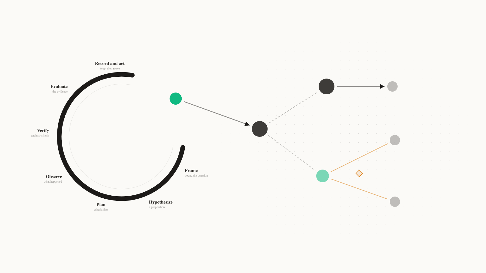
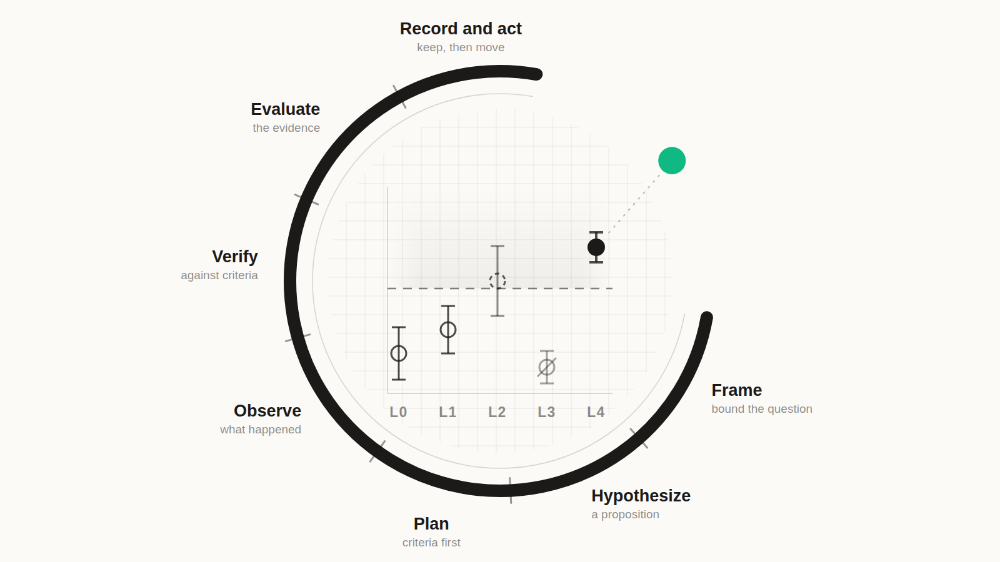
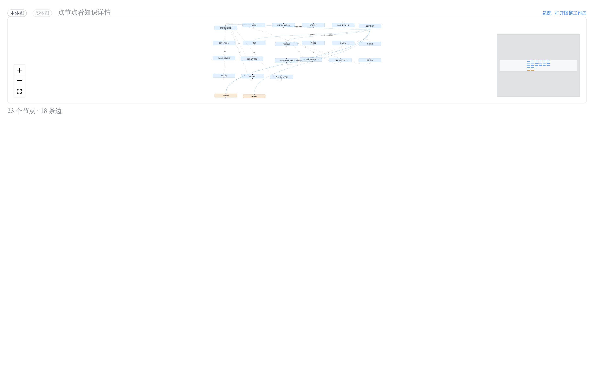

<p align="center">
  <picture>
    <source media="(prefers-color-scheme: dark)" srcset="brand/logo-lockup-dark.png">
    
  </picture>
</p>

<p align="center"><b>English</b> · <a href="README.zh-CN.md">中文</a></p>

**Your research, grown into an ontology.**

ClearAI is an **ontology discovery and exploration platform**, built on two core concepts:

- **Domain ontology** (what you get) — your project's own vocabulary, the knowledge entries established through the loop, and their graphs. At the end of a research session you hold a continuously growing knowledge structure, retrievable next round by concept.
- **Epistemic loop** (how you get it) — a disciplined seven-stage path: frame, hypothesize, plan, observe, verify, evaluate, record. Every edge is tested by evidence and independent evaluation.

> Other knowledge graphs pile up edges by extraction and assertion; here every edge has to be earned through the loop.

<picture>
  <source media="(prefers-color-scheme: dark)" srcset="docs/diagrams/ontology-hero-dark.png">
  
</picture>

*Left: the Epistemic Loop — seven stages. Its emerald fact dot is also the first node of the domain ontology on the right. Right: the ontology graph — dark is a concept, light is a value form, emerald an instance; the instance carries two contradictory assertions — **the two readings are tinted amber**, marking that they do not agree. The system reports the conflict; retracting or keeping is a human decision.*

---

## What you get: a domain ontology

A **domain ontology** that grows as you research:

- **Vocabulary** — the language your project speaks: concepts, predicates, value forms, units. Conventions themselves carry no truth value; sentences written with them do.
- **Established entries** — knowledge that passed the loop: each with its boundary, support level, and evidence chain. Each entry states its boundary explicitly, so it can be cited safely.
- **Ontology graph and entity graph** — what your domain looks like (structure), and what you have actually verified (the state of play).
- **Conflict readings** — contradictory conclusions surface automatically; the system reports them, and retracting or keeping is your decision.

## How you get it: the Epistemic Loop

Most agent loops track one thing: whether the task is done. The Epistemic Loop also tracks **what makes a conclusion trustworthy**:

| | Task loop | Epistemic loop |
|---|---|---|
| Driving question | What next? | What do we know, and on what grounds? |
| Completion | The model declares it | The system computes it from delivered evidence |
| Verdict | Whoever did it, says so | Separated — above a level, the doer cannot judge themselves |
| Failure | Deleted, retried, forgotten | Kept: a refuted hypothesis is a result, not noise |
| What accumulates | A chat transcript | **An ontology**: every edge earned through the loop |

<picture>
  <source media="(prefers-color-scheme: dark)" srcset="docs/diagrams/epistemic-loop-hero-dark.png">
  
</picture>

*Inside the ring is the instrument's read-out: the L0–L4 axis, the **pre-registered** threshold as a dashed line, and five observations with error bars — the supported one filled, the inconclusive drawn as a dashed circle, the refuted left in place with a slash through it (nothing is deleted). The emerald dot at the opening is the one reading that crossed the threshold and settled as a fact.*

At runtime, the seven stages compress into four beats — plan, execute, observe, reflect. State is derived from the session record with no second store; the tools the model holds contain no field in which it could declare a step complete.

ClearAI does **not** claim recursive self-improvement. It provides the epistemic substrate a self-improving system would need. See [Positioning](docs/positioning.md) and the [OpenRSI survey](docs/research-openrsi.md).

---

## Install and use

```bash
npx clearai-dsh install
```

The installer's output follows your system language (`--lang zh|en` overrides it, `doctor` / `seed` / `unseed` take the same flag). Its only runtime dependency is `zod`; the graph stack is bundled into the client half at build time.

Restart `dsh web` afterwards (`npx @deepseek-ai/dsh web`), then **create a session and switch to the `ClearAI` mode in the picker at the top**:

1. Open `dsh web` and click "New session";
2. Click the current mode name at the top (default: **Standard mode**) to open the preset list;
3. Pick **ClearAI** — its card reads "利用认识论循环构建可信本体。Build a trustworthy ontology through the epistemic loop.";
4. Just ask your question. Ordinary Q&A runs as usual; once you set a goal and register hypotheses, the system enters knowledge mode by itself: known facts come to you, gaps stay visible, and conclusions earn their place.

<picture>
  
</picture>

*The ontology graph in ClearAI mode — this real session grew 21 concepts and 9 predicates; the same ledger always yields the same picture. (UI shown is Chinese.)*

If pnpm is not on PATH: `npm install -g pnpm` (do not `corepack enable` — it installs a version forwarder that may download a pnpm it cannot launch).

From the repository:

```bash
npm test                       # 15 suites
node tools/build-package.mjs   # assemble dist/ from source
node tools/verify-package.mjs  # rebuild on the spot, byte-compare
node docs/diagrams/build-hero.mjs   # redraw the product hero (needs google-chrome)
```

`dist/` is generated and never committed. See [DSH integration](docs/dsh-integration.md).

---

## What it looks like

The middle column has two switchable views: **Deliverables** and **Ontology**. The right sidebar: **Worldlines** and **External Brain**.

**Ontology** — this view is your knowledge home. At the top, a **graph band**: the ontology graph (what your domain looks like) and the entity graph (what you have actually verified) toggle with one click; clicking a node or edge opens the **knowledge inspector** (definition / relations / assertions / evidence chain / history), and "filter by this" is an explicit action inside the detail view. Below that, the **ontology shelf**: established entries, each with assertion chips (click to see what the term means), boundary, and support level; contradictions surface automatically. The vocabulary maintenance block sits collapsed at the bottom — it auto-expands when a language exists before any sentence does.

<picture>
  
</picture>

*The band — the ontology graph and the entity graph share one deterministic projection, so the same ledger always yields the same picture (captured from a real session: 21 concepts, 9 predicates).*

<picture>
  
</picture>

*Open any node or edge: definition, relations, assertions, evidence chain, registration and revision history, all in one place. (UI shown is Chinese.)*

**Worldlines** — when two routes genuinely disagree, they run as separate branches with their own readings; the losing one stays on record, and adoption is a human press.

**Deliverables** — the middle column keeps "what the plan declared" and "what actually exists on disk" apart.

**External Brain** — skills and memory as DSH-native entries in one merged catalogue.

---

## Cases

- [Physical-world process experiment](docs/cases/physical-experiment.md) — sensor thermal drift: the full chain from raising terms to a conflict surfacing
- [AI for Science](docs/cases/ai4sci.md) — convergence order of WENO reconstructions, and what "we could not resolve it" honestly means
- [Mathematics](docs/cases/mathematics.md) — keeping finite numerical evidence strictly separate from proof

---

## Documentation

- [Positioning](docs/positioning.md) · [Domain ontology design](docs/domain-ontology.md)
- [Epistemic loop](docs/epistemic-loop.md) · [Verification ontology](docs/verification-loop.md) · [Loop philosophy](docs/loop-philosophy.md)
- [Design principles](docs/design-principles.md) · [Soul map](docs/soul-map.md) · [Glossary](docs/glossary.md)
- [Knowledge-native loop ledger](docs/optimization/knowledge-native-loop.zh-CN.md) (this round: triage / preflight / knowledge gate / graph / inspector; zh-CN)
- [Development plan](docs/optimization/domain-ontology-plan.md) (with real-run evidence from the Hengtong project)
- [Known gaps](docs/known-gaps.md) · [Authority map](docs/authority-map.md) · [Release verification](docs/release-verification.md)

## Where it sits in DSH

ClearAI adds the epistemic layer on DSH's **composition plane** — one host package, one agent preset, one client module, with **zero changes to the DSH engine**. Working style is unrestricted, but nothing outside the governed path can write to the authoritative ledger (pinned by tests).

## Work attribution

This project's work attribution unit is [Jidian Qiyuan](https://jidianqiyuan.com/).

## Star History

[](https://star-history.com/#Clearailhc/clearai-dsh&Date)

## License

Apache-2.0, see [LICENSE](LICENSE).

## Status

A local-first ontology discovery and exploration platform delivered as a DSH plugin. What is not yet implemented, and what has not been verified in a real browser, is written in [Known gaps](docs/known-gaps.md).
