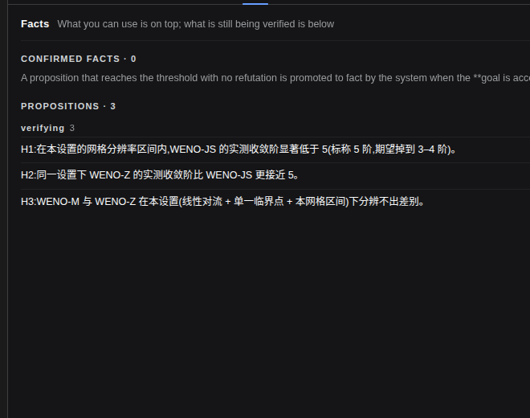
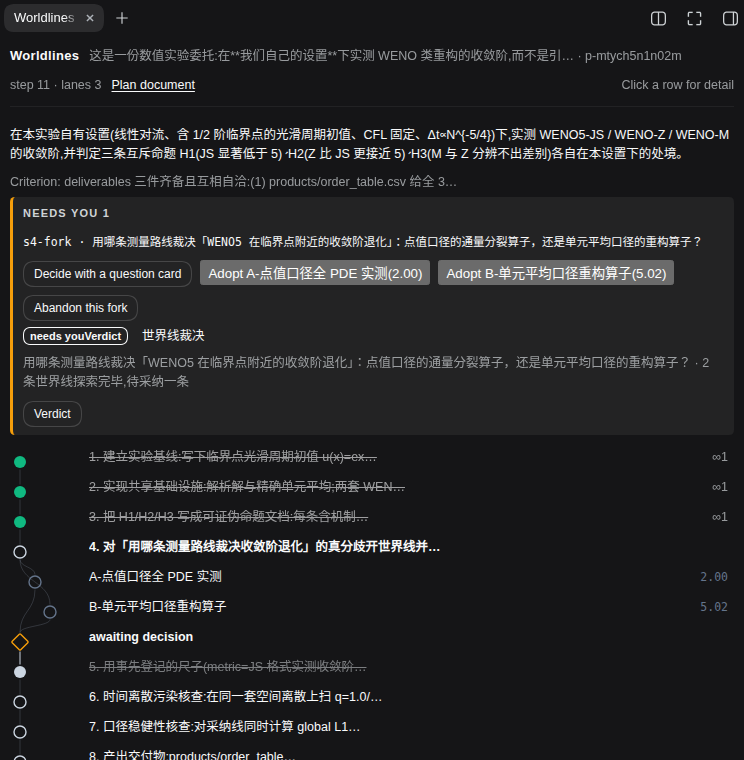
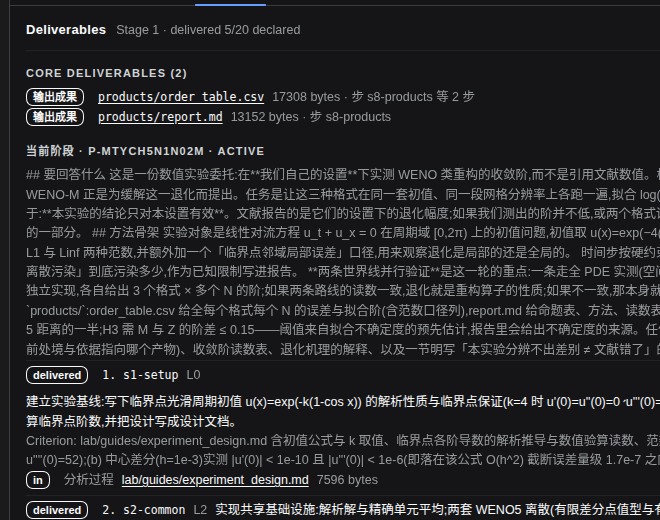
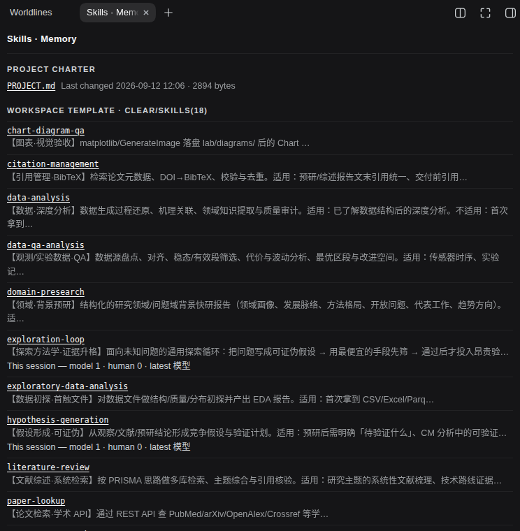
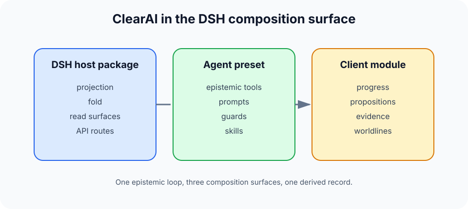

<p align="center">
  <picture>
    <source media="(prefers-color-scheme: dark)" srcset="brand/logo-lockup-dark.png">
    
  </picture>
</p>

<p align="center"><b>English</b> · <a href="README.zh-CN.md">中文</a></p>

**From answers to evidence. From evidence to improvement.**

ClearAI is a **native DSH plugin** that brings the Epistemic Loop to DeepSeek Harness.

A language model can produce a plausible answer in seconds. ClearAI is about what happens next: stating what would test the idea, running the work, recording what happened, evaluating the evidence, and revising what is believed — so that a conclusion has to *earn* its status instead of asserting it.

<picture>
  <source media="(prefers-color-scheme: dark)" srcset="docs/diagrams/epistemic-loop-hero-dark.png">
  
</picture>

> Let the model explore. Let the mechanism protect the boundary of fact.

---

## Why this is not just another agent loop

Most agent loops track one thing: whether the task is done. The Epistemic Loop also tracks **how a conclusion came to be trusted**:

| | Task loop | Epistemic Loop |
|---|---|---|
| Driving question | What do I do next? | What do we know, and on what grounds? |
| Completion | The model declares it | The system computes it from delivered evidence |
| Judgment | Whoever did the work | Separated — above a level, the doer cannot judge its own result |
| Failure | Deleted, retried, forgotten | Kept: a refuted hypothesis is a result, not noise |

ClearAI implements that loop as mechanism, not advice. State is derived from the session record rather than stored twice, progress and phases are computed, and the tools the model holds contain **no field in which it could declare a step complete**.

ClearAI does **not** claim recursive self-improvement. It provides the epistemic substrate that a self-improving system would need: an honest account of what changed, what supports it, who evaluated it, and what failed. See [Positioning](docs/positioning.md) and the [OpenRSI survey](docs/research-openrsi.md) for where that boundary sits.

## The loop, stage by stage

The Epistemic Loop has seven stages. At runtime, these stages compress into four beats—plan, execute, observe, reflect—for a simpler operating rhythm.

| Stage | What the model does | What the mechanism guarantees | What you see |
|---|---|---|---|
| Frame | Bounds the question, assumptions, scope, and outcome | The inquiry starts with an explicit frame | Scope and assumptions |
| Hypothesize | Records candidate explanations or routes | Propositions remain distinct from admitted facts | Hypotheses |
| Plan | Defines executable, evidence-bearing steps and criteria | Completion is advanced only through governed paths | Inspectable plan |
| Observe | Runs permitted work and records what happened | Admission checks eligibility, never truth | Observations and artifacts |
| Verify | Tests observations against the stated criteria | Verification remains tied to the proposition and its limits | Checks and evidence |
| Evaluate | Assesses support, uncertainty, and conflicts | Higher-level work can require independent evaluation | Evaluation and basis |
| Record and act | Preserves the result and chooses the next bounded action | History is retained; unresolved claims stay qualified | Facts, limits, and next step |

Full version: [The Epistemic Loop](docs/epistemic-loop.md)

## What it looks like

The plugin contributes three surfaces on top of stock DSH: a **deliverables** view in the middle column, and **worldlines / propositions & facts / external brain** panes on the right.

**Propositions and facts** — every claim is one row: its current standing, its level, and who judged it. Confirmed conclusions move to the shelf with their scope; refuted ones stay, with the evidence that refuted them.



**Worldlines** — when two routes genuinely disagree, they run as separate branches with their own readings; the record keeps the ones that lost, and adoption is a human decision.



**Deliverables** — the middle column shows what a plan declared and what actually exists on disk, and refuses to conflate the two.



**External brain** — skills and memory appear as native DSH entries in one merged catalogue, with the usage of this session next to them.



## Install

```bash
dsh plugin --profile web add clearai-dsh
```

Restart the DSH web process, open a session, and pick **ClearAI** in the preset picker.

From a checkout:

```bash
npm test                       # kernel / host / brain / client / ontology suites
node tools/build-package.mjs   # assemble dist/ from source
node tools/verify-package.mjs  # rebuild and compare byte-for-byte
node docs/diagrams/build.mjs   # regenerate the loop diagram (needs google-chrome)
```

`dist/` is generated and never committed. See [DSH integration](docs/dsh-integration.md).

## Where it lands in DSH

ClearAI adds an epistemic layer on the DSH **composition surface** — one host package, one agent preset, one client module. The DSH engine is not modified.



## Cases

Three cases, written to show what the loop does on questions where the honest answer is not a clean result:

- [AI for Science](docs/cases/ai4sci.md) — convergence order of WENO reconstructions near critical points, and what "we could not resolve it" honestly means.
- [Mathematics](docs/cases/mathematics.md) — keeping finite numerical evidence strictly separate from proof.
- [Physical-world process experiment](docs/cases/physical-experiment.md) — keeping the loop intact when execution leaves the computer.

They are illustrations of the mechanism, not shipped run records.

## Documentation

- [Positioning](docs/positioning.md)
- [Design principles](docs/design-principles.md)
- [Soul map: principle → mechanism → test](docs/soul-map.md)
- [Glossary](docs/glossary.md)
- [Loop philosophy](docs/loop-philosophy.md) · [Verification ontology](docs/verification-loop.md)
- [Known gaps](docs/known-gaps.md) · [Release verification](docs/release-verification.md)

## License

Apache-2.0. See [LICENSE](LICENSE).

## Status

This repository is the DSH-native ClearAI plugin library: a local-first epistemic workspace delivered through DSH. What is not implemented, and what has not yet been verified in a real browser, is listed explicitly in [known gaps](docs/known-gaps.md).
