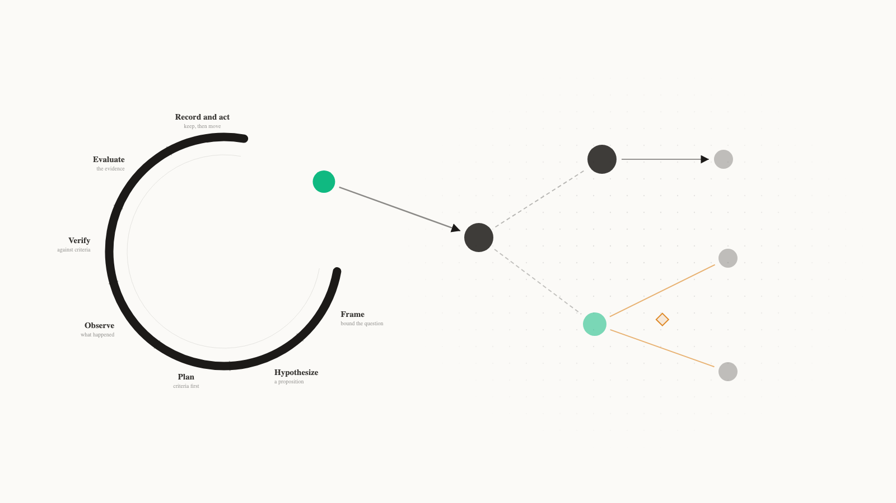
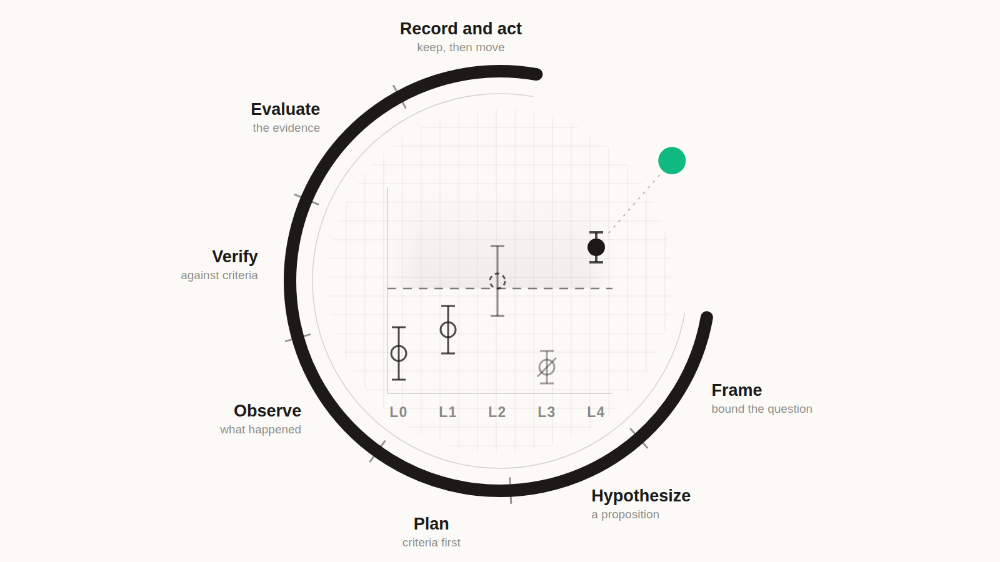
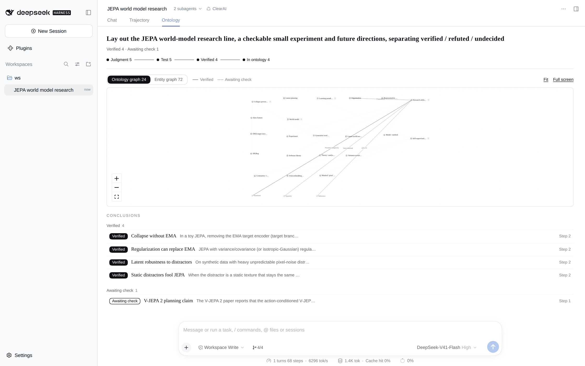
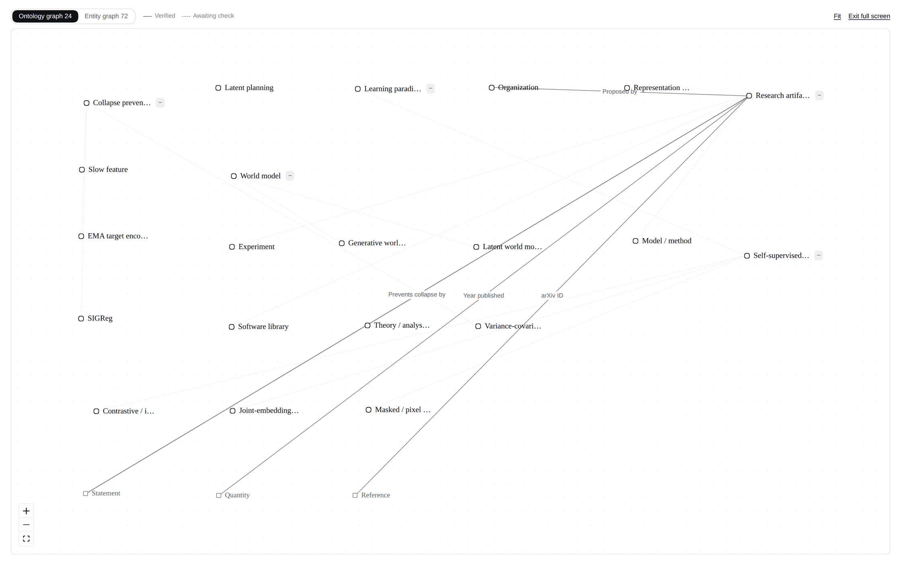
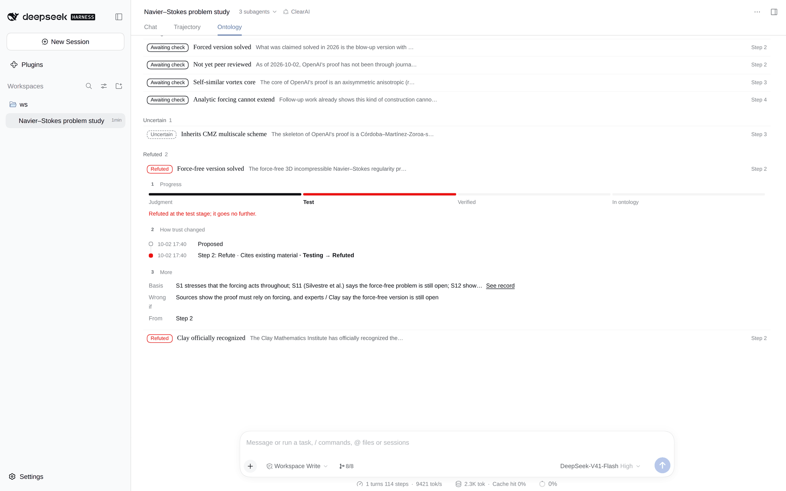

<p align="center">
  <picture>
    <source media="(prefers-color-scheme: dark)" srcset="brand/logo-lockup-dark.png">
    
  </picture>
</p>

<p align="center"><b>English</b> · <a href="README.zh-CN.md">中文</a></p>

<p align="center">
  <a href="https://trendshift.io/repositories/248415?utm_source=trendshift-badge&amp;utm_medium=badge&amp;utm_campaign=badge-trendshift-248415" target="_blank" rel="noopener noreferrer"></a>
</p>

**Your research, grown into an ontology.**

ClearAI is an **ontology discovery and exploration platform**, built on two core concepts:

- **Domain ontology** (what you get) — your project's own vocabulary, the knowledge entries established through the loop, and their graphs. At the end of a research session you hold a continuously growing knowledge structure, retrievable next round by concept.
- **Epistemic loop** (how you get it) — question → ontology (how the relevant quantities are measured and how they affect each other) → candidate hypotheses with their predictions → a test that could fail → evidence → bounded conclusion → grows into the ontology. Every edge is tested by evidence and independent evaluation.

> Other knowledge graphs pile up edges by extraction and assertion; here every edge has to be earned through the loop.

```bash
# Install (npm package, prebuilt — no build step, no allowBuilds prompt)
dsh plugin --profile web add clearai-dsh@0.5.1
# or in the app: Plugins → Add plugin → clearai-dsh@0.5.1
```

Restart `dsh web`, then pick **ClearAI** in the preset picker at the top of a new session. That is the whole setup. [Full install notes ↓](#install-and-use)


<picture>
  <source media="(prefers-color-scheme: dark)" srcset="docs/diagrams/ontology-hero-dark.png">
  
</picture>

*Left: the Epistemic Loop. Its emerald fact dot is also the first node of the domain ontology on the right. Right: the ontology graph — dark is a concept, light is a value form, emerald an instance; the instance carries two contradictory assertions — **the two readings are tinted amber**, marking that they do not agree. The system reports the conflict; retracting or keeping is a human decision.*

---

## What you get: a domain ontology

A **domain ontology** that grows as you research:

- **Vocabulary** — the language your project speaks: concepts, predicates, value forms, units. Conventions themselves carry no truth value; sentences written with them do.
- **Established entries** — knowledge that passed the loop: each with its boundary, support level, and evidence chain. Each entry states its boundary explicitly, so it can be cited safely.
- **Ontology graph and entity graph** — what your domain looks like (structure), and what you have actually verified (the state of play).
- **Conflict readings** — contradictory conclusions surface automatically; the system reports them, and retracting or keeping is your decision.

## How you get it: the Epistemic Loop

Most agent loops track one thing: whether the task is done. The Epistemic Loop also tracks **what makes a conclusion trustworthy**:

| | Task loop | Epistemic loop |
|---|---|---|
| Driving question | What next? | What do we know, and on what grounds? |
| Completion | The model declares it | The system computes it from delivered evidence |
| Verdict | Whoever did it, says so | Separated — above a level, the doer cannot judge themselves |
| Failure | Deleted, retried, forgotten | Kept: a refuted hypothesis is a result, not noise |
| Stopping | The model feels it is done | Every candidate and anomaly that could change the answer is handled, or written into the open points |
| What accumulates | A chat transcript | **An ontology**: every edge earned through the loop |

<picture>
  <source media="(prefers-color-scheme: dark)" srcset="docs/diagrams/epistemic-loop-hero-dark.png">
  
</picture>

*Inside the ring is the instrument's read-out: the L0–L4 axis, the **pre-registered** threshold as a dashed line, and five observations with error bars — the supported one filled, the inconclusive drawn as a dashed circle, the refuted left in place with a slash through it (nothing is deleted). The emerald dot at the opening is the one reading that crossed the threshold and settled as a fact.*

In the loop the ontology comes first, not last:

- **The ontology is written at framing.** Which quantities the answer involves, what measures each one, how the reading is checked, and how the quantities affect each other are written in one go with the framing. A measure with no measuring method cannot be framed.
- **The ontology yields the candidates.** Each question lists at least two candidate hypotheses, each naming the relation it comes from; before each step the model writes a prediction per candidate, and a step that predicts the same for all of them is flagged as unable to tell them apart.
- **Anomalies need a destination.** A reading that does not fit the prediction or the ontology becomes an unexplained item: explained, ruled out with a reason, or written into the answer. One that touches an established fact sends that fact back to awaiting check.
- **Answers are delivered per question.** Each in four parts: conclusion / basis / open points / for you to decide. While a candidate still under examination or an open unexplained item is missing from the answer, the goal cannot close as achieved.

State is derived from the session record with no second store; the tools the model holds contain no field in which it could declare a step complete, and a goal completes only after independent evaluation. ClearAI does only what the host cannot — the epistemic contract, the domain ontology, presentation; goal continuation, subagents, asking you, deliverable cards and file history all come from DSH itself.

ClearAI does **not** claim recursive self-improvement. It provides the epistemic substrate a self-improving system would need. See [Positioning](docs/positioning.md) and the [OpenRSI survey](docs/research-openrsi.md).

---

## Install and use

**Requirements:** DSH ≥ `0.2.0-rc.2` (the current `latest`). The preset is registered through a composition declaration line, which is the only way the host's preset registry finds presets. Verified against the host's `0.2.0-rc.2`, and also checked against `0.2.1-alpha.1`. Hosts older than `0.2.0` are no longer supported.

**Recommended — install it in the app, with the version pinned:**

In the sidebar open **Plugins → Add plugin**, enter `clearai-dsh@0.5.1`, and install. That is DSH's own plugin manager: it hands what you type to pnpm, checks that the package declares a bundle and is compatible with this host, and applies it live. (The Settings page **插件列表 / Plugins** is the read-only inventory — installing happens on the sidebar's Plugins page.)

**Or from a terminal — the same install:**

```bash
dsh plugin --profile web add clearai-dsh@0.5.1
```

This installs the prebuilt package from the npm registry. Nothing is compiled on your machine, so there is no `allowBuilds` grant to approve — the plugin is ready the moment the command returns.

> **Why the version is pinned.** pnpm ≥ 11 holds back newly published versions: `minimumReleaseAge` defaults to 1440 minutes, and because that built-in default is non-strict, a bare package name (or `@latest`) **silently falls back to the newest version older than a day** — right after a release, the *previous* release. DSH's plugin manager forwards your spec to pnpm unchanged and does **not** compare what landed against what you asked for, so this downgrade is reported as a success. Its preview card is no help either: it reads the package with `pnpm view`, which ignores the age policy, so it can show the newest release while pnpm installs the one before it. Two ways to be exact:
>
> - **Pin the version**, as both commands above do — pnpm then records the exception itself.
> - **Or exempt the package once** in the profile's `pnpm-workspace.yaml`; a bare name works from then on:
>
>   ```yaml
>   minimumReleaseAgeExclude:
>     - clearai-dsh
>   ```

**Also available — one-command installer** (it resolves the current release and pins that version for you, so it is immune to the delay):

```bash
npx clearai-dsh install
```

Same install underneath; it resolves the DSH CLI from your PATH (or through npx), installs into the `web` profile, and reads the composed config back so you are not taking "success" on faith. Use this if you prefer a guided path, or `--lang zh|en` to force the installer's output language.

**Community market (third-party):** [dsh-market](https://github.com/dsh-market/dsh-market) lists whatever the curated [awesome-dsh-plugin](https://github.com/awesome-dsh-plugin/awesome-dsh-plugin) catalog carries and installs a pinned version for you; ClearAI's catalog entry is in review there. It is not part of DSH, and it is not needed to install this plugin.

**Install from source (for development, not the normal path):**

```bash
dsh plugin --profile web add github:Clearailhc/clearai-dsh
```

Git fetches source rather than build artifacts, so pnpm ≥10 will refuse to run the `prepare` script until you add an `allowBuilds` entry to the profile's `pnpm-workspace.yaml`. That grant means *permission for this package's code to execute on your machine at install time* — grant it only if you have read the source, and pin a commit. If you just want to use ClearAI, use the npm install above.

The installer's output follows your system language (`--lang zh|en` overrides it, and `doctor` takes the same flag). Its only runtime dependency is `zod`; the graph stack is bundled into the client half at build time.

Restart `dsh web` afterwards (`npx @deepseek-ai/dsh web`), then **create a session and switch to the `ClearAI` mode in the picker at the top**:

1. Open `dsh web` and click "New session";
2. Click the current mode name at the top (default: **Standard mode**) to open the preset list;
3. Pick **ClearAI** — its card reads "利用认识论循环构建可信本体。Build a trustworthy ontology through the epistemic loop.";
4. Just ask your question. Ordinary Q&A runs as usual; once a goal is set, the system enters knowledge mode by itself: what is already known comes to you, the ontology is written with the framing, and conclusions earn their place through evidence. The process is in the Explore pane, the conclusions in the Ontology pane. Only decisions only you can make are put to you.

<picture>
  
</picture>

*The Ontology pane after the [JEPA world model](docs/cases/jepa-world-model.md) session (0.5.0 layout; from 0.5.1 the progress rail and the full judgment list move to the process record in the Explore pane, and the Ontology pane holds answer cards, graphs, established facts and lessons).*

If pnpm is not on PATH: `npm install -g pnpm` (do not `corepack enable` — it installs a version forwarder that may download a pnpm it cannot launch).

From the repository:

```bash
npm test                       # 17 suites
node tools/build-package.mjs   # assemble dist/ from source
node tools/verify-package.mjs  # rebuild on the spot, byte-compare
node docs/diagrams/build-hero.mjs   # redraw the product hero (needs google-chrome)
```

`dist/` is generated and never committed. See [DSH integration](docs/dsh-integration.md).

---

## What it looks like

Two panes in the middle: **Explore** and **Ontology**. Explore holds the process; Ontology holds only results. The plan chip next to the input box shows exploration progress ("Question 1/2 · hypotheses to test: 2" or "Areas 3/6 · 1 question(s) awaiting your decision"); click it to open Explore.

**Explore** — what is being answered, which possibilities are still open, and what comes next. The header gives the topic and mode (survey / solve), the current question and plan progress. Below come the items awaiting you, the survey areas (in survey mode), each question's candidate hypotheses (being examined / excluded / adopted / set aside; open one for its source, refutation condition, prediction and related records), the next step with each candidate's prediction (with a note when the predictions are identical and the step cannot tell them apart), and unexplained observations. A newly found question carries two buttons, "Make it a question" and "Park"; pressing one sends a sentence to the model on your behalf, and the model revises the framing. At the bottom, a collapsed **process record**: judgment counts and the progress rail, every judgment, and the plan's steps and gates.

**Ontology** — conclusions and long-term knowledge. At the top, an **answer card** per question in four parts: conclusion / basis / open points / for you to decide. In the middle, the **graph**: the ontology graph (what your domain looks like) and the entity graph (the concrete things found) toggle with one click, and clicking a node filters by it. Below, the **established facts** and **lessons**. Two contradictory conclusions light up; retracting or keeping is your call.

**Deliverables** — at close, the artefacts accepted for each step appear as DSH's native deliverable cards; what changed each turn is in DSH's native change cards.

**Language** — everything the system writes (tool results, the runtime card, questions to you, the files under `clear/`) follows the language you write in, Chinese or English. The panel follows the UI language.

<picture>
  
</picture>

*The ontology graph, full screen. The ontology graph and the entity graph come from one deterministic projection of the files under `clear/ontology/`, so the same files always give the same picture.*

<picture>
  
</picture>

*A refuted judgment from the [Navier–Stokes](docs/cases/navier-stokes.md) session: it stopped at the test stage, and the record keeps why.*

---

## Against the bare model

Same model, same tools and budget: one arm runs with ClearAI, one without it, on the same tasks with planted traps, graded blind. These are early dev-set results for 0.5.0 (the developers wrote the tasks, and the samples are small), not a formal validity result; the 0.5.1 comparison is not finished yet.

| Experiment | ClearAI | Bare model |
|---|---|---|
| Reactor task: the control thermocouple drifts 8 °C mid-run, 4 runs each | 3/4 found it and corrected for the actual temperature | 1/4 |
| One rig, 3 lines in a row: the drift changes direction and onset each time, 3 series each | 5/6 corrected in the later tasks; task-3 mean 1.5 / 4 | 1/6; 1.17 / 4 |
| Electrolyte task: no data trap, 4 runs each | 2.25 / 5 | 2.25 / 5 |

Both arms **saw** the reference reading disagree. The difference is what came next. With ClearAI, the model writes a prediction before acting. A missed prediction cannot be explained away: it must be explained, ruled out with a reason, or handed to a person. An independent evaluator then checks the raw data again. Lessons left by an earlier task, once an evaluator has checked them, get cited when the next task writes its predictions.

What did not improve for either arm is exploration depth. Recipes landed just as far from the true optimum, and nobody found the coupling between temperature and a second factor. The cost is about 2.2× the tokens. The candidate hypotheses, per-candidate predictions and stop check in 0.5.1 target exactly this. The walkthrough and the graders' words are in [Case: against the bare model](docs/cases/bare-model-ab.md); every record is in [docs/optimization/sim-runs/](docs/optimization/sim-runs/).

---

## Cases

The first two are real-model sessions run end to end without asking anything; the screenshots replay them in real DSH. The third is a simulated A/B against the bare model.

- [JEPA world models](docs/cases/jepa-world-model.md): a literature review, a toy experiment judged by an independent evaluator, and an ontology of 21 concepts, 8 relations and 27 entities
- [Was Navier–Stokes solved?](docs/cases/navier-stokes.md): two popular claims refuted and kept, an intake rejection handled honestly, and an ontology of 24 concepts, 13 relations and 59 entities
- [Against the bare model](docs/cases/bare-model-ab.md): on the same drifting bench rig, how ClearAI and the bare model each handle a reference reading that disagrees (dev set, blind graded)

---

## Documentation

- [Positioning](docs/positioning.md) · [Domain ontology design](docs/domain-ontology.md)
- [Epistemic loop](docs/epistemic-loop.md) · [Verification ontology](docs/verification-loop.md) · [Loop philosophy](docs/loop-philosophy.md)
- [Design principles](docs/design-principles.md) · [Soul map](docs/soul-map.md) · [Glossary](docs/glossary.md)
- [Mechanism truth table](docs/optimization/truth-table.md) · [State machines](docs/optimization/state-machines.md) · [Timing diagrams](docs/optimization/timing-diagrams.md)
- [Known gaps](docs/known-gaps.md) · [Authority map](docs/authority-map.md) · [Release verification](docs/release-verification.md)

## Where it sits in DSH

ClearAI adds the epistemic layer on DSH's **composition plane** — one host package, one agent preset, one client module, with **zero changes to the DSH engine**. Working style is unrestricted, but nothing outside the governed path can write to the authoritative ledger (pinned by tests).

## Work attribution

This project's work attribution unit is [Jidian Qiyuan](https://jidianqiyuan.com/).

## Star History

[](https://star-history.com/#Clearailhc/clearai-dsh&Date)

## License

Apache-2.0, see [LICENSE](LICENSE).

## Status

A local-first ontology discovery and exploration platform delivered as a DSH plugin. What is not yet implemented, and what has not been verified in a real browser, is written in [Known gaps](docs/known-gaps.md).
