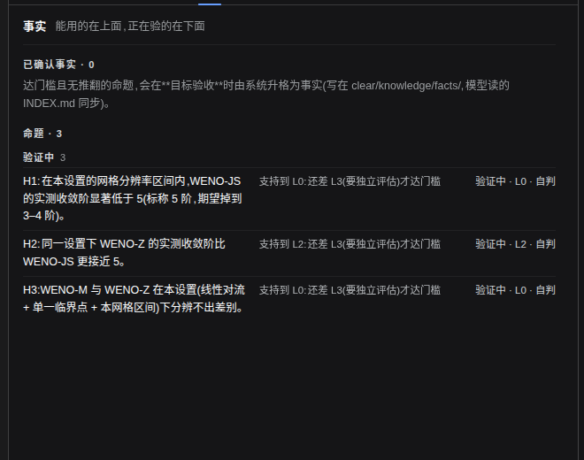
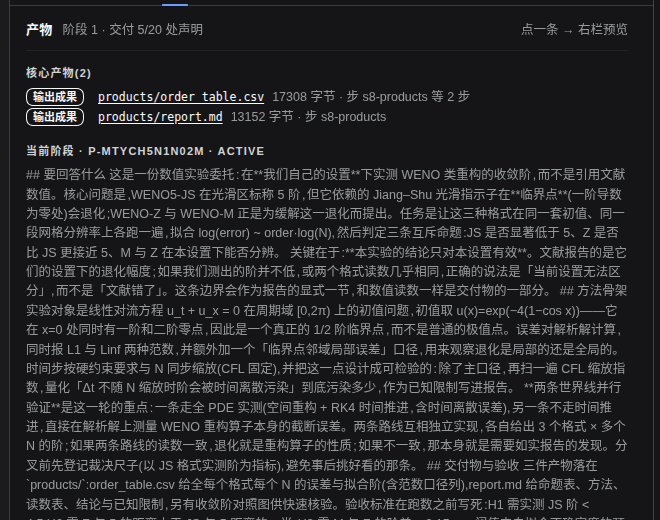
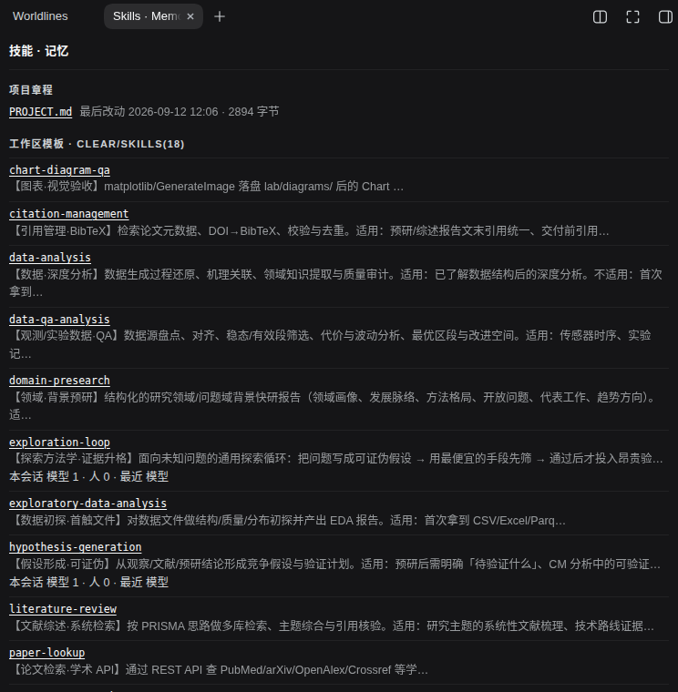
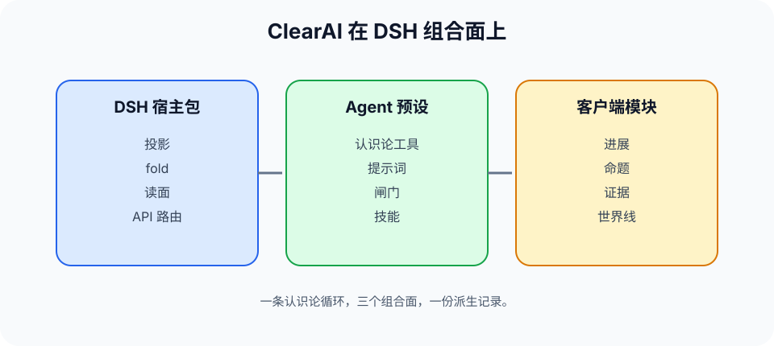

<p align="center">
  <picture>
    <source media="(prefers-color-scheme: dark)" srcset="brand/logo-lockup-dark.png">
    
  </picture>
</p>

<p align="center"><a href="README.md">English</a> · <b>中文</b></p>

**从答案，到证据；从证据，到改进。**

ClearAI 是一个**原生 DSH 插件**，把认识论循环带进 DeepSeek Harness。

语言模型可以在几秒内给出一个看起来合理的答案。ClearAI 关心的是接下来发生的事：写下什么能检验这个想法、执行工作、记录发生了什么、评估证据、修正已有的认识——让一个结论**获得**它的状态，而不是靠断言取得。

<picture>
  <source media="(prefers-color-scheme: dark)" srcset="docs/diagrams/epistemic-loop-hero-dark.zh-CN.png">
  
</picture>

> 让模型负责探索，让机制守住事实边界。

---

## 为什么它不只是又一个 agent loop

多数 agent loop 只跟踪一件事：任务做完没有。认识论循环还跟踪**一个结论凭什么被信任**：

| | 任务循环 | 认识论循环 |
|---|---|---|
| 驱动问题 | 下一步做什么？ | 我们现在知道什么，依据是什么？ |
| 完成 | 模型宣布完成 | 系统按交付的证据算出来 |
| 裁决 | 谁做的谁说了算 | 分离——超过一定等级，做的人不能判自己 |
| 失败 | 删掉、重来、忘掉 | 留下：被推翻的命题是结果，不是噪声 |

ClearAI 把这条循环做成机制，而不是劝告。状态从会话记录派生而不是存第二本账，进度与阶段是算出来的，模型手上的工具里**根本不存在**可以宣告某一步完成的字段。

ClearAI **不**声称实现递归自我改进。它提供的是自我改进系统所需要的认识论底座：诚实记录改了什么、证据是什么、谁评估了它、哪些失败了。边界在哪，见 [定位](docs/positioning.zh-CN.md) 与 [OpenRSI 调研](docs/research-openrsi.md)。

## 循环的每一阶段

认识论循环有七个阶段。运行时，这七个阶段压缩成四拍——计划、执行、观察、反思——作为更简洁的工作节奏。

| 阶段 | 模型做什么 | 机制保证什么 | 你看到什么 |
|---|---|---|---|
| 界定 | 明确问题、假设、范围与目标 | 调查从显式边界开始 | 范围与假设 |
| 提出假设 | 记录候选解释或路线 | 命题与已采纳事实分开 | 假设 |
| 规划 | 定义可执行、可提供证据的步骤和判据 | 只能通过受治理路径推进完成 | 可检查的计划 |
| 观测 | 执行允许的工作并记录发生了什么 | 准入只判断是否可接收，不判断真假 | 观测与产物 |
| 验证 | 用已登记的判据检验观测 | 验证始终绑定命题及其边界 | 检查与证据 |
| 评估 | 判断支持、不确定性与冲突 | 高等级工作可要求独立评估 | 评估与依据 |
| 记录并行动 | 保存结果，选择下一项有边界的行动 | 保留历史；未解决命题保持限定 | 事实、边界与下一步 |

完整版：[认识论循环](docs/epistemic-loop.zh-CN.md)

## 它长什么样

插件在原生 DSH 之上贡献三个面：中栏的**产物**，以及右栏的**世界线 / 命题与事实 / 外脑**。

**命题与事实**——一行一条主张：当前处境、等级、判者。已确认的结论带着边界上架；被推翻的留在原位，连同推翻它的证据。



**世界线**——两条路线真的分歧时，各自独立跑、各自带读数；落选的那条留在记录里，采纳是人按的那一下。


**产物**——中栏把「计划声明交付的」与「盘上真有的」分开摆，不许混为一谈。



**外脑**——技能与记忆以 DSH 原生条目的形式出现在同一张合并目录里，旁边是本会话的用量。



## 安装

需要 **Node ≥ 22** 和 **`pnpm` 在 PATH 上** —— `dsh plugin …` 是 pnpm 的一层转发器，没有 pnpm 就管不了 profile：

```bash
corepack enable --install-directory ~/.local/bin   # 还没有 pnpm 就先装它
dsh plugin --profile web add clearai-dsh
```

**装完要重启 `dsh web`。** 插件的两半都在运行中的进程里按模块 URL 缓存，只刷新浏览器不够。然后新建会话，在预设选择器里选 **ClearAI**。

从仓库开发：

```bash
npm test                       # 内核 / 宿主 / 外脑 / 客户端 / 本体 五份套件
node tools/build-package.mjs   # 由源装配 dist/
node tools/verify-package.mjs  # 现场重建并逐字节比对
node tools/verify-clean-install.mjs   # 空 DSH_HOME + 真 CLI 装一遍(16 条断言)
node docs/diagrams/build.mjs   # 重画循环主图(需 google-chrome)
```

`dist/` 是生成物，不进版本库。见 [DSH 集成](docs/dsh-integration.zh-CN.md)。

## 它落在 DSH 的哪一层

ClearAI 把认识论层加在 DSH 的**组合面**上——一个宿主包、一个 agent 预设、一个客户端模块，**DSH 引擎一行都没改**。



## 案例

三个案例，用来展示循环在"诚实的答案不是一个干净结果"的问题上怎么工作：

- [AI for Science](docs/cases/ai4sci.zh-CN.md) —— WENO 重构在临界点附近的收敛阶，以及「分辨不出来」到底意味着什么；
- [数学探索](docs/cases/mathematics.zh-CN.md) —— 把有限数值证据与形式证明严格分开；
- [物理世界工艺实验](docs/cases/physical-experiment.zh-CN.md) —— 执行离开计算机之后，循环如何保持可追溯。

它们演示的是机制本身，随库不附跑批记录。

## 文档

- [定位](docs/positioning.zh-CN.md)
- [设计原则](docs/design-principles.zh-CN.md)
- [灵魂映射：原则 → 机制 → 测试](docs/soul-map.zh-CN.md)
- [术语表](docs/glossary.zh-CN.md)
- [循环哲学](docs/loop-philosophy.zh-CN.md) · [验证本体](docs/verification-loop.zh-CN.md)
- [已知缺口](docs/known-gaps.zh-CN.md) · [发布验收](docs/release-verification.zh-CN.md)

## 工作署名

本项目的工作署名单位为[基点起源](https://jidianqiyuan.com/)。

## Star 曲线

[](https://star-history.com/#Clearailhc/clearai-dsh&Date)

## 许可证

Apache-2.0,见 [LICENSE](LICENSE)。

## 状态

本仓库是 DSH 原生 ClearAI 插件库：一个通过 DSH 交付的本地优先认识论工作台。哪些还没实现、哪些还没在真浏览器里验过，都写在 [已知缺口](docs/known-gaps.zh-CN.md) 里。
