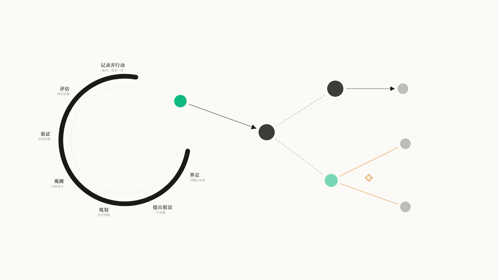

<p align="center">
  <picture>
    <source media="(prefers-color-scheme: dark)" srcset="brand/logo-lockup-dark.png">
    
  </picture>
</p>

<p align="center"><a href="README.md">English</a> · <b>中文</b></p>

**你的研究，长成一个本体。**

ClearAI 是一个**本体发现与探索平台**，核心由两个概念支撑：

- **领域本体**（你得到什么）——项目自己的词汇、经循环确立的知识条目、以及它们的图。研究结束时你拿到一个持续生长的知识结构，下一轮按概念检索。
- **认识论循环**（你怎么得到它）——七个阶段的纪律化路径：界定、假设、规划、观测、验证、评估、记录。每条边都要经过证据与独立评估的检验。

> 别的知识图谱靠抽取与断言堆边；这里的每一条边都要通过循环挣得。

<picture>
  <source media="(prefers-color-scheme: dark)" srcset="docs/diagrams/ontology-hero-dark.zh-CN.png">
  
</picture>

*左：认识论循环——七阶段。绿点是它落定的事实，也是右侧领域本体的第一个节点。右：本体图——深墨是概念，浅墨是值形态，emerald 是实例；实例上挂着两条互相矛盾的断言，冲突处亮出菱形。*

---

## 你得到什么：领域本体

一个**领域本体**，它在你研究的过程中生长：

- **词汇**——你的项目用什么语言说话：概念、谓词、值形态、单位。约定本身没有对错，有对错的是用这些词写下的句子。
- **已确立条目**——通过了循环的知识：每条带边界、支持等级、证据链。每条都写明适用边界，否则无法安全引用。
- **本体图与实体图**——你的领域长什么样（结构），你已经验证出了什么（战况）。
- **冲突读数**——两条互相矛盾的结论自动亮出来；系统只报出冲突，撤回或维持由你决定。

## 你怎么得到它：认识论循环

多数 agent loop 只跟踪一件事：任务做完没有。认识论循环还跟踪**一个结论凭什么被信任**：

| | 任务循环 | 认识论循环 |
|---|---|---|
| 驱动问题 | 下一步做什么？ | 我们现在知道什么，依据是什么？ |
| 完成 | 模型宣布完成 | 系统按交付的证据算出来 |
| 裁决 | 谁做的谁说了算 | 分离——超过一定等级，做的人不能判自己 |
| 失败 | 删掉、重来、忘掉 | 留下：被推翻的命题是结果，不是噪声 |
| 沉淀 | 一段聊天记录 | **一个本体**：每条边都通过循环挣得 |

<picture>
  <source media="(prefers-color-scheme: dark)" srcset="docs/diagrams/epistemic-loop-hero-dark.zh-CN.png">
  
</picture>

*环内是这台仪器的读数面：横轴是 L0–L4 七个等级，那条虚线是**事先登记进判据**的阈值；五个观测各带误差棒——被支持的填实、无法判定的画虚圈、被推翻的留在原位打一道斜杠（什么都不删）。开口处那颗 emerald 是唯一越过判据、落定成事实的读数。*

运行时，七个阶段压缩为四拍——计划、执行、观察、反思。状态从会话记录派生，没有第二份存储；模型的工具里没有可以宣告某一步完成的字段。

ClearAI **不**声称递归自我改进。它提供的是自我改进系统所需要的认识论底座。详见[定位](docs/positioning.zh-CN.md)与[OpenRSI 调研](docs/research-openrsi.md)。

---

## 安装

```bash
npx clearai-dsh install
```

装完重启 `dsh web`（`npx @deepseek-ai/dsh web`），新建会话选 **ClearAI** 预设。如果 PATH 上没有 pnpm：`npm install -g pnpm`（别用 `corepack enable`——它装的是版本转发器，可能下载一个自己启动不了的 pnpm）。

从仓库开发：

```bash
npm test                       # 15 份套件
node tools/build-package.mjs   # 由源装配 dist/
node tools/verify-package.mjs  # 现场重建并逐字节比对
node docs/diagrams/build-hero.mjs   # 重画产品主图(需 google-chrome)
```

`dist/` 是生成物，不进版本库。见 [DSH 集成](docs/dsh-integration.zh-CN.md)。

---

## 它长什么样

中栏两格可切：**产物**与**本体**。右栏：**世界树**与**外脑**。

**本体**——这一格是你的知识主场。顶部是**图带**：本体图（你的领域长什么样）与实体图（已经验证出了什么）一键切换，点概念节点按概念过滤。下面是**本体货架**：已确立的条目，每条带断言芯片（点开看这个词什么意思）、边界与等级；互相矛盾的自动亮出来。词汇维护区收在最底下——语言先于句子时它自动展开。

**世界树**——两条路线真的分歧时，各自独立跑、各自带读数；落选的那条留在记录里，采纳是人按的那一下。

**产物**——中栏把「计划声明交付的」与「盘上真有的」分开摆，不许混为一谈。

**外脑**——技能与记忆以 DSH 原生条目的形式出现在同一张合并目录里。

---

## 案例

- [物理世界工艺实验](docs/cases/physical-experiment.zh-CN.md)——传感器热漂移：从立词到冲突现形的完整链路
- [AI for Science](docs/cases/ai4sci.zh-CN.md)——WENO 重构的收敛阶，以及「分辨不出来」意味着什么
- [数学探索](docs/cases/mathematics.zh-CN.md)——把有限数值证据与形式证明严格分开

---

## 文档

- [定位](docs/positioning.zh-CN.md) · [领域本体设计](docs/domain-ontology.zh-CN.md)
- [认识论循环](docs/epistemic-loop.zh-CN.md) · [验证本体](docs/verification-loop.zh-CN.md) · [循环哲学](docs/loop-philosophy.zh-CN.md)
- [设计原则](docs/design-principles.zh-CN.md) · [灵魂映射](docs/soul-map.zh-CN.md) · [术语表](docs/glossary.zh-CN.md)
- [开发计划](docs/optimization/domain-ontology-plan.zh-CN.md)（含亨通真跑读数）
- [已知缺口](docs/known-gaps.zh-CN.md) · [权威归属](docs/authority-map.zh-CN.md) · [发布验收](docs/release-verification.zh-CN.md)

## 它落在 DSH 的哪一层

ClearAI 把认识论层加在 DSH 的**组合面**上——一个宿主包、一个 agent 预设、一个客户端模块，**DSH 引擎一行都没改**。工作方式不设限，但它们写不进权威账本（权威边界由测试钉死）。

## 工作署名

本项目的工作署名单位为[基点起源](https://jidianqiyuan.com/)。

## Star 曲线

[](https://star-history.com/#Clearailhc/clearai-dsh&Date)

## 许可证

Apache-2.0，见 [LICENSE](LICENSE)。

## 状态

一个通过 DSH 交付的本地优先本体发现与探索平台。哪些还没实现、哪些还没在真浏览器里验过，都写在[已知缺口](docs/known-gaps.zh-CN.md)里。
