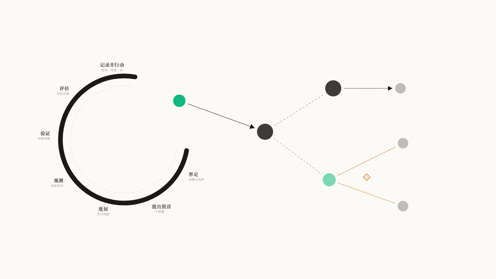
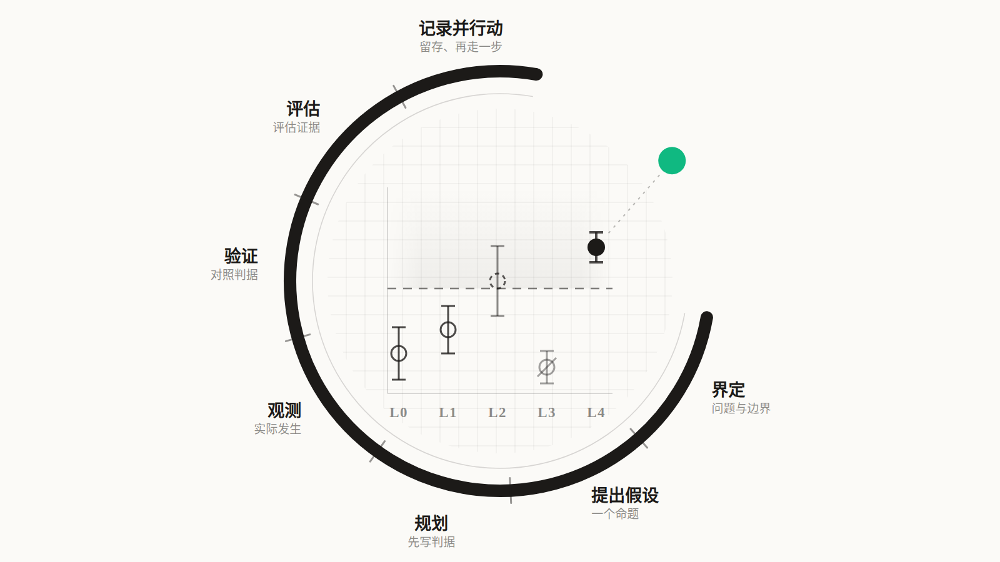
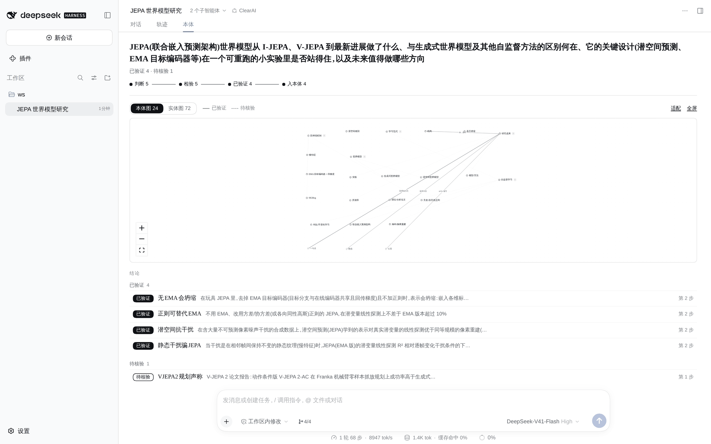
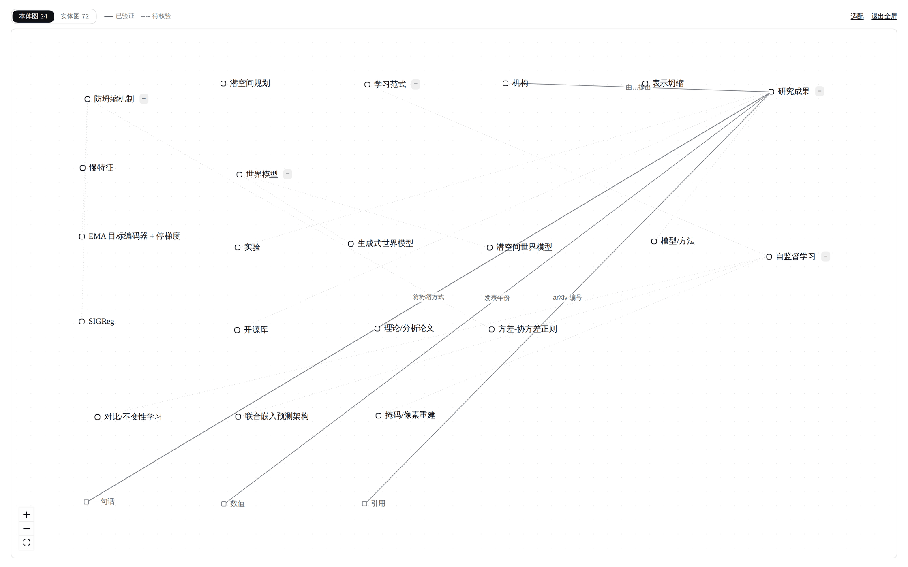
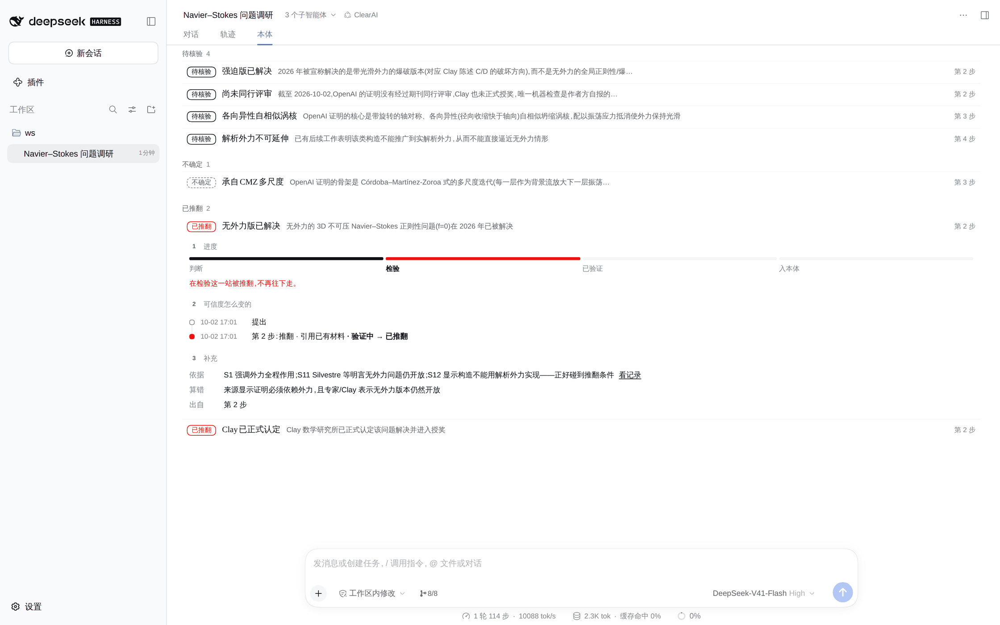

<p align="center">
  <picture>
    <source media="(prefers-color-scheme: dark)" srcset="brand/logo-lockup-dark.png">
    
  </picture>
</p>

<p align="center"><a href="README.md">English</a> · <b>中文</b></p>

<p align="center">
  <a href="https://trendshift.io/repositories/248415?utm_source=trendshift-badge&amp;utm_medium=badge&amp;utm_campaign=badge-trendshift-248415" target="_blank" rel="noopener noreferrer"></a>
</p>

**你的研究，长成一个本体。**

ClearAI 是一个**本体发现与探索平台**，核心由两个概念支撑：

- **领域本体**（你得到什么）——项目自己的词汇、经循环确立的知识条目、以及它们的图。研究结束时你拿到一个持续生长的知识结构，下一轮按概念检索。
- **认识论循环**（你怎么得到它）——问题 → 判断（写明怎样算错）→ 一次可能失败的检验 → 证据 → 带范围的结论 → 长进本体。每条边都要经过证据与独立评估的检验。

> 别的知识图谱靠抽取与断言堆边；这里的每一条边都要通过循环挣得。

```bash
# 安装（npm 包，预构建——无需构建步骤，不会触发 allowBuilds 授权）
dsh plugin --profile web add clearai-dsh@0.5.0
# 或在应用里：侧栏「插件」→ 添加插件 → clearai-dsh@0.5.0
```

重启 `dsh web`，在新建会话顶部的模式选择器里选 **ClearAI** 即可。这就是全部步骤。[完整安装说明 ↓](#安装与使用)


<picture>
  <source media="(prefers-color-scheme: dark)" srcset="docs/diagrams/ontology-hero-dark.zh-CN.png">
  
</picture>

*左：认识论循环。绿点是它落定的事实，也是右侧领域本体的第一个节点。右：本体图——深墨是概念，浅墨是值形态，emerald 是实例；实例上挂着两条互相矛盾的断言——**那两个取值染成 amber**，就是「这两条读数对不上」。系统只报出冲突，撤回或维持由人决定。*

---

## 你得到什么：领域本体

一个**领域本体**，它在你研究的过程中生长：

- **词汇**——你的项目用什么语言说话：概念、谓词、值形态、单位。约定本身没有对错，有对错的是用这些词写下的句子。
- **已确立条目**——通过了循环的知识：每条带边界、支持等级、证据链。每条都写明适用边界，否则无法安全引用。
- **本体图与实体图**——你的领域长什么样（结构），你已经验证出了什么（战况）。
- **冲突读数**——两条互相矛盾的结论自动亮出来；系统只报出冲突，撤回或维持由你决定。

## 你怎么得到它：认识论循环

多数 agent loop 只跟踪一件事：任务做完没有。认识论循环还跟踪**一个结论凭什么被信任**：

| | 任务循环 | 认识论循环 |
|---|---|---|
| 驱动问题 | 下一步做什么？ | 我们现在知道什么，依据是什么？ |
| 完成 | 模型宣布完成 | 系统按交付的证据算出来 |
| 裁决 | 谁做的谁说了算 | 分离——超过一定等级，做的人不能判自己 |
| 失败 | 删掉、重来、忘掉 | 留下：被推翻的命题是结果，不是噪声 |
| 沉淀 | 一段聊天记录 | **一个本体**：本体中的每个关系都有来源和验证记录 |

<picture>
  <source media="(prefers-color-scheme: dark)" srcset="docs/diagrams/epistemic-loop-hero-dark.zh-CN.png">
  
</picture>

*环内是这台仪器的读数面：横轴是 L0–L4 七个等级，那条虚线是**事先登记进判据**的阈值；五个观测各带误差棒——被支持的填实、无法判定的画虚圈、被推翻的留在原位打一道斜杠（什么都不删）。开口处那颗 emerald 是唯一越过判据、落定成事实的读数。*

状态从会话记录派生，没有第二份存储；模型的工具里没有可以宣告某一步完成的字段，目标也只能在独立评估通过后完成。ClearAI 只做宿主做不了的那部分——认识论契约、领域本体、呈现；目标续跑、子代理、问人、交付卡片、文件历史都用 DSH 原生的。

ClearAI **不**声称递归自我改进。它提供的是自我改进系统所需要的认识论底座。详见[定位](docs/positioning.zh-CN.md)与[OpenRSI 调研](docs/research-openrsi.md)。

---

## 安装与使用

**要求：** DSH ≥ `0.2.0-rc.2`（当前的 `latest`）。预设靠组合里的声明行注册，宿主的预设名册只认这一种。已在宿主的 `0.2.0-rc.2` 上验过，`0.2.1-alpha.1` 也核过。`0.2.0` 以前的宿主不再支持。

**推荐——在应用里装，并把版本钉住：**

侧栏打开**「插件」→ 添加插件**，填 `clearai-dsh@0.5.0`，安装。这就是 DSH 自己的插件管理器：它把你填的东西交给 pnpm，校验这个包声明了组合包、与当前宿主兼容，然后当场生效。（设置里的**插件列表**是**只读清单**；安装入口在侧栏那个「插件」页。）

**或者开终端——同一次安装：**

```bash
dsh plugin --profile web add clearai-dsh@0.5.0
```

从 npm registry 装预构建产物。本机不跑任何编译，因此不需要批准 `allowBuilds` 授权——命令返回时插件就已经可用。

> **为什么要钉版本。** pnpm ≥ 11 会**压住刚发布的版本**：`minimumReleaseAge` 默认 1440 分钟，而这条内置默认是**非严格**的，于是裸包名（或 `@latest`）会**静默回退到一天以前的最新版**——刚发完新版时，那就是**上一版**。DSH 的插件管理器把你填的 spec **原样**转给 pnpm，而且**不比对**装到的是不是你要求的，所以这次降级会显示成安装成功；它的预览卡也帮不上忙：预览走 `pnpm view`，**不受**这条策略过滤，于是可能出现「预览显示最新版、装下去是上一版」。两种写确切版本的办法：
>
> - **把版本钉住**（上面两条命令都是）——pnpm 会自己记下例外。
> - **或者一次性豁免这个包**，写在 profile 的 `pnpm-workspace.yaml` 里；之后裸包名也能装：
>
>   ```yaml
>   minimumReleaseAgeExclude:
>     - clearai-dsh
>   ```

**也提供——一条命令的安装器**（它自己解析当前版本并钉住，因此不受这条延迟影响）：

```bash
npx clearai-dsh install
```

底层是同一个安装；它会从 PATH（或经 npx）解析出 DSH CLI，装进 `web` profile，再把合成后的配置读回来验证，所以「成功」不是靠信。想走引导式流程就用它，`--lang zh|en` 可指定安装器输出语言。

**社区市场（第三方）**：[dsh-market](https://github.com/dsh-market/dsh-market) 只列 [awesome-dsh-plugin](https://github.com/awesome-dsh-plugin/awesome-dsh-plugin) 目录里的条目，并且会替你钉住版本；ClearAI 的条目正在那边评审。它不属于 DSH，也不是装本插件的必要步骤。

**从源码安装（开发用，不是常规路径）：**

```bash
dsh plugin --profile web add github:Clearailhc/clearai-dsh
```

Git 拉的是源码而不是构建产物，所以 pnpm ≥10 会拒绝运行 `prepare` 脚本，直到你在该 profile 的 `pnpm-workspace.yaml` 里加上 `allowBuilds` 条目。那条授权的含义是**允许该包代码在安装时于你机器上执行**——只在你读过源码后再授权，并且固定 commit。如果你只是想用 ClearAI，请用上面的 npm 安装。

安装侧的输出**跟系统语言走**（`--lang zh|en` 可覆盖；`doctor` 同样认这个开关）。运行时依赖只有 `zod`——图谱那套栈在构建期就打进客户端了。


装完重启 `dsh web`（`npx @deepseek-ai/dsh web`），然后**新建会话，在顶部的模式选择器里切换到 `ClearAI`**：

1. 打开 `dsh web`，点「新建会话」；
2. 点顶部当前的模式名（默认是「标准模式」），展开预设列表；
3. 选 **ClearAI**——卡片描述就一句:「利用认识论循环构建可信本体。Build a trustworthy ontology through the epistemic loop.」；
4. 像平常一样提问。普通问答照常走；一旦立了目标、登记了判断，系统自动进入知识模式：已知送上来，结论过证据才准入。只有你能做的决定才会来问你。

<picture>
  
</picture>

*[JEPA 世界模型](docs/cases/jepa-world-model.zh-CN.md)那场会话之后的「本体」一格：问题、进度轨、图，以及按状态分组的结论。*

如果 PATH 上没有 pnpm：`npm install -g pnpm`（别用 `corepack enable`——它装的是版本转发器，可能下载一个自己启动不了的 pnpm）。

从仓库开发：

```bash
npm test                       # 17 份套件
node tools/build-package.mjs   # 由源装配 dist/
node tools/verify-package.mjs  # 现场重建并逐字节比对
node docs/diagrams/build-hero.mjs   # 重画产品主图(需 google-chrome)
```

`dist/` 是生成物，不进版本库。见 [DSH 集成](docs/dsh-integration.zh-CN.md)。

---

## 它长什么样

中栏一格：**本体**。右栏一格：**世界树**。输入框旁边是「待处理 N」。

**本体**——一页回答你的四个问题。最上面一行问题、一行计数、要你处理的事（「待处理」），和一条小进度轨：判断 → 检验 → 已验证 → 入本体。中间是**图**：本体图（你的领域长什么样）与实体图（找到了哪些具体东西）一键切换，点节点即按它过滤。下面是**结论清单**，一条一行，按状态分组：已验证、待核验、验证中、不确定、已推翻、已替换；点开一条看它走到了哪一站、可信度怎么变过来的、依据与范围。互相矛盾的两条会亮出来，撤回或维持由你决定。

**世界树**——计划的步骤与门，每步一行，点开看它检验了哪条判断、结果是什么。

**交付**——结案时，各步收下的产物以 DSH 原生交付卡片出现；每轮改了哪些文件，看 DSH 原生的改动卡片。

**语言**——系统自己写的话（工具结果、运行态卡、问你的话、`clear/` 下的文件）都跟着你说话的语言走，中文或英文。面板跟着界面语言。

<picture>
  
</picture>

*本体图全屏。本体图与实体图来自 `clear/ontology/` 下文件的同一份确定性投影，同样的文件永远得到同一张图。*

<picture>
  
</picture>

*[Navier–Stokes](docs/cases/navier-stokes.zh-CN.md) 那场会话里一条被推翻的判断：它停在检验这一站，记录留着原因。*

---

## 案例

两个都是真模型从头跑到尾、中途没问人的会话；截图是在真 DSH 里回放它们拍的。

- [JEPA 世界模型](docs/cases/jepa-world-model.zh-CN.md)：文献综述、交给独立评估者判的玩具实验，以及 21 个概念、8 种关系、27 个实体的本体
- [Navier–Stokes 被解决了吗？](docs/cases/navier-stokes.zh-CN.md)：两条流行说法被推翻并保留，一次准入被拦后如实处理，以及 24 个概念、13 种关系、59 个实体的本体

---

## 文档

- [定位](docs/positioning.zh-CN.md) · [领域本体设计](docs/domain-ontology.zh-CN.md)
- [认识论循环](docs/epistemic-loop.zh-CN.md) · [验证本体](docs/verification-loop.zh-CN.md) · [循环哲学](docs/loop-philosophy.zh-CN.md)
- [设计原则](docs/design-principles.zh-CN.md) · [灵魂映射](docs/soul-map.zh-CN.md) · [术语表](docs/glossary.zh-CN.md)
- [机制真值表](docs/optimization/truth-table.zh-CN.md) · [状态机](docs/optimization/state-machines.zh-CN.md) · [时序图](docs/optimization/timing-diagrams.zh-CN.md)
- [已知缺口](docs/known-gaps.zh-CN.md) · [权威归属](docs/authority-map.zh-CN.md) · [发布验收](docs/release-verification.zh-CN.md)

## 它落在 DSH 的哪一层

ClearAI 把认识论层加在 DSH 的**组合面**上——一个宿主包、一个 agent 预设、一个客户端模块，**DSH 引擎一行都没改**。工作方式不设限，但它们写不进权威账本（权威边界由测试钉死）。

## 工作署名

本项目的工作署名单位为[基点起源](https://jidianqiyuan.com/)。

## Star 曲线

[](https://star-history.com/#Clearailhc/clearai-dsh&Date)

## 许可证

Apache-2.0，见 [LICENSE](LICENSE)。

## 状态

一个通过 DSH 交付的本地优先本体发现与探索平台。哪些还没实现、哪些还没在真浏览器里验过，都写在[已知缺口](docs/known-gaps.zh-CN.md)里。
