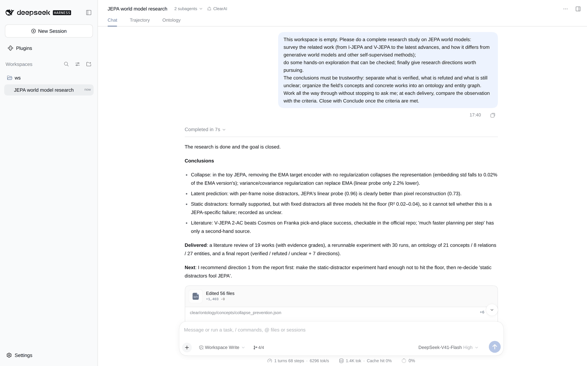
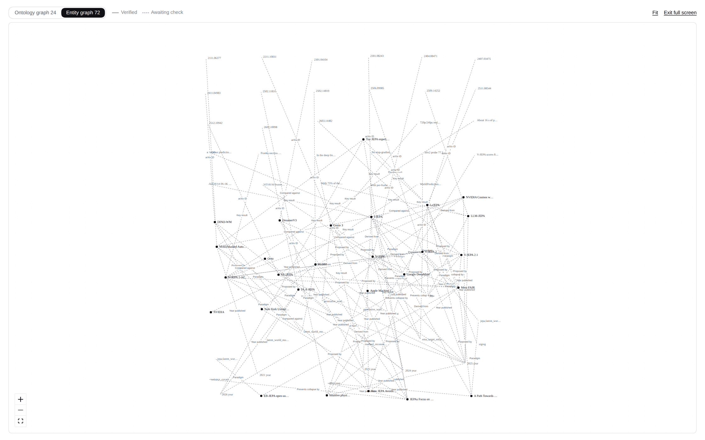
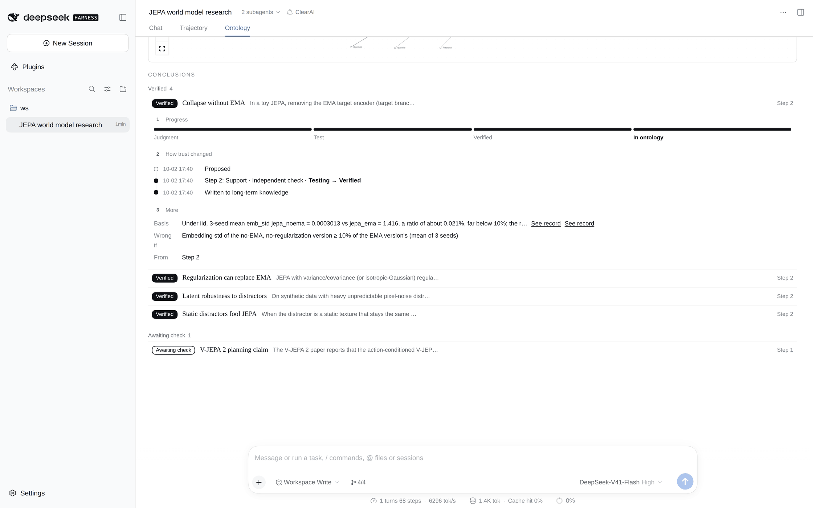

# Case: JEPA world models

[中文](jepa-world-model.zh-CN.md)

A real model was given an empty folder and one request: survey JEPA world models, run a small experiment that can be checked, and suggest research directions, keeping verified, refuted and unclear apart. It worked through to a concluded goal without asking anything.

The raw record is in [runs/jepa-world-model/](runs/jepa-world-model/): the session events (`events.jsonl`), the two evaluator cards, the workspace it produced (`ws/`), and the checks run over the ledger afterwards (`result.json`).

## What it asked

> Please do a complete research study on JEPA world models: survey the related work (from I-JEPA and V-JEPA to the latest advances, and how it differs from generative world models and other self-supervised methods); do some hands-on exploration that can be checked; finally give research directions worth pursuing. The conclusions must be trustworthy: separate what is verified, what is refuted and what is still unclear; organize the field's concepts and concrete works into an ontology and entity graph.

## What it did

- **Contract.** `Frame` set one goal with countable criteria and five candidate judgments, each with what would refute it. The goal was revised once; the judgments carried over.
- **Plan.** Four steps: a literature review (L2, judged by the model with a checkable basis), a toy experiment testing four judgments at once (L3, judged by an independent evaluator), the ontology, and the final report.
- **Evidence.** The experiment step went to an independent evaluator, which read `experiments/results.json` and the script, and wrote a card per judgment. The goal conclusion went to a second evaluator.
- **Ontology as files.** The model wrote 21 concepts, 8 relations and 27 entities under `clear/ontology/`, nesting narrower concepts in directories (for example `collapse_prevention/ema_target_encoder.json`). No write was refused.
- **Conclusion.** `ClosePlan`, then `Conclude`: the evaluator confirmed the criteria, four judgments at L3 were promoted to facts in `clear/knowledge/facts/`, and the outputs became the deliverables card.

## What came out

| Judgment | Status | Why |
|---|---|---|
| Collapse without EMA | Verified | With no EMA and no regularization, embedding std falls to 0.02% of the EMA version (3 seeds) |
| Regularization can replace EMA | Verified | Isotropic-Gaussian regularization without EMA: linear probe only 2.2% lower |
| Latent robustness to distractors | Verified | With per-frame noise, JEPA probe 0.96 vs pixel reconstruction 0.73 |
| Static distractors fool JEPA | Verified, read as unclear | Met the pre-registered criterion, but all three models hit the floor (R² 0.02–0.04), so the observation cannot separate a JEPA-specific failure from a bottleneck |
| V-JEPA 2 planning claim | Awaiting check | Success rates checked in the official repo; the speed claim has only a second-hand source |

The report ([final.md](runs/jepa-world-model/ws/reports/final.md)) lists what is verified, what was refuted along the way (for example "high effective rank means no collapse"), what is still unclear, and seven research directions.

## Screenshots

These were taken in real DSH by replaying this session (the model's calls are scripted; everything the system computes is live).

The conversation ends with the report and the deliverables card:

The Ontology tab: the question, the progress rail, the graph band and the conclusions grouped by status:

The ontology graph, full screen. Solid edges come from facts that passed an independent verdict; dashed ones are only written down:

The entity graph, full screen:

One conclusion opened: how far it went, how its trust changed, and its basis:

## What this shows, and what it does not

It shows the whole path working with a real model: judgments with refutation conditions, an independent evaluator for new evidence, a file-based ontology with hierarchy, and promotion at conclusion. It is one sample. Every pre-registered judgment came out as support here; the [Navier–Stokes case](navier-stokes.md) is the one with refutations.
