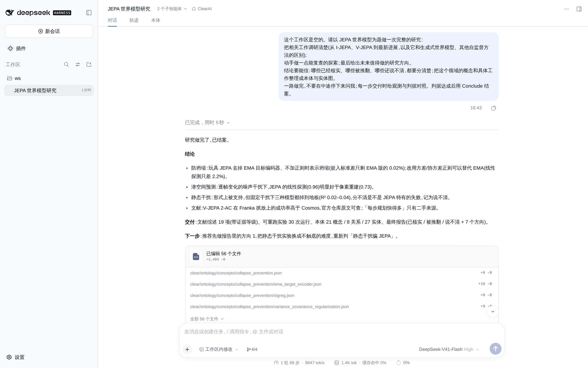
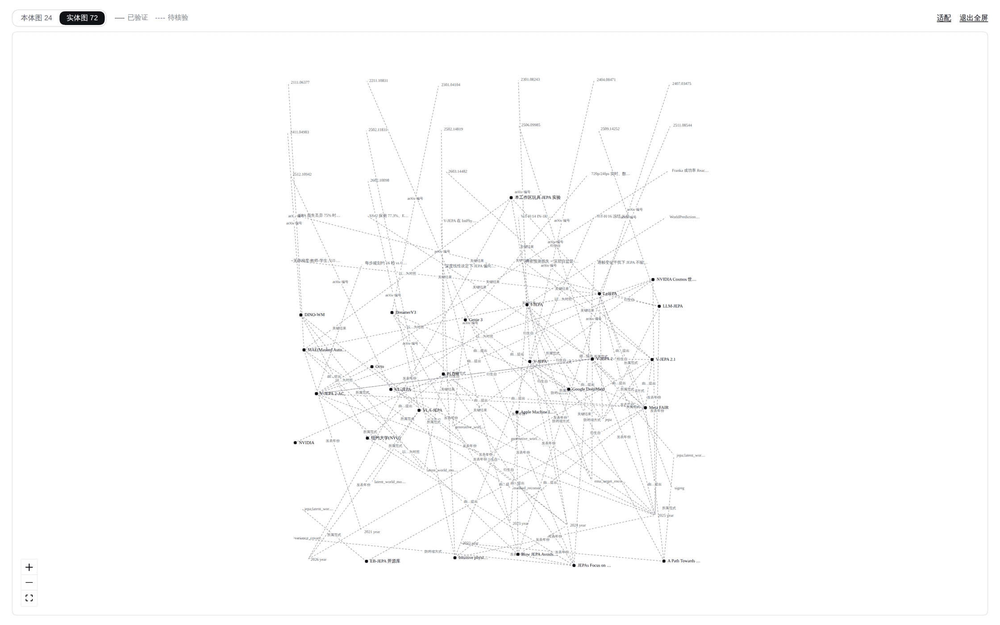
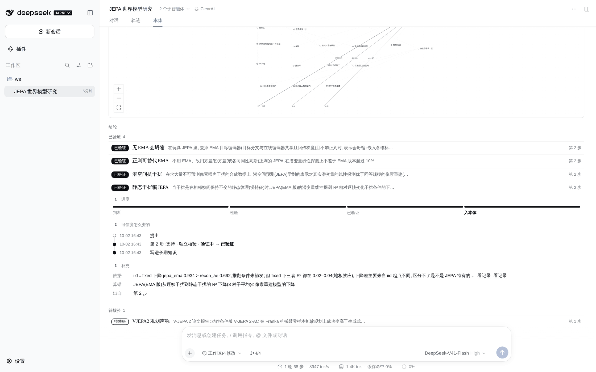

# 案例:JEPA 世界模型

[English](jepa-world-model.md)

给一个真模型一个空文件夹和一句请求:调研 JEPA 世界模型,做一个能复查的小实验,给出研究方向,并把已核实、被推翻、说不清分开。它一路做到目标结案,中途没有问人。

原始记录在 [runs/jepa-world-model/](runs/jepa-world-model/):会话事件(`events.jsonl`)、两张评估卡、它产出的工作区(`ws/`),以及事后对账本跑的检查(`result.json`)。

## 请求

> 工作区是空的。请对 JEPA 世界模型做一次完整研究:调研相关工作(从 I-JEPA、V-JEPA 到最新进展,以及它与生成式世界模型、其他自监督方法的区别);做一些可复查的动手探索;最后给出值得做的研究方向。结论要可信:分清已核实、被推翻和说不清的;把领域里的概念与具体工作整理成本体和实体图。

## 它做了什么

- **立约。** `Frame` 立了一个目标:判据能清点,另有五条候选判断,每条写明什么结果会推翻它。目标修订过一次,判断沿用。
- **计划。** 四步:文献综述(L2,模型自己判,依据要能复查)、一个同时检验四条判断的玩具实验(L3,独立评估者判)、本体、总报告。
- **证据。** 实验那一步交给独立评估者:它读 `experiments/results.json` 和脚本,逐条判断写评估卡。结案再派第二个评估者。
- **本体写成文件。** 模型在 `clear/ontology/` 下写了 21 个概念、8 种关系、27 个实体,下位概念放进目录(例如 `collapse_prevention/ema_target_encoder.json`)。没有一次写入被拒。
- **结案。** 先 `ClosePlan`,再 `Conclude`:评估者确认判据达成,四条到 L3 的判断升格为 `clear/knowledge/facts/` 里的事实,产物成为交付卡片。

## 结果

| 判断 | 状态 | 依据 |
|---|---|---|
| 无EMA会坍缩 | 已验证 | 不用 EMA 也不加正则,嵌入标准差只剩 EMA 版的 0.02%(3 个种子) |
| 正则可替代EMA | 已验证 | 各向同性高斯正则、不用 EMA,线性探测只低 2.2% |
| 潜空间抗干扰 | 已验证 | 逐帧噪声干扰下,JEPA 探测 0.96,像素重建 0.73 |
| 静态干扰骗JEPA | 已验证,读作说不清 | 满足预先登记的判据,但三个模型都到了地板(R² 0.02–0.04),这次观测分不出是 JEPA 特有的失败还是瓶颈 |
| VJEPA2规划声称 | 待核验 | 成功率在官方仓库核对过;速度那一半只有二手来源 |

报告([final.md](runs/jepa-world-model/ws/reports/final.md))列出已核实、途中被推翻的说法(例如「有效秩高说明没有坍缩」)、说不清的,以及七个研究方向。

## 截图

在真 DSH 里回放这场会话拍的(模型的调用由脚本回放,系统算的一切都是现场算的)。

对话以报告和交付卡片收尾:

「本体」一格:问题、进度轨、图带,以及按状态分组的结论:

本体图全屏。实线来自过了独立裁决的事实,虚线只是写下了:

实体图全屏:

展开一条结论:走到了哪一站、可信度怎么变过来的、依据是什么:

## 它说明了什么,没说明什么

它说明整条路在真模型上走得通:带推翻条件的判断、新证据交给独立评估者、带层次的文件本体、结案时升格。它只是一个样本。这里预先登记的判断全都是支持;有推翻的是 [Navier–Stokes 案例](navier-stokes.zh-CN.md)。
