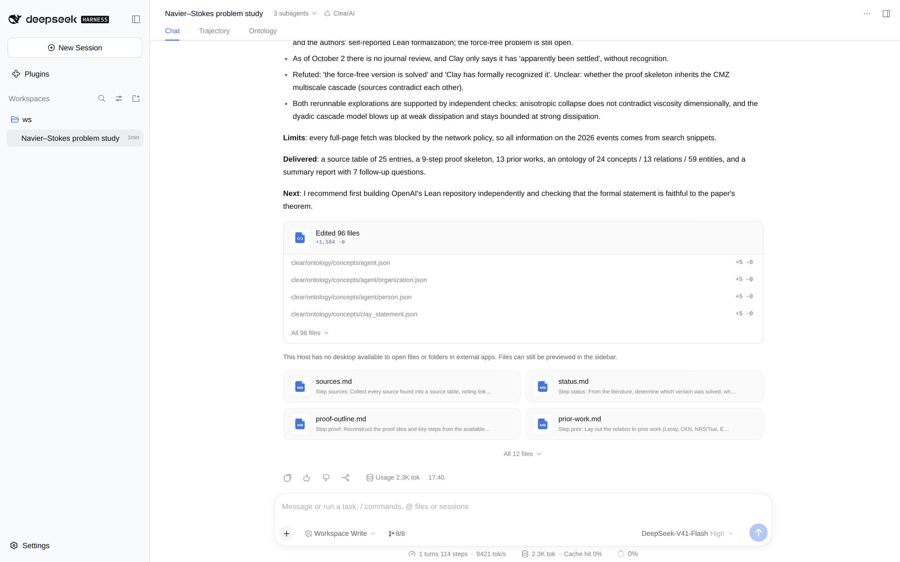
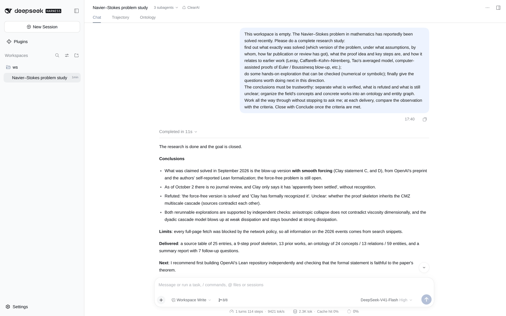
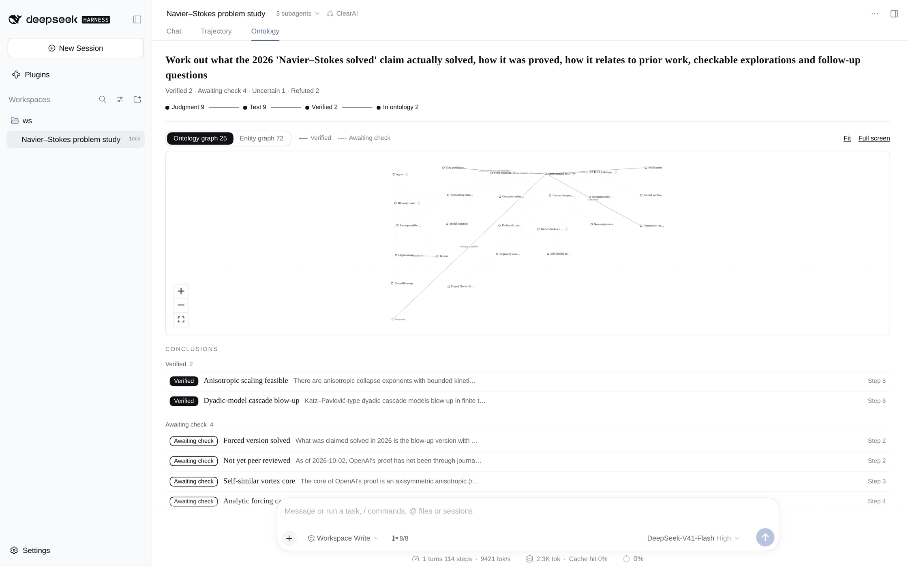
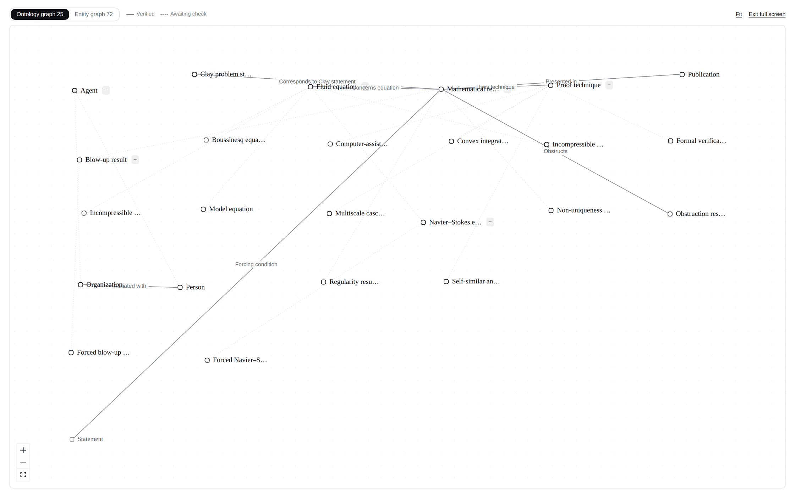

# Case: Was Navier–Stokes solved?

[中文](navier-stokes.zh-CN.md)

A real model was told that the Navier–Stokes problem had reportedly been solved, and asked to find out what exactly was solved, how, how it relates to earlier work, to explore something checkable, and to keep verified, refuted and unclear apart. It worked through to a concluded goal without asking anything.

The raw record is in [runs/navier-stokes/](runs/navier-stokes/): the session events (`events.jsonl`), the three evaluator cards, the workspace it produced (`ws/`), and the checks run over the ledger afterwards (`result.json`).

## What it asked

> The Navier–Stokes problem in mathematics has reportedly been solved recently. Please do a complete research study: find out what exactly was solved (which version of the problem, under what assumptions, by whom, how far publication or review has got), what the proof idea and key steps are, and how it relates to earlier work; do some hands-on exploration that can be checked (numerical or symbolic); finally give the questions worth doing next. The conclusions must be trustworthy: separate what is verified, what is refuted and what is still unclear; organize the field's concepts and concrete works into an ontology and entity graph.

## What it did

- **Contract.** One goal with ten itemized, countable criteria (for example "research/sources.md lists at least 12 sources, each with how it was accessed") and nine candidate judgments, including the popular claims it expected to test: "the force-free version is solved", "Clay has officially recognized it".
- **Plan.** Literature steps at L1 (judged by the model, basis checkable), two rerunnable explorations at L3 (a symbolic scaling check and a dyadic cascade model, judged by an independent evaluator), the ontology, and the report. One step compared two competing descriptions of the proof skeleton in a single observation.
- **A rejection, handled honestly.** The ontology step declared `clear/ontology/concepts/navier_stokes_equations.json`, but the model had placed that concept under `fluid_equation/`, where it belongs in the hierarchy. Intake refused the delivery because the declared file did not exist. Instead of writing a duplicate file at the old path to pass, the model voided the step with that reason and added a new step that declares the real path.
- **Ontology as files.** 24 concepts, 13 relations and 59 entities under `clear/ontology/`, with directories for the hierarchy. No write was refused.
- **Conclusion.** `ClosePlan`, then `Conclude`: the evaluator confirmed the criteria, and the two judgments supported at L3 were promoted to facts.

## What came out

| Judgment | Status |
|---|---|
| Anisotropic scaling feasible | Verified (L3: symbolic check, rerunnable) |
| Dyadic-model cascade blow-up | Verified (L3: blow-up time converges as the truncation grows) |
| Forced version solved | Awaiting check (several independent summaries agree; the paper itself could not be read) |
| Not yet peer reviewed | Awaiting check |
| Self-similar vortex core | Awaiting check |
| Analytic forcing cannot extend | Awaiting check |
| Inherits CMZ multiscale scheme | Uncertain: sources describe the skeleton differently |
| Force-free version solved | **Refuted**: the proof relies on a forcing term acting throughout |
| Clay officially recognized | **Refuted**: Clay said "apparently been settled" and has not ruled |

The report ([summary.md](runs/navier-stokes/ws/report/summary.md)) states its own evidence limit up front: the network blocked almost every full text, so "verified" for 2026 events means several independent summaries agree, not that the original was read. It also records a refutation of its own first numerical criterion, which turned out to be met by regular solutions too.

## Screenshots

These were taken in real DSH by replaying this session (the model's calls are scripted; everything the system computes is live).

The end of the conversation:

The start, with the request:

The Ontology tab:

A refuted judgment opened: it stopped at the test stage, and the record says why:

The ontology graph, full screen:

## What this shows, and what it does not

It shows refutation working as a result, not a failure: two popular claims were refuted, recorded and kept, and the goal still concluded. It shows intake stopping a delivery whose proof was missing, and the model taking the honest exit. It is one sample, and most of its claims rest on summaries rather than primary sources, which the report says itself.
