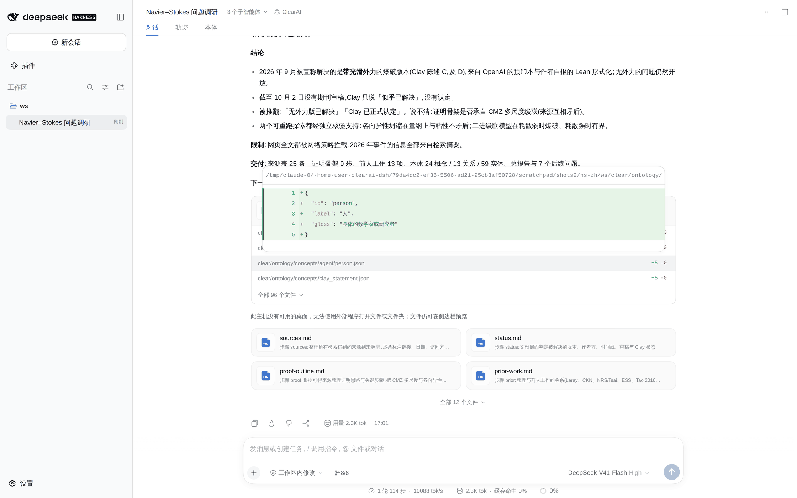
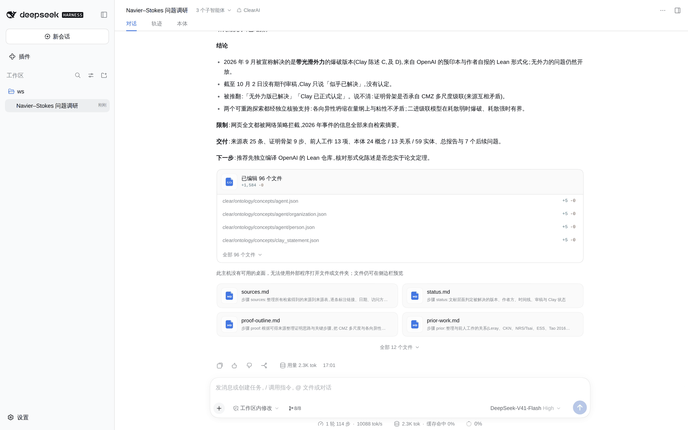
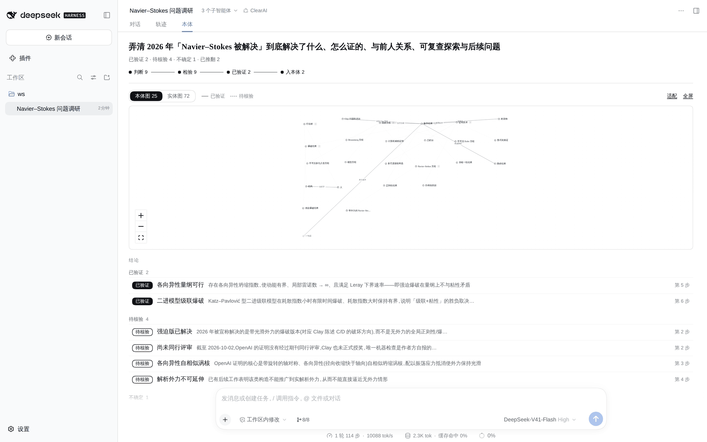
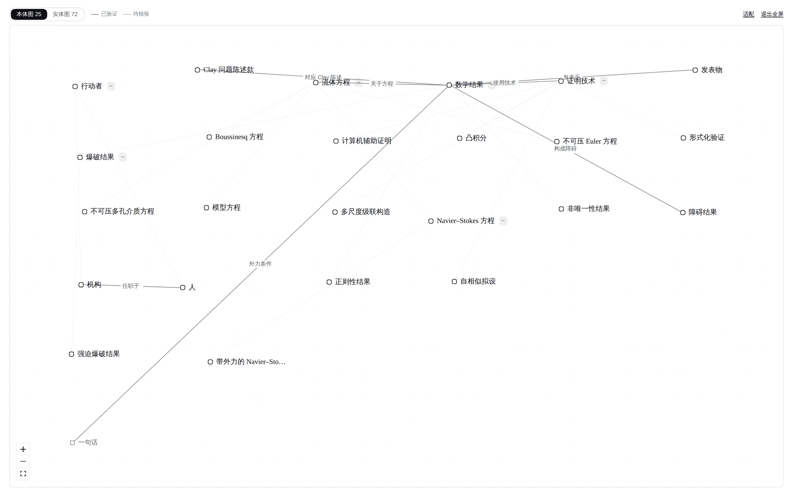

# 案例:Navier–Stokes 被解决了吗?

[English](navier-stokes.md)

告诉一个真模型「Navier–Stokes 问题据说最近被解决了」,请它弄清到底解决了什么、怎么证的、和前人什么关系,做一点能复查的探索,并把已核实、被推翻、说不清分开。它一路做到目标结案,中途没有问人。

原始记录在 [runs/navier-stokes/](runs/navier-stokes/):会话事件(`events.jsonl`)、三张评估卡、它产出的工作区(`ws/`),以及事后对账本跑的检查(`result.json`)。

## 请求

> 工作区是空的。数学里的 Navier–Stokes 问题据说最近被解决了。请做一次完整研究:弄清到底解决了什么(哪个版本、什么假设、谁做的、发表或审稿到了哪一步),证明思路与关键步骤,以及和前人工作的关系;做一些可复查的动手探索(数值或符号);最后给出这个方向上值得做的问题。结论要可信:分清已核实、被推翻和说不清的;把领域里的概念与具体工作整理成本体和实体图。

## 它做了什么

- **立约。** 一个目标,十条逐条可清点的判据(例如「research/sources.md 至少列 12 条来源,每条注明访问方式」),九条候选判断,其中包括它打算检验的流行说法:「无外力版已解决」「Clay已正式认定」。
- **计划。** 文献各步是 L1(模型自己判,依据要能复查);两个可重跑的探索是 L3(符号标度校验和二进级联模型,独立评估者判);然后是本体和报告。有一步用一次观测同时判两种互相竞争的证明骨架描述。
- **被拦了一次,如实处理。** 本体那一步声明的产物是 `clear/ontology/concepts/navier_stokes_equations.json`,但模型按层次把这个概念放进了 `fluid_equation/`。准入因为声明的文件不存在拒了这次交付。模型没有在旧路径造一个重复文件来过关,而是带着这个理由作废了这一步,补了一步按真实路径声明。
- **本体写成文件。** `clear/ontology/` 下 24 个概念、13 种关系、59 个实体,层次用目录表达。没有一次写入被拒。
- **结案。** 先 `ClosePlan`,再 `Conclude`:评估者确认判据达成,两条到 L3 的判断升格为事实。

## 结果

| 判断 | 状态 |
|---|---|
| 各向异性量纲可行 | 已验证(L3:符号校验,可重跑) |
| 二进模型级联爆破 | 已验证(L3:截断加大时爆破时刻收敛) |
| 强迫版已解决 | 待核验(多个独立摘要一致,原文读不到) |
| 尚未同行评审 | 待核验 |
| 各向异性自相似涡核 | 待核验 |
| 解析外力不可延伸 | 待核验 |
| 承自CMZ多尺度 | 不确定:各来源对骨架的描述不一致 |
| 无外力版已解决 | **已推翻**:证明依赖全程作用的外力 |
| Clay已正式认定 | **已推翻**:Clay 只说「似乎已解决」,尚未认定 |

报告([summary.md](runs/navier-stokes/ws/report/summary.md))开头就写明证据限度:网络挡住了几乎所有全文,所以 2026 年事件的「已核实」意思是多个独立摘要一致,不是读过原文。它还记下了自己第一版数值判据被推翻:那条判据正则解也满足。

## 截图

在真 DSH 里回放这场会话拍的(模型的调用由脚本回放,系统算的一切都是现场算的)。

对话收尾:

对话开头,即那句请求:

「本体」一格:

展开一条被推翻的判断:它停在检验这一站,记录写明了原因:

本体图全屏:

## 它说明了什么,没说明什么

它说明推翻是一种结果,不是失败:两条流行说法被推翻、记下、保留,目标照样结案。它说明准入会拦住缺物证的交付,而模型走了如实的那条出路。它只是一个样本,多数说法依据的是摘要而不是一手来源,报告自己也这么说。
