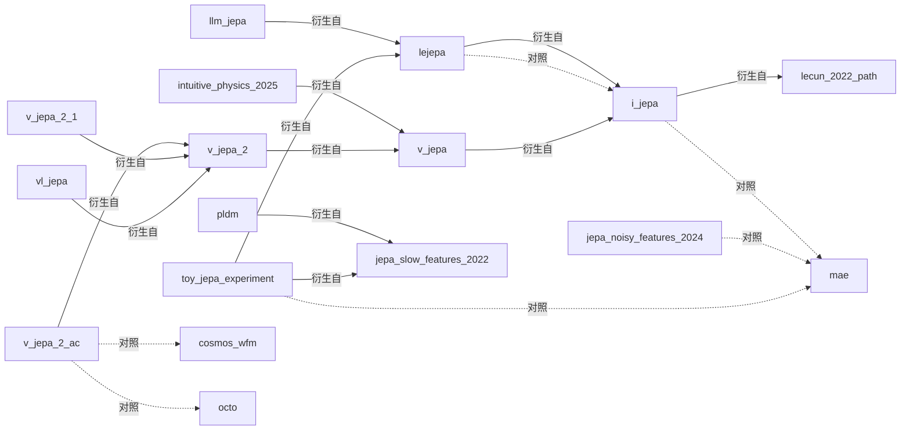

# 本体与实体图

由脚本从 `clear/ontology/` 读出:21 个概念、8 个关系、27 个实体。目录嵌套即上下位(概念)/组成(实体)。

## 概念层次

- `collapse_prevention` 防坍缩机制:阻止联合嵌入模型把所有输入映射到同一个表示的手段
  - `ema_target_encoder` EMA 目标编码器 + 停梯度:目标分支用在线编码器参数的指数滑动平均,且不回传梯度
  - `sigreg` SIGReg:随机一维投影 + 特征函数检验,把嵌入分布推向各向同性高斯
  - `variance_covariance_regularization` 方差-协方差正则:约束每维方差不低于阈值、各维去相关(VICReg 式)
- `latent_planning` 潜空间规划:在世界模型的表示空间里对候选动作序列打分优化(如 CEM/MPC),以图像目标的表示为目标
- `learning_paradigm` 学习范式:表示或模型靠什么目标、在什么空间里学
  - `self_supervised_learning` 自监督学习:不用人工标签、从数据自身构造预测目标来学表示
    - `contrastive_invariance` 对比/不变性学习:让同一数据的两种增强视图表示一致(含负样本对比或方差-协方差正则)
    - `jepa` 联合嵌入预测架构:在表示空间里从上下文的表示预测目标的表示,不还原像素
    - `masked_reconstruction` 掩码/像素重建:在像素或 token 空间重建被遮挡或缺失的输入
- `organization` 机构:发布研究成果的机构或实验室
- `representation_collapse` 表示坍缩:编码器输出对所有输入几乎相同,使预测损失平凡地为零
- `research_artifact` 研究成果:一篇论文、一个发布的模型或一个代码库
  - `experiment_run` 实验:本工作区内做的可重跑实验
  - `model_release` 模型/方法:提出并发布的具体模型或训练方法
  - `software_library` 开源库:供他人复用的代码库或教程
  - `theory_paper` 理论/分析论文:以理论或分析为主要贡献的论文(含立场论文)
- `slow_feature` 慢特征:随时间几乎不变、因而对预测很'好用'却可能与任务无关的特征(如静态背景)
- `world_model` 世界模型:给定当前状态(与动作)预测世界下一步会怎样的模型,可用于规划
  - `generative_world_model` 生成式世界模型:在像素/视频 token 空间生成未来观测的世界模型
  - `latent_world_model` 潜空间世界模型:只在学到的表示空间里预测未来状态,不生成像素

## 关系

 | id | 名称 | 主语 | 宾语 | 单值 |
|---|---|---|---|---|
| `arxiv_id` | arXiv 编号 | research_artifact | {"form": "reference"} | True |
| `compared_against` | 以…为对照 | research_artifact | "research_artifact" | False |
| `derived_from` | 衍生自 | research_artifact | "research_artifact" | False |
| `key_result` | 关键结果 | research_artifact | {"form": "statement"} | False |
| `paradigm` | 所属范式 | research_artifact | {"form": "statement"} | False |
| `prevents_collapse_by` | 防坍缩方式 | research_artifact | {"form": "statement"} | False |
| `proposed_by` | 由…提出 | research_artifact | "organization" | False |
| `released_year` | 发表年份 | research_artifact | {"form": "quantity", "unit": "year"} | True |

## 实体与关系边

| 实体 | 类型 | 出处 | 关系 |
|---|---|---|---|
| `apple_mlr` Apple Machine Learning Research | organization | https://machinelearning.apple.com/research/implicit-bias |  |
| `cosmos_wfm` NVIDIA Cosmos 世界基础模型 | model_release | https://techcrunch.com/2025/01/06/nvidia-releases-its-own-brand-of-world-models | proposed_by → `nvidia` released_year = 2025 paradigm = generative_world_model |
| `dino_wm` DINO-WM | model_release | sources/gaoyuezhou_dino_wm_README.md | proposed_by → `nyu` released_year = 2024 arxiv_id = 2411.04983 paradigm = latent_world_model;latent_planning |
| `dreamer_v3` DreamerV3 | model_release | https://arxiv.org/abs/2301.04104 | proposed_by → `google_deepmind` released_year = 2023 arxiv_id = 2301.04104 paradigm = generative_world_model;latent_world_model |
| `eb_jepa` EB-JEPA 开源库 | software_library | sources/facebookresearch_eb_jepa_README.md | proposed_by → `meta_fair` paradigm = jepa;latent_world_model;latent_planning |
| `genie_3` Genie 3 | model_release | https://deepmind.google/discover/blog/genie-3-a-new-frontier-for-world-models/ | proposed_by → `google_deepmind` released_year = 2025 paradigm = generative_world_model key_result = 720p/24fps 实时、数分钟一致;等级 B |
| `google_deepmind` Google DeepMind | organization | https://deepmind.google/discover/blog/genie-3-a-new-frontier-for-world-models/ |  |
| `i_jepa` I-JEPA | model_release | https://github.com/facebookresearch/ijepa | derived_from → `lecun_2022_path` proposed_by → `meta_fair` compared_against → `mae` released_year = 2023 arxiv_id = 2301.08243 paradigm = jepa prevents_collapse_by = ema_target_encoder key_result = ViT-H/14 IN-1K 线性探测 79.3%(MAE ViT-H/14 77.2%);等级 B |
| `intuitive_physics_2025` Intuitive physics understanding emerges from SSL on natural videos | theory_paper | https://github.com/facebookresearch/jepa-intuitive-physics | derived_from → `v_jepa` proposed_by → `meta_fair` released_year = 2025 arxiv_id = 2502.11831 key_result = V-JEPA 在 IntPhys 物体恒存 85.7%、连续性 86.3%;像素预测模型与多模态 LLM 接近随机;等级 B |
| `jepa_noisy_features_2024` How JEPA Avoids Noisy Features | theory_paper | https://machinelearning.apple.com/research/implicit-bias | proposed_by → `apple_mlr` compared_against → `mae` released_year = 2024 arxiv_id = 2407.03475 key_result = 深度线性设定下 JEPA 偏向高影响(大回归系数)特征,MAE 偏向高方差特征;等级 B |
| `jepa_slow_features_2022` JEPAs Focus on Slow Features | theory_paper | https://arxiv.org/abs/2211.10831 | proposed_by → `nyu` released_year = 2022 arxiv_id = 2211.10831 prevents_collapse_by = variance_covariance_regularization key_result = 逐帧变化干扰下 JEPA 不输重建;固定干扰下 JEPA 失败;等级 B |
| `lecun_2022_path` A Path Towards Autonomous Machine Intelligence | theory_paper | https://openreview.net/forum?id=BZ5a1r-kVsf | proposed_by → `meta_fair` released_year = 2022 paradigm = jepa;latent_world_model |
| `lejepa` LeJEPA | model_release | sources/rbalestr-lab_lejepa_README.md | derived_from → `i_jepa` compared_against → `i_jepa` proposed_by → `meta_fair` released_year = 2025 arxiv_id = 2511.08544 paradigm = jepa prevents_collapse_by = sigreg key_result = 无停梯度/教师-学生;ViT-L 8 数据集全量线性平均 79.48 vs I-JEPA ViT-H 78.50;等级 A |
| `llm_jepa` LLM-JEPA | model_release | sources/galilai-group_llm-jepa_README.md | derived_from → `lejepa` released_year = 2025 arxiv_id = 2509.14252 paradigm = jepa key_result = JEPA 损失丢弃 75% 时约 1.25× 计算量保持微调性能;等级 A |
| `mae` MAE(Masked Autoencoder) | model_release | https://arxiv.org/abs/2111.06377 | released_year = 2021 arxiv_id = 2111.06377 paradigm = masked_reconstruction |
| `meta_fair` Meta FAIR | organization | https://github.com/facebookresearch |  |
| `nvidia` NVIDIA | organization | https://techcrunch.com/2025/01/06/nvidia-releases-its-own-brand-of-world-models |  |
| `nyu` 纽约大学(NYU) | organization | https://github.com/gaoyuezhou/dino_wm |  |
| `octo` Octo | model_release | sources/vjepa2_README.md | released_year = 2024 |
| `pldm` PLDM | model_release | https://arxiv.org/abs/2502.14819 | derived_from → `jepa_slow_features_2022` proposed_by → `nyu` released_year = 2025 arxiv_id = 2502.14819 paradigm = latent_world_model;latent_planning |
| `toy_jepa_experiment` 本工作区玩具 JEPA 实验 | experiment_run | experiments/toy_jepa.py | derived_from → `lejepa` derived_from → `jepa_slow_features_2022` compared_against → `mae` released_year = 2026 |
| `v_jepa` V-JEPA | model_release | https://github.com/facebookresearch/jepa | derived_from → `i_jepa` proposed_by → `meta_fair` released_year = 2024 arxiv_id = 2404.08471 paradigm = jepa prevents_collapse_by = ema_target_encoder key_result = ViT-H/16 冻结:K400 81.9%、SSv2 72.2%、IN-1K 77.9%;等级 B |
| `v_jepa_2` V-JEPA 2 | model_release | sources/vjepa2_README.md | derived_from → `v_jepa` proposed_by → `meta_fair` released_year = 2025 arxiv_id = 2506.09985 paradigm = jepa;latent_world_model prevents_collapse_by = ema_target_encoder key_result = SSv2 探测 77.3%、EK100 R@5 39.7%;等级 A |
| `v_jepa_2_ac` V-JEPA 2-AC | model_release | sources/vjepa2_README.md | derived_from → `v_jepa_2` proposed_by → `meta_fair` compared_against → `cosmos_wfm` compared_against → `octo` released_year = 2025 paradigm = latent_world_model;latent_planning key_result = Franka 成功率 Reach/Grasp-Cup/Grasp-Box/P&P-Cup/P&P-Box = 100/60/20/80/50%,Cosmos 80/0/20/0/0%;等级 A key_result = 每步规划约 16 秒 vs Cosmos 约 4 分钟;等级 C(二手,未对照原文) |
| `v_jepa_2_1` V-JEPA 2.1 | model_release | sources/vjepa2_README.md | derived_from → `v_jepa_2` proposed_by → `meta_fair` released_year = 2026 arxiv_id = 2603.14482 paradigm = jepa key_result = 稠密预测损失 + 深层自监督 + 多模态 tokenizer;抓取成功率比 V-JEPA 2 高 20 个百分点(等级 B) |
| `vl_jepa` VL-JEPA | model_release | https://arxiv.org/abs/2512.10942 | derived_from → `v_jepa_2` proposed_by → `meta_fair` released_year = 2025 arxiv_id = 2512.10942 key_result = WorldPrediction-WM 63.9%;等级 B |
| `vla_jepa` VLA-JEPA | model_release | https://arxiv.org/abs/2602.10098 | released_year = 2026 arxiv_id = 2602.10098 paradigm = latent_world_model |

## 实体关系图(只画实体间的边;proposed_by 边省略以免拥挤)

