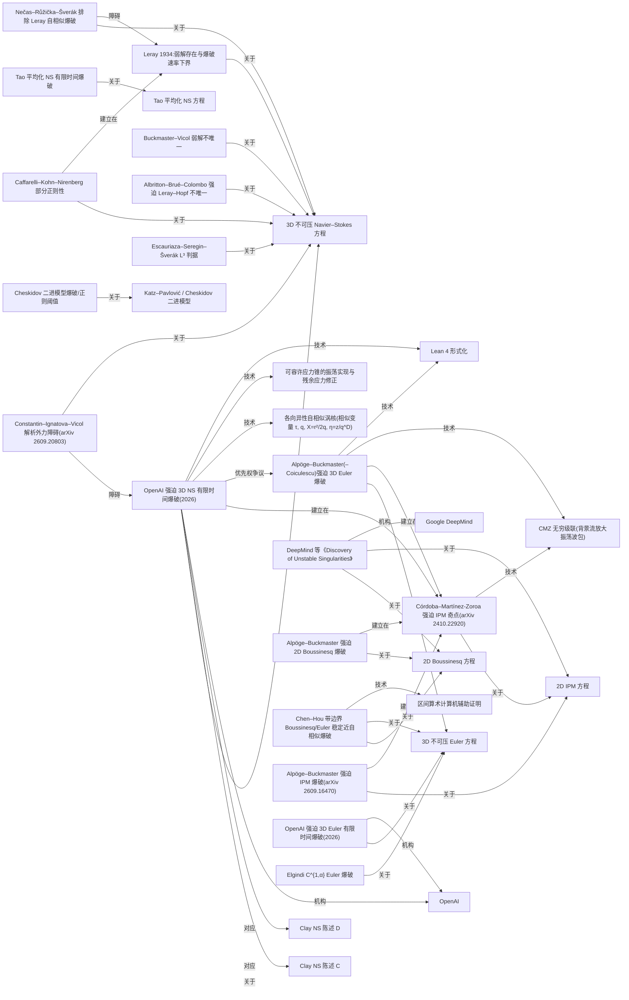
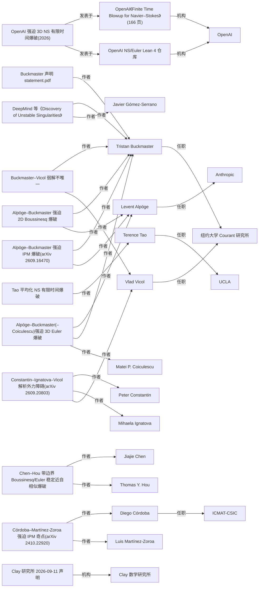

# 实体关系图

由 `clear/ontology/entities/` 自动生成(共 59 个实体、70 条对象关系)。图一画结果—方程—陈述—技术—机构;图二画人物—结果—机构。字面值关系(日期、外力条件、审稿状态)见各实体文件。

## 图一:结果、方程、Clay 陈述、技术

## 图二:人物与机构

两图共覆盖 54 个实体。

## 读图要点

- `openai_ns_blowup_2026` 对应 Clay 陈述 C 与 D(宣称),与 `ba_euler_forced_2026` 之间有优先权争议;`civ_analytic_obstruction_2026` 对它构成障碍(解析外力不可行)。
- 强迫爆破一族(CMZ 2024 → Alpöge–Buckmaster 三篇 → OpenAI)都指向 CMZ;OpenAI 指向 CMZ 的那条边只据综合摘要(S25),可信度低于其余边。
- 无外力路线(Chen–Hou、DeepMind 2025)与强迫路线在图上是两簇,中间只靠 Buckmaster 一个人连接。
