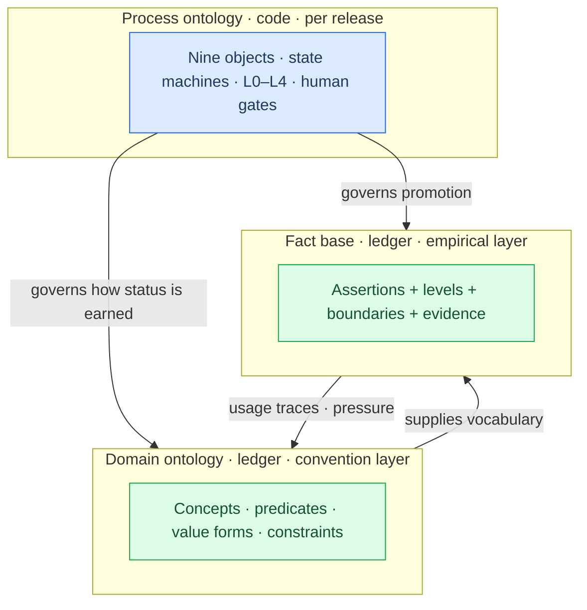
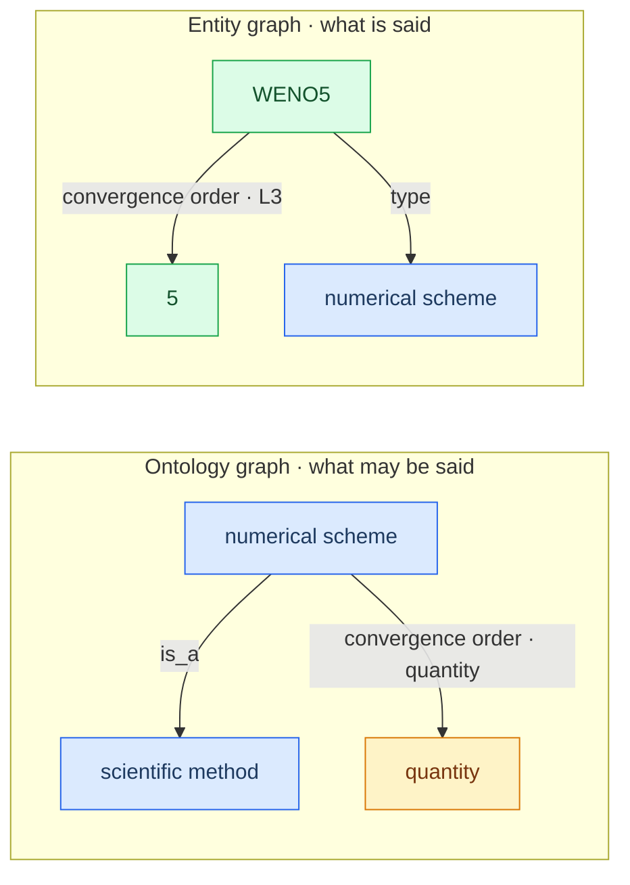
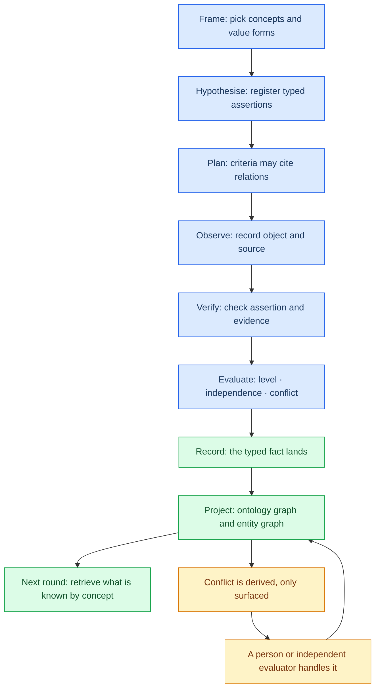
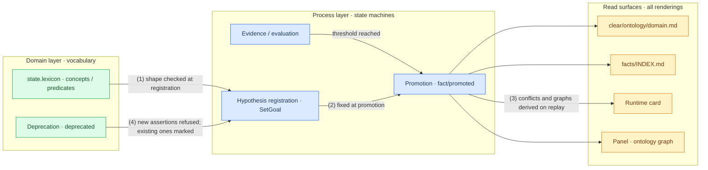

# Domain Ontology: the Knowledge Form of the Epistemic Loop

> The epistemic loop governs *what may be believed*. The domain ontology governs *the language in which it is said*. This document defines the domain ontology and specifies how it is represented, stored, added, revised and deprecated, and how it relates to the epistemic loop, the fact base and graph projection.
>
> This describes the `0.2.0` **design**. What is implemented and what is still a design target is governed by [Known gaps](known-gaps.md) and the [mechanism truth table](optimization/truth-table.md) — this document does not present itself as current behaviour.

---

## 1. The problem: facts need a form

A fact today is a one-line statement (`text`), a boundary (`scope`), a support level (`level`) and a set of evidence references. It is epistemically complete — the *why believe it* is answered — but its content is prose, so three things cannot be done mechanically:

- **Comparison**: whether two facts are about the same thing can only be decided by re-reading prose;
- **Conflict detection**: two contradictory facts can sit on the shelf together with nobody told;
- **Reuse**: citing "what is known" in the next round means re-reading the whole fact base instead of retrieving by concept.

The loop therefore completes only half its work: it *earns* conclusions but does not *place* them into a structure that can keep growing. The starting point of this design is one sentence:

> The product of the epistemic loop is not a string; it is **bounded knowledge** — assertion content (constrained by the ontology) times epistemic metadata (governed by the loop).

---

## 2. Three layers

"Ontology" has two senses in this repository and they must be kept apart, or two entirely different kinds of authority get conflated.

| Layer | What it is | Question it answers | Where authority comes from | Rate of change |
|---|---|---|---|---|
| **Process ontology** | [`verification-loop`](verification-loop.md): nine objects, state machines, L0–L4, who judges and who releases | **How** we come to know | Code declaration, assembly-time validation, per plugin release | Release-level |
| **Domain ontology** | A project's domain language: concepts, predicates, value forms, constraints | **In what language** we say it | Convention: admitted with a basis, usage leaves traces, deprecation is sticky | Slow (convention layer) |
| **Fact base** | Sentences written in that language that already passed the loop | **What** we know | The loop: evidence, levels, boundaries, evaluation, review | Fast (empirical layer) |

### 2.1 The domain ontology is a language, not an a priori frame

In knowledge representation, an ontology is "an explicit specification of a conceptualization" (Gruber, 1993). ClearAI accepts the **form** (explicit, shareable, checkable) and rejects the **a-priority**:

> **A domain ontology is the language layer of a project's knowledge base: a set of governed conventions about which concepts exist in this domain, how they relate, which units quantities use, and what form a conclusion takes.**

That yields one cut which dissolves two deadlocks at once:

- **Bootstrapping**: a fact needs promotion before it has epistemic standing. If the domain ontology were also defined as "facts that must pass the loop", then no vocabulary would exist while the first goal is still running. **A language may exist before any sentence does** — conventions are admitted by named verbs, not by promotion.
- **Authority**: a term is a convention, not an empirical claim. The authority of a convention comes from being adopted, used and deprecable — not from an evidence level. Only empirical claims need L0–L4.

So: **terms do not need verification; sentences written with terms do.**

### 2.2 The process ontology is the plugin's own backend flow

The process ontology is not project knowledge — it is the **plugin's own backend flow structure**: which objects exist, who may push which transition, who judges at which level. Three boundaries follow:

- **It does not enter the ledger**: the ledger records **instances** (`goal/set`, `step/advanced`, `fact/promoted`, …), not the machine. Recording the machine in a project ledger would turn a plugin upgrade into a rewrite of project history, and would hand the runtime the ability to rewrite the rules of knowing — exactly what "inexpressible beats unviolatable" exists to prevent. The machine changes by **release**, `STATE_VERSION` guards its shape, and the shelf states the current version plainly.
- **It is not editable at runtime**: changing the machine means changing code and declaration (`preset/plugins/ontology.js`), through assembly-time validation and a release — never through the ontology tab.
- **It is shown as a state shape, not as a document to maintain**: the user sees steps, lanes, gates and convergence in the worldlines tree, and sees propositions grouped by ontology state in Propositions and facts — that is what the process ontology looks like on screen. The `clear/ontology/verification-loop.md` shelf is first of all the **charter the model reads** (it must write criteria and deliveries against these objects) and only secondly a reference for a human who wants to read deeply.

In one line: **the domain ontology answers "in what language is your knowledge written" (editable, ledgered, backed by a basis); the process ontology answers "where does your work stand right now" (release-level, not editable, invisible rules with visible states).**

### 2.3 The three layers



---

## 3. The graph model: the minimal set after Occam's razor

No OWL, no RDF triples, no SHACL, no SPARQL, no graph database, no separate reasoner. Only the four node kinds and three edge kinds that serve the current loop.

### 3.1 Nodes

| Node | Meaning | Independently governed |
|---|---|---|
| `concept` | A domain concept, e.g. "numerical scheme", "furnace batch", "ramp rate" | Yes — part of the domain ontology |
| `value_type` | A built-in value form: `statement` / `quantity` / `formula` / `code` / `reference` | No — fixed by the system |
| `instance` | A concrete object mentioned by a fact, e.g. "WENO5", "batch-2025-001" | No — projected from facts |
| `literal` | A number, text, formula, or code reference used as an object | No — projected from facts |

**Instances are not registered.** They are projected out of typed facts and have no separate lifecycle — otherwise a picture would cost a whole extra object model. Instances sharing a label collapse to one node; entity resolution (two names for one thing) is out of scope, see [Known gaps](known-gaps.md).

### 3.2 Edges

| Edge | Meaning | Example |
|---|---|---|
| `is_a` | Concept subsumption | `WENO scheme → numerical scheme` |
| `predicate` | A domain predicate: concept → concept, or concept → value form | `numerical scheme --convergence order--> quantity` |
| `assertion` | One typed fact | `WENO5 --convergence order--> 5` |

A predicate is a **first-class edge record** in the ontology graph, not a visible node. It carries:

```json
{
  "id": "convergence_order",
  "label": "convergence order",
  "domain": "numerical_scheme",
  "range": { "form": "quantity", "unit": "order" },
  "functional": true
}
```

Predicates are promoted to nodes only when relations *between predicates* genuinely need expressing. **No meta-model in advance.**

### 3.3 Ontology graph and entity graph stay separate



Drawing a term definition and an empirical fact as the same kind of edge is the main mistake this design avoids: they differ in authority, in rate of change, and in the cost of being wrong.

---

## 4. Facts: assertion plus epistemic metadata

### 4.1 Definition

> **A fact = an assertion written in the domain language + epistemic metadata.**

The metadata is what exists today (level, boundary, evidence, evaluation, review, source goal, verification path) and loses nothing. What is new is the **assertion**:

```json
{
  "subject": { "id": "WENO5", "type": "numerical_scheme" },
  "predicate": "convergence_order",
  "object": { "kind": "quantity", "value": 5, "unit": "order" },
  "qualifiers": { "regime": "smooth" }
}
```

### 4.2 Value forms: the direct answer to "what form?"

Plain text, formulae and code are not three kinds of fact. They are the five **value forms an assertion object may take**:

| Form | Object shape | Validation (strict once supplied) |
|---|---|---|
| `statement` | A short statement string | Non-empty, bounded length |
| `quantity` | A number plus a unit string | The number parses; the unit is non-empty; no dimensional arithmetic in this version |
| `formula` | LaTeX source | Non-empty; no semantic parsing in this version |
| `code` | A workspace file path | The file really exists in the workspace (the same discipline as "a scale must reference a real file") |
| `reference` | A ledger id or an on-disk path | The reference resolves |

A relation predicate (`range: { term }`) takes an **instance** as its object — `{ kind: "instance", value: "<label>" }` — because its object is another instance rather than a literal value. `instance` is therefore the relation-object form, not a sixth value form.

### 4.3 Fields a promoted fact carries

Beyond today's fields, `fact/promoted` gains:

- `hypothesis`: the id of the hypothesis that produced this fact. This **fixes a fragile spot**: hypotheses and facts are matched today by `text` equality, so rewording breaks the link. Matching by id replaces it.
- `assertions`: the assertion array, or `null` when absent (lenient plus validated: omission passes, supply is checked strictly).

---

## 5. Storage and projection

### 5.1 The only authority: ledger events

| Event | Meaning |
|---|---|
| `ontology/term_added` | Admit a concept |
| `ontology/predicate_added` | Admit a predicate |
| `ontology/term_revised` | Non-semantic revision of a concept (version +1, old values kept) |
| `ontology/predicate_revised` | Non-semantic revision of a predicate |
| `ontology/term_deprecated` | Sticky deprecation of a concept |
| `ontology/predicate_deprecated` | Sticky deprecation of a predicate |

`fold` replays these into `state.lexicon` (concepts, predicates, revision history, deprecations). **There is no second state account.**

The projection also carries a `state.ontology` slot, and that is the **process-ontology** shape (see §2.2) — not the same thing as this field: one is release-scoped and not editable, the other grows with the project and is governed by the ledger.

### 5.2 Every read surface comes from the same projection

None of the following is authoritative storage; all of it is rendering:

- `clear/ontology/domain.md`: the Markdown read surface for the domain ontology (with Mermaid), rendered idempotently by the system;
- `clear/knowledge/facts/INDEX.md`: the fact shelf;
- the ontology graph and entity graph in the UI;
- the statistics line on the runtime card;
- the nodes and edges returned by `graphProjection(state)`.

**There is no hand-editable `domain.json`.** If offline editing is ever needed, a file may only be a **draft patch** that enters the ledger through an apply action.

### 5.3 Layout is not stored

Node coordinates, zoom and filters are not knowledge and do not enter the ledger. Layout is a **deterministic pure function**:

- the ontology graph prefers `is_a` layering;
- without hierarchy it uses a deterministic partitioned/circular layout;
- the same ledger yields the same graph data and the same default layout (pinnable by tests);
- a user's temporary drag only changes the current view.

---

## 6. Adding, revising and deprecating

### 6.1 Add: registration with a basis

`RegisterTerm` (concepts) and `RegisterPredicate` (predicates). Registration checks: unique id; non-empty label and gloss; `domain` / `range` / `parent` referencing existing, non-deprecated concepts; no cycle in `is_a`; the value form is one of the fixed enumeration; a single-valued predicate declaration is self-consistent.

**A basis is required**, and it must point at something that really exists in the ledger (literature, a project file, an existing fact, experimental material, or a user statement). A basis is not proof of the fact; it explains why the convention was introduced.

### 6.2 Revise: version for small changes, a new id for semantic change

In-place overwriting is not allowed.

| Change | Action |
|---|---|
| Label, gloss, aliases, display information | `ReviseTerm` / `RevisePredicate`: version +1, old values kept, id unchanged |
| Concept meaning, predicate domain/range, constraints — i.e. **semantics** | **Deprecate the old entry and register a new one** |

The second row is a hard boundary: **the meaning of a stable id may not change silently in history.** Old facts are always interpreted under the vocabulary of their time, never rewritten by today's gloss.

### 6.3 Delete: there is no delete, only sticky deprecation

`DeprecateTerm` / `DeprecatePredicate`: a reason is required; old nodes and edges stay on the graph (ghost styling); historical facts remain readable; **new assertions may not reference deprecated entries**; existing facts that do reference them show "the term this used has been deprecated"; there is no undo — restoring meaning means registering a new version.

This is the same historical principle as "facts are not deleted", "a refuted hypothesis is kept" and "voiding requires a reason".

### 6.4 Graph editing = a graphical front end for named governance verbs

| Graph action | Actual meaning |
|---|---|
| Add a node | `RegisterTerm` |
| Add an edge | `RegisterPredicate` |
| Edit node information | `ReviseTerm` |
| Edit edge properties | `RevisePredicate` |
| Remove a node/edge | `DeprecateTerm` / `DeprecatePredicate` |
| Click a fact edge | Jump to the fact and its evidence; changes nothing |

**Graph editing never writes files; it invokes verbs.** Dragging and zooming produce no ledger event. This is the positive statement of "a non-authoritative path structurally cannot write the ledger".

### 6.5 Why no proposal subsystem

Automatic ontology induction (inducing concepts from extracted material by frequency) must produce **proposals** rather than editing the live ontology — we accept that. But this version has no batch induction: terms are registered one at a time by the model with a basis, or edited on the graph by a human. They are few, reversible and visible. **Deprecation is the real veto.** So no `Proposal / Review` state machine is built now; when batch induction actually arrives it adds an `ontology_change_set` object, instead of letting induction edit the live ontology directly.

---

## 7. Integration with the epistemic loop



| Beat | What the domain ontology does |
|---|---|
| Frame | Retrieve what is known by concept instead of re-reading every fact |
| Hypothesise | Write typed assertions with registered predicates; writing none is still allowed |
| Plan | Criteria may cite predicates and value forms; binding to a unit system is not enforced in this version |
| Observe | Recorded objects carry a value form and a source; observation is not fact |
| Verify | Check that assertion, evidence and hypothesis correspond |
| Evaluate | Level, independence, uncertainty — and **mechanically derived conflicts** |
| Record | Promote to a typed fact, landing in the fact base and the graph projection together |
| Next round | Retrieve what is known by concept, predicate or subject |

### 7.1 Conflict is derived, not adjudicated

When two **un-retracted** confirmed facts fall on the same single-valued predicate, the same subject, and different objects, the projection produces a conflict (referencing both facts). A conflict:

- **is not stored** — it is recomputed on every replay;
- **is not auto-adjudicated**, and never auto-retracts either side — "admission is not a verdict" holds in this new layer too;
- disappears when either side is retracted (through the existing `fact/reviewed`);
- may be explicitly kept on both sides with a reason (a one-off `fact/conflict-resolved`).

### 7.2 Every fact edge carries epistemic metadata

Colour shows the support level or fact state, line style shows confirmed / pending review / refuted / retracted, and the detail shows the statement, `scope`, evidence, evaluator, source goal and verification step. The graph is not knowledge visualisation; it is **visualisation of epistemic results**: from one edge you can trace back to the hypothesis, evidence, evaluation and human decision that produced it.

---

## 8. Interaction with the state machines and the flows

Three things have three lifecycles, and none of them pushes another's state. This section sets them side by side first, then says exactly where they do shake hands.

### 8.1 Three state machines that do not nest

| State machine | States | Events | Who pushes it |
|---|---|---|---|
| **Process objects** (nine; see [State machines](optimization/state-machines.md)) | `open` / `advanced` / `void` / `proposed` / `refuted` / `promoted` … | `goal/set`, `step/advanced`, `fact/promoted` … | The kernel, as facts arrive; the model can only emit intent |
| **Domain vocabulary** (concepts / predicates) | `admitted` → `deprecated` (a revision is a self-loop, version +1) | `ontology/term_added`, `ontology/*_revised`, `ontology/*_deprecated` | Named verbs (seven, implemented); the fold only interprets |
| **One verification** (`tests` on a step) | Derived from evidence and levels | `evidence/recorded`, `audit/settled` | The kernel |

**They do not nest**: admitting a concept advances no process object, and closing a plan changes no vocabulary. There is exactly one directional relation between them — **reference**: assertions reference predicates and concepts; facts reference hypotheses and evidence.

### 8.2 Exactly four handshake points



1. **Shape checked at hypothesis registration**: a `SetGoal` assertion references a predicate and a concept; an unknown or deprecated reference, or a range mismatch, is refused **before anything lands** (implemented).
2. **Fixed at promotion**: `fact/promoted` carries `hypothesis` (identity) and `assertions` (content) — from then on the assertion travels in the same record as the level, boundary and evidence.
3. **Conflicts derived on replay**: `derive()` computes conflict pairs from the fact set and the vocabulary. It **modifies no fact** and enters no gate.
4. **Deprecation propagates as a boundary**: once an entry is deprecated, **new** assertions referencing it are refused; **existing** facts stay readable and the shelf marks them "the term this used has been deprecated".

### 8.3 Who reads what

| Read surface | What it reads | Rendered by |
|---|---|---|
| `clear/ontology/<process-ontology id>.md` | The process-ontology shape (nine objects / five levels) | The kernel, idempotently — the charter the model reads |
| `clear/ontology/domain.md` | The domain vocabulary (concepts / predicates / basis / deprecations + Mermaid) | The kernel, idempotently (implemented) |
| `clear/knowledge/facts/INDEX.md` | Promoted facts (with assertions and boundaries) | The kernel, idempotently |
| The runtime card | Vocabulary counts, typed-fact ratio, one conflict line | The fold, `renderCard` |
| The panel's propositions-and-facts view | Facts and assertion chips | The projection, `view().facts` |
| The panel's ontology view | Ontology graph / entity graph / entry detail | The projection, `view().lexicon` (rendered in stages D–E) |

### 8.4 Where it stands today

| Piece | Status |
|---|---|
| Six vocabulary events fold into `state.lexicon` | Implemented (stage B) |
| Assertions fold into facts with `fact/promoted` | Implemented (fold layer) |
| Conflict derivation / vocabulary health / graph projection | Implemented (`test/domain-language.test.mjs`) |
| The seven verbs, the `SetGoal` / `CloseGoal` wiring, the `domain.md` shelf, the `clear/ontology/` write protection | Implemented |
| The panel's ontology view and graph editing | Design target: stages D–E |

**In one line**: the state machines answer "how things change", the ontology answers "in what language knowledge is written", and the graphs are the **read surface** folded out of both — all three layers exist, and only the middle layer's producers are still unplugged.

## 9. Interface

**The ontology does not get a tab of its own — it grows into the middle column's facts view** (`clearai-facts` in `conversation.view`).

Why: facts are that view's main question ("what do we know, and on what basis"), and the ontology is their **language and map**. Split across two columns, the reader has to carry context between them — and the right rail is only ~300px, where a graph is crippled. There is also a harder precedent: the "progress" tab was removed precisely because "the fewer tabs, the less each one has to be explained".

### 9.1 Layout (top to bottom)

| Block | When it appears | What it holds |
|---|---|---|
| Conflict line | **only when conflicts exist** | One pointer: predicate · subject → both sides' facts and values; click to open the pair |
| **Graph band** | resident once vocabulary exists (one click collapses it; the choice is remembered) | Ontology graph ｜ entity graph toggle (~200px, zoom and pan); **clicking a node filters the shelves below by concept**; `⤢` expands to panorama |
| Filter line | **only while a filter is active** | Filtered by "X": N/M · clear — N/M tells the truth, unmatched rows never vanish silently |
| Confirmed facts | resident | The existing shelf (unchanged) + **assertion chips** that expand a term card in place |
| Propositions | resident | The existing groups (unchanged) + assertion chips (marked "not yet promoted") |
| Vocabulary maintenance | collapsed by default | Term table, health, deprecations, "open the shelf"; **auto-expands when there are 0 facts and 0 propositions but vocabulary exists** (a language before its sentences needs somewhere to stand) |

### 9.2 Six "no explosion" contracts

1. **Zero cost**: with no vocabulary, this view is **pixel-for-pixel what it was**. The conflict line, the band, the chips and the maintenance block each exist only when there is something to say.
2. **Confidence ordering**: confirmed facts on top, propositions in flight in the middle, language (maintenance) at the bottom. Reference material never blocks conclusions.
3. **The graph is both a face and a tool**: the band is this view's **head** (like a header — it does not compete with the facts), and its nodes *are* the index: clicking a concept node filters, replacing a row of text chips.
4. **Expand in place, never jump away**: an assertion chip expands its term card in situ (gloss / basis / subject domain / range / single-valuedness / uses; actions: filter by this concept, see it in the graph); conflicts are marked on the **affected fact row**. The only cross-view jump kept is "see this step in the worldlines".
5. **Only exceptions interrupt**: conflicts and health warnings each get one pointer line; vocabulary maintenance lives in the collapsed block.
6. **Filtering is visible, clearable, and honest**: one status line plus `✕`, with N/M stating how many rows did not match (including older, untyped facts).

### 9.3 The two graphs in the band

One toggle, sharing the same deterministic layout (`graphProjection()`: the same ledger always yields the same picture):

- **Ontology graph** (default): concepts + `is_a` + predicates — **what this language looks like**. Clean and structural, which is why it is the face.
- **Entity graph**: instances + assertion edges, coloured by support level, conflicts in red — **what has actually been verified**. Switch to it to read the situation.

The panorama (`⤢`) expands in place to nearly the whole view: the shelves step aside, the **node cap is lifted** (the band draws only the first 40 nodes and says so), and a "fit" button frames the whole graph. Editing lands in this panorama in stage E.

### 9.4 The read-only / editable boundary

The first version is **read-only**: zero-dependency SVG (zoom, pan, select, switching, panorama, conflict highlighting, dashed ghosts for deprecated entries). Graph editing (stage E) is **a graphical front end for named verbs** — add a node = `RegisterTerm`, connect = `RegisterPredicate`, deprecate = `DeprecateTerm`; a drawer form rather than drag-to-connect (a drag gesture expresses semantics too loosely, while a drawer can require domain, range, value form and basis). Dragging and zooming **produce no ledger event**.

**This view governs the domain ontology only.** The process ontology never appears here as editable content — it shows up as the steps and gates in the worldlines tree and as propositions grouped by state; the charter the model reads is the `clear/ontology/verification-loop.md` shelf.

---

## 10. Relationship to Semantica

The reference implementation Semantica (graph-native knowledge infrastructure, `semantica-agi/semantica`; the local copy under `refs/` is not committed) has already walked this road, and our trade-offs are explicit.

**Three things borrowed:**

1. **An ontology is naturally a graph** — concepts as nodes and predicates as directed edges with domain/range is the most natural representation of this kind of knowledge;
2. **Visual editing with governed application** — the graph is editable, but an edit must become a traceable change rather than a byte written directly;
3. **Separation of automatic output from the live ontology** — frequency induction only produces proposals; without batch induction, we honour the same rule by not building a proposal state machine.

**Four things deliberately not borrowed:**

1. The RDF / OWL / SHACL / SPARQL stack and its reasoners — introducing a full serialisation and query semantics for consumers this version does not have;
2. Multi-backend graph databases (Neo4j / FalkorDB / AGE / Neptune and friends) — ClearAI is local-first and single-project, and the ledger is already authoritative;
3. Enterprise ingestion, NER/relation extraction and entity-resolution pipelines — they do not solve our current problem;
4. React Flow / Sigma.js and similar front-end graph libraries — the plugin client is a bundler-free native module environment, and the ontology scale does not need an enterprise renderer.

---

## 11. Boundaries and what comes later

**Not in this version**: OWL/RDF/SHACL/SPARQL; graph and triple stores; automatic ontology induction; large-scale document extraction and entity resolution; complex rule reasoning and transitive closure; cross-project or user-level ontology libraries; dimensional conversion and numeric tolerance reasoning; automatic overwriting, automatic retraction, or automatic conflict adjudication; direct editing of authoritative ontology files; drag-to-connect as the only editing mechanism.

**Later directions** (not promised here): a unit registry bound to worldline "quantity = scale" criteria; cross-project ontology reuse; entity resolution; deeper ontology health checks (naming conventions, coverage, invalidation propagation).

---

## 12. Design principles, restated

1. The process ontology governs the path of knowing, the domain ontology governs the language of knowledge, and a fact is an assertion that passed the loop.
2. A graph is the most natural presentation, but the graph is a projection, not authoritative storage.
3. Nodes and edges are editable, and every edit must land as a named governance action.
4. There is no delete — only versioned revision and sticky deprecation; a semantic change must take a new id.
5. A fact carries epistemic metadata, and the entity graph may not erase its evidence chain.
6. Every read surface comes from the same fold; no second account is maintained.
7. Implement only the graph capability the current problem needs; do not build an enterprise knowledge-graph platform in advance.
