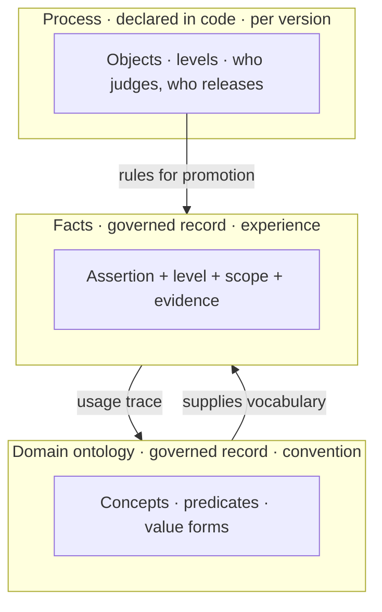

# Domain Ontology: the Knowledge Form of the Epistemic Loop

> **Being rebuilt.** This document describes the target design from the ["less is more" plan](less-is-more-plan.zh-CN.md). Code follows in phases; what has landed is tracked in [Known Gaps](known-gaps.md).

> The epistemic loop governs "why believe it"; the domain ontology governs "in what language to say it". This document defines the domain ontology: how it is represented, stored, added to, revised and deprecated, and how it relates to the loop, facts and the graph.

---

## 1. The problem: facts need shape

A fact that is only prose is epistemically complete — why it is believed and where it holds are both stated — but three things cannot be done mechanically:

- **Comparison**: whether two facts say the same thing needs rereading the prose;
- **Conflict detection**: two contradictory facts can sit on the shelf together;
- **Reuse**: using "what is known" next time means rereading every fact.

So the loop's output is not a string but **bounded knowledge**: asserted content (constrained by the ontology) × epistemic metadata (governed by the loop). The direction of truth never changes — world → evidence → fact → grows into the ontology — and **the ontology adjudicates nothing; it only houses what has been adjudicated**. Established conclusions stay in the workspace across sessions; that is ClearAI's long-term memory.

---

## 2. Three layers

| Layer | What it is | Answers | Authority | Pace |
|---|---|---|---|---|
| **Process** | [Verification Loop](verification-loop.md): objects, levels, who judges and who releases | **How** we know | Declared in code, checked at assembly | Per plugin version |
| **Domain ontology** | The project's domain language: concepts, predicates, value forms | **In what language** we say it | Convention: admitted with a basis, sticky deprecation | Slow |
| **Facts** | Sentences in that language that completed the loop | **What** we know | The loop: evidence, level, scope, review | Fast |

**The domain ontology is a language, not an a-priori framework.** Terms are conventions, not empirical claims: their authority comes from being adopted, used and deprecable, not from evidence levels. That unties two knots: the vocabulary is usable before the first goal has produced any fact (language precedes sentences); terms need no verification — sentences written with them do.

**The process is not project knowledge.** It is not in the record and not editable at runtime; changing it means changing code and releasing. In the UI it appears as **state shape**: steps and gates in the World Tree, conclusions grouped by trust in the Ontology pane.


```mermaid
flowchart TD
    subgraph process["Process · declared in code · per version"]
        loop["Objects · levels · who judges, who releases"]
    end
    subgraph domain["Domain ontology · governed record · convention"]
        vocab["Concepts · predicates · value forms"]
    end
    subgraph facts["Facts · governed record · experience"]
        know["Assertion + level + scope + evidence"]
    end
    loop -->|"rules for promotion"| facts
    domain -->|"supplies vocabulary"| facts
    facts -->|"usage trace"| domain
```

---

## 3. Graph model: the minimum

No OWL, RDF, SHACL, SPARQL, graph database or reasoner. Four node kinds, three edge kinds.

| Node | Meaning | Source |
|---|---|---|
| `concept` | A domain concept, e.g. "numerical scheme", "furnace batch" | Domain ontology, `Define` |
| `value_type` | Built-in value forms: `statement` / `quantity` / `formula` / `code` / `reference` | Fixed by the system |
| `instance` | A concrete thing that was found, e.g. "WENO5" | `RegisterInstance`, or projected from facts |
| `literal` | Numbers, text, formulas, code references | Projected from assertions |

| Edge | Meaning | Example |
|---|---|---|
| `is_a` | Concept inheritance | `WENO scheme → numerical scheme` |
| `predicate` | Domain predicate: concept → concept or value form | `numerical scheme --convergence order--> quantity` |
| `assertion` | One assertion | `WENO5 --convergence order--> 5` |

A predicate is an edge record with domain, range and single-valuedness, not a node:

```json
{ "id": "convergence_order", "label": "convergence order", "domain": "numerical_scheme",
  "range": { "form": "quantity", "unit": "order" }, "functional": true }
```

**Instances land the moment they are observed** (`RegisterInstance`, `Assert`, both with provenance), not when the goal closes. Otherwise "a beautiful vocabulary and an empty entity graph" becomes the cheapest way to finish. Edges from the two sources are labelled honestly: from promoted facts they carry level and scope (`promoted`); from observations with provenance they are not independently adjudicated (`asserted`).

**The ontology graph and the entity graph are drawn apart.** One says what the language allows (declaration), the other what has been said (claims). They differ in authority, pace and cost of error; drawing them as the same kind of edge is the main mistake this design avoids.

---

## 4. Facts: assertion + epistemic metadata

> **A fact = an assertion in the domain language + epistemic metadata (level, scope, evidence, evaluation, review, originating goal).**

```json
{ "subject": { "id": "WENO5", "type": "numerical_scheme" },
  "predicate": "convergence_order",
  "object": { "kind": "quantity", "value": 5, "unit": "order" },
  "qualifiers": { "regime": "smooth" } }
```

| Value form | Object | Validation (strict when provided) |
|---|---|---|
| `statement` | Short statement | Non-empty, length limit |
| `quantity` | Number + unit | Parseable number, non-empty unit; no unit conversion |
| `formula` | LaTeX | Non-empty; no semantic parsing |
| `code` | Workspace file path | The file exists |
| `reference` | Record id or path | Resolvable |

A relational predicate's object is another **instance** (`{ kind: "instance" }`), not a sixth value form. Assertions are additive: a fact without them is still valid and shows as "unstructured". Assertions land with the fact at promotion and are never rewritten afterwards; a fact links to its hypothesis by id, not by matching text.

---

## 5. Storage and projection

**The only authority is the event record**: `ontology/term_added`, `ontology/predicate_added`, two revision and two deprecation events, plus `entity/registered`, `entity/asserted` and `fact/promoted.assertions`. Replaying them yields `state.lexicon`; there is no second ledger and no hand-editable `domain.json`.

**Every read surface is a rendering**: `clear/ontology/domain.md` (with a Mermaid graph), the fact shelf, the graph and list in the Ontology pane, one summary line in the run-state card. All come from one projection; a read surface never becomes the authority.

**Layout is not stored**: coordinates, zoom and filters are not knowledge. Layout is a deterministic pure function — the same record always yields the same graph, pinned by tests.

---

## 6. Add, revise, deprecate

| Action | Tool | Rules |
|---|---|---|
| Admit a concept or predicate | `Define` | Unique id; non-empty name and definition; referenced concepts exist and are not deprecated; no `is_a` cycle; value form from the fixed set; **a basis is required** and must point at something actually on record |
| Change display details (name, definition, aliases) | `Define` (same id again) | Version +1, old values kept |
| Change meaning (sense, domain, range, single-valuedness) | `Deprecate` the old entry + `Define` a new id | The meaning of a stable id never silently changes in history |
| Deprecate | `Deprecate` | Reason required; sticky, no restore; old nodes stay on the graph (dashed); new assertions cannot cite it; existing facts that cite it are flagged "uses a deprecated term" |
| Register an instance | `RegisterInstance` | Provenance required |
| Write an assertion | `Assert` | Provenance required; predicate, domain and range strictly checked against the vocabulary |

**Nothing is deleted.** This is the same history principle as "refuted hypotheses are kept" and "voids carry a reason".

**How a person changes the vocabulary.** They say so in the conversation, and the model records it with the same verbs and the same checks. The UI is read-only, with no edit drawer — a second write path would need a second set of checks to keep aligned with the model's verbs.

**Why no proposal subsystem.** Entries are added one by one with a basis, few, reversible and visible; deprecation is the real veto. If batch induction arrives later, a change-set object comes with it rather than letting induction edit the live ontology.

---

## 7. Relation to the loop

| Beat | Role of the domain ontology |
|---|---|
| Question | Retrieve what is known by concept instead of rereading every fact |
| Judgement | Write assertions with registered predicates; optional |
| Test | Criteria may cite predicates and value forms |
| Evidence | Instances and assertions land with provenance; observations are not facts |
| Conclusion | Promotion into facts, which enter the graph |
| Ontology | Next time, retrieve by concept, predicate or subject |

**Knowledge mode.** While a goal is open with registered hypotheses, the run-state card adds two things: known facts that match the topic lexically (read-only, bounded, no semantic guessing), and **gaps** — computed from the record, each pointing to an action that would close it. Gaps are for the model only, and there are three kinds:

1. A judgement no evidence has touched;
2. A judgement that is prose only, with no assertion;
3. An assertion whose subject is not on the instance graph.

Closing has **one gate**: entities named in assertions must be on the instance graph. Two honest ways out: add them, or abandon honestly. Ordinary Q&A never enters knowledge mode.

A real run gave a counter-intuitive result: what changed model behaviour was mainly **seeing the gaps**, not the gate. So both stay — visibility makes it want to, the gate stops it from going around.

**Conflicts: derived, never adjudicated.** When two unretracted confirmed facts land on the same single-valued predicate for the same subject with different objects, the projection yields a conflict pair. It is not stored, retracts neither side, decides nothing and is not a gate; retracting either side (review) removes it, and a person may keep both with a stated reason.

---

## 8. Relation to the state machines

Process objects, domain vocabulary and a single test each have their own lifecycle and **do not nest**: admitting a concept advances no process object, and closing a goal changes no vocabulary. They only reference each other (assertions cite predicates and concepts; facts cite hypotheses and evidence), and they meet in four places only:

1. **Assertion shape checked when a hypothesis is registered**: unknown, deprecated or out-of-range references are rejected before anything is recorded;
2. **Fixed at promotion**: the fact carries its hypothesis id and assertions, bound to its level, scope and evidence in one record;
3. **Conflicts and graphs derived on replay**: no fact is changed, no gate is opened;
4. **Deprecation propagates**: new assertions refuse it, existing ones are flagged.

---

## 9. UI: the Ontology pane

The middle column has one pane, **Ontology**. One page answers the person's four questions: what can I trust now; what was refuted and what is unclear; what does it add up to; what do you need from me. The fourth is the same list in the header and next to the input box ("to handle N").

One screen, three layers, each finer than the one above:

| Layer | Content |
|---|---|
| **Header** | One line for the question being answered + one line of counts + "to handle" (a plan stopped after repeated rejections, conclusions that contradict each other; one line each, statements only, no buttons) + a small progress rail: judgment → test → verified → in ontology, with a count per station |
| **Graph (the main thing)** | **Ontology graph ｜ entity graph**, one at a time. Concepts in serif type, instances as small squares with their type in small print; verified relations solid, awaiting check dashed, refuted and uncertain each in their own colour. Clicking a node opens its term card and filters the list below (one line "only related to X · clear", with honest counts); full-screen available |
| **Conclusion list** | One line per conclusion, grouped by status: **verified / awaiting check / testing / uncertain / refuted / replaced**, each tagged with the step it came from. Opening one shows three parts in order: **progress** (which station it has reached), **how trust changed** (one line per change: which step, from what to what), **more** (basis, scope, what would make it wrong, related concepts and instances) |

A single test's result uses three words only: **support / refute / uncertain**. Levels are written in plain words: reasoned through alone / cites existing material / reproducible / independent check / released by a person. Internal ids never reach the screen; people see a judgment's short name and "step n".

**No-explosion contract:**

1. **Zero cost**: with no goal and no vocabulary the pane is a one-line hint, with no blocks laid out.
2. **Layered**: glance at the header, scan the list, open a line for basis and history.
3. **The graph is the main thing and the index**: clicking a node filters; no separate chip row.
4. **Expand in place, no jumps**: the only cross-pane jump is "see that step in the World Tree".
5. **Interrupt only for exceptions**: anything that needs a person takes one line under "to handle"; a contradiction is marked on the two affected lines.
6. **Filters tell the truth**: one status line + clear, stating how many did not match.

**The pane is read-only.** Terms cannot be registered or edited by hand here; to change the vocabulary, say so in the conversation. Process never appears as editable content: steps and gates are in the World Tree on the right, one line per step, and opening a step shows which judgments it tested and what came out.

---

## 10. Relation to Semantica

The reference implementation Semantica (`semantica-agi/semantica`) walked this road. We **borrow** three things: an ontology is naturally a graph; an edit must become a traceable change; automatic output stays separate from the live ontology. We **do not borrow** four: RDF/OWL/SHACL/SPARQL and reasoners; multi-backend graph databases; enterprise ingestion, extraction and entity-resolution pipelines; heavy front-end graph stacks (the graph band uses a vendored React Flow built into the client module, not resolved from npm).

---

## 11. Boundaries and future work

**Not in this version**: the semantic-web stack; graph databases; automatic ontology induction; large-scale extraction and entity resolution; rule reasoning and transitive closure; a cross-project vocabulary library; unit conversion; automatic retraction or conflict adjudication; editing authoritative files directly; editing in the UI.

**Possible later** (not promised): a unit registry; cross-project reuse; entity resolution; deeper vocabulary health checks.

---

## 12. Principles in review

1. The process governs how we know, the domain ontology the language, and facts are assertions that completed the loop.
2. The graph is the most natural form, but it is a projection, not authoritative storage.
3. The vocabulary changes only through named verbs; the model and the person use the same path.
4. No deletion — only versioned revision and sticky deprecation; a change of meaning needs a new id.
5. Facts carry epistemic metadata; the entity graph never erases the evidence chain.
6. Every read surface comes from one fold; there is no second ledger.
