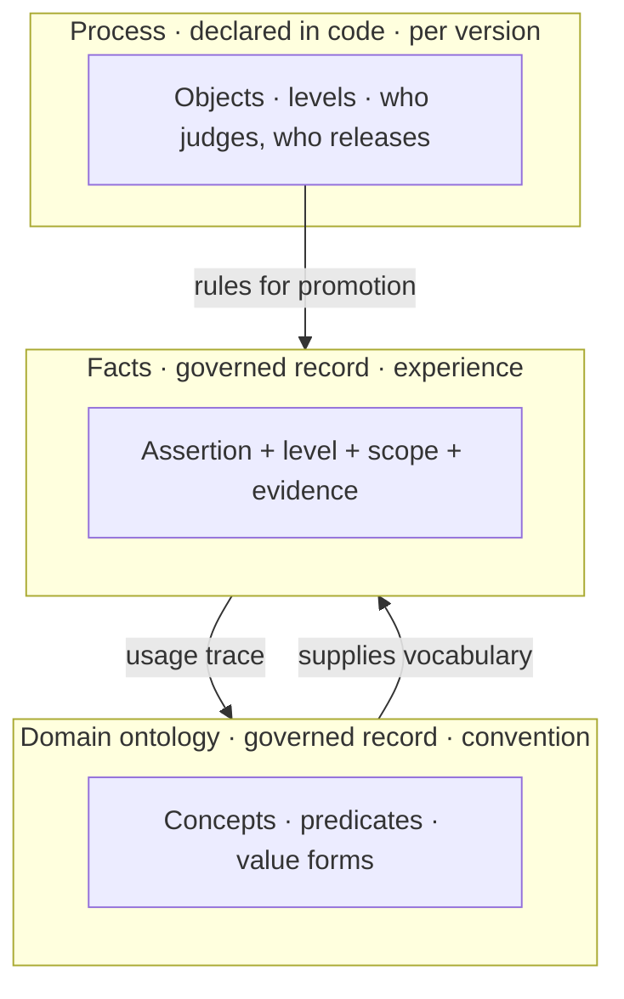

# Domain Ontology: the Knowledge Form of the Epistemic Loop

> The epistemic loop governs "why believe it"; the domain ontology governs "in what language to say it". This document defines the domain ontology: how it is represented, stored, added to, revised and deprecated, and how it relates to the loop, facts and the graph.

---

## 1. The problem: facts need shape

A fact that is only prose is epistemically complete — why it is believed and where it holds are both stated — but three things cannot be done mechanically:

- **Comparison**: whether two facts say the same thing needs rereading the prose;
- **Conflict detection**: two contradictory facts can sit on the shelf together;
- **Reuse**: using "what is known" next time means rereading every fact.

So the loop's output is not a string but **bounded knowledge**: asserted content (constrained by the ontology) × epistemic metadata (governed by the loop). The direction of truth never changes — world → evidence → fact → grows into the ontology — and **the ontology adjudicates nothing; it only houses what has been adjudicated**. Established conclusions stay in the workspace across sessions; that is ClearAI's long-term memory.

---

## 2. Three layers

| Layer | What it is | Answers | Authority | Pace |
|---|---|---|---|---|
| **Process** | [Verification Loop](verification-loop.md): objects, levels, who judges and who releases | **How** we know | Declared in code, checked at assembly | Per plugin version |
| **Domain ontology** | The project's domain language: concepts, predicates, value forms | **In what language** we say it | Convention: admitted with a basis, sticky deprecation | Slow |
| **Facts** | Sentences in that language that completed the loop | **What** we know | The loop: evidence, level, scope, review | Fast |

**The domain ontology is a language, not an a-priori framework.** Terms are conventions, not empirical claims: their authority comes from being adopted, used and deprecable, not from evidence levels. That unties two knots: the vocabulary is usable before the first goal has produced any fact (language precedes sentences); terms need no verification — sentences written with them do.

**The process is not project knowledge.** It is not in the record and not editable at runtime; changing it means changing code and releasing. In the UI it appears as **state shape**: questions, candidates and steps in the Explore pane, conclusions and established facts in the Ontology pane.


```mermaid
flowchart TD
    subgraph process["Process · declared in code · per version"]
        loop["Objects · levels · who judges, who releases"]
    end
    subgraph domain["Domain ontology · governed record · convention"]
        vocab["Concepts · predicates · value forms"]
    end
    subgraph facts["Facts · governed record · experience"]
        know["Assertion + level + scope + evidence"]
    end
    loop -->|"rules for promotion"| facts
    domain -->|"supplies vocabulary"| facts
    facts -->|"usage trace"| domain
```

---

## 3. Graph model: the minimum

No OWL, RDF, SHACL, SPARQL, graph database or reasoner. Four node kinds, four edge kinds.

| Node | Meaning | Source |
|---|---|---|
| `concept` | A domain concept, e.g. "numerical scheme", "furnace batch" | Concept files `clear/ontology/concepts/**.json` |
| `value_type` | Built-in value forms: `statement` / `quantity` / `formula` / `code` / `reference` | Fixed by the system |
| `instance` | A concrete thing that was found, e.g. "WENO5" | Entity files `clear/ontology/entities/**.json`, or projected from facts |
| `literal` | Numbers, text, formulas, code references | Projected from assertions |

| Edge | Meaning | Example |
|---|---|---|
| `is_a` | Concept inheritance (concept directory nesting) | `WENO scheme → numerical scheme` |
| `part_of` | Composition (entity directory nesting) | `blade-3 → turbine-A` |
| `predicate` | Domain predicate: concept → concept or value form | `numerical scheme --convergence order--> quantity` |
| `assertion` | One assertion | `WENO5 --convergence order--> 5` |

A predicate is an edge record with domain, range and single-valuedness, not a node:

```json
{ "id": "convergence_order", "label": "convergence order", "domain": "numerical_scheme",
  "range": { "form": "quantity", "unit": "order" }, "functional": true }
```

**Instances land the moment they are observed** (an entity file is written, each relation with provenance), not when the goal closes. Otherwise "a beautiful vocabulary and an empty entity graph" becomes the cheapest way to finish. Edges from the two sources are labelled honestly: from promoted facts they carry level and scope (`promoted`); from observations with provenance they are not independently adjudicated (`asserted`).

**The ontology graph and the entity graph are drawn apart.** One says what the language allows (declaration), the other what has been said (claims). They differ in authority, pace and cost of error; drawing them as the same kind of edge is the main mistake this design avoids.

---

## 4. Facts: assertion + epistemic metadata

> **A fact = an assertion in the domain language + epistemic metadata (level, scope, evidence, evaluation, review, originating goal).**

```json
{ "subject": { "id": "WENO5", "type": "numerical_scheme" },
  "predicate": "convergence_order",
  "object": { "kind": "quantity", "value": 5, "unit": "order" },
  "qualifiers": { "regime": "smooth" } }
```

| Value form | Object | Validation (strict when provided) |
|---|---|---|
| `statement` | Short statement | Non-empty, length limit |
| `quantity` | Number + unit | Parseable number, non-empty unit; no unit conversion |
| `formula` | LaTeX | Non-empty; no semantic parsing |
| `code` | Workspace file path | The file exists |
| `reference` | Record id or path | Resolvable |

A relational predicate's object is another **instance** (`{ kind: "instance" }`), not a sixth value form. Assertions are additive: a fact without them is still valid and shows as "unstructured". Assertions land with the fact at promotion and are never rewritten afterwards; a fact links to its hypothesis by id, not by matching text.

---

## 5. Storage and projection: the ontology is a tree of JSON files

**The ontology is files in the workspace.** The model maintains them with its native read, write and edit tools; there are no special tools:

```
clear/ontology/
  SCHEMA.json                 ← format description written by the system
  concepts/
    numerical_scheme.json     ← describes "numerical scheme"
    numerical_scheme/         ← its sub-concepts (directory nesting = is_a)
      weno_scheme.json
  relations/
    convergence_order.json    ← predicate: domain / range / functional
  entities/
    turbine_a.json            ← entity: type + relations[]
    turbine_a/                ← its parts (directory nesting = part_of)
      blade_3.json
```

- `X.json` describes X; X's children go in the sibling `X/` directory. Identity is the id (the file name), location is the directory, and references use ids only.
- Concepts and predicates share one id space. A predicate's range is a concept id or `{form, unit?}`.
- An entity carries `relations:[{predicate, object|value, unit?, evidence:{kind, ref}}]`; every relation needs provenance.
- Concepts have three kinds (`kind`): `category`, `measure`, `phenomenon`. A measure must give a `unit` (`"1"` if dimensionless), and its gloss is its definition; when the unit or definition changes, facts that use it are flagged "definition changed".
- Relations have four kinds (`kind`): `affects`, `defines`, `measures`, `manifests_as`. An affects relation may give its rough `shape` (`increasing` / `decreasing` / `peak` / `threshold` / `coupled`), which is where expectations come from; a measures relation says how to check the reading (`check`, such as a reference probe, a standard or a repeat point). The card's "relations in use" line carries the shape and the check.
- An entity may carry `history:[{at:"YYYY-MM-DD", what, evidence?}]`: calibrations, replacements, faults found.
- All of these are optional; older files without them stay valid and keep their fingerprints.
- Fields not in `SCHEMA.json` are rejected.

**Facts are written by the system only**: at promotion each fact becomes `clear/knowledge/facts/<id>.json` (with fingerprints of the definitions it uses), and `INDEX.md` is rendered from all fact files. Fact files accumulate across sessions: a new session can read the facts and ontology earlier sessions wrote.

**The host folds the files into one graph**: before each step it syncs the workspace (cached by mtime and size, changes detected by sha1) and folds it into `state.lexicon`. The UI and the model read the same graph; a read surface never becomes the authority.

**Layout is not stored**: coordinates, zoom and filters are not knowledge. Layout is a deterministic pure function — the same files always yield the same graph, pinned by tests.

---

## 6. Three checks

| When | What | Outcome |
|---|---|---|
| **On write** | One file: parseable JSON, fields match `SCHEMA.json`, id matches the file name | **Write denied**; the model sees what is wrong right away |
| **On read** | Across files: duplicate ids, a parent / domain / range / entity type / relation object that points nowhere, single-valued conflicts | **Flagged, not blocked**: the faulty file stays off the graph and the problem is listed on the card and under the graph |
| **On promotion** | Assertions about to enter long-term knowledge are rechecked against all files | **Not promoted**; the hypothesis stays in the "held" list |

**Meaning changes are detected, not blocked.** Each fact carries fingerprints of the definitions it used (the entries its assertions cite, plus concepts and relations its claim and scope mention by name); if those definition files change later, the fact is flagged "definition changed" under "to handle", and a person or the model decides whether to review it or keep it.

**Deprecation**: write `status: "deprecated"` (optionally `replaced_by`) in the definition file. Old nodes stay on the graph (dashed); new assertions cannot cite them.

**How a person changes the ontology.** They say so in the conversation and the model edits the files, through the same three checks; or they edit the files directly, with the same effect. The UI is read-only.

---

## 7. Relation to the loop

| Beat | Role of the domain ontology |
|---|---|
| Question | Retrieve what is known by concept instead of rereading every fact |
| Judgement | Write assertions with registered predicates; optional |
| Test | Criteria may cite predicates and value forms |
| Evidence | Instances and assertions land with provenance; observations are not facts |
| Conclusion | Promotion into facts, which enter the graph |
| Ontology | Next time, retrieve by concept, predicate or subject |

**Knowledge mode.** While a goal is open with registered hypotheses, the run-state card adds two things: known facts that match the topic lexically (read-only, bounded, no semantic guessing), and **gaps** — computed from the record, each pointing to an action that would close it. Gaps are for the model only, and there are three kinds:

1. A judgement no evidence has touched;
2. A judgement that is prose only, with no assertion;
3. An assertion whose subject is not on the instance graph.

Closing has **one gate**: entities named in assertions must be on the instance graph. Two honest ways out: add them, or abandon honestly. Ordinary Q&A never enters knowledge mode.

A real run gave a counter-intuitive result: what changed model behaviour was mainly **seeing the gaps**, not the gate. So both stay — visibility makes it want to, the gate stops it from going around.

**Conflicts: derived, never adjudicated.** When two unretracted confirmed facts land on the same single-valued predicate for the same subject with different objects, the projection yields a conflict pair. It is not stored, retracts neither side, decides nothing and is not a gate; retracting either side (review) removes it, and a person may keep both with a stated reason.

---

## 8. Relation to the state machines

Process objects, domain vocabulary and a single test each have their own lifecycle and **do not nest**: admitting a concept advances no process object, and closing a goal changes no vocabulary. They only reference each other (assertions cite predicates and concepts; facts cite hypotheses and evidence), and they meet in four places only:

1. **Assertion shape checked when a hypothesis is registered**: unknown, deprecated or out-of-range references are rejected before anything is recorded (against the ontology files at that moment);
2. **Fixed at promotion**: the fact carries its hypothesis id and assertions, bound to its level, scope and evidence in one record;
3. **Conflicts and graphs derived on replay**: no fact is changed, no gate is opened;
4. **Definition changes propagate**: new assertions refuse deprecated terms; when a definition file changes, facts that use it are flagged "definition changed".

---

## 9. UI: the Explore and Ontology panes

Two panes in the middle: **Explore** holds the process, **Ontology** holds only results. The person's four questions split across them: what is being answered, which possibilities are still open, and what comes next (Explore); what the conclusion rests on and what needs my decision (the answer cards in Ontology). The plan chip next to the input box shows exploration progress; clicking it opens Explore.

**Explore**, top to bottom:

| Block | Content |
|---|---|
| **Header** | The topic + one line of tags: mode (survey / solve), how many survey areas are clear, the current question, plan progress |
| **Awaiting you** | A plan stopped after repeated rejections, conclusions that contradict each other; one line each, statements only |
| **Survey areas** | In survey mode: each area's state (clear / in progress / not started), its judgments and adopted count, open unexplained observations; newly found questions hang under their area |
| **Questions** | One block per question: candidate hypotheses by state (being examined / excluded / adopted / set aside); opening one shows its source (which ontology relation, or intuition), refutation condition, prediction, basis for exclusion or adoption, and related records |
| **Next step** | What to do, and each candidate's prediction; when the predictions are identical, a note that the step cannot tell them apart |
| **Unexplained observations** | Each open one, with the quantities, candidates or facts it touches |
| **Process record** | Collapsed by default: judgment counts and the progress rail (judgment → test → verified → in ontology), every judgment (grouped by trust; open one for progress, trust changes and notes), the plan's steps and gates |

A newly found question carries two buttons, "Make it a question" and "Park". They write no state: each sends one sentence to the model on the person's behalf, and the model records it with a Frame revision. When the message cannot be sent, the pane says to raise it in the conversation.

**Ontology**, top to bottom:

| Block | Content |
|---|---|
| **Answer cards** | Switchable per question, in four parts: conclusion / basis / open points / for you to decide |
| **Graph (the main thing)** | **Ontology graph ｜ entity graph**, one at a time. Directory nesting is drawn as collapsible subgraphs (collapsed to the first level when the graph is large; +N expands); file problems found on read are listed under the graph. Concepts in serif type, instances as small squares with their type in small print; verified relations solid, awaiting check dashed, refuted and uncertain each in their own colour. Clicking a node opens its term card and filters the list below (one line "related only · clear", with honest counts); full-screen available |
| **Established facts** | Only verified conclusions, each marked with the step it came from; open one for progress, trust changes and notes (basis, scope, refutation condition, related concepts and instances) |
| **Lessons** | Lessons carried across tasks: common pitfalls / checks first / shortcuts to avoid / prior knowledge |

A single test result uses only three words: **supported / refuted / inconclusive**. Levels come in three tiers: self-tested / independent check / approved by a person. Internal ids stay off screen; people know a judgment by its short name and "step N".

**The no-explosion contract:**

1. **Zero cost**: with no goal and no terms, each pane is one empty-state sentence, no blocks.
2. **Layered**: Ontology leads with the conclusions, Explore with the questions and the next step; the process record opens on demand.
3. **The graph is both the main thing and the index**: clicking a node filters; no separate chip row.
4. **Two jumps only**: "View the exploration record" on an answer card opens Explore; "view the conclusion" on a question opens Ontology.
5. **Interrupt only for exceptions**: things a person must handle each take one line under "awaiting you"; contradictions are marked on the two affected rows.
6. **Filters tell the truth**: one status line + clear, stating how many did not match.

**Both panes are read-only.** Terms cannot be registered or edited by hand here; to change the ontology, say so in the conversation or edit the files under `clear/ontology/`.

---

## 10. Relation to Semantica

The reference implementation Semantica (`semantica-agi/semantica`) walked this road. We **borrow** three things: an ontology is naturally a graph; an edit must become a traceable change; automatic output stays separate from the live ontology. We **do not borrow** four: RDF/OWL/SHACL/SPARQL and reasoners; multi-backend graph databases; enterprise ingestion, extraction and entity-resolution pipelines; heavy front-end graph stacks (the graph band uses a vendored React Flow built into the client module, not resolved from npm).

---

## 11. Boundaries and future work

**Not in this version**: the semantic-web stack; graph databases; automatic ontology induction; large-scale extraction and entity resolution; rule reasoning and transitive closure; a cross-project vocabulary library; unit conversion; automatic retraction or conflict adjudication; editing in the UI.

**Possible later** (not promised): a unit registry; cross-project reuse; entity resolution; deeper vocabulary health checks.

---

## 12. Principles in review

1. The process governs how we know, the domain ontology the language, and facts are assertions that completed the loop.
2. The file tree is the ontology's authority; the graph is its projection.
3. The model writes the ontology with native file tools behind three checks; facts are written by the system only.
4. Deprecation leaves a trace; definition changes are detected and handed to a person or the model for review, never taking effect silently.
5. Facts carry epistemic metadata; the entity graph never erases the evidence chain.
6. Every read surface comes from one fold; there is no second ledger.
