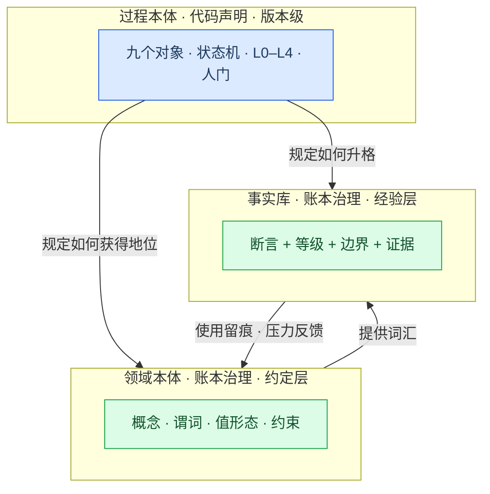
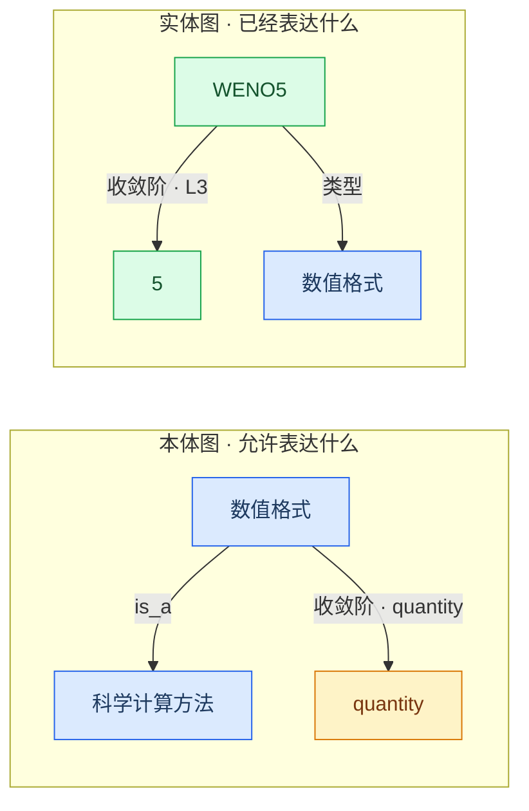
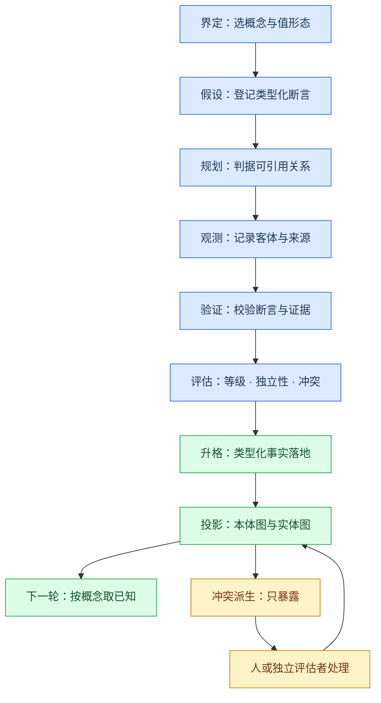
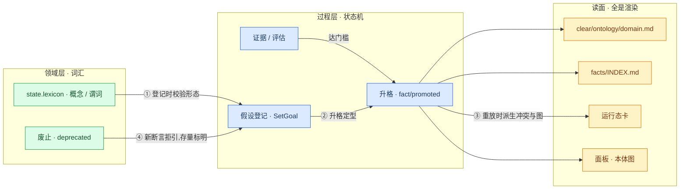

# 领域本体：认识论循环的知识形态

> 认识论循环管「凭什么信」，领域本体管「用什么语言说」。本文定义领域本体，并规定它如何表示、如何存储、如何增删改，以及它与认识论循环、事实库、图投影的关系。
>
> 本文描述的是 `0.2.0` 的**设计**。哪些已实现、哪些仍是设计目标，以[已知缺口](known-gaps.zh-CN.md)与[机制真值表](optimization/truth-table.zh-CN.md)为准——本文不冒充现状。

---

## 1. 问题：事实需要形态

今天的[事实](glossary.zh-CN.md)是：一句话陈述（`text`）、一条边界（`scope`）、一个支持等级（`level`）、一组证据引用。它在认识论上是完整的——**凭什么信**回答得清清楚楚；但在内容上是一段散文，于是三件事做不到机械：

- **不可比较**：两条事实说的是不是同一件事，只能靠重读散文判断；
- **不可查冲突**：互相矛盾的两条事实可以同时躺在货架上，没人会被告知；
- **不可复用**：下一轮想引用「已知」，只能把整个事实库重读一遍，而不是按概念取。

循环因此只完成了一半：它把结论**挣**出来了，却没有把结论**安放**成可继续生长的结构。本文的起点就是这句话：

> 认识论循环的产出不是一个字符串，而是**有界的知识**——断言内容（本体约束）× 认识论元数据（循环治理）。
**这次转向把这个结论说满：研究的产品形态是本体。** 认识论循环是本体的生产工艺，事实是它的内容单位——真值方向不变（世界 → 证据 → 事实 → 长成本体），所以**本体不裁决任何事，它只收留被裁决过的东西**；词汇是约定、条目是经验，两者的权威分属接纳与验证，这条红线在重心调整之后一条不动。

---

## 2. 三个层次

「本体」在本仓库里有两个义项，必须分开，否则会把两种完全不同权威混成一种。

| 层次 | 是什么 | 回答的问题 | 权威从哪来 | 变化速度 |
|---|---|---|---|---|
| **过程本体** | [`verification-loop`](verification-loop.zh-CN.md)：九个对象、状态机、L0–L4、谁判谁放 | 我们**如何**知道 | 代码声明，装配期校验，随插件版本 | 版本级 |
| **领域本体** | 一个项目的领域语言：概念、谓词、值形态、约束 | 我们**用什么语言**表达 | 约定：带依据接纳、使用留痕、黏性废止 | 慢（约定层） |
| **事实库** | 用领域语言写下的、走完了循环的句子 | 我们**知道了什么** | 循环：证据、等级、边界、评估、复核 | 快（经验层） |

### 2.1 领域本体是语言，不是先验框架

在计算机知识表示的传统里，本体是「对概念化的显式规范」（Gruber, 1993）。ClearAI 接受它的**形式**（显式、可共享、可校验），拒绝它的**先验性**：

> **领域本体是一个项目知识库的语言层：关于「这个领域有什么概念、它们之间有何关系、量用什么单位、结论取什么形式」的一组被治理的约定。**

由此得到一条关键切割，它同时解掉两个死结：

- **自举问题**：事实要升格才有认识论地位；如果把领域本体也定义成「必须走完循环的事实」，那么第一个目标还没有产出任何事实时，就没有词汇可用来登记断言。**语言可以先于句子存在**——约定由具名动词接纳，不需要升格。
- **权威问题**：术语是约定，不是经验主张。约定的权威来自「被采纳、被使用、可废止」，而不是来自证据等级。经验主张才需要 L0–L4。

所以：**术语不需要验证；用术语写下的句子才需要。**

### 2.2 过程本体是插件的后台流转本体

过程本体不是项目知识——它是**插件自己的后台流转结构**：哪些对象存在、谁能推动哪条转移、哪一级由谁判。因此三条边界：

- **不进账本**：账本记的是**实例**（`goal/set`、`step/advanced`、`fact/promoted`…），不是机器本身。把机器记进项目账本，等于让一次插件升级变成一次项目历史改写，也等于把「重写认识规则」的能力交给运行时——那正是「不可表达优于不可违反」要挡住的东西。机器随**版本**变化，`STATE_VERSION` 管形状，货架负责把当前版本说清楚。
- **不做运行时编辑**：要改机器，改的是代码与声明（`preset/plugins/ontology.js`），走装配期校验与发布流程，不走本体页签。
- **展示方式是「状态形状」，不是「一份要维护的文档」**：用户在世界树里看到步骤、车道、闸门与收口，在「命题与事实」里看到命题按本体状态分组——那就是过程本体在界面上的样子。`clear/ontology/verification-loop.md` 这份货架首先是**给模型读的章程**（它要照这套对象写判据与交付），其次才是给愿意深读的人的参考。

一句话对照：**领域本体是「你的知识用什么语言写」（可编辑、进账本、带依据）；过程本体是「你的工作现在走到哪一步」（版本级、不可编辑、规则隐形而状态可见）。**

### 2.3 三层结构图



---

## 3. 图模型：奥卡姆剃刀后的最小集

不引入 OWL、RDF 三元组、SHACL、SPARQL、图数据库或独立推理机。只保留能直接服务于当前循环的四种节点与三种边。

### 3.1 节点

| 节点 | 含义 | 是否独立治理 |
|---|---|---|
| `concept` | 领域概念，如「数值格式」「炉次」「升温速率」 | 是，属于领域本体 |
| `value_type` | 内置值形态：`statement` / `quantity` / `formula` / `code` / `reference` | 否，由系统固定 |
| `instance` | 事实中提到的具体对象，如「WENO5」「炉次-2025-001」 | 否，由事实投影产生 |
| `literal` | 数值、文本、公式、代码引用等客体 | 否，由事实投影产生 |

**实例不注册。** 它们从类型化事实里投影出来，没有独立生命周期——否则为了画一张图，就要多维护一套对象。同标签的实例在投影里合并为一个节点；实体消解（同一事物的不同称呼）本版不做，见[已知缺口](known-gaps.zh-CN.md)。

### 3.2 边

| 边 | 含义 | 例 |
|---|---|---|
| `is_a` | 概念之间的继承 | `WENO格式 → 数值格式` |
| `predicate` | 领域谓词：概念 → 概念，或概念 → 值形态 | `数值格式 --收敛阶--> quantity` |
| `assertion` | 一条类型化事实 | `WENO5 --收敛阶--> 5` |

谓词是本体图里的**一等边记录**，不是可见节点。它携带：

```json
{
  "id": "convergence_order",
  "label": "收敛阶",
  "domain": "numerical_scheme",
  "range": { "form": "quantity", "unit": "order" },
  "functional": true
}
```

只有当将来真需要表达「谓词之间的关系」时，才把谓词提升为节点。**不提前引入元模型。**

### 3.3 本体图与实体图必须分层



把术语定义与经验事实画成同一种边，是本设计要避免的最主要错误：它们权威不同、变化速度不同、失败后果不同。

---

## 4. 事实：断言 + 认识论元数据

### 4.1 定义

> **事实 = 一个符合领域本体语言的断言 + 认识论元数据。**

认识论元数据是今天已有的部分（等级、边界、证据、评估、复核、来源目标、验证路径），一个字不减。新增的是**断言**：

```json
{
  "subject": { "id": "WENO5", "type": "numerical_scheme" },
  "predicate": "convergence_order",
  "object": { "kind": "quantity", "value": 5, "unit": "order" },
  "qualifiers": { "regime": "smooth" }
}
```

### 4.2 值形态：对「什么形式」的直接回答

纯文本、公式、代码不是三种事实，是**断言客体的五种值形态**：

| 形态 | 客体形状 | 校验（提供即严校） |
|---|---|---|
| `statement` | 短陈述字符串 | 非空、有长度上限 |
| `quantity` | 数值 + 单位字符串 | 数值可解析；单位非空；本版不做量纲换算 |
| `formula` | LaTeX 源码 | 非空；本版不做语义解析 |
| `code` | 工作区文件路径 | 文件在工作区真实存在（与「口径必须引用真文件」同一条纪律） |
| `reference` | 账内 id 或盘上路径 | 引用可解析 |

关系谓词（`range: { term }`）的宾语是**实例**——`{ kind: "instance", value: "<名称>" }`:它的宾语是另一个实例而不是一个字面值。所以 `instance` 是**关系宾语形态**,不是第六种值形态。

### 4.3 升格时事实携带的字段

`fact/promoted` 事件在现有字段之外增加：

- `hypothesis`：产出这条事实的假设 id。**顺带修掉一个脆弱点**：今天假设与事实靠 `text` 字符串相等匹配，改了措辞就断链；改为按 id 关联。
- `assertions`：断言数组；未提供时为 `null`（宽松+校验：不提供放行，提供即严校）。

---

## 5. 存储与投影

### 5.1 唯一权威：账本事件

| 事件 | 含义 |
|---|---|
| `ontology/term_added` | 接纳一个概念 |
| `ontology/predicate_added` | 接纳一个谓词 |
| `ontology/term_revised` | 概念的非语义修订（版本 +1，旧值留痕） |
| `ontology/predicate_revised` | 谓词的非语义修订 |
| `ontology/term_deprecated` | 黏性废止一个概念 |
| `ontology/predicate_deprecated` | 黏性废止一个谓词 |

`fold` 重放这些事件得到 `state.lexicon`（概念表、谓词表、修订史、废止表）。**没有第二本状态账。**

投影里另有一格 `state.ontology`，那是**过程本体**的形状（见 §2.2），与本节这个字段不是同一种东西：一个随发布变、不可编辑，一个随项目长、由账本治理。

### 5.2 读面全部来自同一个投影

以下都不是权威存储，只是渲染：

- `clear/ontology/domain.md`：领域本体的 Markdown 读面（含 Mermaid 图），系统幂等渲染；
- `clear/knowledge/facts/INDEX.md`：事实货架；
- UI 的本体图与实体图；
- 运行态卡片里的统计行；
- `graphProjection(state)` 返回的节点与边。

**不设可手改的 `domain.json`。** 若将来需要离线编辑，文件只能作为**草稿补丁**，必须经应用动作进入账本。

### 5.3 布局不存储

节点坐标、缩放比例、筛选条件不是知识，不进账本。布局是**确定性纯函数**：

- 本体图优先按 `is_a` 分层；
- 无层级时用确定性分区/圆形布局；
- 同一账本 ⇒ 同一组图数据 + 同一默认布局（可被测试钉死）；
- 用户临时拖动只改当前界面。

---

## 6. 增、改、删

### 6.1 增：带依据的注册

`RegisterTerm`（概念）与 `RegisterPredicate`（谓词）。注册时检查：id 唯一；名称与释义非空；`domain` / `range` / `parent` 引用已存在且未废止的概念；`is_a` 不成环；值形态属于固定枚举；单值谓词声明自洽。

**依据必填**，且指向账上真有的东西（文献、项目文件、已有事实、实验材料或用户说明）。依据不是事实证明，而是说明「这个约定为什么被引入」。

### 6.2 改：小改版本化，语义变化换 id

不允许原地覆盖。

| 变化 | 动作 |
|---|---|
| 标签、释义、别名、展示信息 | `ReviseTerm` / `RevisePredicate`：版本 +1，旧值留痕，id 不变 |
| 概念含义、谓词域/值域、约束等**语义**变化 | **废止旧条目 + 注册新条目** |

第二条是硬边界：**稳定 id 的含义不许在历史上悄悄改变**。旧事实永远按当时的词汇解释，不被今天的释义重写。

### 6.3 删：没有删除，只有黏性废止

`DeprecateTerm` / `DeprecatePredicate`：缘由必填；旧节点与旧边仍留在图上（幽灵样式）；历史事实照常可读；**新断言不能引用已废止条目**；引用了废止条目的存量事实显示「所用术语已废止」；不提供恢复——恢复语义通过注册新版本表达。

这与「事实不删除」「被推翻的假设保留」「作废必须带原因」是同一条历史原则。

### 6.4 图编辑 = 具名治理动词的图形前端

| 图操作 | 实际语义 |
|---|---|
| 新增节点 | `RegisterTerm` |
| 新增连线 | `RegisterPredicate` |
| 改节点信息 | `ReviseTerm` |
| 改边属性 | `RevisePredicate` |
| 删除节点/边 | `DeprecateTerm` / `DeprecatePredicate` |
| 点事实边 | 跳转事实与证据，不改本体 |

**图编辑不写文件，只发动词。** 拖动位置、缩放不产生任何账本事件。这与「非权威路径结构上写不进账本」是同一条约束的正面表达。

### 6.5 为什么不建提案子系统

自动本体归纳（从抽取结果按频次归纳概念）必须产出**提案**而非直接改有效本体——这一点我们接受。但当前版本没有批量归纳：术语由模型逐条带依据注册、由人在图上编辑，量少、可逆、可见。**废弃才是真正的否决。** 因此本版不建 `Proposal / Review` 状态机；将来真接入批量归纳时，再加 `ontology_change_set` 对象，而不是让归纳直接改有效本体。

---

## 7. 与认识论循环的结合



| 阶段 | 领域本体的作用 |
|---|---|
| 界定 | 按概念查询「已知」，而不是重读全部事实 |
| 提出假设 | 用已登记的谓词写类型化断言；不写也可以 |
| 规划 | 判据可引用谓词与值形态；本版不强制绑定量纲体系 |
| 观测 | 记录的客体带上值形态与来源，不把观测当事实 |
| 验证 | 校验断言、证据与假设是否对应 |
| 评估 | 等级、独立性、不确定性，以及**机械派生的冲突** |
| 记录 | 升格为类型化事实，同时进事实库与图投影 |
| 下一轮 | 按概念/谓词/主体取用已知 |

### 7.1 冲突：派生，不是裁决

当两条**未撤回**的已确认事实落在同一个单值谓词、同一主体、而客体不同时，投影里出现一条冲突（成对引用两侧事实）。冲突：

- **不是存储对象**，是每次重放算出来的读数；
- **不自动裁决**，也不自动撤回任何一侧——「准入不是裁决」这条红线在新层上继续成立；
- 撤回任一侧（走既有 `fact/reviewed`）冲突即消失；
- 人可以注明缘由维持双方（一次性 `fact/conflict-resolved`）。

### 7.2 图上的每条事实边都带认识论元数据

颜色表示支持等级或事实状态，线型表示已确认/待复核/被推翻/已撤回，详情里是事实正文、`scope`、证据、评估者、来源目标与验证步骤。图不是「知识可视化」，是**认识论结果的可视化**：从一条边能追溯回产生它的假设、证据、评估和人工决定。

---

## 8. 与状态机、流转的联动

三个东西各有各的生命周期，谁也别替谁推状态。先把它们排开，再说它们真的在哪里握手。

### 8.1 三张状态机，互不嵌套

| 状态机 | 状态 | 事件 | 谁推 |
|---|---|---|---|
| **过程对象**（九个，见[状态机](optimization/state-machines.zh-CN.md)） | `open` / `advanced` / `void` / `proposed` / `refuted` / `promoted` … | `goal/set`、`step/advanced`、`fact/promoted` … | 内核按事实推进；模型只能发起意图 |
| **领域词汇**（概念 / 谓词） | `admitted` → `deprecated`（修订是自环，版本 +1） | `ontology/term_added`、`ontology/*_revised`、`ontology/*_deprecated` | 具名动词（七个,已实现）；折法只解释 |
| **一次验证**（步骤上的 `tests`） | 由证据与等级派生 | `evidence/recorded`、`audit/settled` | 内核 |

**它们互不嵌套**：接纳一个概念不会推进任何过程对象，一条计划收尾也不改词汇。两者之间只有一种方向性关系——**引用**：断言引用谓词与概念，事实引用假设与证据。

### 8.2 握手点只有四处



1. **登记假设时校验形态**：`SetGoal` 的断言引用谓词与概念；引用不存在、已废止，或值域不符 ⇒ **落账之前**就拒（已实现）。
2. **升格那一刻定型**：`fact/promoted` 带上 `hypothesis`（身份）与 `assertions`（内容）——从此这条事实的断言与它的等级、边界、证据绑在同一条记录里。
3. **重放时派生冲突**：`derive()` 拿事实集与词汇现算冲突对。它**不改任何事实**，也不进闸门。
4. **废止的边界传播**：词条一旦废止，引用它的**新**断言被拒；**存量**事实照旧可读，并在货架上标明「所用术语已废止」。

### 8.3 谁读什么

| 读面 | 读什么 | 由谁渲染 |
|---|---|---|
| `clear/ontology/<过程本体 id>.md` | 过程本体的形状（九个对象 / 五级） | 内核幂等渲染——给模型读的章程 |
| `clear/ontology/domain.md` | 领域词汇（概念 / 谓词 / 依据 / 废止 + Mermaid 图） | 内核幂等渲染（已实现） |
| `clear/knowledge/facts/INDEX.md` | 已升格事实（含断言与边界） | 内核幂等渲染 |
| 运行态卡 | 词汇计数、类型化事实比例、冲突一行 | 折法 `renderCard` |
| 面板「命题与事实」 | 事实与断言芯片 | 投影 `view().facts` |
| 面板「本体」 | 本体图 / 实体图 / 条目详情 | 投影 `view().lexicon`（阶段 D–E 渲染） |

### 8.4 今天到哪儿了

| 环节 | 状态 |
|---|---|
| 六个词汇事件折进 `state.lexicon` | 已实现（阶段 B） |
| 断言随 `fact/promoted` 折进事实 | 已实现（折法层） |
| 冲突派生 / 词汇健康度 / 图投影 | 已实现（`test/domain-language.test.mjs`） |
| 七个动词、`SetGoal` / `CloseGoal` 接线、`domain.md` 货架、`clear/ontology/` 拒写 | 已实现 |
| 面板「本体」与图编辑 | 设计目标：阶段 D–E |

**一句话**：状态机回答「东西怎么变」，本体回答「知识用什么语言写」，图是这两者折出来的**读面**——三层都在，只有中间那层的生产者还没接。

## 9. 界面

**本体不占独立页签——它长进中栏「事实」那一格**（`conversation.view` 的 `clearai-facts`）。

为什么:事实是这一格的主问题（"我们现在知道什么、凭什么"），本体是它的**语言与地图**；
分到两处，读者就得在两栏之间搬运上下文。而右栏只有 ~300px —— 图在那里是残废。
一个更硬的先例：`进展` 页签当初被撤，理由正是「页签越少，越不需要向人解释每个页签该在什么时候看」。

### 9.1 排布（从上到下）

| 区块 | 何时出现 | 内容 |
|---|---|---|
| 冲突行 | **仅当有冲突** | 一行指针：谓词 · 主体 → 两侧事实与取值；点开成对看 |
| **图带** | 有词条即常驻（可一键收起，记住选择） | 本体图 ｜ 实体图 切换（约 200px，可缩放平移）；**点节点 = 按概念过滤下方货架**；`⤢` 放大为全景 |
| 过滤状态行 | **仅当过滤激活** | 按「X」过滤：N/M 条 · 清除——N/M 说真话，没匹配的不静默消失 |
| 已确认事实 | 常驻 | 现有货架（不动）+ **断言芯片**：点开就地展开词条卡 |
| 命题 | 常驻 | 现有分组（不动）+ 断言芯片（标注「未升格」） |
| 词汇维护 | 折叠，默认收起 | 词条表、健康度、废止列表、「在货架里打开」；**0 事实 0 命题而有词条时自动展开**（语言先于句子时它得有地方站） |

### 9.2 六条「不爆炸」契约

1. **零成本**：没有词条时，这一格与从前**逐像素相同**。冲突行、图带、芯片、维护区，每一个都以「有东西可说」为前提。
2. **置信度排序**：确认的事实在上、在验的命题居中、语言（维护区）垫底。参考材料不挡结论。
3. **图既是门面也是工作件**：图带是这一格的**头**（像页眉，不与事实抢主位），而它的节点就是索引——点概念节点即过滤，取代一行文字芯片。
4. **就地展开，不跳转**：断言芯片在原位展开词条卡（释义 / 依据 / 主词域 / 值域 / 单值 / 引用数；动作：筛选此概念、在图里看）；冲突标在**受害的事实行**上。唯一的跨面跳转保留「去世界树看那一步」。
5. **例外才打扰**：冲突与健康告警各只占一行指针；词汇维护收进折叠区。
6. **过滤可见、可清除、说真话**：一行状态 + `✕`，N/M 写明有多少条没匹配（包括不带断言的旧事实）。

### 9.3 图带里的两张图

一键切换，共用同一套确定性布局（`graphProjection()`：同一账本必得同一张图）：

- **本体图**（默认）：概念 + `is_a` + 谓词——**这门语言长什么样**。干净、结构感强，适合当门面。
- **实体图**：实例 + 断言边，按支持等级着色、冲突红边——**已经验证出了什么**。看战况切到它。

全景观（`⤢`）在同一格内展开到几乎整格：货架暂时让位，**解除节点截断**（图带只画前 40 个节点并如实标注），角上给一个「适配」把整图收进一屏。阶段 E 的图上编辑就落在全景态。

### 9.4 只读与编辑的边界

第一版**只读**：零依赖 SVG（缩放、平移、选择、切换、全景、冲突高亮、废止用虚线幽灵）。图上的编辑（阶段 E）是**具名动词的图形前端**——新增节点 = `RegisterTerm`、连线 = `RegisterPredicate`、废止 = `DeprecateTerm`；抽屉式表单而不是拖拽连边（连边手势很容易表达出错误的语义，而抽屉能明确要求域、值域、值形态与依据）。拖动与缩放**不产生任何账本事件**。

**这一格只治理领域本体。** 过程本体不作为可编辑内容出现在这里——它的呈现是世界树里的步骤与闸门，以及命题按状态分组；模型读的章程是 `clear/ontology/verification-loop.md` 货架。

---

## 10. 与 Semantica 的关系

参考实现 Semantica（图原生知识基础设施，`semantica-agi/semantica`；本地副本在 `refs/`，不入库）已经走过这条路，我们对它的取舍是明确的。

**借用的三件事：**

1. **本体天然是图**——概念为节点、谓词为带域/值域的有向边，是这一类知识最自然的表现形式；
2. **可视编辑 + 受治理落地**——图可以编辑，但编辑必须成为一次可追溯的变更，而不是一个字节的直接写入；
3. **自动产出与有效本体的隔离**——频次归纳只产出提案；这一点我们在没有批量归纳时以「不建提案状态机」的方式同样遵守。

**明确不借的四件事：**

1. RDF / OWL / SHACL / SPARQL 标准栈与推理机——为本版不存在的消费方引入整套序列化与查询语义；
2. 多后端图数据库（Neo4j / FalkorDB / AGE / Neptune 等）——ClearAI 是本地优先单项目，账本已是权威；
3. 企业数据摄取、NER/关系抽取与实体消解管线——不解决我们当前的问题；
4. React Flow / Sigma.js 等前端图库——插件客户端是无打包器的原生模块环境，本体规模也不需要企业级渲染器。

---

## 11. 边界与后续

**本版不做**：OWL/RDF/SHACL/SPARQL；图数据库与三元组库；自动本体归纳；大规模文档抽取与实体消解；复杂规则推理与传递闭包；跨项目/用户级本体库；量纲换算与数值容差推理；事实自动覆盖、自动撤回或冲突自动裁决；直接编辑权威本体文件；把拖拽连边作为第一版唯一编辑方式。

**后续方向**（不在本版承诺）：量纲注册表与世界线「量 = 口径」绑定；跨项目本体复用；实体消解；本体健康度的更深检查（命名规范、覆盖率、失效传播）。

---

## 12. 设计原则回顾

1. 过程本体管认识路径，领域本体管知识语言，事实是走完循环的断言。
2. 图是最自然的表现形式，但图是投影，不是权威存储。
3. 节点与边可以编辑，编辑必须落成具名治理动作。
4. 没有删除，只有版本化修订与黏性废止；语义变化必须换 id。
5. 事实携带认识论元数据，实体图不能抹掉证据链。
6. 所有读面来自同一个 fold，不维护第二本账。
7. 只实现当前问题需要的图能力，不提前实现企业知识图谱平台。
