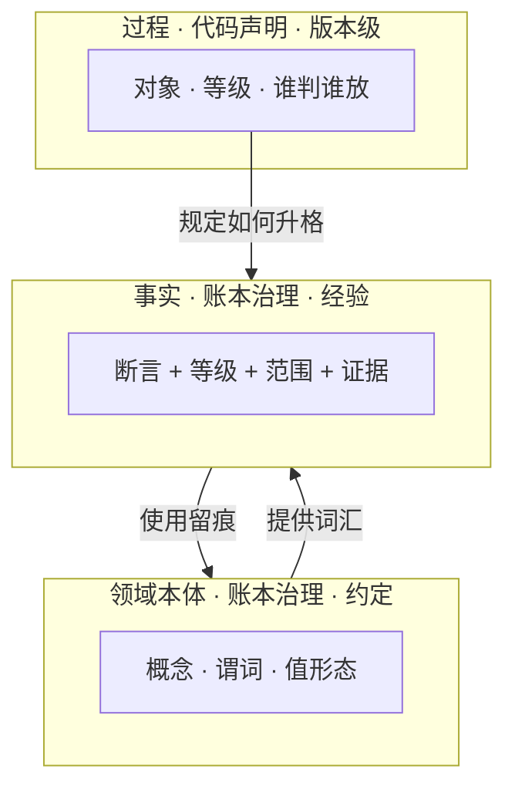

# 领域本体：认识论循环的知识形态

> **改造中。** 本文按[「少即是多」方案](less-is-more-plan.zh-CN.md)描述目标设计。代码分阶段跟进，哪些已经落地，以[已知缺口](known-gaps.zh-CN.md)为准。

> 认识论循环管「凭什么信」，领域本体管「用什么语言说」。本文定义领域本体：它如何表示、如何存储、如何增改废，以及它与循环、事实、图的关系。

---

## 1. 问题：事实需要形态

一条只有散文的事实，认识论上是完整的——凭什么信、在什么范围成立都写清了——但三件事做不到机械：

- **不可比较**：两条事实是不是在说同一件事，只能重读散文；
- **不可查冲突**：互相矛盾的两条可以同时在架；
- **不可复用**：下一轮想用「已知」，只能把全部事实重读一遍。

所以循环的产出不是一个字符串，而是**有界的知识**：断言内容（本体约束）× 认识论元数据（循环治理）。真值方向不变——世界 → 证据 → 事实 → 长成本体——**本体不裁决任何事，它只收留被裁决过的东西**。已确立的结论跨会话留在工作区，就是 ClearAI 的长期记忆。

---

## 2. 三个层次

| 层次 | 是什么 | 回答 | 权威从哪来 | 变化速度 |
|---|---|---|---|---|
| **过程** | [验证闭环](verification-loop.zh-CN.md)：对象、等级、谁判谁放 | 我们**如何**知道 | 代码声明，装配期校验 | 随插件版本 |
| **领域本体** | 项目的领域语言：概念、谓词、值形态 | 我们**用什么语言**说 | 约定：带依据接纳、黏性废止 | 慢 |
| **事实** | 用领域语言写下、走完了循环的句子 | 我们**知道了什么** | 循环：证据、等级、范围、复核 | 快 |

**领域本体是语言，不是先验框架。** 术语是约定，不是经验主张：它的权威来自被采纳、被使用、可废止，不来自证据等级。由此解掉两个死结：第一个目标还没有任何事实时，词汇已经可用（语言先于句子）；术语不需要验证，用术语写下的句子才需要。

**过程不是项目知识。** 它不进账本、不在运行时编辑；要改它，改代码并发布。它在界面上的样子是**状态形状**：世界树里的步骤与门，本体格里按能信的程度分组的结论。


```mermaid
flowchart TD
    subgraph process["过程 · 代码声明 · 版本级"]
        loop["对象 · 等级 · 谁判谁放"]
    end
    subgraph domain["领域本体 · 账本治理 · 约定"]
        vocab["概念 · 谓词 · 值形态"]
    end
    subgraph facts["事实 · 账本治理 · 经验"]
        know["断言 + 等级 + 范围 + 证据"]
    end
    loop -->|"规定如何升格"| facts
    domain -->|"提供词汇"| facts
    facts -->|"使用留痕"| domain
```

---

## 3. 图模型：最小集

不引入 OWL、RDF、SHACL、SPARQL、图数据库或推理机。只有四种节点、三种边。

| 节点 | 含义 | 来源 |
|---|---|---|
| `concept` | 领域概念，如「数值格式」「炉次」 | 领域本体，`Define` |
| `value_type` | 内置值形态：`statement` / `quantity` / `formula` / `code` / `reference` | 系统固定 |
| `instance` | 找到的具体东西，如「WENO5」「炉次-2025-001」 | `RegisterInstance`，或从事实投影 |
| `literal` | 数值、文本、公式、代码引用 | 从断言投影 |

| 边 | 含义 | 例 |
|---|---|---|
| `is_a` | 概念继承 | `WENO格式 → 数值格式` |
| `predicate` | 领域谓词：概念 → 概念或值形态 | `数值格式 --收敛阶--> quantity` |
| `assertion` | 一条断言 | `WENO5 --收敛阶--> 5` |

谓词是带主词域、值域与单值性的边记录，不是节点：

```json
{ "id": "convergence_order", "label": "收敛阶", "domain": "numerical_scheme",
  "range": { "form": "quantity", "unit": "order" }, "functional": true }
```

**实例在被观测到的那一刻落账**（`RegisterInstance`、`Assert`，都必须带出处），不等目标结案。否则「词汇写得漂亮、实体图是空的」会成为最省力的完成方式。图上两种来源的边如实标注：来自升格事实的带等级与范围（`promoted`），来自带出处观测的未经独立裁决（`asserted`）。

**本体图与实体图分开画。** 一张说「这门语言允许表达什么」（声明），一张说「已经表达了什么」（主张）。两者权威不同、变化速度不同、出错的后果不同，画成同一种边是本设计要避免的主要错误。

---

## 4. 事实：断言 + 认识论元数据

> **事实 = 一个符合领域语言的断言 + 认识论元数据（等级、范围、证据、评估、复核、来源目标）。**

```json
{ "subject": { "id": "WENO5", "type": "numerical_scheme" },
  "predicate": "convergence_order",
  "object": { "kind": "quantity", "value": 5, "unit": "order" },
  "qualifiers": { "regime": "smooth" } }
```

| 值形态 | 客体 | 校验（提供即严校） |
|---|---|---|
| `statement` | 短陈述 | 非空、有长度上限 |
| `quantity` | 数值 + 单位 | 数值可解析、单位非空；不做量纲换算 |
| `formula` | LaTeX | 非空；不做语义解析 |
| `code` | 工作区文件路径 | 文件真实存在 |
| `reference` | 账内 id 或盘上路径 | 可解析 |

关系谓词的宾语是另一个**实例**（`{ kind: "instance" }`），不是第六种值形态。断言是加法：不写断言的事实照旧有效，只是显示为「未结构化」。断言在升格那一刻随事实落地，之后不回溯改写；事实按假设 id 关联它的来源，不靠文字相等。

---

## 5. 存储与投影

**唯一权威是账本事件**：`ontology/term_added`、`ontology/predicate_added`、两种修订、两种废止，以及 `entity/registered`、`entity/asserted`、`fact/promoted.assertions`。折法重放得到 `state.lexicon`；没有第二本账，也没有可手改的 `domain.json`。

**读面全是渲染**：`clear/ontology/domain.md`（含 Mermaid 图）、事实货架、本体格的图与清单、运行态卡里的一行统计。它们都来自同一个投影，读面永不反过来成为权威。

**布局不存储**：坐标、缩放、筛选不是知识。布局是确定性纯函数——同一账本必得同一张图，可被测试钉死。

---

## 6. 增、改、废

| 动作 | 工具 | 规则 |
|---|---|---|
| 接纳概念或谓词 | `Define` | id 唯一；名称与释义非空；引用的概念存在且未废止；`is_a` 不成环；值形态属于固定枚举；**依据必填**并指向账上真有的东西 |
| 改展示信息（名称、释义、别名） | `Define`（同 id 再定义） | 版本 +1，旧值留痕 |
| 改语义（含义、主词域、值域、单值性） | `Deprecate` 旧条目 + `Define` 新 id | 稳定 id 的含义不许在历史上悄悄改变 |
| 废止 | `Deprecate` | 缘由必填；黏性，没有恢复；旧节点留在图上（虚线）；新断言不能引用它；引用它的存量事实标明「所用术语已废止」 |
| 登记实例 | `RegisterInstance` | 必须带出处 |
| 写断言 | `Assert` | 必须带出处；谓词、主词域、值域按词汇严校 |

**没有删除。** 这与「被推翻的假设保留」「作废必带原因」是同一条历史原则。

**人怎么改词汇。** 人在对话里说，模型用同一组动词落账，同一份判据。界面只读，不设编辑抽屉——多一条写入口，就多一套要和模型动词对齐的判据。

**为什么不建提案子系统。** 词汇由模型逐条带依据登记，量少、可逆、可见；废止就是真正的否决。将来接入批量归纳时，再加变更集对象，而不是让归纳直接改有效本体。

---

## 7. 与循环的结合

| 拍 | 领域本体的作用 |
|---|---|
| 问题 | 按概念取「已知」，而不是重读全部事实 |
| 判断 | 用已登记的谓词写断言；不写也可以 |
| 检验 | 判据可以引用谓词与值形态 |
| 证据 | 实例与断言带出处落账，不把观测当事实 |
| 结论 | 升格为事实，同时进图 |
| 本体 | 下一轮按概念、谓词、主体取用 |

**知识模式。** 目标还开着、并且登记了假设时，运行态卡多出两样东西：与本题词面相关的已知（只读、有界、不猜语义），以及**缺口**——从已有记录算出来、每条都指得出一个能补的动作。缺口只给模型看，只有三种：

1. 判断没被任何证据碰过；
2. 判断只有散文，没有断言；
3. 断言的主体没落到实例图上。

结案前还有**一道门**：断言提到的实体必须落在实例图上。出口诚实的两条：补上，或如实放弃。普通问答从不进入知识模式。

真跑给过一个反直觉的结论：改变模型行为的主要是**缺口看得见**，不是门。所以两者都留——看得见负责「让它想做」，门负责「不让它绕过」。

**冲突：派生，不是裁决。** 两条未撤回的已确认事实落在同一个单值谓词、同一主体、客体不同时，投影给出一对冲突读数。它不是存储对象，不撤回任何一侧，不判谁对，也不进门；撤回任一侧（复核）它就消失，人也可以注明缘由维持双方。

---

## 8. 与状态机的联动

过程对象、领域词汇、一次检验各有各的生命周期，**互不嵌套**：接纳一个概念不推进任何过程对象，结案也不改词汇。它们之间只有引用（断言引用谓词与概念，事实引用假设与证据），握手只有四处：

1. **登记假设时校验断言形态**：引用不存在、已废止、值域不符，落账之前就拒；
2. **升格时定型**：事实带上假设 id 与断言，与等级、范围、证据绑在同一条记录；
3. **重放时派生冲突与图**：不改任何事实，不进门；
4. **废止后的传播**：新断言拒引，存量标明。

---

## 9. 界面：「本体」格

中栏只有一格，叫**本体**。它回答人的前三个问题：现在能信什么；什么被推翻、什么说不清；这些加起来长成了什么。第四个问题「需要我做什么」在输入框旁边（「需要你 N」）。

| 区块 | 何时出现 | 内容 |
|---|---|---|
| **页眉图** | 有词条即常驻，可收起 | 本体图 ｜ 实体图 切换；点节点 = 按概念过滤下面的清单；可放大为全景 |
| 过滤行 | 仅当过滤激活 | 「按 X 过滤：N/M 条 · 清除」，没匹配的如实计数 |
| **结论清单** | 常驻 | 一张清单，按能信的程度分组：**能信的**（事实，带范围与等级）→ **还在检验的** → **被推翻或说不清的**（含冲突、待复核）；已撤回的折叠在最后 |

每一行用人话写：结论、凭什么、范围；断言芯片点开就地展开词条卡（释义、依据、主词域、值域、引用数）。冲突标在受影响的那两行上。

**不爆炸的契约：**

1. **零成本**：没有目标、没有词条时，这一格是空的提示，不铺任何区块。
2. **按能信的程度排**：能信的在上，说不清的在下；过程不进这一格。
3. **图是页眉也是索引**：点概念节点即过滤，不另设一排芯片。
4. **就地展开，不跳转**：唯一的跨格跳转是「去世界树看那一步」。
5. **例外才打扰**：冲突与待复核各占一行指针。
6. **过滤说真话**：一行状态 + 清除，N/M 写明有多少条没匹配。

**这一格只读。** 过程不作为可编辑内容出现：步骤与门在右栏世界树里。

---

## 10. 与 Semantica 的关系

参考实现 Semantica（`semantica-agi/semantica`）走过这条路。**借用**三件事：本体天然是图；编辑必须成为可追溯的变更；自动产出与有效本体隔离。**不借**四件事：RDF/OWL/SHACL/SPARQL 与推理机；多后端图数据库；企业摄取、抽取与实体消解管线；React Flow 之外的前端图库栈（本版图带用 vendored 的 React Flow，打进客户端模块，不从 npm 解析）。

---

## 11. 边界与后续

**本版不做**：标准语义网栈；图数据库；自动本体归纳；大规模抽取与实体消解；规则推理与传递闭包；跨项目词汇库；量纲换算；事实自动撤回或冲突自动裁决；直接编辑权威文件；界面编辑。

**后续方向**（不承诺）：量纲注册表；跨项目复用；实体消解；更深的词汇健康检查。

---

## 12. 原则回顾

1. 过程管认识路径，领域本体管语言，事实是走完循环的断言。
2. 图是最自然的表现形式，但图是投影，不是权威存储。
3. 改词汇只能经具名动词，模型与人走同一条路。
4. 没有删除，只有版本化修订与黏性废止；语义变化必须换 id。
5. 事实携带认识论元数据，实体图不能抹掉证据链。
6. 所有读面来自同一个折法，不维护第二本账。
