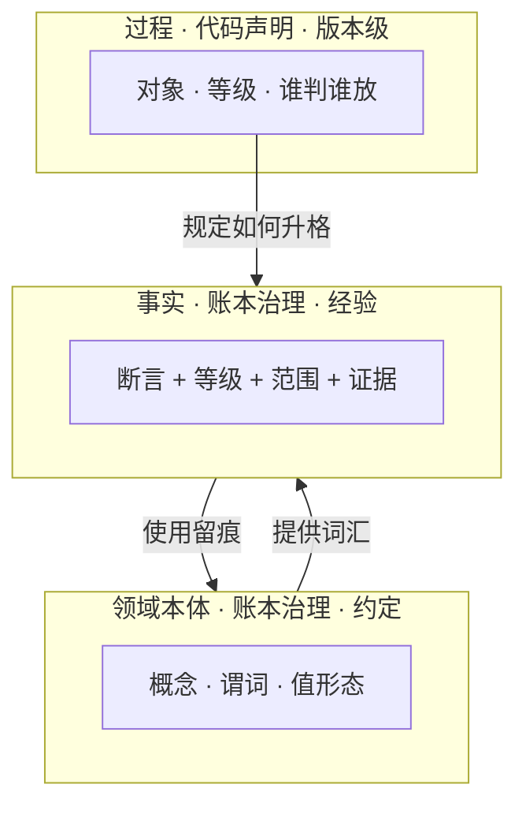

# 领域本体：认识论循环的知识形态

> **改造中。** 本文按[「少即是多」方案](less-is-more-plan.zh-CN.md)描述目标设计。代码分阶段跟进，哪些已经落地，以[已知缺口](known-gaps.zh-CN.md)为准。

> 认识论循环管「凭什么信」，领域本体管「用什么语言说」。本文定义领域本体：它如何表示、如何存储、如何增改废，以及它与循环、事实、图的关系。

---

## 1. 问题：事实需要形态

一条只有散文的事实，认识论上是完整的——凭什么信、在什么范围成立都写清了——但三件事做不到机械：

- **不可比较**：两条事实是不是在说同一件事，只能重读散文；
- **不可查冲突**：互相矛盾的两条可以同时在架；
- **不可复用**：下一轮想用「已知」，只能把全部事实重读一遍。

所以循环的产出不是一个字符串，而是**有界的知识**：断言内容（本体约束）× 认识论元数据（循环治理）。真值方向不变——世界 → 证据 → 事实 → 长成本体——**本体不裁决任何事，它只收留被裁决过的东西**。已确立的结论跨会话留在工作区，就是 ClearAI 的长期记忆。

---

## 2. 三个层次

| 层次 | 是什么 | 回答 | 权威从哪来 | 变化速度 |
|---|---|---|---|---|
| **过程** | [验证闭环](verification-loop.zh-CN.md)：对象、等级、谁判谁放 | 我们**如何**知道 | 代码声明，装配期校验 | 随插件版本 |
| **领域本体** | 项目的领域语言：概念、谓词、值形态 | 我们**用什么语言**说 | 约定：带依据接纳、黏性废止 | 慢 |
| **事实** | 用领域语言写下、走完了循环的句子 | 我们**知道了什么** | 循环：证据、等级、范围、复核 | 快 |

**领域本体是语言，不是先验框架。** 术语是约定，不是经验主张：它的权威来自被采纳、被使用、可废止，不来自证据等级。由此解掉两个死结：第一个目标还没有任何事实时，词汇已经可用（语言先于句子）；术语不需要验证，用术语写下的句子才需要。

**过程不是项目知识。** 它不进账本、不在运行时编辑；要改它，改代码并发布。它在界面上的样子是**状态形状**：世界树里的步骤与门，本体格里按能信的程度分组的结论。


```mermaid
flowchart TD
    subgraph process["过程 · 代码声明 · 版本级"]
        loop["对象 · 等级 · 谁判谁放"]
    end
    subgraph domain["领域本体 · 账本治理 · 约定"]
        vocab["概念 · 谓词 · 值形态"]
    end
    subgraph facts["事实 · 账本治理 · 经验"]
        know["断言 + 等级 + 范围 + 证据"]
    end
    loop -->|"规定如何升格"| facts
    domain -->|"提供词汇"| facts
    facts -->|"使用留痕"| domain
```

---

## 3. 图模型：最小集

不引入 OWL、RDF、SHACL、SPARQL、图数据库或推理机。只有四种节点、四种边。

| 节点 | 含义 | 来源 |
|---|---|---|
| `concept` | 领域概念，如「数值格式」「炉次」 | 概念文件 `clear/ontology/concepts/**.json` |
| `value_type` | 内置值形态：`statement` / `quantity` / `formula` / `code` / `reference` | 系统固定 |
| `instance` | 找到的具体东西，如「WENO5」「炉次-2025-001」 | 实体文件 `clear/ontology/entities/**.json`，或从事实投影 |
| `literal` | 数值、文本、公式、代码引用 | 从断言投影 |

| 边 | 含义 | 例 |
|---|---|---|
| `is_a` | 概念继承（概念目录嵌套） | `WENO格式 → 数值格式` |
| `part_of` | 组成（实体目录嵌套） | `叶片-3 → 涡轮-A` |
| `predicate` | 领域谓词：概念 → 概念或值形态 | `数值格式 --收敛阶--> quantity` |
| `assertion` | 一条断言 | `WENO5 --收敛阶--> 5` |

谓词是带主词域、值域与单值性的边记录，不是节点：

```json
{ "id": "convergence_order", "label": "收敛阶", "domain": "numerical_scheme",
  "range": { "form": "quantity", "unit": "order" }, "functional": true }
```

**实例在被观测到的那一刻落盘**（写一份实体文件，关系带出处），不等目标结案。否则「词汇写得漂亮、实体图是空的」会成为最省力的完成方式。图上两种来源的边如实标注：来自升格事实的带等级与范围（`promoted`），来自带出处观测的未经独立裁决（`asserted`）。

**本体图与实体图分开画。** 一张说「这门语言允许表达什么」（声明），一张说「已经表达了什么」（主张）。两者权威不同、变化速度不同、出错的后果不同，画成同一种边是本设计要避免的主要错误。

---

## 4. 事实：断言 + 认识论元数据

> **事实 = 一个符合领域语言的断言 + 认识论元数据（等级、范围、证据、评估、复核、来源目标）。**

```json
{ "subject": { "id": "WENO5", "type": "numerical_scheme" },
  "predicate": "convergence_order",
  "object": { "kind": "quantity", "value": 5, "unit": "order" },
  "qualifiers": { "regime": "smooth" } }
```

| 值形态 | 客体 | 校验（提供即严校） |
|---|---|---|
| `statement` | 短陈述 | 非空、有长度上限 |
| `quantity` | 数值 + 单位 | 数值可解析、单位非空；不做量纲换算 |
| `formula` | LaTeX | 非空；不做语义解析 |
| `code` | 工作区文件路径 | 文件真实存在 |
| `reference` | 账内 id 或盘上路径 | 可解析 |

关系谓词的宾语是另一个**实例**（`{ kind: "instance" }`），不是第六种值形态。断言是加法：不写断言的事实照旧有效，只是显示为「未结构化」。断言在升格那一刻随事实落地，之后不回溯改写；事实按假设 id 关联它的来源，不靠文字相等。

---

## 5. 存储与投影：本体是一棵 JSON 文件树

**本体就是工作区里的文件**，模型用原生的读、写、改文件工具直接维护，不经专门工具：

```
clear/ontology/
  SCHEMA.json                 ← 系统写的格式说明，模型照着写
  concepts/
    numerical_scheme.json     ← 描述「数值格式」
    numerical_scheme/         ← 它的子概念放这里（目录嵌套 = is_a）
      weno_scheme.json
  relations/
    convergence_order.json    ← 谓词：domain / range / functional
  entities/
    turbine_a.json            ← 实体：type + relations[]
    turbine_a/                ← 它的部件（目录嵌套 = part_of）
      blade_3.json
```

- `X.json` 描述 X，X 的孩子放在同级的 `X/` 目录里。身份是 id（等于文件名），位置是目录，引用只用 id。
- 概念与谓词共用一个 id 空间。谓词的 range 是概念 id，或 `{form, unit?}`。
- 实体带 `relations:[{predicate, object|value, unit?, evidence:{kind, ref}}]`，每条关系必须有出处。
- 字段不在 `SCHEMA.json` 里的一律拒收。

**事实只由系统写**：升格时每条事实写成 `clear/knowledge/facts/<id>.json`（含它所用定义的指纹），`INDEX.md` 从全部事实文件渲染。事实文件跨会话累积：新会话一开始就能读到旧会话写下的事实与本体。

**宿主把文件折成一张图**：每步之前同步一次工作区（按 mtime/大小缓存、sha1 判变化），折成 `state.lexicon`。界面和模型读的是同一张图；读面永不反过来成为权威。

**布局不存储**：坐标、缩放、筛选不是知识。布局是确定性纯函数——同一组文件必得同一张图，可被测试钉死。

---

## 6. 三道检查

| 时机 | 查什么 | 结果 |
|---|---|---|
| **写时** | 单个文件：JSON 能解析、字段合 `SCHEMA.json`、id 与文件名一致 | **拒写**，模型当场看到哪一处不对 |
| **读时** | 跨文件：id 重复、父概念 / 主词域 / 值域 / 实体类型 / 关系宾语指空、单值关系冲突 | **只标不拦**：有问题的那一份不进图，问题列在卡上和图下 |
| **升格时** | 要写进长期知识的断言，按当时的全部文件重查一遍 | **不升格**，这条留在「暂缓」里 |

**含义变了：检测，不阻拦。** 每条事实带着它所用定义的指纹（断言引用的词条，加上主张与边界原文里按词面提到的概念与关系）；之后有人改了这些定义文件，这条事实标「定义已变」，进「待处理」，由人或模型决定是复核还是维持。

**废止**：在定义文件里写 `status: "deprecated"`（可选 `replaced_by`）。旧节点留在图上（虚线）；新断言不能引用它。

**人怎么改本体。** 人在对话里说，模型改文件，走同样的三道检查；人也可以直接改文件，效果一样。界面只读。

---

## 7. 与循环的结合

| 拍 | 领域本体的作用 |
|---|---|
| 问题 | 按概念取「已知」，而不是重读全部事实 |
| 判断 | 用已登记的谓词写断言；不写也可以 |
| 检验 | 判据可以引用谓词与值形态 |
| 证据 | 实例与断言带出处落账，不把观测当事实 |
| 结论 | 升格为事实，同时进图 |
| 本体 | 下一轮按概念、谓词、主体取用 |

**知识模式。** 目标还开着、并且登记了假设时，运行态卡多出两样东西：与本题词面相关的已知（只读、有界、不猜语义），以及**缺口**——从已有记录算出来、每条都指得出一个能补的动作。缺口只给模型看，只有三种：

1. 判断没被任何证据碰过；
2. 判断只有散文，没有断言；
3. 断言的主体没落到实例图上。

结案前还有**一道门**：断言提到的实体必须落在实例图上。出口诚实的两条：补上，或如实放弃。普通问答从不进入知识模式。

真跑给过一个反直觉的结论：改变模型行为的主要是**缺口看得见**，不是门。所以两者都留——看得见负责「让它想做」，门负责「不让它绕过」。

**冲突：派生，不是裁决。** 两条未撤回的已确认事实落在同一个单值谓词、同一主体、客体不同时，投影给出一对冲突读数。它不是存储对象，不撤回任何一侧，不判谁对，也不进门；撤回任一侧（复核）它就消失，人也可以注明缘由维持双方。

---

## 8. 与状态机的联动

过程对象、领域词汇、一次检验各有各的生命周期，**互不嵌套**：接纳一个概念不推进任何过程对象，结案也不改词汇。它们之间只有引用（断言引用谓词与概念，事实引用假设与证据），握手只有四处：

1. **登记假设时校验断言形态**：引用不存在、已废止、值域不符，落账之前就拒（按当时的本体文件）；
2. **升格时定型**：事实带上假设 id 与断言，与等级、范围、证据绑在同一条记录；
3. **重放时派生冲突与图**：不改任何事实，不进门；
4. **定义变化的传播**：新断言拒引已废止的词；定义文件改了，引用它的事实标「定义已变」。

---

## 9. 界面：「本体」格

中栏只有一格，叫**本体**。一页回答人的四个问题：现在能信什么；什么被推翻、什么说不清；这些加起来长成了什么；需要我做什么。第四个问题在页眉与输入框旁边是同一份（「待处理 N」）。

一屏三层，自上而下越来越细：

| 层 | 内容 |
|---|---|
| **页眉** | 一行问题（在回答什么）+ 一行计数 + 「待处理」（计划连拦停下、结论互相矛盾；一条一行，只陈述，不放按钮）+ 小进度轨：判断 → 检验 → 已验证 → 入本体，每站带计数 |
| **图（主角）** | **本体图 ｜ 实体图** 二选一。目录嵌套画成可收起的子图（点多时默认收到第一层，+N 展开）；读时查出的文件问题列在图下。概念用衬线字，实例用小方块加类型小字；已验证的关系实线，待核验虚线，推翻与不确定各一种颜色。点节点出词条小卡，并按它过滤下面的清单（一行「只看与 X 相关的 · 清除」，如实计数）；可全屏 |
| **结论清单** | 一条一行，按状态分组：**已验证 / 待核验 / 验证中 / 不确定 / 已推翻 / 已替换**，行尾标出自第几步。点开依次展开三段：**进度**（这条走到了哪一站）、**可信度怎么变的**（每次变化一行：哪一步、从什么变成什么）、**补充**（依据、范围、算错的条件、相关的概念与实例） |

单次检验的结果只用三个词：**支持 / 推翻 / 不确定**。等级写成人话：自己推了一遍 / 引用已有材料 / 可复算 / 独立核验 / 人放行。内部编号不上屏，人认的是判断的短名和「第几步」。

**不爆炸的契约：**

1. **零成本**：没有目标、没有词条时，这一格是一句空的提示，不铺任何区块。
2. **分层**：一眼看页眉，扫一遍清单，点开才看依据与来历。
3. **图是主角也是索引**：点节点即过滤，不另设一排芯片。
4. **就地展开，不跳转**：唯一的跨格跳转是「去世界树看那一步」。
5. **例外才打扰**：要人处理的事只在「待处理」里各占一行；矛盾标在受影响的那两行上。
6. **过滤说真话**：一行状态 + 清除，写明有多少条没匹配。

**这一格只读。** 不能在这里手工登记或修改词条；要改本体就在对话里说，或直接改 `clear/ontology/` 下的文件。过程不作为可编辑内容出现：步骤与门在右栏世界树里，每步一行，点一步才看它检验了哪条判断、结果是什么。

---

## 10. 与 Semantica 的关系

参考实现 Semantica（`semantica-agi/semantica`）走过这条路。**借用**三件事：本体天然是图；编辑必须成为可追溯的变更；自动产出与有效本体隔离。**不借**四件事：RDF/OWL/SHACL/SPARQL 与推理机；多后端图数据库；企业摄取、抽取与实体消解管线；React Flow 之外的前端图库栈（本版图带用 vendored 的 React Flow，打进客户端模块，不从 npm 解析）。

---

## 11. 边界与后续

**本版不做**：标准语义网栈；图数据库；自动本体归纳；大规模抽取与实体消解；规则推理与传递闭包；跨项目词汇库；量纲换算；事实自动撤回或冲突自动裁决；界面编辑。

**后续方向**（不承诺）：量纲注册表；跨项目复用；实体消解；更深的词汇健康检查。

---

## 12. 原则回顾

1. 过程管认识路径，领域本体管语言，事实是走完循环的断言。
2. 本体的权威是文件树；图是它的投影。
3. 模型用原生文件工具写本体，三道检查把关；事实只由系统写。
4. 废止留痕；定义变化检测出来，交给人或模型复核，不悄悄生效。
5. 事实携带认识论元数据，实体图不能抹掉证据链。
6. 所有读面来自同一个折法，不维护第二本账。
