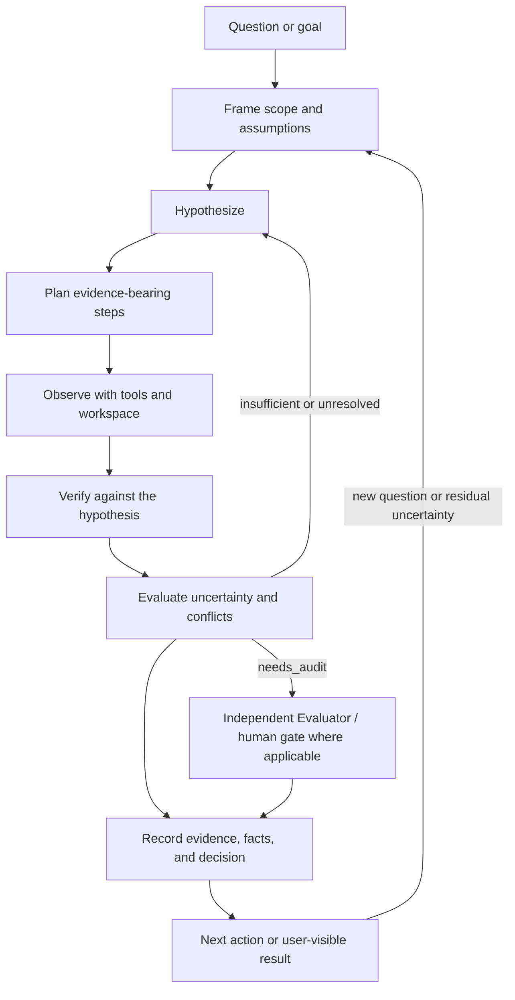

# The Epistemic Loop

The Epistemic Loop is ClearAI’s disciplined path from an uncertain question to a better-supported, explicitly bounded conclusion. It is not a claim of recursive self-improvement (RSI): the system does not autonomously rewrite itself or guarantee capability growth. State is derived from recorded objects, plans, observations, evidence, and decisions rather than maintained as a second hidden ledger.

## Core stages

1. **Frame** — Turn a question into a bounded problem: clarify the intended outcome, assumptions, scope, and available evidence.
2. **Hypothesize** — Record candidate explanations or approaches as hypotheses, including what would count for or against them.
3. **Plan** — Decompose the work into executable, evidence-bearing steps. `AdvancePlan` is the completion verb; plan progress and phases are derived from the plan tree.
4. **Observe** — Gather material through workspace reads and writes, web search and page browsing, experiments, or other permitted tools. An observation is a report of what was encountered, not yet a verdict.
5. **Verify** — Compare observations with the hypothesis using explicit checks and tests. Verification objects and levels (L0–L4) express epistemic strength; a per-step/per-branch L4 human release is implemented, while the proposed eight-state verification machine and a universal L4 gate over every evaluation are not.
6. **Evaluate** — Assess quality, uncertainty, conflicts, and whether independent review is needed. Observation admission can set `needs_audit` and trigger an independent Evaluator; admission is routing/eligibility, not a truth verdict. The person or process that performs a test should not be the sole judge of its result.
7. **Record and act** — Preserve sources, evidence, facts, decisions, and artifacts in the workspace. Accepted conclusions can guide the next plan or user-facing deliverable, while unresolved claims remain qualified and feed the next loop.

## Mermaid overview

## Stage map

| Stage | ClearAI/DSH mechanism | User-visible output |
|---|---|---|
| Frame | Run mode (`flash`, `dialogue`, `goal`); prompt and workspace context; a Goal when the user asks for a durable objective | Clarified response, scope, or active goal |
| Hypothesize | Hypothesis object and linked verification context | Candidate explanations, predictions, and assumptions |
| Plan | `AdvancePlan`, `AmendPlan`, `RefinePlan`, `VoidPlanStep`; derived `plan_tree.goal_progress` | Inspectable plan steps, progress, and completion evidence |
| Observe | Read/write tools, `web_search`, `web_fetch`, experiments, and workspace ledger | Sources, observations, tool results, and changed artifacts |
| Verify | Verification objects, observations, tests, evidence, facts, and L0–L4 levels | Checks, supporting/contradicting evidence, and stated limits |
| Evaluate | Admission metadata such as `needs_audit`; independent `evaluator` role when triggered; human review where applicable | Audit/review result, uncertainty, conflicts, or a request for review |
| Record and act | `clear/` records, per-project git ledger, evidence/fact records, deliverable declarations, and the next run/goal | Persisted history, files, citations, decision, or a qualified non-conclusion |

### Important boundaries

- **Derived state:** progress, phase, and completion are derived from the plan tree; ClearAI does not keep a competing second account of state.
- **Admission is not verdict:** admitting an observation for downstream processing, including setting `needs_audit`, says that it is eligible or worth reviewing—not that it is true.
- **Human gates apply where specified:** human review remains the authority for applicable release or acceptance decisions. A per-step/per-branch L4 release is implemented; do not infer that every L4 or every evaluation is currently hard-gated by a human, and treat the documented eight-state machine and universal L4 release gate as design targets rather than shipped behavior.
- **Content form comes from the domain language:** a conclusion's **assertion** (subject–predicate–object) and its value form are constrained by the project's [domain ontology](domain-ontology.md) — an assertion that references an unknown predicate, misses the range, or contradicts itself is refused **before anything lands**; when two un-retracted confirmed facts contradict each other the system only **surfaces the conflict**, and retracting or keeping remains a human decision. Assertions are additive: a fact without one is still valid, and simply shows as "unstructured".
- **No RSI claim:** the loop structures inquiry and records its results; it does not autonomously redesign the system or claim recursive self-improvement.
