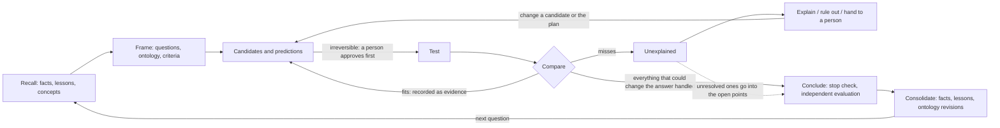

# Epistemic Loop

The epistemic loop is ClearAI's core loop, and it runs both ways: it uses the ontology and earlier facts to analyse and explore (listing candidate hypotheses, giving each one's prediction, and pointing at what to look at), and it writes tested results back to build a trustworthy ontology. Where a prediction misses is where the most is learned. It is not a recursive self-improvement (RSI) claim: the system does not rewrite itself and does not promise automatic capability growth.

## One loop

> recall → frame (the questions and the ontology: how the relevant quantities are measured and how they affect each other) → candidate hypotheses and predictions → test → compare (misses become unexplained items) → conclude (an answer per question, independent evaluation) → consolidate

| Beat | The model | The system guarantees | Tools |
|---|---|---|---|
| Recall | Reads the facts, lessons and concept glosses the card hands it | Before framing and while judgements are written, related facts (statement and boundary) and the glosses of the concepts in use go on the card; lessons checked earlier are shown before framing, planning and writing predictions | runtime card |
| Frame | Writes the person's question as a goal with criteria; states the mode (survey / solve); lists the questions or survey areas; writes the ontology with the framing: the quantities the answer involves (measures, with definition and unit), what measures them and how the reading is checked, and how the quantities affect each other; declares irreversible actions | The kernel validates the ontology and writes it to `clear/ontology/`; the ClearAI preset requires at least one measure, each the range of a measuring relation with a check, and refuses with the missing items otherwise; criteria hang on the host's native goal and are written before the work | native goal, `Frame` |
| Candidates and predictions | Proposes candidate hypotheses for each question (at least two), each with what would refute it and which ontology relation it comes from (or intuition); before each step, writes a prediction per candidate | Candidate states (being examined / excluded / adopted / set aside) are computed from evidence; when a step predicts the same for every candidate, the card says it cannot tell them apart; affects relations in the ontology that no candidate covers are listed on the card, not enforced | `Frame`, `CreatePlan`, `RevisePlan(action="expect")` |
| Test | Does the work and delivers; each step says which question or area it serves | Admission only decides accept or reject; a declared irreversible command asks a person before it runs; independent evaluation is spent on evidence the answer depends on, on promotion and on closing; L4 first needs a person's approval | native bash, `AdvancePlan` |
| Compare | Records where the result does not fit the prediction or the ontology as an unexplained item (anomaly), naming the quantities, candidates or facts it touches, and gives it a destination | Unexplained items stay on the card with three destinations only: explained, ruled out with a stated reason, handed to a person; an unexplained item that touches an established fact sends that fact back to awaiting check | `AdvancePlan.anomalies`, `Anomaly` |
| Conclude | Answers each question: conclusion / basis / open points (each saying how the answer would change if it held) / for you to decide; proposes the lessons this run found | The ClearAI preset first runs a stop check: every question has an answer or a stated reason it is unanswered, and every candidate still being examined, every open unexplained item and every newly found or parked question appears in the open points; otherwise the goal cannot close as achieved. Then an independent evaluator checks the criteria, whether the remaining unexplained items could shake the conclusion, and whether the data can be trusted; only then is the native goal completed | `Conclude` |
| Consolidate | Revises the ontology (through `Frame` or by editing the files) | Judgements the evaluator supports are promoted to facts with boundary and level; lessons the evaluator supports are written to `clear/knowledge/lessons/`; retracting an old fact is a person's decision | `Frame`, native file tools on `clear/ontology/**.json` |

Ordinary Q&A sets no goal, so it never enters the loop and costs nothing.

## Overview

```mermaid
flowchart LR
    R[Recall: facts, lessons, concepts] --> F[Frame: questions, ontology, criteria]
    F --> H[Candidates and predictions]
    H -->|irreversible: a person approves first| A[Test]
    A --> C{Compare}
    C -->|fits: recorded as evidence| H
    C -->|misses| U[Unexplained]
    U --> S[Explain / rule out / hand to a person]
    S -->|change a candidate or the plan| H
    C -->|everything that could change the answer handled| Z[Conclude: stop check, independent evaluation]
    U -.unresolved ones go into the open points.-> Z
    Z --> D[Consolidate: facts, lessons, ontology revisions]
    D -->|next question| R
```

## Boundaries

- **State is computed.** Progress, candidate and judgement status, whether a conclusion can be trusted and how many unexplained items are open are all folded from the session log; there is no second ledger and the model has no writable state field.
- **Admission is not a verdict.** Admission only answers "is this artefact accepted": present, non-empty, well-formed. What it shows is for evaluation.
- **The stop check only checks presence.** Before closing, it checks that whatever could change the answer is written into the answer; it does not judge whether it is right. Judging is the independent evaluator's job.
- **The worker does not judge itself.** There are three levels: L2 self-tested, with a checkable basis; L3 judged by an independent evaluator; L4 also approved by a person. L0 and L1 in old ledgers read as self-tested.
- **Anomalies are not explained away.** An unexplained item is explained, ruled out with a stated reason, or written into the answer's open points; it goes to the evaluator with the delivery, and the evaluator checks the reasons for ruling any out. The evaluator also looks for anomalies the worker did not record: re-run numbers matching does not mean the data can be trusted.
- **People's decisions are made by people.** Where a person is needed (an irreversible command, L4 approval, a plan blocked repeatedly, a fact meeting counter-evidence), that call asks the person directly and the answer does not pass through the model. If nobody can answer, the gate stays open and the goal waits. The "Make it a question" / "Park" buttons only send a sentence to the model on the person's behalf; they write no state.
- **Conventions are not observations.** Concepts and relations are conventions: they need a basis, not an evidence level. Instances and assertions are observations and need provenance. Facts are judgements that went through the loop. The graph labels the three separately.
- **Parallel exploration is parallel testing.** Competing routes are competing candidate hypotheses, each tested by a step with its prediction written in advance; the model runs them in parallel with native subtasks.
- **Conflicts are only surfaced.** When two confirmed facts contradict each other the system shows it; a person decides which to keep.
- **Nothing is deleted.** Refuted judgements, rejected artefacts, handled unexplained items and retracted facts all stay on record.
- **No RSI claim.** The loop organises inquiry and records results; it does not redesign the system or claim recursive self-improvement.
