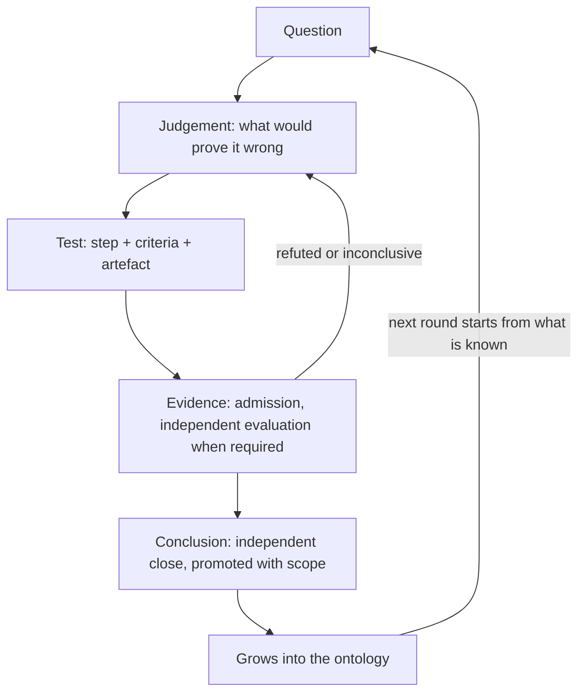

# Epistemic Loop

> **Being rebuilt.** This document describes the target design from the ["less is more" plan](less-is-more-plan.zh-CN.md). Code follows in phases; what has landed is tracked in [Known Gaps](known-gaps.md).

The epistemic loop is how ClearAI takes an uncertain question to a **bounded conclusion**. It is not a recursive self-improvement (RSI) claim: the system does not rewrite itself and does not promise automatic capability growth.

## One loop

> question → judgement (state what would prove it wrong) → a test that could fail → evidence → bounded conclusion → grows into the ontology

| Beat | The model | The system guarantees | Tools |
|---|---|---|---|
| Question | Writes the person's question as a goal with criteria | The goal is the host's native goal; criteria hang on it and are written before the work | native goal, `Frame` |
| Judgement | Proposes judgements (hypotheses), each with what would refute it | At least two; a refutation condition is required | `Frame` |
| Test | Splits work into steps, each with criteria and the artefact it will deliver; optionally which hypothesis it tests and at what level | Criteria are written before results exist; a step cannot declare itself done | `CreatePlan`, `RevisePlan` |
| Evidence | Does the work, delivers | Admission only decides accept or reject; L3+ dispatches an independent evaluator; L4 first asks a human to release | `AdvancePlan` |
| Conclusion | Concludes | An independent evaluator checks every goal criterion; only then is the native goal completed and qualifying hypotheses promoted to facts, with scope and level | `Conclude` |
| Ontology | Writes assertions in the domain vocabulary, registers the concrete things it found | Vocabulary needs a basis; instances and assertions need provenance; conflicts are only surfaced | `Define`, `Deprecate`, `RegisterInstance`, `Assert` |

Ordinary Q&A sets no goal, so it never enters the loop and costs nothing.

## Overview

```mermaid
flowchart TD
    Q[Question] --> J[Judgement: what would prove it wrong]
    J --> T[Test: step + criteria + artefact]
    T --> E[Evidence: admission, independent evaluation when required]
    E -->|refuted or inconclusive| J
    E --> C[Conclusion: independent close, promoted with scope]
    C --> O[Grows into the ontology]
    O -->|next round starts from what is known| Q
```

## Boundaries

- **State is computed.** Progress, hypothesis status and whether a conclusion can be trusted are folded from the session log; there is no second ledger and the model has no writable state field.
- **Admission is not adjudication.** Admission only answers "is this artefact accepted": it exists, is non-empty, is well-formed. What it shows is left to evaluation.
- **The doer does not judge their own work.** L0–L2 may self-judge with a reviewable basis; L3+ is judged by an independent evaluator; L4 also needs a human release.
- **Only a human makes a human's decision.** Where a person is needed (L4 release, a plan blocked repeatedly, a fact meeting counter-evidence), the call that opened the gate asks the person directly; the answer never passes through the model. If nobody can answer, the gate stays open and the goal waits.
- **Convention is not observation.** Concepts and predicates are conventions: they need a basis, not an evidence level. Instances and assertions are observations and must carry provenance. Facts are hypotheses that completed the loop. The graph labels the three apart.
- **Parallel exploration is parallel testing.** Competing routes are competing judgements, each tested by a step whose criteria are written in advance; the model runs them in parallel with native subagents. The loser becomes a refuted judgement and stays on record; if both hold and contradict each other, the conflict is shown to the person.
- **Conflicts are only surfaced.** When two confirmed facts contradict each other the system shows it; retracting or keeping is the person's decision.
- **Nothing is deleted.** Refuted hypotheses, rejected artefacts and retracted facts all remain inspectable.
- **No RSI claim.** The loop organises inquiry and records results; it does not redesign the system.
