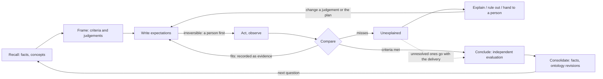

# Epistemic Loop

The epistemic loop is ClearAI's core loop, and it runs both ways: it uses the ontology and earlier facts to analyse and explore (giving expectations and pointing at what to look at), and it writes tested results back to build a trustworthy ontology. Where an expectation misses is where the most is learned. It is not a recursive self-improvement (RSI) claim: the system does not rewrite itself and does not promise automatic capability growth.

## One loop

> recall → frame (judgements state what would prove them wrong) → write expectations → act and observe → compare (misses become unexplained items) → independent evaluation at close → consolidate

| Beat | The model | The system guarantees | Tools |
|---|---|---|---|
| Recall | Reads the facts and concept glosses the card hands it | Before framing and while judgements are written, related facts (statement and boundary) and the glosses of the concepts in use go on the card | runtime card |
| Frame | Writes the person's question as a goal with criteria; proposes judgements, each with what would refute it; declares irreversible actions | At least two judgements, refutation condition required; criteria hang on the host's native goal and are written before the work | native goal, `Frame` |
| Expect | Before each step, writes what it expects to see and where that comes from (relation / lesson / judgement, or plainly intuition) | The expectation is kept on the step and the card shows it for the next step; leaving it out is not blocked | `CreatePlan`, `RevisePlan(action="expect")` |
| Act, observe | Does the work, delivers | Admission only decides accept or reject; a declared irreversible command asks a person before it runs; L3+ dispatches an independent evaluator; L4 first asks a person to release | native bash, `AdvancePlan` |
| Compare | Records where the result does not fit the expectation or the ontology as an unexplained item (anomaly) and gives it a destination | Unexplained items stay on the card with three destinations only: explained, ruled out with a stated reason, handed to a person | `AdvancePlan.anomalies`, `Anomaly` |
| Conclude | Concludes | An independent evaluator checks three things: are the criteria met, could the remaining unexplained items shake the conclusion, can the data itself be trusted; only then is the native goal completed | `Conclude` |
| Consolidate | Writes concepts, relations and entities in the domain vocabulary | Judgements the evaluator supports are promoted to facts with boundary and level; retracting an old fact is a person's decision | native file tools on `clear/ontology/**.json` |

Ordinary Q&A sets no goal, so it never enters the loop and costs nothing.

## Overview

```mermaid
flowchart LR
    R[Recall: facts, concepts] --> F[Frame: criteria and judgements]
    F --> X[Write expectations]
    X -->|irreversible: a person first| A[Act, observe]
    A --> C{Compare}
    C -->|fits: recorded as evidence| X
    C -->|misses| U[Unexplained]
    U --> S[Explain / rule out / hand to a person]
    S -->|change a judgement or the plan| X
    C -->|criteria met| Z[Conclude: independent evaluation]
    U -.unresolved ones go with the delivery.-> Z
    Z --> D[Consolidate: facts, ontology revisions]
    D -->|next question| R
```

## Boundaries

- **State is computed.** Progress, judgement status, whether a conclusion can be trusted and how many unexplained items are open are all folded from the session log; there is no second ledger and the model has no writable state field.
- **Admission is not a verdict.** Admission only answers "is this artefact accepted": present, non-empty, well-formed. What it shows is for evaluation.
- **The worker does not judge itself.** There are three levels: L2 self-tested, with a checkable basis; L3 judged by an independent evaluator; L4 also released by a person. L0 and L1 in old ledgers read as self-tested.
- **Anomalies are not explained away.** Unexplained items do not block concluding, but they go to the evaluator with the delivery, and the evaluator checks the reasons for ruling any out. The evaluator also looks for anomalies the worker did not record: re-run numbers matching does not mean the data can be trusted.
- **People's decisions are made by people.** Where a person is needed (an irreversible command, L4 release, a plan blocked repeatedly, a fact meeting counter-evidence), that call asks the person directly and the answer does not pass through the model. If nobody can answer, the gate stays open and the goal waits.
- **Conventions are not observations.** Concepts and relations are conventions: they need a basis, not an evidence level. Instances and assertions are observations and need provenance. Facts are judgements that went through the loop. The graph labels the three separately.
- **Parallel exploration is parallel testing.** Competing routes are competing judgements, each tested by a step with criteria written in advance; the model runs them in parallel with native subtasks.
- **Conflicts are only surfaced.** When two confirmed facts contradict each other the system shows it; a person decides which to keep.
- **Nothing is deleted.** Refuted judgements, rejected artefacts, handled unexplained items and retracted facts all stay on record.
- **No RSI claim.** The loop organises inquiry and records results; it does not redesign the system or claim recursive self-improvement.
