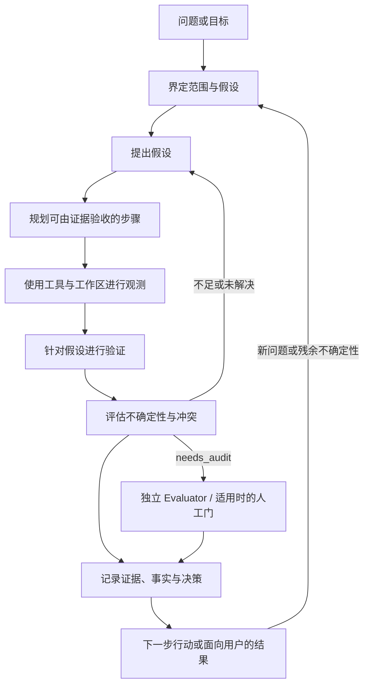

# 认识论循环（Epistemic Loop）

认识论循环是 ClearAI 将不确定问题推进为有更充分依据、且明确标注边界的结论所采用的纪律化路径。它**不是**递归自我改进（RSI）主张：系统不会自主重写自身，也不保证能力自动增长。状态来自已记录的对象、计划、观测、证据和决策的派生结果，而不是维护第二本隐藏账本。

## 核心阶段

1. **界定（Frame）**——把问题变成有边界的任务：明确期望结果、假设、范围和可用证据。
2. **提出假设（Hypothesize）**——记录候选解释或方案，并说明哪些观察会支持或反驳它们。
3. **规划（Plan）**——把工作拆成可执行、可用证据验收的步骤。`AdvancePlan` 是完成步骤的动词；计划进度和阶段由计划树派生。
4. **观测（Observe）**——通过工作区读写、网络搜索和网页浏览、实验或其他获准工具收集材料。观测只是对所遇内容的报告，还不是裁决。
5. **验证（Verify）**——用明确的检查和测试将观测与假设比较。验证对象及 L0–L4 等级表达认识论强度；L4 的步骤/分支级人类放行已实现，而设计中的八状态验证机与覆盖每一次评估的通用 L4 闸门尚未实现。
6. **评估（Evaluate）**——评估质量、不确定性、冲突，以及是否需要独立复核。观测准入可以设置 `needs_audit` 并触发独立 Evaluator；准入是路由/资格判断，不是真值裁决。执行测试的人不应成为结果的唯一裁判。
7. **记录并行动（Record and act）**——在工作区保存来源、证据、事实、决策和产物；已确立的条目沉淀为**本体**（本体货架），下一轮按概念取用。已接受的结论可以指导下一份计划或面向用户的交付物；未解决的主张则保持限定，并进入下一轮循环。

## Mermaid 总览

## 阶段对照表

| 阶段 | ClearAI/DSH 机制 | 用户可见输出 |
|---|---|---|
| 界定 | Run 模式（`flash`、`dialogue`、`goal`）；提示词和工作区上下文；用户要求持续目标时使用 Goal | 澄清后的回答、范围或活动目标 |
| 提出假设 | 假设对象及关联的验证上下文 | 候选解释、预测和前提 |
| 规划 | `AdvancePlan`、`AmendPlan`、`RefinePlan`、`VoidPlanStep`；派生的 `plan_tree.goal_progress` | 可检查的步骤、进度和完成证据 |
| 观测 | 读写工具、`web_search`、`web_fetch`、实验和工作区账本 | 来源、观测、工具结果和变更后的产物 |
| 验证 | 验证对象、观测、测试、证据、事实及 L0–L4 等级 | 检查结果、支持/反驳证据和明确限制 |
| 评估 | `needs_audit` 等准入元数据；触发时使用独立 `evaluator` 角色；适用时进行人工复核 | 审计/复核结果、不确定性、冲突或复核请求 |
| 记录并行动 | `clear/` 记录、项目级 git 账本、证据/事实记录、交付声明及下一次 run/goal | 持久化历史、文件、引用、决策或带限定的非结论 |

### 重要边界

- **状态是派生的：**进度、阶段和完成度由计划树派生；ClearAI 不维护相互竞争的第二本状态账。
- **准入不是裁决：**让观测进入后续处理（包括设置 `needs_audit`）只表示它具备资格或值得复核，不表示它为真。
- **人工门按适用范围生效：**在规定的放行或接受决策中，人工复核仍是权威。L4 的步骤/分支级放行已实现；不要推断每个 L4 或每次评估当前都必然有硬性的人工门，文档中的八状态机器和通用 L4 放行门是设计目标，而非已交付行为。
- **内容形态来自领域语言：**一条结论的**断言**（主词–谓词–宾语）与它的值形态由项目的[领域本体](domain-ontology.zh-CN.md)约束——引用不存在的谓词、值域不符或自相矛盾的断言在**落账之前**就被拒；两条未撤回的已确认事实互相矛盾时，系统只**暴露冲突**，撤回或维持仍是人的决定。断言是加法：没有断言的事实照旧有效，只是显示为「未结构化」。
- **不作 RSI 主张：**循环组织探究并记录结果，但不会自主重新设计系统，也不声称递归自我改进。
