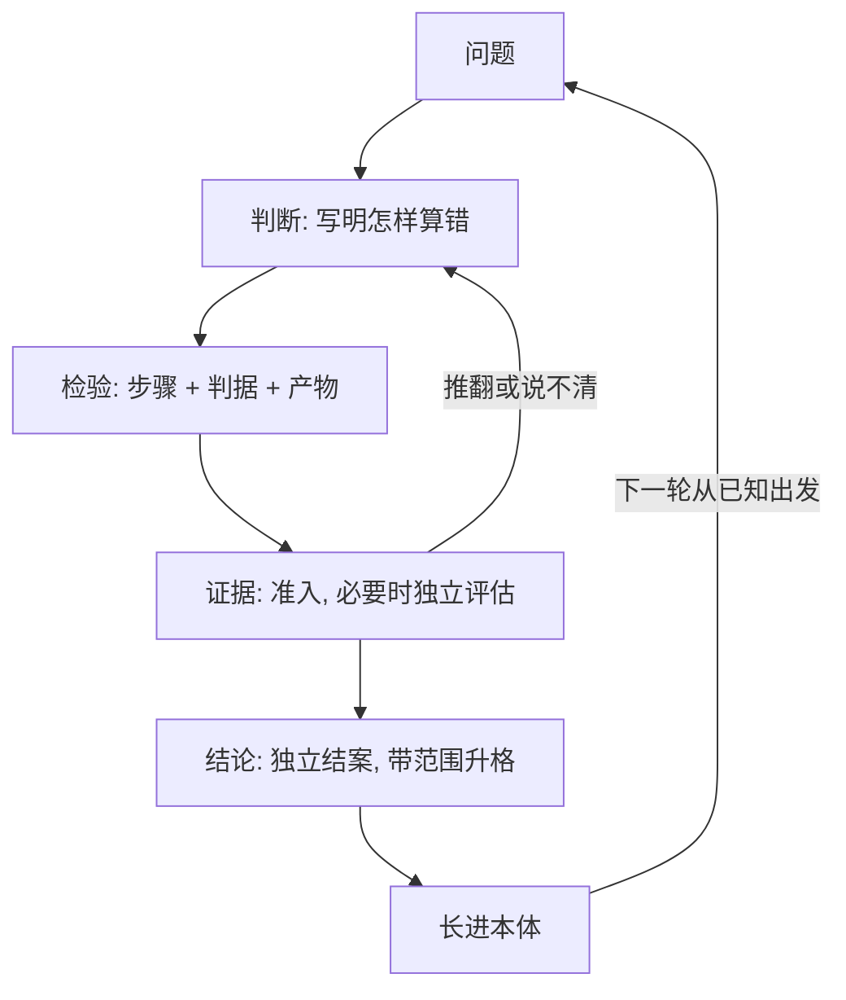

# 认识论循环

> **改造中。** 本文按[「少即是多」方案](less-is-more-plan.zh-CN.md)描述目标设计。代码分阶段跟进，哪些已经落地，以[已知缺口](known-gaps.zh-CN.md)为准。

认识论循环是 ClearAI 把一个不确定的问题推进成**带范围的结论**的路径。它不是递归自我改进（RSI）主张：系统不重写自己，也不保证能力自动增长。

## 一条循环

> 问题 → 判断（写明怎样算错）→ 一次可能失败的检验 → 证据 → 带范围的结论 → 长进本体

| 拍 | 模型做什么 | 系统保证什么 | 工具 |
|---|---|---|---|
| 问题 | 把人的问题写成目标与判据 | 目标由宿主的原生 goal 持有；判据挂在它上面，先写后做 | 原生 goal、`Frame` |
| 判断 | 提出判断（即假设），每条写明什么结果会推翻它 | 判断至少两条；推翻条件必填 | `Frame` |
| 检验 | 拆成步骤，每步写判据与要交的产物；需要时声明它检验哪条判断、什么等级 | 判据在结果出现之前写下；步骤不能自称完成 | `CreatePlan`、`RevisePlan` |
| 证据 | 做事、交付 | 准入只看产物收不收；L3 以上派独立评估者；L4 先问人放行 | `AdvancePlan` |
| 结论 | 结案 | 独立评估者逐条核对目标判据；通过才完成原生 goal，并把达到门槛的判断升格为事实，带范围与等级 | `Conclude` |
| 本体 | 用领域词汇写断言，登记找到的具体东西 | 词汇带依据接纳；实例与断言必须带出处；冲突只暴露 | `Define`、`Deprecate`、`RegisterInstance`、`Assert` |

普通问答不立目标，也就不进这条循环，不多花一个字节。

## 总览

```mermaid
flowchart TD
    Q[问题] --> J[判断: 写明怎样算错]
    J --> T[检验: 步骤 + 判据 + 产物]
    T --> E[证据: 准入, 必要时独立评估]
    E -->|推翻或说不清| J
    E --> C[结论: 独立结案, 带范围升格]
    C --> O[长进本体]
    O -->|下一轮从已知出发| Q
```

## 边界

- **状态是算出来的。** 进度、判断的状态、结论能不能信，都从会话日志折出来；没有第二本账，模型也没有可写的状态字段。
- **准入不是裁决。** 准入只回答「这份产物收不收」：存在、非空、结构合法。它说明了什么，交给评估。
- **做的人不判自己。** L0–L2 可以自判，依据要能复查；L3 以上由独立评估者判；L4 还要人放行。
- **人的决定只由人做。** 需要人的地方（L4 放行、计划连续被拦、事实遇到反例），由那次调用直接问人，答案不经模型转述。没人能答时，门开着，目标停下等人。
- **约定不是观测。** 概念与谓词是约定，要依据、不要证据等级；实例与断言是观测，必须带出处；事实是走完循环的判断。三者在图上分开标注。
- **冲突只暴露。** 两条已确认的事实互相矛盾时，系统把它亮出来；撤回还是维持，由人决定。
- **什么都不删。** 被推翻的判断、被拒的产物、被撤回的事实都留着，可查。
- **不作 RSI 主张。** 循环组织探究、记录结果；它不重新设计系统，也不声称递归自我改进。
