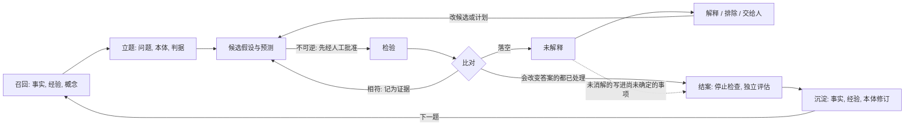

# 认识论循环

认识论循环是 ClearAI 的核心循环，它是双向的：一边用本体和以前留下的事实去分析、探索（列出候选假设，给出各自的预测，指出该看什么），一边把探索的结果经检验后写回，构建可信的本体。预测落空的地方学得最快。它不是递归自我改进（RSI）主张：系统不重写自己，也不保证能力自动增长。

## 一条循环

> 召回 → 立题（问题与本体：相关的量如何测量、如何相互影响）→ 候选假设与预测 → 检验 → 比对（落空记成未解释）→ 结案（逐问题给出结论，独立评估）→ 沉淀

| 拍 | 模型做什么 | 系统保证什么 | 工具 |
|---|---|---|---|
| 召回 | 读卡上递来的事实、经验、概念释义 | 立题前与写判断时，相关事实的原话与边界、用到的概念释义直接上卡；立题、定计划、写预测前摆出以前核过的经验 | 运行态卡 |
| 立题 | 把人的问题写成目标与判据；说明工作方式（广度调研 / 定向求解）；列出问题或调研板块；随立题写入本体：答案涉及的量（度量，带口径与单位）、它们由什么测量、如何核对，以及量之间的影响关系；声明不可逆的动作 | 本体由内核校验后写入 `clear/ontology/`；ClearAI 预设要求至少一个度量，且每个度量都有带核对方式的测量关系，缺了就拒并列出缺项；判据挂在宿主的原生 goal 上，先写后做 | 原生 goal、`Frame` |
| 候选假设与预测 | 每个问题提出候选假设（至少两条），写明推翻条件和它由本体中哪条关系提出（没有就写直觉）；每一步动手前，按候选分别写下预测 | 候选的状态（考察中 / 已排除 / 已采纳 / 暂不考察）由证据算出；某一步对所有候选的预测相同时，卡上说明此步骤无法区分它们；本体中已有、却没有候选覆盖的影响关系列在卡上，只列出、不强制 | `Frame`、`CreatePlan`、`RevisePlan(action="expect")` |
| 检验 | 做事、交付；步骤写明服务哪个问题或板块 | 准入只看产物收不收；声明过的不可逆命令执行前先问人；独立评估只用于答案所依赖的证据、升格与结案；L4 先经人工批准 | 原生 bash、`AdvancePlan` |
| 比对 | 结果和预测或本体对不上的地方记成未解释（反常），写明涉及哪些量、候选或事实，给它一个去处 | 未解释项挂在卡上，只有三个去处：被解释、写明理由排除、交给人；指向某条已确立事实的未解释项，使该事实回到「待核验」 | `AdvancePlan.anomalies`、`Anomaly` |
| 结案 | 逐问题给出结论：结论 / 依据 / 尚未确定的事项（每项写明若成立答案会如何改变）/ 待您决策；提议这次摸出的经验 | ClearAI 预设先做停止检查：每个问题都有结论或写明未回答的原因，仍在考察中的候选、开着的未解释项、新发现或暂缓的问题都已写进「尚未确定的事项」，否则不能以达成结案；然后独立评估者核判据、剩下的未解释项会不会动摇结论、数据本身可不可信；通过才完成原生 goal | `Conclude` |
| 沉淀 | 修订本体（可用 `Frame` 修订，也可直接编辑文件） | 评估者支持的判断升格为事实，带边界与等级；评估者支持的经验写进 `clear/knowledge/lessons/`；撤回旧事实要人定 | `Frame`、原生文件工具写 `clear/ontology/**.json` |

普通问答不立目标，也就不进这条循环，不多花一个字节。

## 总览

```mermaid
flowchart LR
    R[召回: 事实, 经验, 概念] --> F[立题: 问题, 本体, 判据]
    F --> H[候选假设与预测]
    H -->|不可逆: 先经人工批准| A[检验]
    A --> C{比对}
    C -->|相符: 记为证据| H
    C -->|落空| U[未解释]
    U --> S[解释 / 排除 / 交给人]
    S -->|改候选或计划| H
    C -->|会改变答案的都已处理| Z[结案: 停止检查, 独立评估]
    U -.未消解的写进尚未确定的事项.-> Z
    Z --> D[沉淀: 事实, 经验, 本体修订]
    D -->|下一题| R
```

## 边界

- **状态是算出来的。** 进度、候选与判断的状态、结论能不能信、未解释项开着几条，都从会话日志折出来；没有第二本账，模型也没有可写的状态字段。
- **准入不是裁决。** 准入只回答「这份产物收不收」：存在、非空、结构合法。它说明了什么，交给评估。
- **停止检查只看写没写。** 结案前检查的是会改变答案的事项有没有写进结论，不判断写得对不对；判断由独立评估者做。
- **做的人不判自己。** 等级只有三档：L2 自行检验，依据要能复查；L3 由独立评估者判；L4 还须经人工批准。旧账里的 L0、L1 读作自行检验。
- **异常不许被解释过去。** 未解释项要么被解释、要么写明理由排除、要么写进结论的「尚未确定的事项」；它随交付交给评估者，排除的理由由评估者核。评估者也会查做的人没登记的异常：数字复跑对得上不等于数据可信。
- **人的决定只由人做。** 需要人的地方（不可逆的命令、L4 批准、计划连续被拦、事实遇到反例），由那次调用直接问人，答案不经模型转述。没人能答时，门开着，目标停下等人。界面上的「立为问题 / 暂缓」只替人向模型发一句话，不写状态。
- **约定不是观测。** 概念与关系是约定，要依据、不要证据等级；实例与断言是观测，必须带出处；事实是走完循环的判断。三者在图上分开标注。
- **并行探索就是并行检验。** 几条竞争路线就是几个候选假设，各由一个步骤检验、预测事先写好；模型用原生子任务并行去跑。
- **冲突只暴露。** 两条已确认的事实互相矛盾时，系统把它亮出来；撤回还是维持，由人决定。
- **什么都不删。** 被推翻的判断、被拒的产物、处理过的未解释项、被撤回的事实都留着，可查。
- **不作 RSI 主张。** 循环组织探究、记录结果；它不重新设计系统，也不声称递归自我改进。
