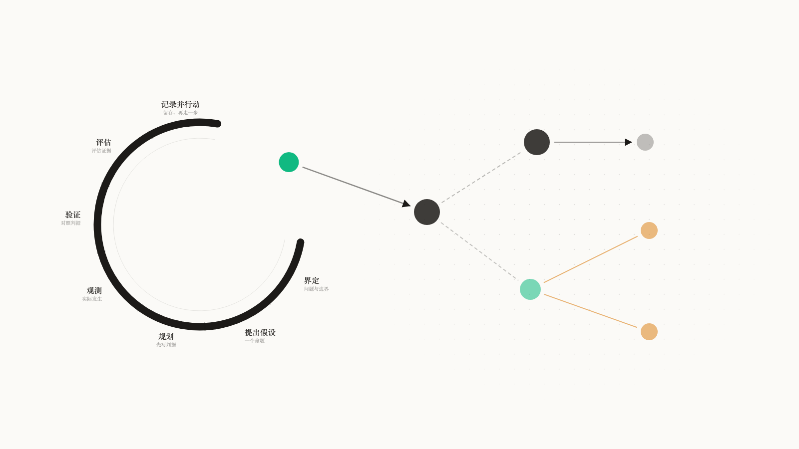
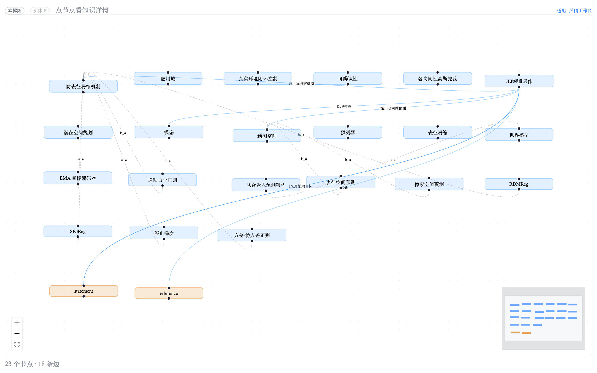
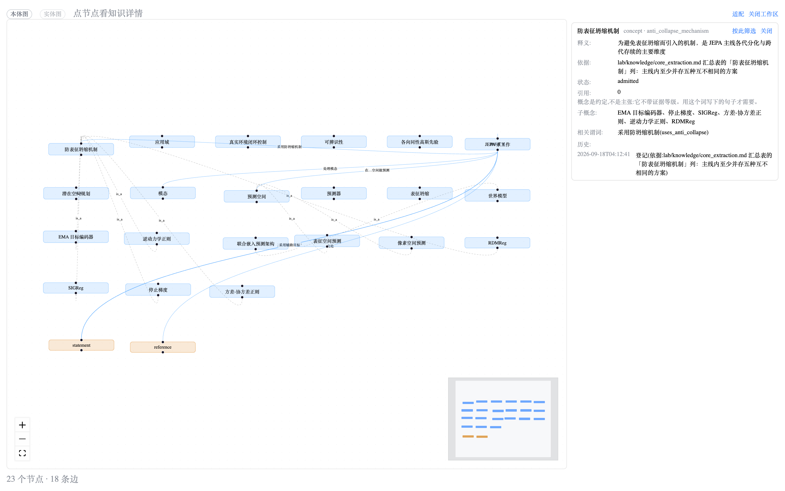
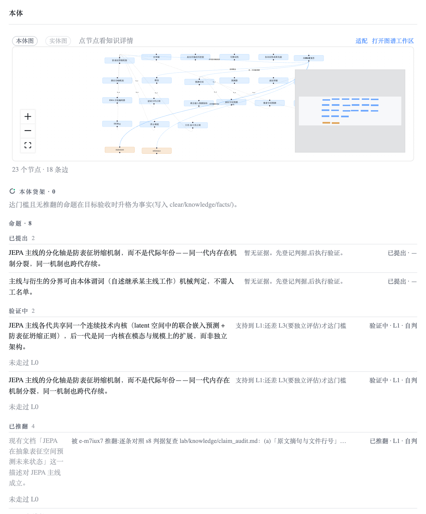
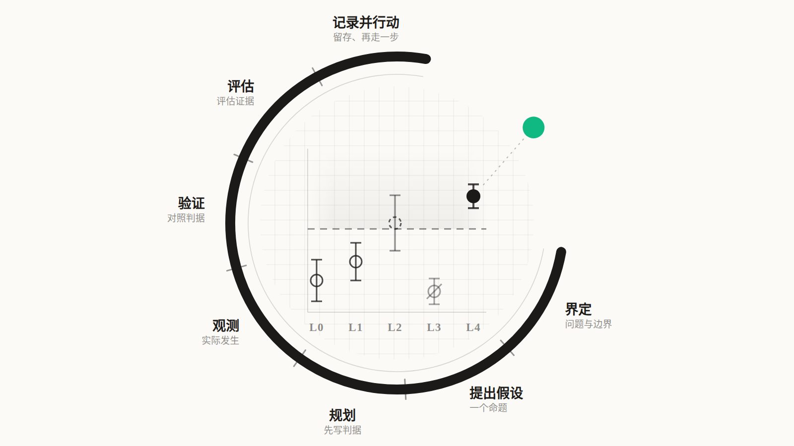
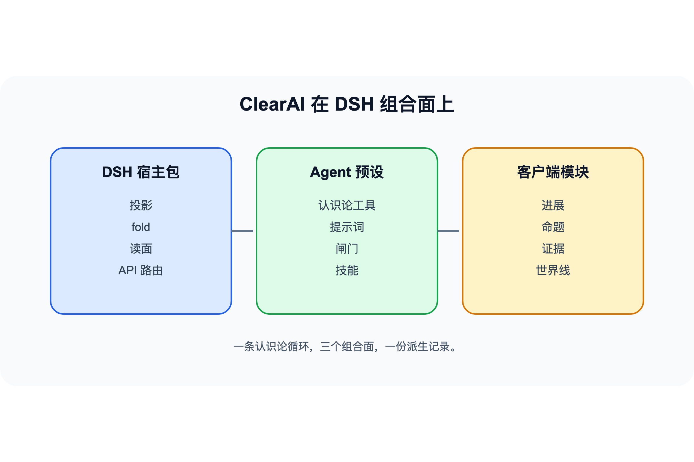
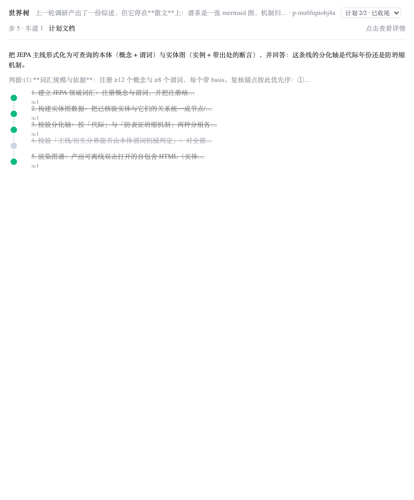
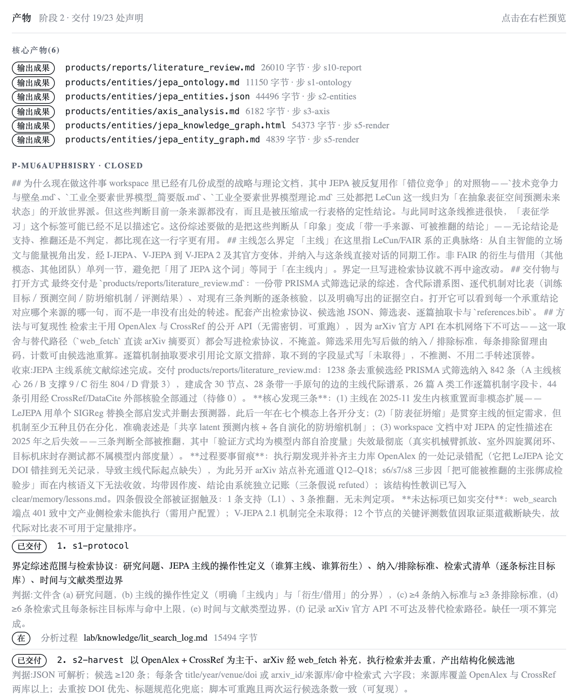

# clearai-dsh：在 DeepSeek Harness 上构建可信本体

**GitHub：** [Clearailhc/clearai-dsh](https://github.com/Clearailhc/clearai-dsh)

> Clearailhc/clearai-dsh @ v0.2.1 · DSH 原生插件
> 15 套件 1618 条断言 · 29 个意图工具 · 6808 行内核 · Apache-2.0

---

## 1、我们在解决什么问题

用 AI Agent 做过正经研究的人大概都撞过这堵墙。

你让模型调研一个技术选型，它给你一份漂亮的分析。有结构、有数据、有结论。你读完觉得有道理，准备拿去汇报。

然后有人问："这个结论怎么验证的？证据在哪？"

你翻聊天记录。证据散落在十几轮对话里，有的在工具输出里，有的在模型自己的推理链里，有的根本没有。你甚至不确定模型是推理出来的还是编出来的。

这件事的本质：**Agent 架构里没有一个地方存放"这个结论凭什么成立"。** 聊天记录不存这个，向量数据库不存这个，LangGraph 的 state graph 也不存这个。

同时，你希望研究产出能**积累**——今天做完的调研，明天换一个人还能接着用。积累需要一个结构化的形态。

我们的判断：这个形态是**领域本体**（domain ontology），而让本体里的每条边都可信的那套工艺是**认识论循环**（epistemic loop）。ClearAI 把两者做成了一个 DSH 插件：

**AI 在你的项目中逐步建立领域本体。概念、关系和事实都带有来源，经过验证后才进入知识结构。**



左边那个环是认识论循环——它是工厂。右边长出来的是领域本体——它是产品。中间那颗绿点是两者的衔接点：循环确认的事实，会成为本体中的新节点。

---

## 2、本体是终点，认识论是到达终点的路

两个词经常被混着用，先把关系说清楚。

**本体论**（ontology）回答的问题是：这个世界有哪些类的东西？它们之间有什么关系？在工程语境里，本体的产出是**一组概念、一组谓词、一组实例和它们之间的关系**——一个结构化的知识库。

**认识论**（epistemology）回答的问题是：一个信念凭什么算知识？证据怎么支持结论？在工程语境里，认识论的产出是**一套验证机制**——判据怎么登记、证据怎么分级、结论怎么裁决。

两者的关系用一个比喻：

| | 本体 | 认识论 |
|---|---|---|
| 是什么 | 房子（交付物） | 施工规范（质量体系） |
| 回答什么 | 知识长什么样 | 凭什么信这条知识 |
| 工程产出 | 概念 + 谓词 + 断言 + 图 | 判据登记 + 证据分级 + 独立评估 |

没有施工规范的房子也能盖起来，看起来像模像样。但你敢住吗？

市面上绝大多数"AI + 知识图谱"的做法是：让 LLM 从文本里抽取实体和关系，直接画到图上。这相当于**让一个没有资质的承包商凭感觉盖房子**。速度很快，外观很漂亮，但你不知道墙里有没有钢筋。

ClearAI 的做法：每一块砖（每一条断言）都要过验收（验证循环），验收记录（证据链）跟着砖走，房子盖完时每面墙都可以追溯到验收单。

**本体是交付物，认识论是质量体系。缺了质量体系的交付物，不敢用。**

---

## 3、可信本体的三条判据

一个本体要配得上"可信"这两个字，至少满足三条：

**① 每条边有出处。** 这条断言"铸锭的氧含量是 10 ppm"——谁测的？怎么测的？在哪条证据链上？没有出处的边和编造的边没有区别。

**② 矛盾能被自动发现。** 两条已确认的事实挂在同一个单值谓词、同一个主体、不同取值上——数学上不可能同时为真——系统必须自动报出来。不能靠人眼扫。

**③ 状态可以回放到零。** 从当前的完整状态出发，能一步步还原回最初的事件流。每一条边的诞生过程都可审计。

ClearAI 的全部架构都在为这三条服务（第 7 节会逐条映射）。先看本体长什么样。

---

## 4、本体的形态：词汇先于句子

一个可信本体的地基是**领域语言**——先定好用什么词，再用这些词说话。

### 概念与谓词

```
RegisterTerm({
  id: "ingot",
  label: "铸锭",
  gloss: "立式半连续铸造产出的单根金属锭",
  basis: "工艺手册第 6.1 节"
})

RegisterPredicate({
  id: "oxygen_ppm",
  label: "氧含量检测值",
  domain: "ingot",
  range: { form: "quantity", unit: "ppm" },
  functional: true,
  basis: "ASTM E2575"
})
```

`basis` 必填——这个词的出处。`functional: true` 是描述逻辑里的 functional property 约束：**同一主体只能有一个取值**。第 6 节的冲突检测靠它。

每条词汇带依据登记。没有依据不收。修订留版本（旧值不删）。废止写原因（黏性废止，没有删除操作）。语义变化必须换 id。

**如果一个词的含义可以随时变，建立在它之上的所有断言都是沙上城堡。**

### 类型化断言

本体上的边是**类型化三元组**：

```
{
  predicate: "oxygen_ppm",
  subject:   { id: "INGOT-3", type: "ingot" },
  object:    { kind: "quantity", value: 10, unit: "ppm" }
}
```

值形态五种：

| 形态 | 含义 | 工程价值 |
|---|---|---|
| `statement` | 一句可验证的陈述 | 最低门槛的结构化 |
| `quantity` | 数值 + 单位 | 可比较、可检冲突 |
| `formula` | 指向可重跑的公式文件 | 可复现 |
| `code` | 指向可执行的代码 | 可执行验证 |
| `reference` | 指向外部来源（DOI / 标准号） | 可追溯 |

断言在假设阶段就挂上，落账之前严格校验：引用不存在的谓词、值形态不合域、同一事实自相矛盾——schema 层直接拒绝。

### 两张图

**本体图**：概念是节点，`is_a` 和谓词是边。回答"这个领域允许表达什么"。它可以在零事实的状态下存在——先立词，再提假设。**语言先于句子。**

**实体图**：实例是节点，断言是边，每条边带支持等级。回答"已经验证出了什么"。**只有经过验证的实例和关系才会出现在实体图中。**



*产品里真实的一张图：素材来自一场真会话的投影，23 个节点、18 条边，左上角「本体图 / 实体图」一键切换。*



*点节点或边，右侧打开知识 Inspector：释义、依据、状态、子概念、相关谓词、登记与修订史，一处读完。*



*本体格的真机读数：图带在上（23 个节点、18 条边），下面是本体货架与在验命题——已提出、验证中、已推翻，各按状态分栏。*

两张图都是纯函数投影——从事件流算出来的，改不了也不用同步。图上点概念节点可以按概念过滤下方货架——**图就是索引**。

---

## 5、认识论：让每条边"挣"到位置的那套工艺



环内是这台仪器的读数面：L0–L4 等级轴、事先登记的阈值虚线（那条虚线）、五个带误差棒的观测——被支持的填实、被推翻的留在原位打一道斜杠。

认识论循环在 ClearAI 里**不是流程图，是写进工具 schema 的强制约束**。

### 判据先行

```
SetGoal({
  claim: "催化剂 A 的转化率优于 B",
  refute_when: "复测显示 A 的转化率低于 B",
  done_criteria: "三次独立实验的均值差 > 5%",
  promote_at_level: "L3"
})
```

`refute_when` 和 `done_criteria` 都是必填——schema 拒绝缺失。你无法在看到结果之后再编一个恰好命中的判据。

在科学方法论里这叫 pre-registration，是防 HARKing（结果出来后编假设）的金标准。凡是出过"可重复性危机"的领域——临床试验、心理学——最后都走到这一步。

### 模型没有"宣告完成"的字段

29 个意图工具里，没有任何一个接受 `status: "done"` 之类的参数。推进只经 `AdvancePlan`，它需要 `evidenceId`——指向一条已落盘的证据。

效果：**模型没法"说它做完了"**。要么交出证据，要么那步就还开着。

### 高等级不能自判

结论分五级（L0–L4）。**L3 以上必须有独立评估者**——一个 fresh-context 子会话，只有只读工具面，看不到做这件事的模型的推理过程。做的人不判自己。

这在认识论里叫 inter-rater reliability。实现方式：每个 L3+ 步骤自动派遣评估者子代理，它的裁决落在自己的证据链上。

### 证伪保留

推翻 ≠ 删除。被推翻的假设留在原位，标"已推翻"，连同推翻它的证据一起展示。

**证伪了的结论也是知识**——"哪条路不通"和"哪条路通"同样有价值。它们都留在本体里。

### 知识任务是原生行为，不是另一个模式

本体、实体、认识论早就在仓库里，但普通研究的最短路径仍然是「检索 → 总结 → 写报告」——要建本体，得用户先想起来说一句。这不是能力缺口，是**接线缺口**。

修法不是多加一段提示词，而是把知识任务的判据做成**结构的**：目标还开着，并且带着登记过的假设——立约本身就是模型已经做出的承诺。满足这条，系统自己进入知识模式：

- **知识预检**（只读）：现在有哪些可以复用的已知？
- **缺口**（只读、算出来的）：还缺什么形态，每条指得出一个能补的动作；
- **知识门**（拦截）：结案之前、派评估者之前，拦住没有形态的核心结论。

普通问答从不立约，于是从不进这一档——**零成本契约**。真跑给了一个反直觉的结论：改变行为的其实是缺口的**可见性**，不是门。所以两者都留下：可见性负责让它想做，门负责不让它绕过。

---

## 6、冲突：可信本体的试金石

说一个具体场景（虚构，机制输出是真实的）。

一个材料实验室在研究某个合金的热处理工艺。两个假设分别验证后升格成了事实：

- 事实 `f-001`：`quench_rate(specimen-3) = 45 °C/s`（L2，两条证据）
- 事实 `f-002`：`quench_rate(specimen-3) = 62 °C/s`（L3，独立评估者确认）

`quench_rate` 登记时声明了 `functional: true`——同一试样只有一个淬冷速率。两条事实同主体、同谓词、不同取值。

系统自动报出：

```
冲突 1 对
quench_rate · specimen-3:
  f-001 (quantity:45:°C/s)  L2
  f-002 (quantity:62:°C/s)  L3
—— 只暴露，不裁决；撤回或维持由人决定
```

本体货架上的两条事实各自标出内联冲突标记。实体图上的两条断言边变色。

系统**不动任何一侧**。也许 f-001 的测量方法有系统误差，也许 f-002 的试样其实换了块。判断需要人来做——但**发现冲突不需要人来做，数学就够了**。

这件事的前提是谓词有 `functional: true` 的 schema 声明。**抽取出来的图没有 schema**——所以抽取式知识图谱工具做不了这件事。这是"登记本体"和"抽取本体"的根本区别。

---

## 7、架构：三条纪律

先看代码结构：

```
ui/lib/domain-language.js        758 行   判据纯函数
ui/lib/fold.js                  2675 行   事件折叠（50 个分支，纯函数）
ui/lib/client.js                3903 行   面板（React，只读投影）
preset/plugins/clearai-kernel.js  6808 行  内核（29 个意图工具 + 货架）
preset/plugins/prompts.js         385 行   提示词段
```

总量 14,500 行出头。三条架构纪律分别对应第 3 节的三条可信判据：

| 架构纪律 | 做法 | 对应可信判据 |
|---|---|---|
| 账本是唯一权威 | 所有变更落成事件；面板读的是纯函数投影 | ③ 状态可以回放到零 |
| DSH 引擎一行没改 | 组合面插件：宿主包 + 预设 + 客户端 | 部署非侵入，可信不依赖黑盒 |
| 判据只有一份 | 模型工具、人门动词、折法调同一纯函数 | ① 每条边有出处（出处格式统一）+ ② 矛盾自动发现（冲突推导同源） |



### 账本是唯一权威

所有状态变更落成事件（event sourcing）。面板读的是投影——`fold.js` 从事件流算出当前状态的纯函数。**没有第二份存储。** 你看到的每一个数字都是现场算出来的。状态可从零重放，审计就是读事件流。

### DSH 引擎一行没改

ClearAI 跑在 DeepSeek Harness 的组合面上。没有 fork，没有 monkey patch。DSH 升级不影响 ClearAI，反过来也一样。

### 判据只有一份

词汇校验、断言校验、值形态检查、冲突推导——全部在 `domain-language.js` 一个纯函数模块里。模型工具（`RegisterTerm`）、人门动词（面板编辑走 `/api/clearai/gate`）、折法（`fold.js`）三个面调同一份判据。

规则写在两处，一定漂移。漂移那一刻，可信承诺就塌了。

---

## 8、和现有方案比什么

| 维度 | 抽取式图谱（GraphRAG 等） | 手动本体（Protégé 等） | ClearAI |
|---|---|---|---|
| 边的来源 | 模型抽取 | 领域专家录入 | 验证循环产出 |
| 边的可信度 | 无法保证 | 依赖专家 | 每条边带证据链（L0–L4） |
| 冲突检测 | 不做 | 需手动定义约束 | 单值谓词违反自动报出 |
| 负知识 | 丢弃 | 不存 | 被推翻的留作本体的一部分 |
| 构建速度 | 快 | 慢 | 中等（要过验证） |
| 可审计性 | 不可审计 | 部分可审计 | 全量回放到零 |
| 适合场景 | 大规模浅层知识 | 小规模深层知识 | 项目级、验证驱动的研究 |

ClearAI 的定位是**在单个项目里，让 AI 产出的知识经过验证后沉淀为可信本体**。抽取式图谱擅长广度覆盖，手动编辑器适合标准化委员会——它们和 ClearAI 解决的是不同层面的问题。

---

## 9、适合谁

| 场景 | 适配度 | 价值 |
|---|---|---|
| 科研探索 | 极高 | 事前登记判据 + 证据分级 + 结论按概念检索 + 负知识保留 |
| 业务建模 / DDD | 高 | 概念与谓词即业务契约 + 单值约束自动检冲突 + 本体图可视化 |
| 技术调研 / 竞品分析 | 高 | 结论带出处 + 矛盾自动报出 + 多轮积累不丢失 |
| 大规模知识图谱构建 | 低 | 这是项目级工具，不是基础设施 |
| 日常代码生成 | 不适用 | 它是认识论工作台，Code Copilot 的活它不干 |



世界树：计划的拓扑与闸门——脊柱步、叉开的车道、收敛点、要你拍板的那一下。

---

## 10、五分钟上手

```bash
npx clearai-dsh install
```

装完重启 `dsh web`（插件两半在运行中的进程里按 URL 缓存）。然后**新建会话，点顶部的模式名，在预设列表里切换到 `ClearAI`**——这是关键一步：默认的「标准模式」不会挂载认识论循环。ClearAI 的卡片描述就一句：「利用认识论循环构建可信本体。Build a trustworthy ontology through the epistemic loop.」


*切到 ClearAI 模式之后，研究会在循环里长出本体——这是真跑会话的投影。*

发第一句话之前想好你的领域大概有哪几个概念。不用想全——词汇增量登记，漏了随时补。然后正常对话。该验证的时候系统走循环；该你裁决的时候（冲突、计划审阅），它在面板上等你。



*产物格：计划的声明与盘上真有的分两栏——每份产物多少字节、由哪一步交的，一眼可查。*

---

## 11、如实说边界

- **本体不跨项目。** 一个项目一个本体。跨项目复用是 OWL 层的事。
- **没有删除。** 废止是黏性的——留痕、标原因、不再被引用，但它还在。历史不可篡改是审计的前提。
- **不宣称 RSI。** 我们提供自我改进系统需要的认识论底座，不宣称自己是 RSI。
- **浏览器长测还在收尾。** 面板交互在结构级测试里全绿，真浏览器的长时间走查在 `docs/known-gaps.md` 里如实挂着。

---

## 总结：本体是结果，认识论是路

回到开头的问题：AI 做完研究，产出怎么积累、结论怎么取信。

**用认识论循环（判据先行 + 独立评估 + 证伪保留）做质量体系，让每一条边都带着证据链和验证等级进入本体——这样的本体，你敢在上面推理。**

14,500 行代码。29 个工具。50 种事件。1618 条断言。每一行都在回答同一个问题：**这条边是怎么挣来的。**

---


工作署名单位：[基点起源](https://jidianqiyuan.com/)
