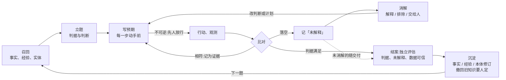

# ClearAI 0.5 meta 设计:认识论循环与本体/实体图

2026-10-07 定稿(在线版:https://claude.ai/code/artifact/d2981d2b-6c5f-49df-82fa-bdb45577f01d)。0.5 的目标:可信、价值可验证的 DSH 本体论插件。

## 设计公理

一句话:**认识论循环是核心 loop,它是双向的:一边用本体和实体图去分析、探索(给出预期,指出该看什么),一边把探索的结果经检验后写回,构建可信的本体。预期落空是这个 loop 里学得最快的一环。** 后面每个定义都从下面六条推出,推不出的就不要。

1. **只有能改变下一步的才算知识。** 卡片上、本体里的每一项,都要能说出它在哪个决策点改变什么。
2. **预期先于观测,落空处学得最快。** 没有事先写下的预期,就无从判断观测是不是反常,模型只会事后解释。所以预期必须显式、先于观测。
3. **类型与实例分层。** 本体说「这类东西通常怎样」,实体图说「这一个具体的东西是什么、连着谁、发生过什么」。经验多半长在实例上。
4. **可信靠检验,不靠写下。** 进本体的每条知识都标明来源与检验程度,有锚、有边界、可撤回。本体里的关系也一样,它本身就是一种可错的信念。
5. **自判不可信的地方才设门。** 只有两道:独立评估(结论站不站得住、还有什么没解释),人(不可逆动作、撤回旧知识)。其余只推给模型看,不拦。
6. **最小。** 每种对象只留推理用得到的字段;新增一种对象,就要说清它替掉了哪一种。

## 认识论循环

七个环节。前半段(召回到写预期)是「用本体」,后半段(结案到沉淀)是「建本体」,两段在「比对」处相交:每一步的结果都拿去和事先写下的预期对。相符就记为证据继续;落空就进入「未解释」,不许解释过去。

1. **召回**:系统按任务里提到的实体和概念,把相关的事实、经验和实体历史推到眼前。这一步由系统主动给。
2. **立题**:写问题、成功判据、待检验的判断(各带推翻条件),并声明哪些动作不可逆。
3. **写预期**:每一步动手前写下预计看到什么,以及预期从哪里来(一条关系、一条经验、一条判断,或明说是直觉)。
4. **行动、观测**:不可逆的动作先过人放行(第一道门)。
5. **比对与消解**:未解释项只有三个去处:被一条判断或关系解释(常常意味着改判断、改计划或修订本体)、写明理由排除、交给人。
6. **结案**:独立评估(第二道门)查三件事:判据是否满足、剩下的未解释项是否影响结论、数据本身是否可信。
7. **沉淀**:独立评估支持的判断升为事实;结案时提炼经验;本体和实体图按这次学到的修订。撤回或保留被推翻的旧知识要人定(第三道门)。

## 认识对象

七种。前五种只活在一次任务里,后两种跨任务存活,这是积累发生的地方。

| 对象 | 定义 | 必须写 | 状态 | 谁写 |
| --- | --- | --- | --- | --- |
| 问题 | 这次要决定的事 | 成功判据;不可逆动作清单 | 开放 / 达成 / 放弃 | 模型 |
| 判断 | 一个可能错的主张 | 主张;推翻条件;锚(实体或概念) | 待检 / 被支持 / 被推翻 / 被取代 | 模型 |
| 预期 | 某一步动手前对结果的预测 | 预测;来源(关系 / 经验 / 判断 / 直觉) | 待对 / 相符 / 落空 | 模型 |
| 观测 | 一步拿到的原始结果 | 文件;一句说明;测的是哪个实体 | 不可变 | 模型,系统存摘要 |
| 未解释 | 和预期或本体对不上的观测(认识论里的「反常」) | 哪里不符;锚(实体);可能的现象 | 开放 / 已解释 / 已排除 / 交给人 | 模型或评估者 |
| 事实 | 独立评估支持过的判断 | 主张;边界;锚;定义指纹 | 有效 / 受质疑 / 已撤回 | 系统(升格时) |
| 经验 | 下次要留意什么 | 一句教训;类别;锚;证据;边界 | 有效 / 已撤回 | 模型提议,评估者核 |

- **事实与经验的区别。** 事实改变信念(「A5/B2.1 寿命约 1700 圈」),经验改变注意力和做法(「有拐点的体系里快测外推不可信」)。经验分四类:坑、要核的读数、会骗人的捷径、先验。
- **预期可以是直觉。** 允许写「来源:直觉」,但要写出来。目的是让落空可见。
- **等级只留三档。** 自判、独立评估、人放行。旧的 L0–L2 读取时映射成自判,不迁移。
- **未解释不阻塞结案。** 但它必须随交付交给评估者,由评估者判它会不会动摇结论。

## 本体(类型层)

本体回答「这类东西是什么、通常怎么表现」。三种概念、四种关系。

**概念**

| 种类 | 是什么 | 必须写 | 改变什么 |
| --- | --- | --- | --- |
| 类别 | 一类东西(小试反应器、热电偶、电解液配方) | 释义;上位(目录嵌套) | 实体归类后,这类东西的关系和经验就能推到它的实例上 |
| 度量 | 一个可测、可算的量(收率、寿命、温度) | 定义(怎么算或怎么测);单位;可控还是结果 | 定义一变,用到它的事实就标「定义已变」 |
| 现象 | 一种会反复出现、能辨认的模式(传感器漂移、寿命拐点、过拟合) | 释义;识别特征(在哪些度量上长什么样) | 未解释项能对上一个现象,就有了现成的解释和查法 |

**关系**

| 种类 | 连接 | 必须写 | 改变什么 |
| --- | --- | --- | --- |
| 影响 | 度量 → 度量 | 方向与形状(升 / 降 / 有峰 / 阈值 / 交互);适用范围 | 预期的主要来源 |
| 定义 | 度量 → 度量 | 公式 | 算错、口径不一时能被查出 |
| 测量 | 类别(仪器) → 度量 | 测什么;有无参考读数;已知会出的现象 | 决定一个读数该不该信、拿什么核 |
| 表现为 | 现象 → 度量 | 在这个度量上的特征 | 把一个异常归到一个现象 |

结构关系(是一种、是一部分)仍用目录嵌套表达。

**可信度。** 每条概念和关系都带来源(文献 / 观测 / 假定)和检验程度(复用事实的三档:假定即未检、自判、独立评估)。只有被一条事实支撑的关系才算「可信」。关系被推翻时,走和事实同一条撤回链路。

## 实体图(实例层)

实体图回答「这一个具体的东西是什么、连着谁、发生过什么」,是跨任务积累的主要载体。

| 内容 | 是什么 | 例子 |
| --- | --- | --- |
| 身份 | id、名称、实例于哪个类别 | TC-1,实例于「热电偶」 |
| 固有属性 | 不随实验变的量 | 量程、精度、批号 |
| 连接 | 和其他实体的关系 | 是 R-1 的一部分;测 R-1 的温度 |
| 历史 | 带日期的事件,不删只加 | 第 25 次小试起读数偏高;校准过一次 |
| 挂着的知识 | 以它为锚的事实、经验、未解释项 | 「TC-1 第 25 次后读数比真温高 8 °C,关键实验用 TR-1 核」 |

实体只在有知识要挂、或有观测要定位时才建。样品和单次实验属于观测,不是实体。

## 三者怎么咬合

**锚定规则**

- 判断、事实、经验至少锚一个实体或概念;锚不上的不会在以后被推送。
- 预期必须写来源;来源是关系或经验时引用它的 id。
- 观测和未解释项锚在「在哪里测的」实体上。
- 事实和经验的边界用本体里的度量和范围写;定义一变,就能自动查出哪些知识要复核。

**在决策点推什么**

| 决策点 | 系统推给模型 | 想改变的行为 |
| --- | --- | --- |
| 立题 | 任务里提到的实体和概念上挂的事实、经验、历史;涉及仪器的已知现象 | 从已知出发,不重新踩坑 |
| 写预期 | 这一步涉及的度量之间的影响关系(标可信度)和相关经验 | 预期有根据,也知道哪些根据不稳 |
| 交付一步 | 预期与实际的对照;未解释项;特征对得上的现象 | 不把异常解释过去 |
| 结案 | 开着的未解释项与已排除项的理由(交给评估者) | 结论不建在没核的数据上 |
| 沉淀 | 待升格的判断、待写的经验、待修订的关系 | 这次学到的东西写回本体 |

**写回的方向**

- 判断经独立评估支持 → 升为事实;如果它说的是一种影响,对应关系的检验程度也随之提升。
- 未解释项被解释 → 通常新增或收窄一条关系,或新增一个现象;在实体历史里记一笔。
- 关系被推翻 → 问人撤回还是收窄范围,依赖它的事实标「受质疑」。

## 与现状的差异

| 变化 | 内容 |
| --- | --- |
| 保留 | concepts / relations / entities 文件树与目录嵌套;断言;事实、边界、定义指纹、retests;独立评估与副本复跑;人放行 |
| 新增 | 概念的种类(类别 / 度量 / 现象);度量必填定义和单位;关系的种类与形状;来源与检验程度;步骤的预期;未解释项;经验(clear/knowledge/lessons/);实体历史;不可逆动作的 Bash 拦截 |
| 删掉 | 对手判断;弱检验提示;L0–L2 细分(合并为自判);卡片上的本体提纲与计数 |
| 改变职责 | 评估者:从「报告和数据一致吗」扩到「还有什么没解释、数据可信吗」;技能:只管「怎么做」,「要留意什么」归经验 |

**已定(2026-10-07)**

- 经验要经独立评估才生效。
- 预期可选,卡片提示;用验证结果决定要不要升为必填。
- 本体的可信度复用事实的三档等级。
