# ClearAI State Machines

> These diagrams are **exported from the code**, not copied out of design documents. State names come
> from `applyMutation` and `derive()` in `ui/lib/fold.js`; event names are the `mutation.t` values the
> kernel actually writes.
> Each section states its delivery status: `implemented` / `partial` / `design goal`.
> The matching mechanism entries live in [`truth-table.md`](truth-table.md).

## 0. Three reading conventions

1. **State is derived, not stored.** Apart from a few explicitly named stored fields (such as
   `step.status`), state is computed by `derive()`.
2. **One edge, one event.** The `event` on an edge is exactly the `mutation.t` the kernel writes and
   can be matched line by line against the `switch` in `fold.js`.
3. **Downgrades are inexpressible.** `step` and `branch` both carry a rank (`RANK` / `BRANCH_RANK`)
   that only increases, so the diagrams contain no "back" edge.

---

## 1. Goal · implemented

Stored: `state.goal.{status, revision, closeVerdict}`.

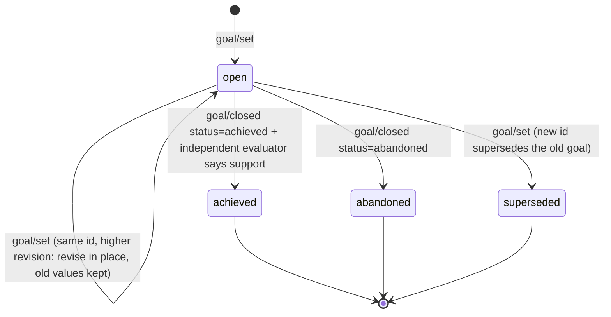

Notes:

- `achieved` requires `ClosePlan` first: the kernel refuses to close a goal while a plan is open.
- `abandoned` is an honest giving-up, not failure cleanup — the record stays.
- Revision only bumps `revision` and appends to `reasons[]`; nothing is deleted.

## 2. Plan · implemented

Stored: `state.plans[].{status, blocked, confirmed_at, confirmed_by}`.

```mermaid
stateDiagram-v2
    [*] --> active: plan/created
    active --> active: plan/amended (add a step; progress unchanged)
    active --> active: plan/refined (change criteria; progress unchanged)
    active --> blocked_by_step: plan/blocked + block/counted
    blocked_by_step --> active: block/cleared
    active --> closed: plan/closed (archive)
    blocked_by_step --> closed: plan/closed
    closed --> [*]
```

The authorization stamp has two sources and one back-fill:

| Stamp | Source | Code |
|---|---|---|
| `confirmed_by='user'` | native review card returns approved | `kernel.js:2780-2782` |
| `confirmed_by='progress'` | back-filled when a step is delivered | `kernel.js:3034-3038` |
| `confirmed_by='autonomy'` | **removed** (the old unattended auto-confirm) | — |

**Authorization is not a hard block**: an unauthorized plan only makes auto continuation `hold`
(`kernel.js:1898`); `AdvancePlan` still runs and back-fills the stamp under "behaviour is
authorization". The diagram therefore has no "unauthorized → delivery refused" edge — that edge does
not exist.

## 3. Step · implemented

Stored: `state.plans[].steps[].status`; rank `RANK = { open: 0, blocked: 0, advanced: 1, void: 1 }`.

```mermaid
stateDiagram-v2
    [*] --> open: plan/created (appendSteps)
    open --> advanced: step/advanced (the only completion verb; admission must pass first)
    open --> void: plan/voided (voided with a reason)
    open --> blocked: plan/blocked (consecutive-block threshold reached)
    blocked --> open: block/cleared
    advanced --> [*]
    void --> [*]
```

Rank semantics: `advanced` and `void` share rank 1 and never overwrite each other; `open` and
`blocked` share rank 0. `settle()` writes only when the target rank is not lower than the current
one, so **a downgrade is inexpressible on the write side**.

Ordering invariant: delivery may only land on the first unsettled step, otherwise `out_of_order`.

## 4. Hypothesis · implemented

Stored: `state.hypotheses[].status` (`proposed` / `superseded`), plus `alive` / `refuted` computed by
`derive()`.

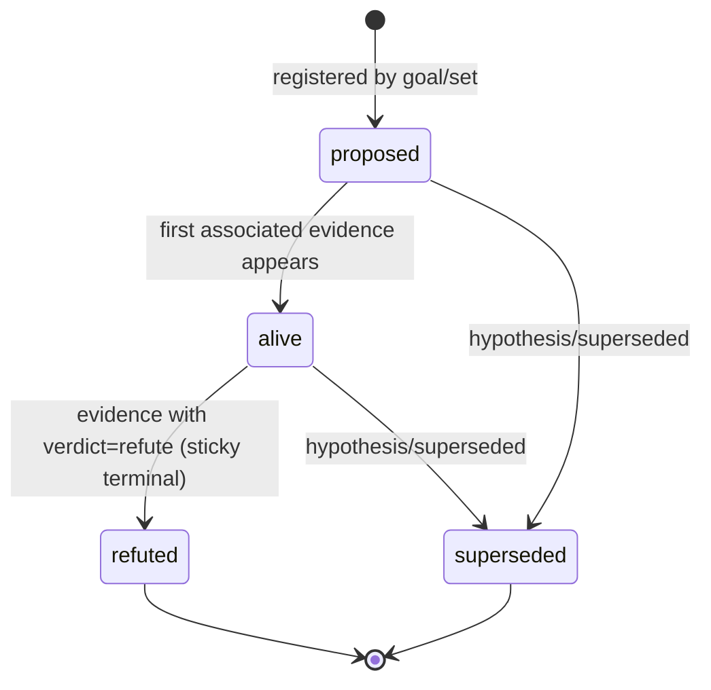

Three stickiness rules, all in `fold.js`:

- `refuted` is not rewritten to `superseded` by a later list that omits it (`fold.js:272-277`).
- A hypothesis already promoted to fact cannot be quietly replaced either (same `promoted` test).
- `supportedLevel` is the maximum computed by `derive()`, never stored.

## 5. Observation · implemented

Stored: `state.materials[]`, append-only.

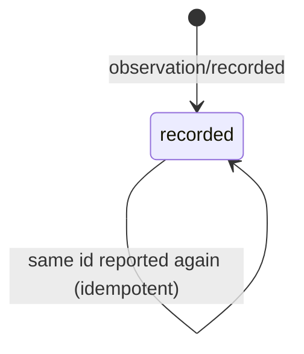

An observation has **no rejected state**: rejection is not a state but "this `AdvancePlan` did not
pass the gate", recorded in `block/counted`.

## 6. Evaluation (audit) · implemented

Stored: `state.audits[].verdict` (`null` means in flight).

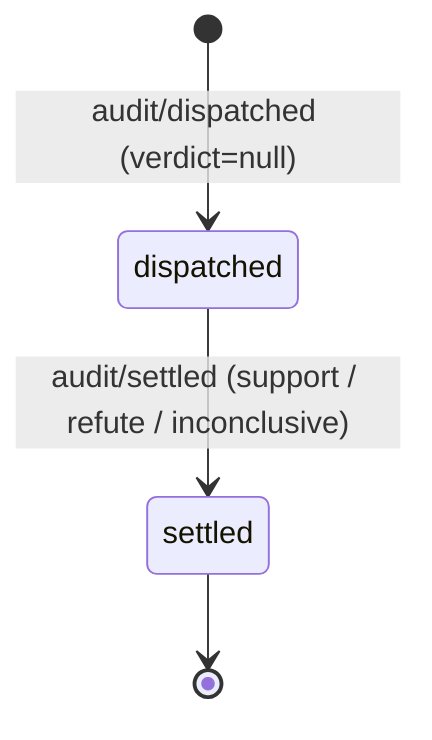

`derive().pendingAudit` is true when any entry has `verdict === null` → phase `auditing`, continuation
`hold`. Lost audits are settled by `sweepLostAudits`, which explicitly lets that beat through
(`kernel.js:1904`).

## 7. Evidence · implemented

Stored: `state.evidence[]`, append-only.

```mermaid
stateDiagram-v2
    [*] --> recorded: evidence/recorded
    recorded --> recorded: supersedes (new evidence marks it; the old row stays)
```

Evidence carries `origins[]` (four kinds of provenance) and `basis_reviewable`.

## 8. Fact · implemented

Stored: `state.facts[]` plus `clear/knowledge/facts/<goal>.md`.

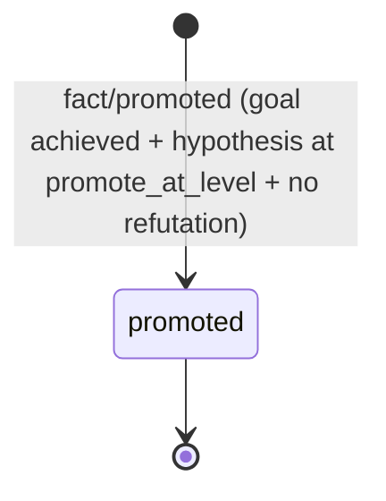

`retracted` exists in the verification ontology but **has no producer today** — it is a design goal and
is deliberately absent from this diagram.

## 9. Worldlines (fork / branch) · implemented

Stored: `state.forks[]`; branch rank `BRANCH_RANK = { exploring: 0, evaluated: 1, adopted: 2, pruned: 2 }`.

```mermaid
stateDiagram-v2
    state "fork" as F {
        [*] --> exploring_f: fork/created
        exploring_f --> exploring_f: worldline/prepared / executing / executed / branch_delivered
        exploring_f --> deciding: every branch rank >= evaluated
        deciding --> deciding: fork/recommended (arithmetic names a favourite; a fact only, no state change)
        deciding --> settled: fork/converged (arithmetic yields a unique winner)
        deciding --> undecidable: fork/undecidable (arithmetic cannot decide)
        undecidable --> undecidable: fork/arbitrated (the arbitration verdict lands, but settled is NOT set)
        undecidable --> settled: fork/converged (the kernel re-decides from the verdict, then converges)
        exploring_f --> orphaned: the owning step was plan/voided
        exploring_f --> abandoned: fork/abandoned
        settled --> [*]
        abandoned --> [*]
        orphaned --> [*]
    }
    note right of deciding
      Adoption is still a human act (adopt_branch).
      Arithmetic ranks; it does not decide.
    end note
```

Three derived states that are "not losses" (`fold.js:961-996`, all zero new ledger):

| Derived | Meaning |
|---|---|
| `failed` | The executor reported `ok:false` — the world gave it no chance; it was not ranked out |
| `orphaned` | Its owning step was voided — it ends when the commitment is withdrawn, not by a human call or by arithmetic |
| `unreturned` | The fork settled and the executor never reported — that line has no destination left |

**Merging at adoption** (after `adopt_branch`) is a separate group of events; they record whether the
winner's files really came back into the workspace:

| Event | Meaning |
|---|---|
| `fork/merged` | Merge succeeded (or already up to date) |
| `fork/merge_skipped` | No merge, but **the adoption is still recorded** (branch ref or working copy gone) |
| `fork/merge_conflict` | Merge conflicted; recorded honestly and left to an ordinary delivery |
| `worldline/removed` | The working copy was dropped — **the branch ref is kept**, because a later reversal depends on it staying readable |

`worldline/executing` and `worldline/executed` are the two facts of an executor round trip: the first
says it was dispatched, the second says it came back (`ok: true/false`). `fork/arbitration_dispatched`
and `fork/arbitrated` are the round trip of cross-evaluation arbitration.

## 10. Auto continuation · implemented

This is a **harness scheduling state**, not an epistemic one. Stored:
`state.continuation.state`.

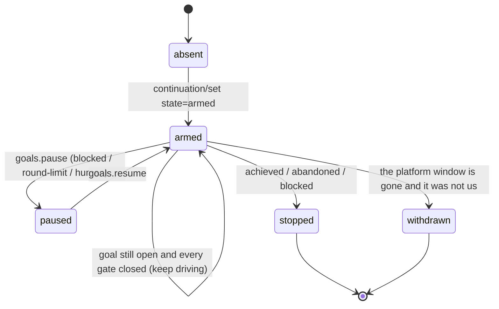

`turnDemand`'s decision order (`kernel.js:1892-1917`, **top down, first hit wins**):

```text
1. plan blocked                     -> stop
2. plan active but unauthorized      -> hold
3. an audit in flight (verdict=null) -> hold
4. inbox non-empty (a gate is open)  -> hold
5. any open step                     -> drive
6. goal still open                   -> drive
7. otherwise                         -> hold
```

The key fact: **autonomy does not appear in this chain.** The two tiers now differ only in the
clarification section and the deployment initial value. The default budget
`DEFAULT_MAX_AUTO_TURNS = 128` takes effect at the arming site (`kernel.js:2001`).

---

## 11. Scout · implemented

Stored: `state.scouts[]`. Sub-roles are derived by the system on a trigger, never freely delegated by
the model.

```mermaid
stateDiagram-v2
    [*] --> dispatched: scout/dispatched (trigger records why it was dispatched)
    dispatched --> settled: scout/settled (the conclusion enters the material face)
    settled --> settled: same id reported again (idempotent; this is how the long soak avoided loss)
```

Notes:

- A conclusion is re-published only while the **projection** has not landed it — the criterion is the
  projection, not an in-memory "reported" flag. The retry cadence is the turn boundary, so there is no
  interval knob.
- `scout/settled` with the same id is idempotent in fold; a repeat never grows a second fact.
- The scout tool face is read-only (`scoutToolFilter`), and `MapScouts` is bounded by `mapScoutMax` /
  `mapScoutConcurrency`.

## 12. Event coverage table

**Every** mutation kind fold understands is assigned a home below; conversely, every event named in
this document is in fold's vocabulary. The `ledger-only` group never folds into the view (they are
ledger facts), so it appears in no state machine:

- `git/committed`: the commit a **delivery** lands in the ledger (`AdvancePlan` / worldline adoption).
- `git/snapshot`: a workspace snapshot at a **turn boundary** (only when this session wrote something
  and the workspace is genuinely dirty), plus the pre-merge snapshot. Its job is not attribution —
  the kernel cannot see what bash wrote — but **coverage**: exploration output produced before any
  plan is in the ledger too, so it can be inspected and restored.
- `git/restored`: a `RestoreFile` restore (a restore is a new version plus a new commit, never a rollback).
- `admission/checked`: the admission reading of each delivery (what is accepted also lands an `observation/recorded`).

| Event | Home | Folds into the view |
|---|---|---|
| `goal/set` | §1 Goal | yes |
| `goal/closed` | §1 Goal | yes |
| `hypothesis/superseded` | §4 Hypothesis | yes |
| `plan/created` | §2 Plan | yes |
| `plan/confirmed` | §2 Plan | yes |
| `plan/amended` | §2 Plan | yes |
| `plan/refined` | §2 Plan | yes |
| `plan/voided` | §3 Step | yes |
| `plan/closed` | §2 Plan | yes |
| `plan/blocked` | §2 Plan / §3 Step | yes |
| `block/counted` | §2 Plan | yes |
| `block/cleared` | §2 Plan | yes |
| `step/advanced` | §3 Step | yes |
| `observation/recorded` | §5 Observation | yes |
| `audit/dispatched` | §6 Evaluation | yes |
| `audit/settled` | §6 Evaluation | yes |
| `evidence/recorded` | §7 Evidence | yes |
| `fact/promoted` | §8 Fact | yes |
| `human/released` | §3 Step (L4 release) | yes |
| `worldline/prepared` | §9 Worldlines | yes |
| `worldline/executing` | §9 Worldlines | yes |
| `worldline/executed` | §9 Worldlines | yes |
| `worldline/removed` | §9 Worldlines | yes |
| `branch/delivered` | §9 Worldlines | yes |
| `fact/reviewed` | §4 Hypothesis (human review: retract / keep) | yes |
| `fork/recommended` | §9 Worldlines | yes |
| `fork/created` | §9 Worldlines | yes |
| `fork/converged` | §9 Worldlines | yes |
| `fork/undecidable` | §9 Worldlines | yes |
| `fork/arbitration_dispatched` | §9 Worldlines | yes |
| `fork/arbitrated` | §9 Worldlines | yes |
| `fork/abandoned` | §9 Worldlines | yes |
| `fork/merged` | §9 Worldlines | yes |
| `fork/merge_skipped` | §9 Worldlines | yes |
| `fork/merge_conflict` | §9 Worldlines | yes |
| `scout/dispatched` | §11 Scout | yes |
| `scout/settled` | §11 Scout | yes |
| `continuation/set` | §10 Auto continuation | yes |
| `admission/checked` | **ledger only** | no |
| `git/committed` | **ledger only** | no |
| `git/restored` | **ledger only** | no |
| `git/snapshot` | **ledger only** | no |

## 13. Relationship to the verification ontology

`docs/verification-loop.md` describes a **more complete** verification ontology (an eight-state
machine, among other things). The difference matters when reading:

| This file | Verification ontology |
|---|---|
| Transitions the code really takes today | The complete declared shape |
| Every state has a producer | Some states have none yet (e.g. `retracted`) |
| Answers "what is actually guaranteed now" | Answers "what this design intends to become" |

Confirmed differences are tracked in [`../known-gaps.md`](../known-gaps.md).
