# ClearAI State Machines

> These diagrams are **exported from the code**, not copied out of design documents. State names come
> from `applyMutation` and `derive()` in `ui/lib/fold.js`; event names are the `mutation.t` values the
> kernel actually writes.
> Each section states its delivery status: `implemented` / `partial` / `design goal`.
> The matching mechanism entries live in [`truth-table.md`](truth-table.md).

## 0. Three reading conventions

1. **State is derived, not stored.** Apart from a few explicitly named stored fields (such as
   `step.status`), state is computed by `derive()`.
2. **One edge, one event.** The `event` on an edge is exactly the `mutation.t` the kernel writes and
   can be matched line by line against the `switch` in `fold.js`.
3. **Downgrades are inexpressible.** `step` and `branch` both carry a rank (`RANK` / `BRANCH_RANK`)
   that only increases, so the diagrams contain no "back" edge.

---

## 1. Goal · implemented

Stored: `state.goal.{status, revision, closeVerdict}`.

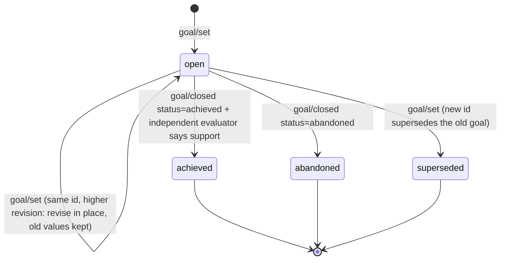
```mermaid
stateDiagram-v2
    [*] --> open: goal/set
    open --> open: goal/set (same id, higher revision: revise in place, old values kept)
    open --> superseded: goal/set (new id supersedes the old goal)
    open --> achieved: goal/closed status=achieved + independent evaluator says support
    open --> abandoned: goal/closed status=abandoned
    achieved --> [*]
    abandoned --> [*]
    superseded --> [*]
```

Notes:

- `achieved` requires `ClosePlan` first: the kernel refuses to close a goal while a plan is open.
- `abandoned` is an honest giving-up, not failure cleanup — the record stays.
- Revision only bumps `revision` and appends to `reasons[]`; nothing is deleted.
- Changing what counts as done is its own event: `criteria/revised` folds into `goal.criteriaHistory[]` (carrying the
  independent `audit` key). It does **not** rewrite the `done_criteria` text (that travels the commit/revision path),
  so a criterion change stays traceable; this is the key `SetGoal`'s `criteria_verdict` asks for.

## 2. Plan · implemented

Stored: `state.plans[].{status, blocked, confirmed_at, confirmed_by}`.

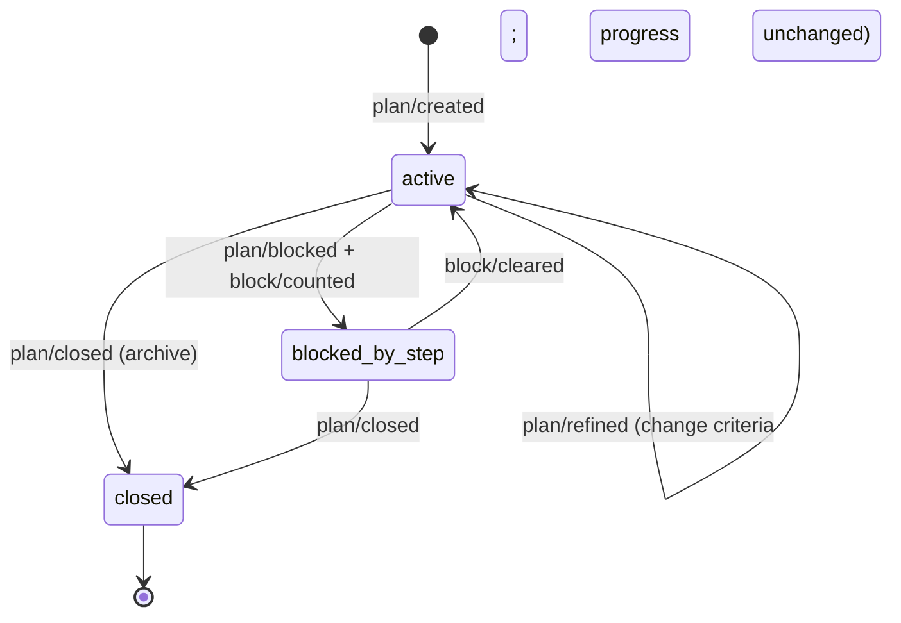
```mermaid
stateDiagram-v2
    [*] --> active: plan/created
    active --> active: plan/confirmed (first authorization wins, idempotent)
    active --> active: plan/amended (add a step; progress unchanged)
    active --> active: plan/refined (change criteria; progress unchanged)
    active --> blocked_by_step: plan/blocked + block/counted
    blocked_by_step --> active: block/cleared
    active --> closed: plan/closed (archive)
    blocked_by_step --> closed: plan/closed
    closed --> [*]
```

The authorization stamp has two sources and one back-fill:

| Stamp | Source | Code |
|---|---|---|
| `confirmed_by='user'` | native review card returns approved | `kernel.js:2780-2782` |
| `confirmed_by='progress'` | back-filled when a step is delivered | `kernel.js:3034-3038` |
| `confirmed_by='autonomy'` | **removed** (the old unattended auto-confirm) | — |

**Authorization is not a hard block**: an unauthorized plan only makes auto continuation `hold`
(`kernel.js:1898`); `AdvancePlan` still runs and back-fills the stamp under "behaviour is
authorization". The diagram therefore has no "unauthorized → delivery refused" edge — that edge does
not exist.

## 3. Step · implemented

Stored: `state.plans[].steps[].status`; rank `RANK = { open: 0, blocked: 0, advanced: 1, void: 1 }`.

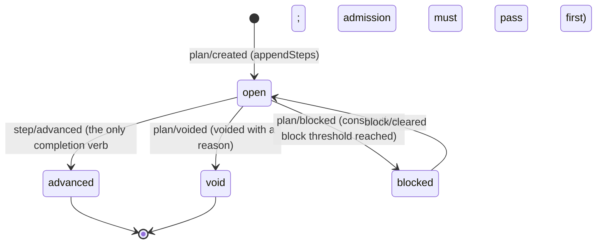
```mermaid
stateDiagram-v2
    [*] --> open: plan/created (appendSteps)
    open --> advanced: step/advanced (the only completion verb; admission must pass first)
    open --> void: plan/voided (voided with a reason)
    open --> blocked: plan/blocked (consecutive-block threshold reached)
    blocked --> open: block/cleared
    advanced --> [*]
    void --> [*]
```

Rank semantics: `advanced` and `void` share rank 1 and never overwrite each other; `open` and
`blocked` share rank 0. `settle()` writes only when the target rank is not lower than the current
one, so **a downgrade is inexpressible on the write side**.

Ordering invariant: delivery may only land on the first unsettled step, otherwise `out_of_order`.

## 4. Hypothesis · implemented

Stored: `state.hypotheses[].status` (`proposed` / `superseded`), plus `alive` / `refuted` computed by
`derive()`.

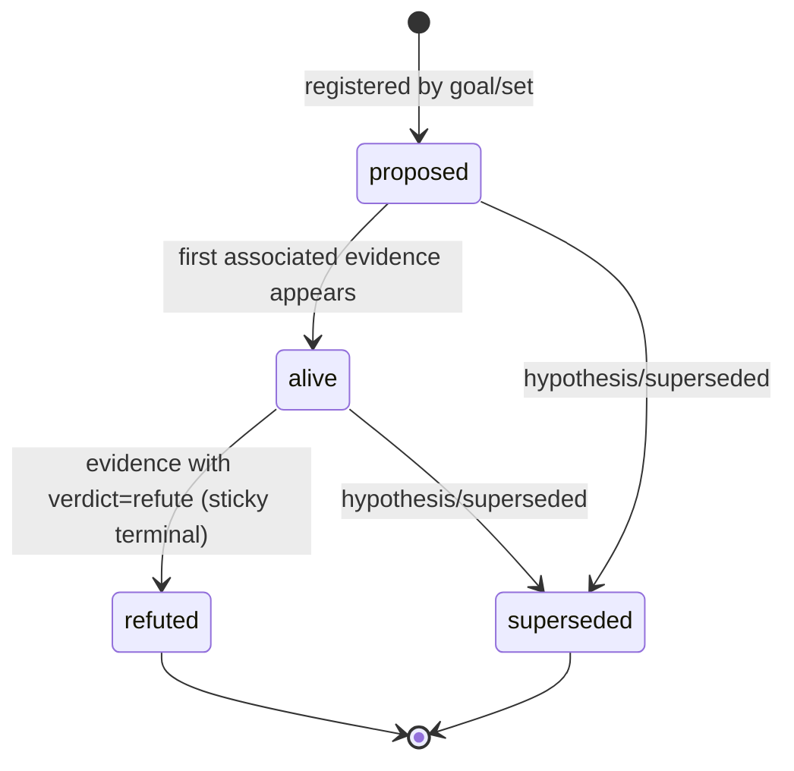
```mermaid
stateDiagram-v2
    [*] --> proposed: registered by goal/set
    proposed --> alive: first associated evidence appears
    alive --> refuted: evidence with verdict=refute (sticky terminal)
    proposed --> superseded: hypothesis/superseded
    alive --> superseded: hypothesis/superseded
    refuted --> [*]
    superseded --> [*]
```

Three stickiness rules, all in `fold.js`:

- `refuted` is not rewritten to `superseded` by a later list that omits it (`fold.js:396-411`).
- A hypothesis already promoted to fact cannot be quietly replaced either (same `promoted` test).
- `supportedLevel` is the maximum computed by `derive()`, never stored.
- A level-skip reason, `level/skipped`, folds into `hypotheses[].skips[]`: `derive()` subtracts the levels a reason
  covers from `untouchedLevels`, so writing the reason really does clear the `levels_skipped` gap — it is that gap's
  way out, not something ignored.

## 5. Observation · implemented

Stored: `state.materials[]`, append-only.

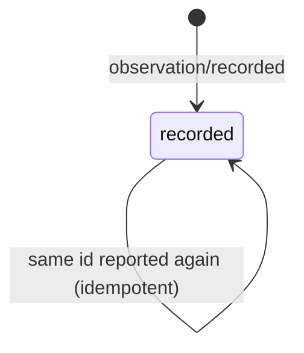
```mermaid
stateDiagram-v2
    [*] --> recorded: observation/recorded
    recorded --> recorded: same id reported again (idempotent)
```

An observation has **no rejected state**: rejection is not a state but "this `AdvancePlan` did not
pass the gate", recorded in `block/counted`.

## 6. Evaluation (audit) · implemented

Stored: `state.audits[].verdict` (`null` means in flight).

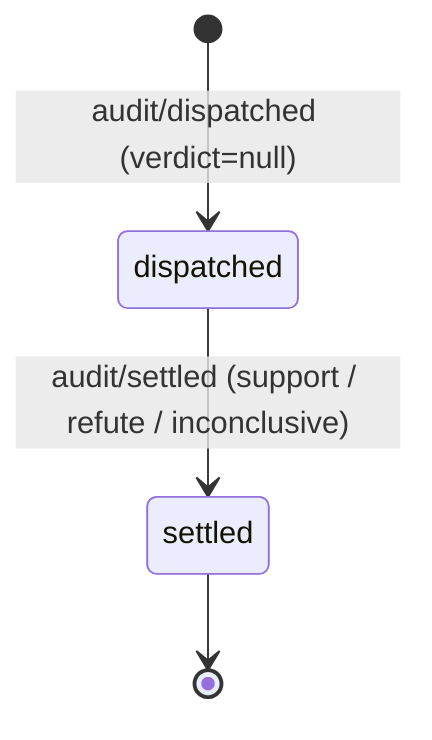
```mermaid
stateDiagram-v2
    [*] --> dispatched: audit/dispatched (verdict=null)
    dispatched --> settled: audit/settled (support / refute / inconclusive)
    settled --> [*]
```

`derive().pendingAudit` is true when any entry has `verdict === null` → phase `auditing`, continuation
`hold`. Lost audits are settled by `sweepLostAudits`, which explicitly lets that beat through
Homomorphic reuse lands an `audit/reused` entry: its `verdict` is `reused`, which is **not** part of the
`support | refute | inconclusive` decision and does not take the `null` "in flight" sentinel — so a step that reused
an older verdict never leaves the system waiting.
(`kernel.js:1904`).

## 7. Evidence · implemented

Stored: `state.evidence[]`, append-only.

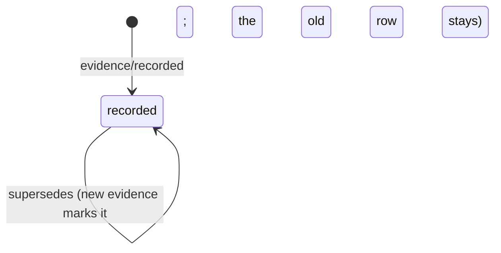
```mermaid
stateDiagram-v2
    [*] --> recorded: evidence/recorded
    recorded --> recorded: supersedes (new evidence marks it; the old row stays)
```

Evidence carries `origins[]` (four kinds of provenance) and `basis_reviewable`.

## 8. Fact · implemented

Stored: `state.facts[]` plus `clear/knowledge/facts/<goal>.md`.

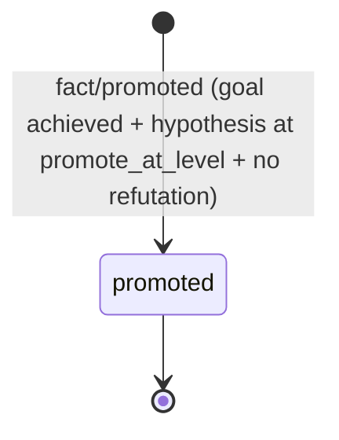
```mermaid
stateDiagram-v2
    [*] --> promoted: fact/promoted (goal achieved + hypothesis at promote_at_level + no refutation)
    promoted --> [*]
```

`retracted` **is deliberately absent from this diagram because it is not a stored state**: refuting
evidence only *marks* the fact (`refuted`, derived), and a person decides to **retract** or to **keep** it —
both outcomes land as one `fact/reviewed` (a retraction is terminal; the record is kept), and the projection
reads it back out of `fact.review` as a derived state. The producers are `retract_fact` / `keep_fact` in
`HUMAN_GATE_ACTIONS` and `markFactReviewed` in the kernel; the truth-table row is `fact-retraction` (implemented).

## 9. Worldlines (fork / branch) · removed

Worldlines were removed in phase 2 of the "less is more" rebuild: parallel exploration goes to native subagents, and competing routes are competing hypotheses, each tested by a step. `fork/*`, `worldline/*` and `branch/*` events in old logs are unknown and skipped as-is.


## 10. Auto continuation · implemented

This is a **harness scheduling state**, not an epistemic one. Stored:
`state.continuation.state`.

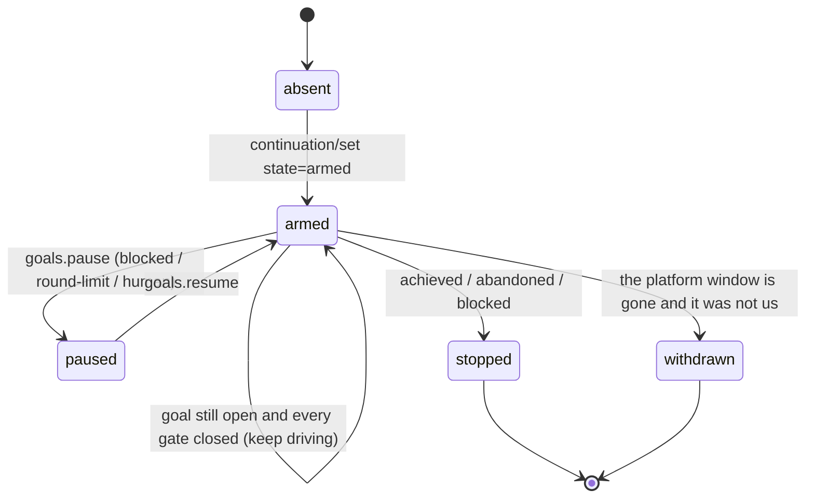
```mermaid
stateDiagram-v2
    [*] --> absent
    absent --> armed: continuation/set state=armed
    armed --> armed: goal still open and every gate closed (keep driving)
    armed --> paused: goals.pause (blocked / round-limit / human)
    paused --> armed: goals.resume
    armed --> stopped: achieved / abandoned / blocked
    armed --> withdrawn: the platform window is gone and it was not us
    stopped --> [*]
    withdrawn --> [*]
```

`turnDemand`'s decision order (`kernel.js:1892-1917`, **top down, first hit wins**):

```text
1. plan blocked                     -> stop
2. plan active but unauthorized      -> hold
3. an audit in flight (verdict=null) -> hold
4. inbox non-empty (a gate is open)  -> hold
5. any open step                     -> drive
6. goal still open                   -> drive
7. otherwise                         -> hold
```

The key fact: **autonomy does not appear in this chain.** The two tiers now differ only in the
clarification section and the deployment initial value. The default budget
`DEFAULT_MAX_AUTO_TURNS = 128` takes effect at the arming site (`kernel.js:2001`).

---

## 11. Scout · removed

Scouts were removed in phase 2 of the "less is more" rebuild: for parallel research the model uses the native `subagent`. `scout/*` events in old logs are unknown and skipped as-is.


## 12. Domain lexicon · implemented

Stored field: `state.lexicon.{terms[], predicates[]}` — the shape folded out of the ontology events in the ledger.

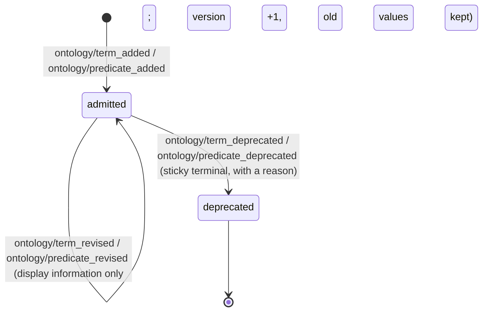
```mermaid
stateDiagram-v2
    [*] --> admitted: ontology/term_added / ontology/predicate_added
    admitted --> admitted: ontology/term_revised / ontology/predicate_revised (display information only; version +1, old values kept)
    admitted --> deprecated: ontology/term_deprecated / ontology/predicate_deprecated (sticky terminal, with a reason)
    deprecated --> [*]
```

Points:

- **The two ontologies are two fields with two kinds of authority**: `state.ontology` is the shape of the **process ontology** (the plugin's own backend flow — release-scoped, not editable at runtime); `state.lexicon` is the **domain ontology** (the project's own language: concepts, predicates, value forms), governed by ledger events.
- **There is no delete**: deprecation only flips an entry to `deprecated`; the entry, its old versions and every fact that referenced it stay (the same rule as "a refuted hypothesis is kept").
- **A semantic change does not go through revision**: if meaning, domain, range or single-valuedness changes, deprecate and register a new id. The meaning of a stable id may not drift through history, or old facts get rewritten by today's gloss.
- Assertions and conflicts are **not in this diagram**: assertions land on facts with `fact/promoted`; conflicts are computed by `derive()` (single-valued predicate + same subject + different objects + neither side retracted) and are surfaced, never adjudicated.

### Interaction: the ontology layer and the process layer never advance each other

- **Vocabulary events advance no process object**, and process events never change the vocabulary — the two state machines do not nest, and the only directional relation between them is **reference** (an assertion references predicates and concepts). The four handshake points are in [Domain ontology §8](../domain-ontology.md).
- **An assertion lands only at promotion** (`hypothesis` and `assertions` on `fact/promoted`); a conflict is a reading computed by `derive()` — **not a state, and it enters no gate**.
- **Every read surface is a rendering**: `clear/ontology/domain.md`, `clear/knowledge/facts/INDEX.md`, the runtime card, the panel's ontology graph — one fold, no second account.

## 13. Entities and assertions · implemented

Storage fields: `state.entities[]`, `state.entityAssertions[]` — **a first-class write path for the
entity layer**, stored separately from promoted facts (`state.facts[].assertions`) and merged only in
the projection.

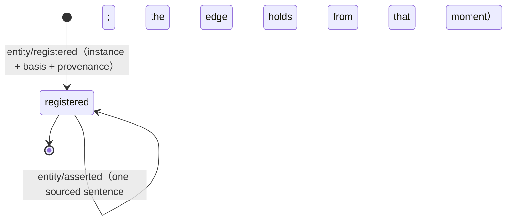
```mermaid
stateDiagram-v2
    [*] --> registered: entity/registered（instance + basis + provenance）
    registered --> registered: entity/asserted（one sourced sentence; the edge holds from that moment）
    registered --> [*]
```

Points:

- **Convention and observation are separate**: `RegisterTerm` is a convention (a concept; no evidence
  required), `RegisterInstance` is an observation (an instance; `basis` and `provenance` required), and
  `Assert` says one sourced thing about a registered instance (`evidence` required).
- **Entities do not wait for the goal verdict**: `entity/asserted` produces an edge at the moment it is
  recorded. The fact path is unchanged (independent verdict → `fact/promoted`), and the projection
  carries both kinds: `source='promoted'` with level and scope, `source='asserted'` with provenance and
  no independent verdict.
- **The subject must be identifiable**: an assertion subject has to be a registered instance
  (`assert_subject_unknown` in `validateAssertions`); otherwise every word is readable and nothing is
  checkable.
- **Promotion still attaches its assertions to the same entity** (deduped by `${type}|${id}`): the two
  sources **merge**, they are not alternatives.

## 14. Host read faces (degradation is a fact too) · implemented

Storage field: `state.hostHealth[]` (append-only, capped at 20).

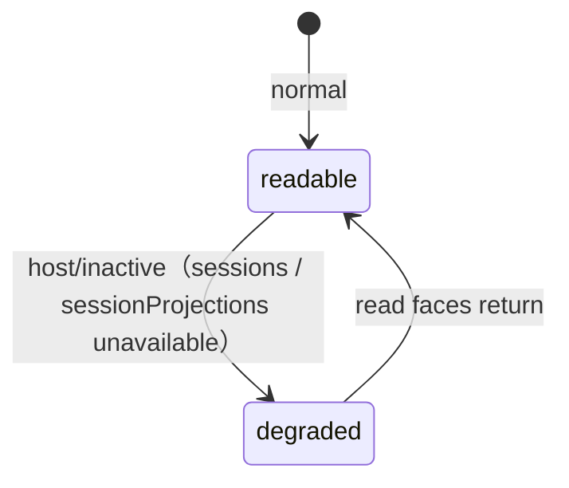
```mermaid
stateDiagram-v2
    [*] --> readable: normal
    readable --> degraded: host/inactive（sessions / sessionProjections unavailable）
    degraded --> readable: read faces return
```

Points:

- When a service is unavailable the read face **returns empty state instead of throwing**, and records
  `host/inactive`: "cannot read right now" and "there is nothing" are two different things, and the
  former belongs in the ledger.
- When the session working directory is unavailable it **does not write** (no fallback to
  `process.cwd()`): failing to write is an honest degradation, writing somewhere else quietly moves the
  ledger.

## 15. Event coverage table

**Every** mutation kind fold understands is assigned a home below; conversely, every event named in
this document is in fold's vocabulary. The `ledger-only` group never folds into the view (they are
ledger facts), so it appears in no state machine:

- `admission/checked`: the admission reading of each delivery (what is accepted also lands an `observation/recorded`).

| Event | Home | Folds into the view |
|---|---|---|
| `goal/set` | §1 Goal | yes |
| `goal/closed` | §1 Goal | yes |
| `hypothesis/superseded` | §4 Hypothesis | yes |
| `plan/created` | §2 Plan | yes |
| `plan/confirmed` | §2 Plan | yes |
| `plan/amended` | §2 Plan | yes |
| `plan/refined` | §2 Plan | yes |
| `plan/voided` | §3 Step | yes |
| `plan/closed` | §2 Plan | yes |
| `plan/blocked` | §2 Plan / §3 Step | yes |
| `block/counted` | §2 Plan | yes |
| `block/cleared` | §2 Plan | yes |
| `step/advanced` | §3 Step | yes |
| `observation/recorded` | §5 Observation | yes |
| `audit/dispatched` | §6 Evaluation | yes |
| `audit/settled` | §6 Evaluation | yes |
| `evidence/recorded` | §7 Evidence | yes |
| `fact/promoted` | §8 Fact | yes |
| `human/released` | §3 Step (L4 release) | yes |
| `fact/reviewed` | §4 Hypothesis (human review: retract / keep) | yes |
| `continuation/set` | §10 Auto continuation | yes |
| `ontology/term_added` | §12 Domain lexicon | yes |
| `ontology/predicate_added` | §12 Domain lexicon | yes |
| `ontology/term_revised` | §12 Domain lexicon | yes |
| `ontology/predicate_revised` | §12 Domain lexicon | yes |
| `ontology/term_deprecated` | §12 Domain lexicon | yes |
| `ontology/predicate_deprecated` | §12 Domain lexicon | yes |
| `entity/registered` | §13 Entities and assertions | yes |
| `entity/asserted` | §13 Entities and assertions | yes |
| `audit/reused` | §6 Evaluation | yes |
| `level/skipped` | §4 Hypotheses (skip reason) | yes |
| `criteria/revised` | §1 Goal (criterion revision) | yes |
| `host/inactive` | §14 Host read faces | yes |
| `admission/checked` | **ledger only** | no |

## 16. Relationship to the verification ontology

`docs/verification-loop.md` describes a **more complete** verification ontology (an eight-state
machine, among other things). The difference matters when reading:

| This file | Verification ontology |
|---|---|
| Transitions the code really takes today | The complete declared shape |
| Every state in use has a producer (including `retracted`, landed by human review) | The designed shape still has states without producers (several cells of the eight-state machine; see [known-gaps](../known-gaps.md)) |
| Answers "what is actually guaranteed now" | Answers "what this design intends to become" |

Confirmed differences are tracked in [`../known-gaps.md`](../known-gaps.md).
