# ClearAI State Machines

> These diagrams are **exported from the code**, not copied out of design documents. State names come
> from `applyMutation` and `derive()` in `ui/lib/fold.js`; event names are the `mutation.t` values the
> kernel actually writes.
> Each section states its delivery status: `implemented` / `partial` / `design goal`.
> The matching mechanism entries live in [`truth-table.md`](truth-table.md).

## 0. Three reading conventions

1. **State is derived, not stored.** Apart from a few explicitly named stored fields (such as
   `step.status`), state is computed by `derive()`.
2. **One edge, one event.** The `event` on an edge is exactly the `mutation.t` the kernel writes and
   can be matched line by line against the `switch` in `fold.js`.
3. **Downgrades are inexpressible.** `step` carries a rank (`RANK`)
   that only increases, so the diagrams contain no "back" edge.

---

## 1. Goal · implemented

Stored: `state.goal.{status, revision, closeVerdict}`.

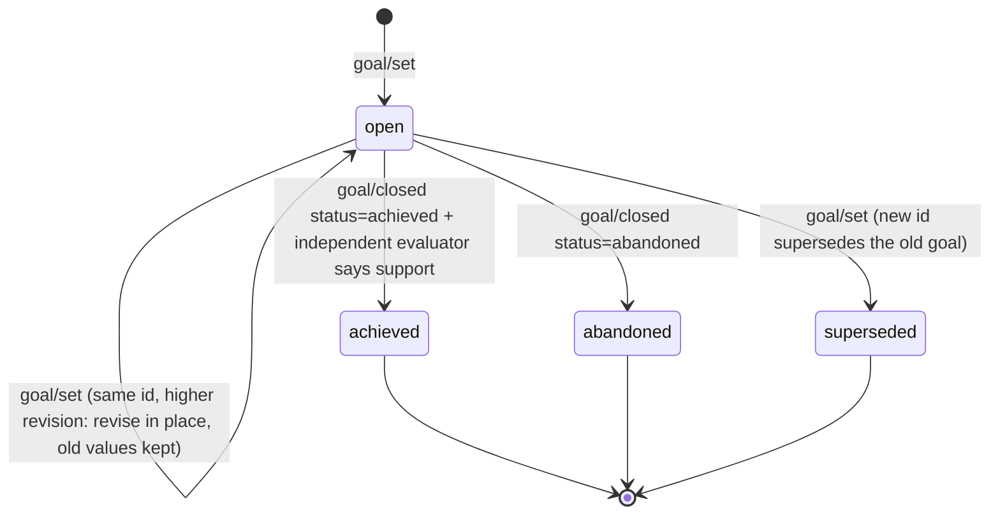
```mermaid
stateDiagram-v2
    [*] --> open: goal/set
    open --> open: goal/set (same id, higher revision: revise in place, old values kept)
    open --> superseded: goal/set (new id supersedes the old goal)
    open --> achieved: goal/closed status=achieved + independent evaluator says support
    open --> abandoned: goal/closed status=abandoned
    achieved --> [*]
    abandoned --> [*]
    superseded --> [*]
```

Notes:

- The goal is framed with `Frame` and closed with `Conclude`. `Frame` also creates (or edits) a goal on the host's native goal service, which drives continuation.
- `achieved` requires `ClosePlan` first: the kernel refuses to close a goal while a plan is open. `achieved` ⇒ the native goal
  completes and the deliverables are declared; `abandoned` ⇒ the native goal is blocked (`clearai-goal-abandoned`). A native
  `update_goal` that tries to complete the goal directly is denied by a guard whose reason points to `Conclude`.
- `abandoned` is an honest giving-up, not failure cleanup — the record stays.
- Revision only bumps `revision` and appends to `reasons[]`; nothing is deleted.
- Changing what counts as done is its own event: `criteria/revised` folds into `goal.criteriaHistory[]` (carrying the
  independent `audit` key). It does **not** rewrite the `done_criteria` text (that travels the commit/revision path),
  so a criterion change stays traceable; this is the key `Frame`'s `criteria_verdict` asks for.

## 2. Plan · implemented

Stored: `state.plans[].{status, blocked}`.

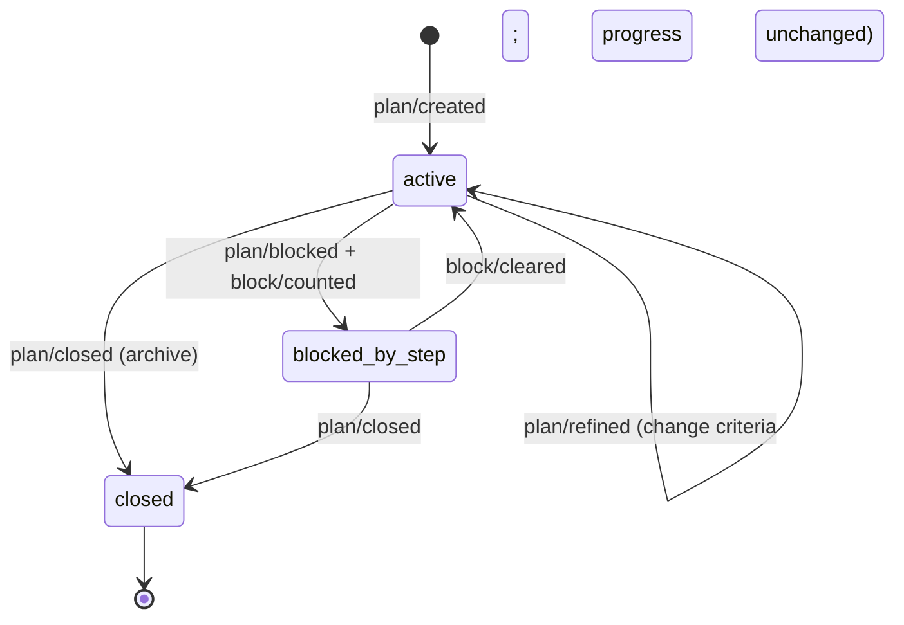
```mermaid
stateDiagram-v2
    [*] --> active: plan/created
    active --> active: plan/amended (add a step; progress unchanged)
    active --> active: plan/refined (change criteria; progress unchanged)
    active --> blocked_by_step: plan/blocked + block/counted
    blocked_by_step --> active: block/cleared
    active --> closed: plan/closed (archive)
    blocked_by_step --> closed: plan/closed
    closed --> [*]
```

Plans carry no authorization stamp.
To show a person the plan before acting, use the native `/plan`.

The call that sets `blocked` **asks the person on the spot** (`userQuestions`): "revise against the gaps" ⇒ `block/cleared`;
"void this step" ⇒ `plan/voided` + `block/cleared`; nobody can answer ⇒ the plan stays `blocked` and the native goal is
blocked (`clearai-needs-human`).

## 3. Step · implemented

Stored: `state.plans[].steps[].status`; rank `RANK = { open: 0, blocked: 0, advanced: 1, void: 1 }`.

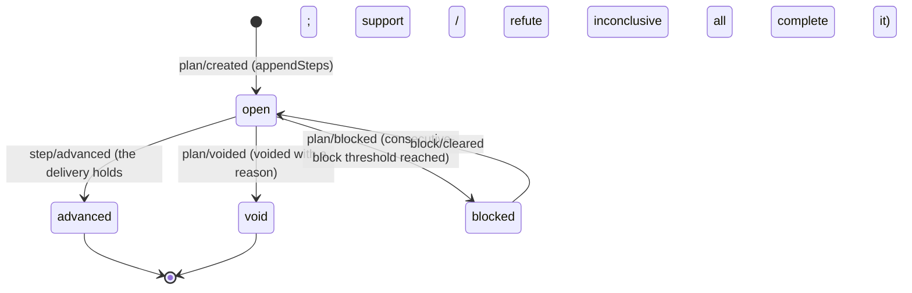
```mermaid
stateDiagram-v2
    [*] --> open: plan/created (appendSteps)
    open --> advanced: step/advanced (the delivery holds; support / refute / inconclusive all complete it)
    open --> void: plan/voided (voided with a reason)
    open --> blocked: plan/blocked (consecutive-block threshold reached)
    blocked --> open: block/cleared
    advanced --> [*]
    void --> [*]
```

Rank semantics: `advanced` and `void` share rank 1 and never overwrite each other; `open` and
`blocked` share rank 0. `settle()` writes only when the target rank is not lower than the current
one, so **a downgrade is inexpressible on the write side**.

Ordering invariant: delivery may only land on the first unsettled step, otherwise `out_of_order`.

**Completion is separate from result**: `step/advanced` only says the delivery holds; each result on a hypothesis lands as its
own `evidence/recorded` (carrying `hypothesis`). One step may test several hypotheses (`tests.hypotheses`), one result each.
Only a delivery that does not hold (`holds` no / unclear) fails to advance, and counts one block.

## 4. Hypothesis · implemented

Stored: `state.hypotheses[].status` (`proposed` / `superseded`), plus `alive` / `refuted` computed by
`derive()`.

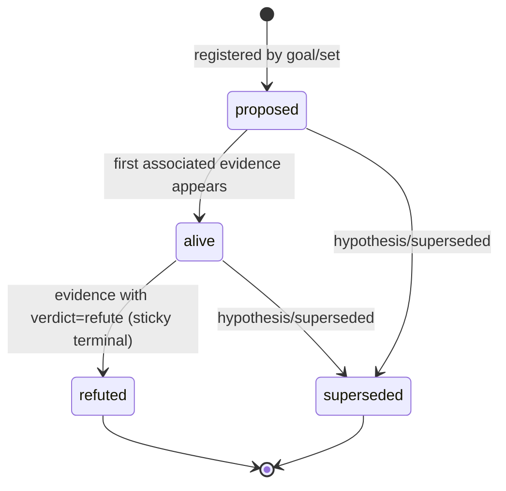
```mermaid
stateDiagram-v2
    [*] --> proposed: registered by goal/set
    proposed --> alive: first associated evidence appears
    alive --> refuted: evidence with verdict=refute (sticky terminal)
    proposed --> superseded: hypothesis/superseded
    alive --> superseded: hypothesis/superseded
    refuted --> [*]
    superseded --> [*]
```

Three stickiness rules, all in `fold.js`:

- `refuted` is not rewritten to `superseded` by a later list that omits it (`fold.js:396-411`).
- A hypothesis already promoted to fact cannot be quietly replaced either (same `promoted` test).
- `supportedLevel` is the maximum computed by `derive()`, never stored.
- Levels only decide who judges; there is no level-skip check. `derive()` marks each hypothesis with `unlanded` (assertion subjects that are not instance nodes on the
  entity graph); the `entities_unlanded` gap and the Conclude entity gate both read it.

## 5. Observation · implemented

Stored: `state.materials[]`, append-only.

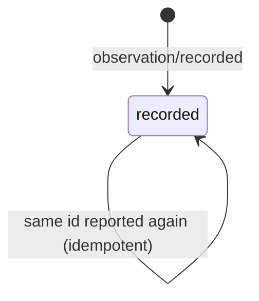
```mermaid
stateDiagram-v2
    [*] --> recorded: observation/recorded
    recorded --> recorded: same id reported again (idempotent)
```

An observation has **no rejected state**: rejection is not a state but "this `AdvancePlan` did not
pass the gate", recorded in `block/counted`.

## 6. Evaluation (audit) · implemented

Stored: `state.audits[].{verdict, holds, results}` (`verdict === null` means in flight).

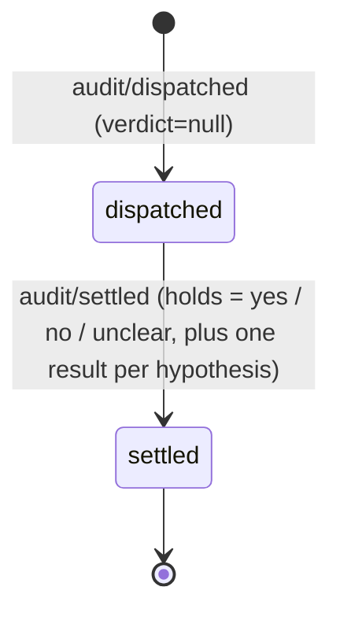
```mermaid
stateDiagram-v2
    [*] --> dispatched: audit/dispatched (verdict=null)
    dispatched --> settled: audit/settled (holds = yes / no / unclear, plus one result per hypothesis)
    settled --> [*]
```

The evaluator gives two judgments: does the delivery hold (`holds`), and the result on each tested hypothesis (`results[]`:
support / refute / inconclusive). `derive().pendingAudit` is true when any entry has `verdict === null` → phase `auditing`,
and the card says it is waiting for a verdict. Homomorphic reuse lands an `audit/reused` entry: its `verdict` is `reused`,
which is **not** part of the `holds` decision and does not take the `null` "in flight" sentinel — so a step that reused an
older verdict never leaves the system waiting. Lost audits are settled by `sweepLostAudits`.

## 7. Evidence · implemented

Stored: `state.evidence[]`, append-only.

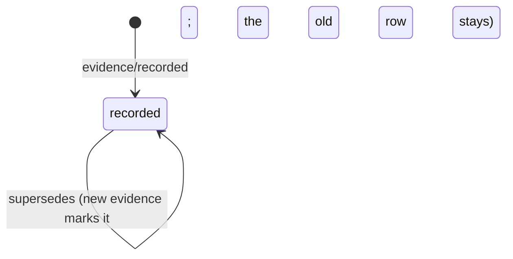
```mermaid
stateDiagram-v2
    [*] --> recorded: evidence/recorded
    recorded --> recorded: supersedes (new evidence marks it; the old row stays)
```

Evidence carries `hypothesis` (which hypothesis it bears on), `verdict` (support / refute / inconclusive), `origins[]` (four kinds of provenance) and `basis_reviewable`.

## 8. Fact · implemented

Stored: `state.facts[]` plus `clear/knowledge/facts/<fact id>.json` (one file per fact, written only by the system).

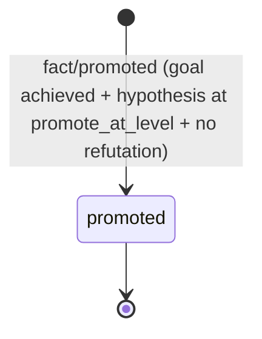
```mermaid
stateDiagram-v2
    [*] --> promoted: fact/promoted (goal achieved + hypothesis at promote_at_level + no refutation)
    promoted --> [*]
```

`retracted` **is deliberately absent from this diagram because it is not a stored state**: refuting
evidence only *marks* the fact (`refuted`, derived), and the delivery that records it **asks the person on the spot** to
**retract** or to **keep** it — both outcomes land as one `fact/reviewed` (a retraction is terminal; the record is kept), and
the projection reads it back out of `fact.review` as a derived state. The producers are `reviewRefutedFacts` /
`markFactReviewed` in the kernel; if nobody can answer, the fact stays marked for review and the native goal is blocked.
`retract_fact` / `keep_fact` gate messages in old logs still fold. The truth-table row is `fact-retraction` (implemented).

**Across sessions**: fact files live in the project. On every step each session folds the changes under
`clear/knowledge/facts/` and `clear/ontology/` into one `workspace/synced` (kept in `state.workspace.files`), and the
derived fact rows also list facts other sessions left behind (`foreign`). A fact file records the meaning fingerprint
of every term it used at promotion (`definitions`); if a definition changes later, the derived `definitionsChanged`
is non-empty and the pending list gains "a definition changed; does this conclusion still hold?". It only flags; it
never retracts.

## 9. Auto continuation · handed to the native goal

Continuation belongs to the host's native goal; ClearAI touches it in three places only:

| When | What happens to the native goal |
|---|---|
| `Frame` | create one (clearing a completed one first), or edit its objective |
| `Conclude` achieved / abandoned | complete / block (`clearai-goal-abandoned`) |
| a person is needed and nobody can answer (stuck plan, L4 release, refuted fact) | block (`clearai-needs-human`) |

---

## 10. Domain lexicon · implemented

Stored field: `state.lexicon.{terms[], predicates[]}`.

Vocabulary and entities **come from files**: the `workspace/synced` fold derives `lexicon` / `entities` / `entityAssertions` / `ontologyProblems` from the JSON file tree under `clear/ontology/` with `materializeOntology` (see §8). There is no tool that registers terms and no event that writes them; the `ontology/*` and `entity/*` branches in `fold.js` are the in-memory shape of that projection.

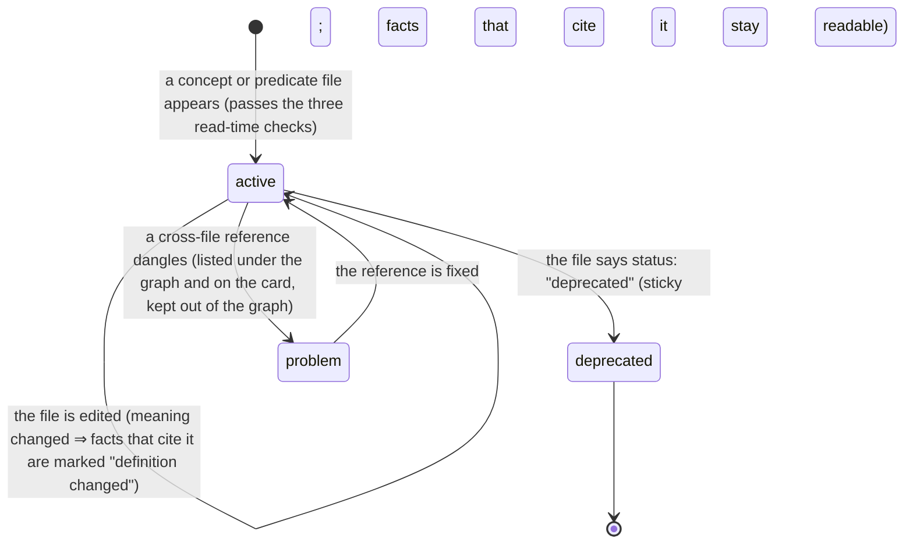
```mermaid
stateDiagram-v2
    [*] --> active: a concept or predicate file appears (passes the three read-time checks)
    active --> active: the file is edited (meaning changed ⇒ facts that cite it are marked "definition changed")
    active --> deprecated: the file says status: "deprecated" (sticky; facts that cite it stay readable)
    active --> problem: a cross-file reference dangles (listed under the graph and on the card, kept out of the graph)
    problem --> active: the reference is fixed
    deprecated --> [*]
```

Points:

- **The two ontologies are two fields with two kinds of authority**: `state.ontology` is the shape of the **process ontology** (the plugin's own backend flow — release-scoped, not editable at runtime); `state.lexicon` is the **domain ontology** (the project's own language: concepts, predicates, value forms), decided by the files in the workspace.
- **Deprecation is not deletion**: deprecating only marks an entry `deprecated`; facts that cited it stay readable (the same rule as "a refuted hypothesis is kept").
- **Meaning changes are caught by fingerprints**: a fact records the definition fingerprints it used at promotion; if a definition changes, the fact gains "definition changed" — a flag, never a retraction.
- Assertions and conflicts are **not in this diagram**: assertions land on facts with `fact/promoted`; conflicts are computed by `derive()` (single-valued predicate + same subject + different objects + neither side retracted) and are surfaced, never adjudicated.

### Interaction: the ontology layer and the process layer never advance each other

- **Ontology files advance no process object**, and process events never change the ontology files — the two state machines do not nest, and the only directional relation between them is **reference** (an assertion references predicates and concepts). The four handshake points are in [Domain ontology §8](../domain-ontology.md).
- **An assertion lands only at promotion** (`hypothesis` and `assertions` on `fact/promoted`); a conflict is a reading computed by `derive()` — **not a state, and it enters no gate**.
- **Every read surface is a rendering**: `clear/ontology/domain.md`, `clear/knowledge/facts/INDEX.md`, the runtime card, the panel's ontology graph — one fold, no second account.

## 11. Entities and assertions · implemented

Derived fields: `state.entities[]`, `state.entityAssertions[]` — read from the entity files, stored separately from promoted facts (`state.facts[].assertions`) and merged only in
the projection.

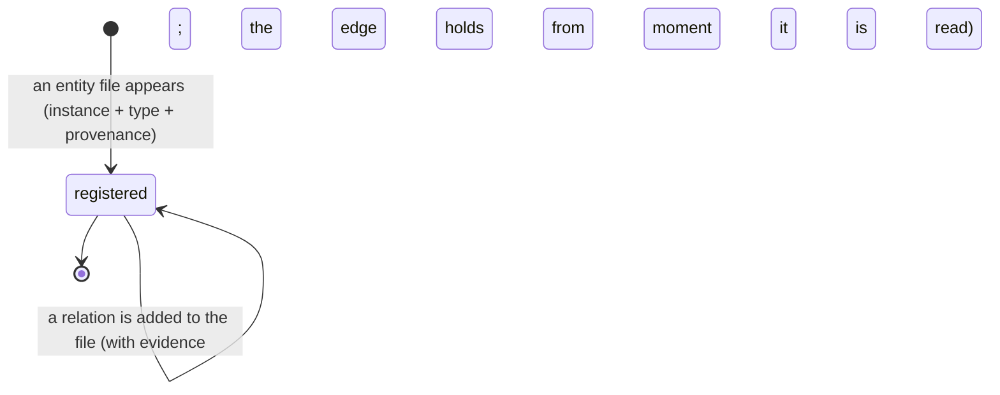
```mermaid
stateDiagram-v2
    [*] --> registered: an entity file appears (instance + type + provenance)
    registered --> registered: a relation is added to the file (with evidence; the edge holds from the moment it is read)
    registered --> [*]
```

Points:

- **Convention and observation are separate**: a concept file is a convention (no evidence required);
  an entity file is an observation, and each of its relations must carry `evidence`.
- **Entities do not wait for the goal verdict**: a relation in an entity file produces an edge at the moment it is
  read. The fact path is unchanged (independent verdict → `fact/promoted`), and the projection
  carries both kinds: `source='promoted'` with level and scope, `source='asserted'` with provenance and
  no independent verdict.
- **The subject must be identifiable**: an assertion subject has to be a registered instance
  (`assert_subject_unknown` in `validateAssertions`); otherwise every word is readable and nothing is
  checkable.
- **Promotion still attaches its assertions to the same entity** (deduped by `${type}|${id}`): the two
  sources **merge**, they are not alternatives.

## 12. Host read faces (degradation is a fact too) · implemented

Storage field: `state.hostHealth[]` (append-only, capped at 20).

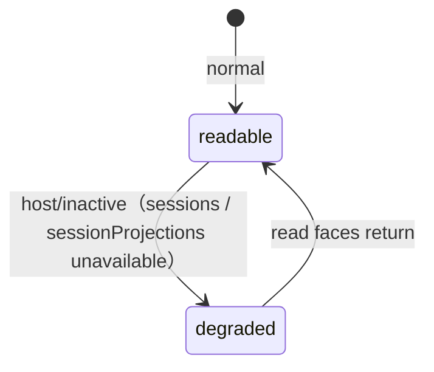
```mermaid
stateDiagram-v2
    [*] --> readable: normal
    readable --> degraded: host/inactive（sessions / sessionProjections unavailable）
    degraded --> readable: read faces return
```

Points:

- When a service is unavailable the read face **returns empty state instead of throwing**, and records
  `host/inactive`: "cannot read right now" and "there is nothing" are two different things, and the
  former belongs in the ledger.
- When the session working directory is unavailable it **does not write** (no fallback to
  `process.cwd()`): failing to write is an honest degradation, writing somewhere else quietly moves the
  ledger.

## 12b. Unexplained items (anomaly) · implemented

Stored fields: `state.anomalies[].{status, by, reason, explainedBy}`. What epistemology calls an anomaly: an observation that does not fit the expectation or the ontology.

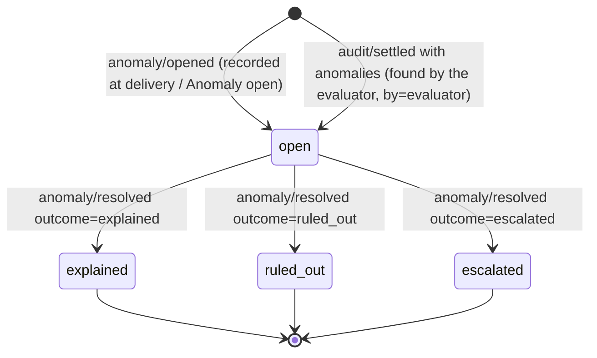
```mermaid
stateDiagram-v2
    [*] --> open: anomaly/opened (recorded at delivery / Anomaly open)
    [*] --> open: audit/settled with anomalies (found by the evaluator, by=evaluator)
    open --> explained: anomaly/resolved outcome=explained
    open --> ruled_out: anomaly/resolved outcome=ruled_out
    open --> escalated: anomaly/resolved outcome=escalated
    explained --> [*]
    ruled_out --> [*]
    escalated --> [*]
```

Notes:

- A step may carry an expectation (`expect`, landed with `plan/created` / `plan/amended`, or written before acting with `step/expected`). Where it misses, an unexplained item is recorded.
- Unexplained items do not block concluding; at close (and at every independent evaluation) they go to the evaluator with the delivery, and the evaluator checks the reasons for ruling any out.
- Each has one destination: a handled item cannot be handled again.
- `explained` may carry `defect: true` (the explanation is a measurement or method defect). Every item, open or handled, is also written as a negative item in `clear/knowledge/negatives/` as it happens (unresolved / explained / ruled out / escalated / defect), together with judgments refuted by evidence (excluded, or preliminarily excluded after a single self-test); items the evaluator judged irrelevant (`matters=no`) are not written.

## 12c. Lessons (lesson) · implemented

Stored fields: `state.lessons[].{kind, about, evidence, boundary, status}`; the file `clear/knowledge/lessons/<id>.json` wins over the ledger row.

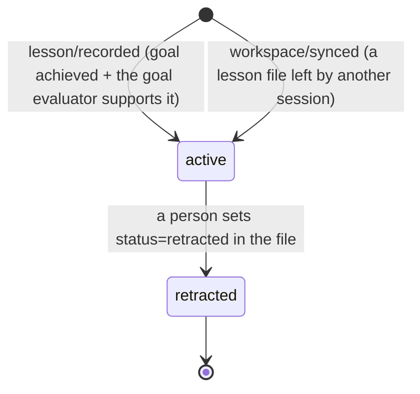
```mermaid
stateDiagram-v2
    [*] --> active: lesson/recorded (goal achieved + the goal evaluator supports it)
    [*] --> active: workspace/synced (a lesson file left by another session)
    active --> retracted: a person sets status=retracted in the file
    retracted --> [*]
```

Notes:

- Lessons are proposed only with `Conclude(outcome="achieved")`; the goal evaluator judges each against the record (`lessons` on its verdict). Refuted or inconclusive ones are listed in the receipt and not written. An abandoned goal writes none.
- A lesson changes how to work next time; a fact changes what is believed. The card shows lessons before framing, planning and writing an expectation; ones whose `about` matches the goal or the next step come first.

## 13. Event coverage table

**Every** mutation kind fold understands is assigned a home below; conversely, every event named in
this document is in fold's vocabulary. The `ledger-only` group never folds into the view (they are
ledger facts), so it appears in no state machine:

- `admission/checked`: the admission reading of each delivery (what is accepted also lands an `observation/recorded`).

| Event | Home | Folds into the view |
|---|---|---|
| `goal/set` | §1 Goal | yes |
| `goal/closed` | §1 Goal | yes |
| `hypothesis/superseded` | §4 Hypothesis | yes |
| `plan/created` | §2 Plan | yes |
| `plan/amended` | §2 Plan | yes |
| `plan/refined` | §2 Plan | yes |
| `plan/voided` | §3 Step | yes |
| `plan/closed` | §2 Plan | yes |
| `plan/blocked` | §2 Plan / §3 Step | yes |
| `block/counted` | §2 Plan | yes |
| `block/cleared` | §2 Plan | yes |
| `step/advanced` | §3 Step | yes |
| `observation/recorded` | §5 Observation | yes |
| `audit/dispatched` | §6 Evaluation | yes |
| `audit/settled` | §6 Evaluation | yes |
| `audit/notified` | §6 Audit: native result notification after caller detachment | Yes |
| `evidence/recorded` | §7 Evidence | yes |
| `fact/promoted` | §8 Fact | yes |
| `human/released` | §3 Step (L4 release) | yes |
| `fact/reviewed` | §8 Fact (human review: retract / keep) | yes |
| `fact/bounded` | §8 Fact (a test outside its scope: boundary recorded, the fact stays) | yes |
| `fact/questioned` | §8 Fact (a judgment that cited it was refuted within its scope: back to pending re-check, not retracted) | yes |
| `ontology/term_added` | §10 Domain lexicon | yes |
| `ontology/predicate_added` | §10 Domain lexicon | yes |
| `ontology/term_revised` | §10 Domain lexicon | yes |
| `ontology/predicate_revised` | §10 Domain lexicon | yes |
| `ontology/term_deprecated` | §10 Domain lexicon | yes |
| `ontology/predicate_deprecated` | §10 Domain lexicon | yes |
| `entity/registered` | §11 Entities and assertions | yes |
| `entity/asserted` | §11 Entities and assertions | yes |
| `audit/reused` | §6 Evaluation | yes |
| `criteria/revised` | §1 Goal (criterion revision) | yes |
| `host/inactive` | §12 Host read faces | yes |
| `workspace/synced` | §8 Fact (across sessions) | yes |
| `step/expected` | §3 Step (expectation) | yes |
| `anomaly/opened` | §12b Unexplained items | yes |
| `anomaly/resolved` | §12b Unexplained items | yes |
| `lesson/recorded` | §12c Lessons | yes |
| `admission/checked` | **ledger only** | no |

## 14. Relationship to the verification ontology

`docs/verification-loop.md` describes a **more complete** verification ontology (an eight-state
machine, among other things). The difference matters when reading:

| This file | Verification ontology |
|---|---|
| Transitions the code really takes today | The complete declared shape |
| Every state in use has a producer (including `retracted`, landed by human review) | The designed shape still has states without producers (several cells of the eight-state machine; see [known-gaps](../known-gaps.md)) |
| Answers "what is actually guaranteed now" | Answers "what this design intends to become" |

Confirmed differences are tracked in [`../known-gaps.md`](../known-gaps.md).
