# ClearAI 状态转移图

> 这些图**从代码导出**，不是从设计文档抄来。状态名来自 `ui/lib/fold.js` 的 `applyMutation`
> 与 `derive()`，事件名来自内核实际写下的 `mutation.t`。
> 每个图都标注实现状态：`已实现` / `部分实现` / `设计目标`。
> 与机制条目的对应关系见 [`truth-table.zh-CN.md`](truth-table.zh-CN.md)。

## 0. 三条读图约定

1. **状态是派生量，不是存储**。除少数明确标注的存储字段（如 `step.status`），状态由 `derive()` 现算。
2. **一条边一个事件**。图上标的 `event` 就是内核写的 `mutation.t`，可以在 `fold.js` 的 `switch` 里逐条对上。
3. **降级不可表示**。`step` 与 `branch` 都有秩（`RANK` / `BRANCH_RANK`），秩只增不减；
   图上因此不存在「退回」的边。

---

## 1. 目标（goal）· 已实现

存储字段：`state.goal.{status, revision, closeVerdict}`。

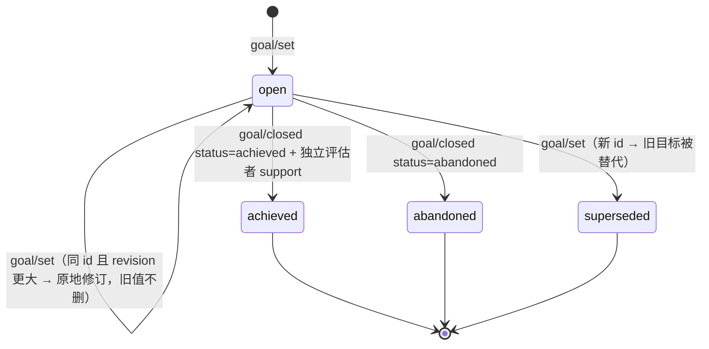

要点：

- `achieved` 之前必须先 `ClosePlan`：内核拒收「计划还开着」的结案。
- `abandoned` 是如实放弃，不是失败清洗——记录保留。
- 修订只增 `revision` 并追加 `reasons[]`，旧段不删。

## 2. 计划（plan）· 已实现

存储字段：`state.plans[].{status, blocked, confirmed_at, confirmed_by}`。

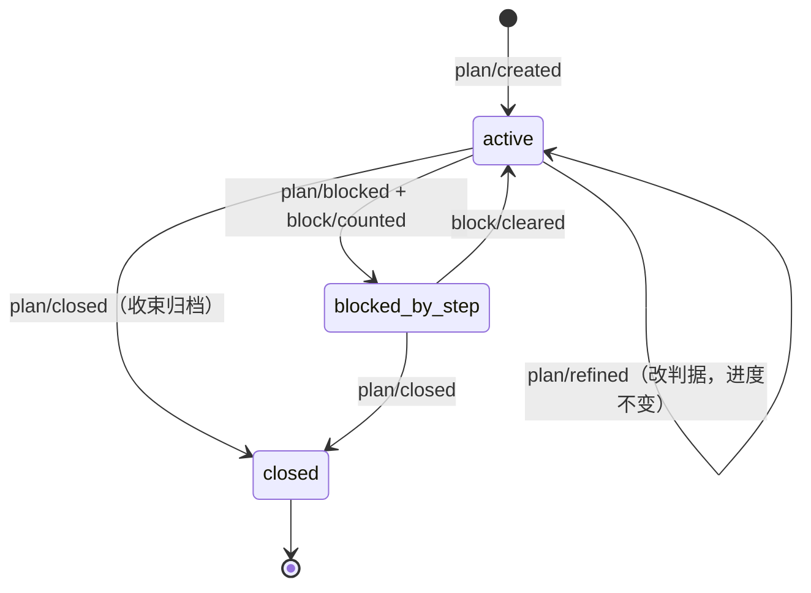

授权记号的两条来源与一条补写：

| 记号 | 来源 | 代码 |
|---|---|---|
| `confirmed_by='user'` | 原生审阅卡返回 approved | `kernel.js:2780-2782` |
| `confirmed_by='progress'` | 交付一步时补写 | `kernel.js:3034-3038` |
| `confirmed_by='autonomy'` | **已删除**（原无人值守自动确认） | — |

**授权不是硬阻断**：未授权的计划只让自动续跑 `hold`（`kernel.js:1898`），
`AdvancePlan` 本身照常执行并按「行为即授权」补写记号。图里因此不画「未授权 → 拒绝交付」的边——
那条边不存在。

## 3. 步骤（step）· 已实现

存储字段：`state.plans[].steps[].status`，秩 `RANK = { open: 0, blocked: 0, advanced: 1, void: 1 }`。

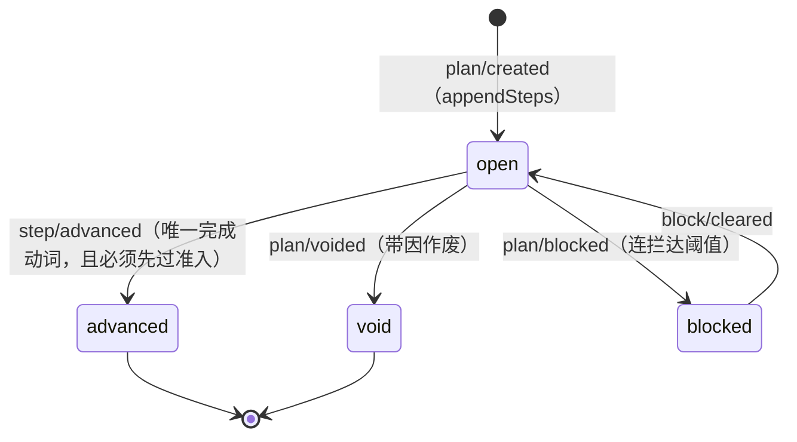

秩的含义：`advanced` 与 `void` 同为秩 1，两者互不覆盖；`open` 与 `blocked` 同为秩 0。
`settle()` 只在目标秩不低于当前秩时写入，所以**降级在写入侧不可表达**。

序位不变量：交付只能落在第一个未落定步，否则 `out_of_order`。

## 4. 假设（hypothesis）· 已实现

存储字段：`state.hypotheses[].status`（`proposed` / `superseded`）+ `derive()` 现算的 `alive` / `refuted`。

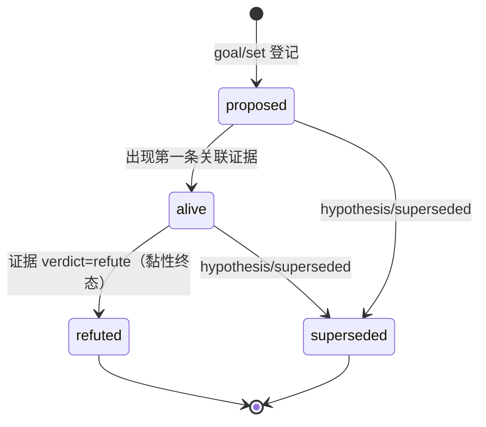

三个黏性规则（都在 `fold.js` 里）：

- `refuted` 不被后续「不在清单里」改写成 `superseded`（`fold.js:272-277`）。
- 已升格成事实的假设同样不许被悄悄替代（同一处 `promoted` 判断）。
- 支持等级 `supportedLevel` 是 `derive()` 现算的最大值，不存。

## 5. 观测（observation）· 已实现

存储字段：`state.materials[]`（只追加）。

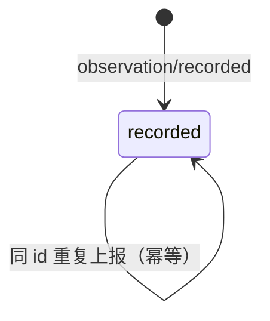

观测**没有拒绝态**：拒绝不是一条状态，而是「这次 `AdvancePlan` 没过闸」，记在 `block/counted` 里。

## 6. 评估（audit）· 已实现

存储字段：`state.audits[].verdict`（`null` 表示在飞）。

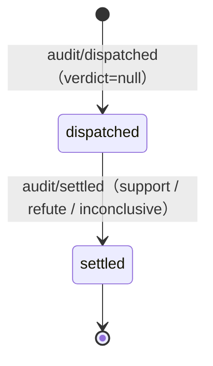

`derive().pendingAudit` = 存在 `verdict === null` 的条目 → 阶段为 `auditing`，续跑 `hold`。
失联裁决由 `sweepLostAudits` 收口，并把「这一拍刚判定失联」显式放行（`kernel.js:1904`）。

## 7. 证据（evidence）· 已实现

存储字段：`state.evidence[]`（只追加）。

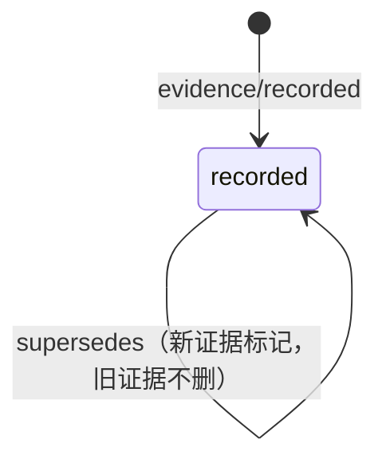

证据带 `origins[]`（四类出处）与 `basis_reviewable`。

## 8. 事实（fact）· 已实现

存储字段：`state.facts[]` + `clear/knowledge/facts/<goal>.md`。

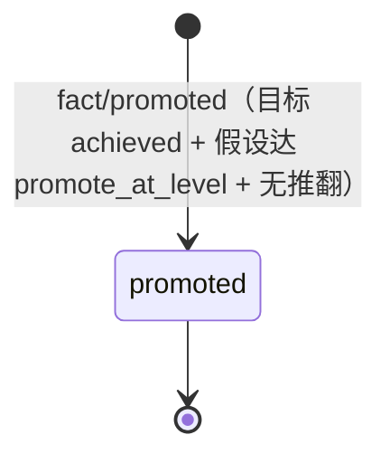

`retracted` 在验证本体里有定义，但**当前没有任何生产者**——属设计目标，不在本图里。

## 9. 世界线（fork / branch）· 已实现

存储字段：`state.forks[]`；分支秩 `BRANCH_RANK = { exploring: 0, evaluated: 1, adopted: 2, pruned: 2 }`。

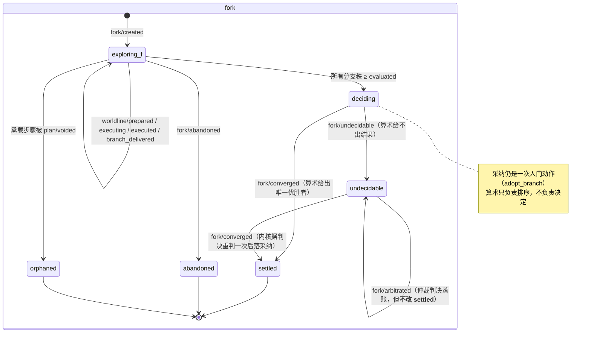

三条「不是落选」的派生状态（`fold.js:961-996`，全部零新账）：

| 派生 | 含义 |
|---|---|
| `failed` | 执行者报了 `ok:false`——世界没给它机会，不是被尺子排掉 |
| `orphaned` | 承载步骤被作废——随承诺撤回而终止，不是人裁的也不是算术排的 |
| `unreturned` | 分叉已收口而执行者没报过——那条线再回来也没有归宿了 |

**采纳时的合并**（`adopt_branch` 之后）是另一组事件，它们记的是「赢家的文件有没有真的回到工作区」：

| 事件 | 含义 |
|---|---|
| `fork/merged` | 合并成功（或 already-up-to-date） |
| `fork/merge_skipped` | 没合并，但**照样登记这次采纳**（分支 ref 或工作副本已不在） |
| `fork/merge_conflict` | 合并冲突，如实记下并交给一次普通交付 |
| `worldline/removed` | 工作副本被收掉——**保留 branch ref**，因为事后改判依赖它永久可读 |

`worldline/executing` 与 `worldline/executed` 是执行者往返的两条事实：前者说派出去了，
后者说回来了（`ok: true/false`）。`fork/arbitration_dispatched` 与 `fork/arbitrated` 是横评仲裁的往返。

## 10. 自动续跑（continuation）· 已实现

这是 **Harness 调度状态**，不是认识论状态。存储字段：`state.continuation.state`。

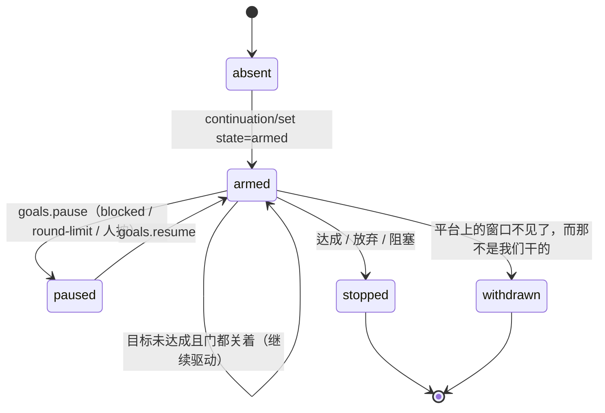

`turnDemand` 的判定顺序（`kernel.js:1892-1917`，**自上而下，先命中者胜**）：

```text
1. 计划 blocked                → stop
2. 计划 active 但未授权        → hold
3. 有裁决在飞（verdict=null）  → hold
4. 收件箱非空（有门开着）      → hold
5. 有 open 的步骤              → drive
6. 目标仍 open                 → drive
7. 其余                        → hold
```

关键事实：**这条链里没有 autonomy**。两档差异只剩澄清协议段与部署初值。
默认额度 `DEFAULT_MAX_AUTO_TURNS = 128`，在布防点生效（`kernel.js:2001`）。

---

## 11. 侦察（scout）· 已实现

存储字段：`state.scouts[]`。子角色由系统按触发派生，不是模型自由委派。

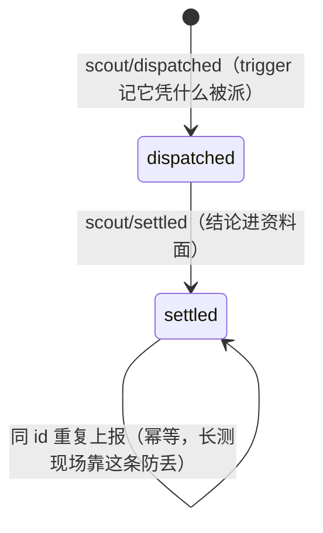

要点：

- 「投影里还没落地就再收一次」的判据是**投影**，不是内存里的 `reported`；重收的节拍是**回合边界**，没有间隔旋钮。
- 同一 id 的 `scout/settled` 在 fold 里幂等，重复发布不会长出第二条事实。
- 侦察工具面只读（`scoutToolFilter`），`MapScouts` 有 `mapScoutMax` / `mapScoutConcurrency` 上限。

## 12. 事件清单覆盖表

折法认识的**每一个**变更类型都在本节有归属；反过来，本文出现的每个 event 也都在折法词汇表里。
`只留台账` 那一组不折进视图（它们是账本事实），因此不出现在任何状态机里。

| 事件 | 归属 | 是否折进视图 |
|---|---|---|
| `goal/set` | §1 目标 | 是 |
| `goal/closed` | §1 目标 | 是 |
| `hypothesis/superseded` | §4 假设 | 是 |
| `plan/created` | §2 计划 | 是 |
| `plan/confirmed` | §2 计划 | 是 |
| `plan/amended` | §2 计划 | 是 |
| `plan/refined` | §2 计划 | 是 |
| `plan/voided` | §3 步骤 | 是 |
| `plan/closed` | §2 计划 | 是 |
| `plan/blocked` | §2 计划 / §3 步骤 | 是 |
| `block/counted` | §2 计划 | 是 |
| `block/cleared` | §2 计划 | 是 |
| `step/advanced` | §3 步骤 | 是 |
| `observation/recorded` | §5 观测 | 是 |
| `audit/dispatched` | §6 评估 | 是 |
| `audit/settled` | §6 评估 | 是 |
| `evidence/recorded` | §7 证据 | 是 |
| `fact/promoted` | §8 事实 | 是 |
| `human/released` | §3 步骤（L4 放行） | 是 |
| `worldline/prepared` | §9 世界线 | 是 |
| `worldline/executing` | §9 世界线 | 是 |
| `worldline/executed` | §9 世界线 | 是 |
| `worldline/removed` | §9 世界线 | 是 |
| `branch/delivered` | §9 世界线 | 是 |
| `fork/created` | §9 世界线 | 是 |
| `fork/converged` | §9 世界线 | 是 |
| `fork/undecidable` | §9 世界线 | 是 |
| `fork/arbitration_dispatched` | §9 世界线 | 是 |
| `fork/arbitrated` | §9 世界线 | 是 |
| `fork/abandoned` | §9 世界线 | 是 |
| `fork/merged` | §9 世界线 | 是 |
| `fork/merge_skipped` | §9 世界线 | 是 |
| `fork/merge_conflict` | §9 世界线 | 是 |
| `scout/dispatched` | §11 侦察 | 是 |
| `scout/settled` | §11 侦察 | 是 |
| `continuation/set` | §10 自动续跑 | 是 |
| `brain/candidates` | 外脑候选扫描（真值表 `skill-candidate`） | 是 |
| `skill/promoted` | 技能采纳（真值表 `skill-candidate`） | 是 |
| `admission/checked` | **只留台账** | 否 |
| `git/committed` | **只留台账** | 否 |
| `git/restored` | **只留台账** | 否 |
| `git/snapshot` | **只留台账** | 否 |

## 13. 与验证本体的关系

`docs/verification-loop.zh-CN.md` 描述的是一份**更完整的**验证本体（八状态机等）。
它与本文件的区别必须在读的时候分清：

| 本文件 | 验证本体 |
|---|---|
| 代码当前真的会走的转移 | 声明出来的完整形状 |
| 每个状态都有生产者 | 部分状态目前没有生产者（如 `retracted`） |
| 用于回答「现在到底保证什么」 | 用于回答「这套设计打算长成什么样」 |

已确认的差异见 [`../known-gaps.zh-CN.md`](../known-gaps.zh-CN.md)。
