# ClearAI 状态转移图

> 这些图**从代码导出**，不是从设计文档抄来。状态名来自 `ui/lib/fold.js` 的 `applyMutation`
> 与 `derive()`，事件名来自内核实际写下的 `mutation.t`。
> 每个图都标注实现状态：`已实现` / `部分实现` / `设计目标`。
> 与机制条目的对应关系见 [`truth-table.zh-CN.md`](truth-table.zh-CN.md)。

## 0. 三条读图约定

1. **状态是派生量，不是存储**。除少数明确标注的存储字段（如 `step.status`），状态由 `derive()` 现算。
2. **一条边一个事件**。图上标的 `event` 就是内核写的 `mutation.t`，可以在 `fold.js` 的 `switch` 里逐条对上。
3. **降级不可表示**。`step` 有秩（`RANK`），秩只增不减；
   图上因此不存在「退回」的边。

---

## 1. 目标（goal）· 已实现

存储字段：`state.goal.{status, revision, closeVerdict}`。

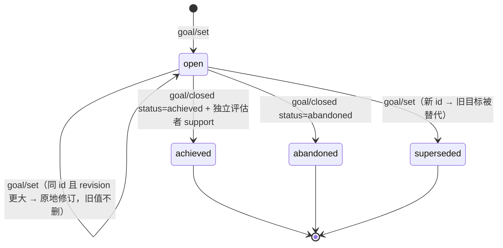
```mermaid
stateDiagram-v2
    [*] --> open: goal/set
    open --> open: goal/set（同 id 且 revision 更大 → 原地修订，旧值不删）
    open --> superseded: goal/set（新 id → 旧目标被替代）
    open --> achieved: goal/closed status=achieved + 独立评估者 support
    open --> abandoned: goal/closed status=abandoned
    achieved --> [*]
    abandoned --> [*]
    superseded --> [*]
```

要点：

- 立约是 `Frame`，结案是 `Conclude`。`Frame` 同时在宿主原生 goal 上建（或改）一条目标，续跑由原生 goal 驱动。
- `achieved` 之前必须先 `ClosePlan`：内核拒收「计划还开着」的结案。`achieved` ⇒ 原生 goal 完成并声明交付物；
  `abandoned` ⇒ 原生 goal 置阻塞（`clearai-goal-abandoned`）。原生 `update_goal` 想直接完成目标会被守卫拒绝，理由指向 `Conclude`。
- `abandoned` 是如实放弃，不是失败清洗——记录保留。
- 修订只增 `revision` 并追加 `reasons[]`，旧段不删。
- 改「怎样算完成」这件事本身还有一条：`criteria/revised` 折进 `goal.criteriaHistory[]`（带独立裁决的 `audit`）。
  它**不改** `done_criteria` 文本（文本走立约 / 修订那条路），改判据因此可查；`Frame` 的 `criteria_verdict` 要的就是这份审计键。

## 2. 计划（plan）· 已实现

存储字段：`state.plans[].{status, blocked}`。

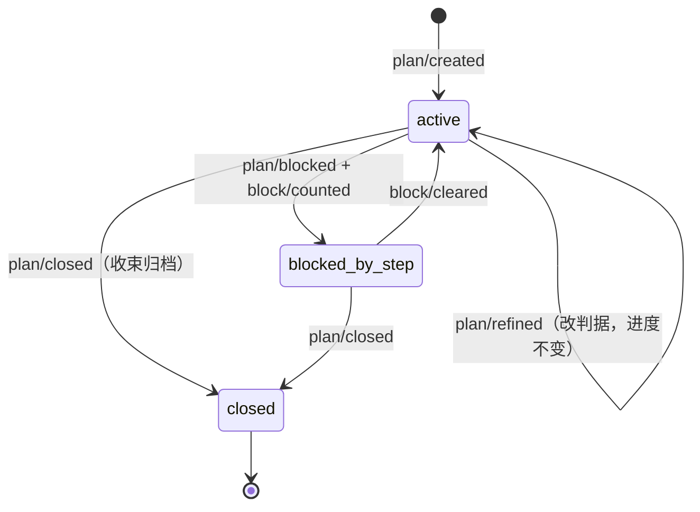
```mermaid
stateDiagram-v2
    [*] --> active: plan/created
    active --> active: plan/amended（补一步，进度不变）
    active --> active: plan/refined（改判据，进度不变）
    active --> blocked_by_step: plan/blocked + block/counted
    blocked_by_step --> active: block/cleared
    active --> closed: plan/closed（收束归档）
    blocked_by_step --> closed: plan/closed
    closed --> [*]
```

计划没有授权记号。要人在动手前看计划，用原生 `/plan`。

置 `blocked` 的那次调用**当场问人**（`userQuestions`）：「按缺口再改」⇒ `block/cleared`；「作废这一步」⇒ `plan/voided` + `block/cleared`；
没人能答 ⇒ 计划保持 `blocked`，原生 goal 置阻塞（`clearai-needs-human`）。

## 3. 步骤（step）· 已实现

存储字段：`state.plans[].steps[].status`，秩 `RANK = { open: 0, blocked: 0, advanced: 1, void: 1 }`。

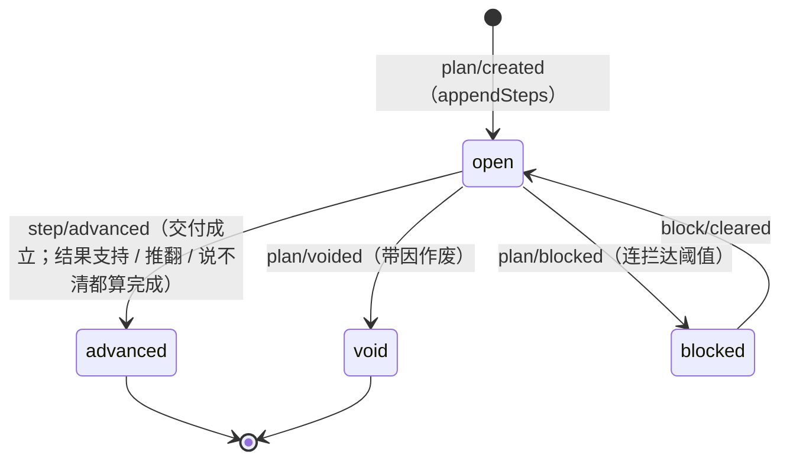
```mermaid
stateDiagram-v2
    [*] --> open: plan/created（appendSteps）
    open --> advanced: step/advanced（交付成立；结果支持 / 推翻 / 说不清都算完成）
    open --> void: plan/voided（带因作废）
    open --> blocked: plan/blocked（连拦达阈值）
    blocked --> open: block/cleared
    advanced --> [*]
    void --> [*]
```

秩的含义：`advanced` 与 `void` 同为秩 1，两者互不覆盖；`open` 与 `blocked` 同为秩 0。
`settle()` 只在目标秩不低于当前秩时写入，所以**降级在写入侧不可表达**。

序位不变量：交付只能落在第一个未落定步，否则 `out_of_order`。

**完成与结果分开**：`step/advanced` 只说交付成立；对判断的结果各落一条 `evidence/recorded`（带 `hypothesis`）。
一步可以检验多条判断（`tests.hypotheses`），每条一个结果。交付不成立（`holds` 为 no / unclear）才不推进，计一次连拦。

## 4. 假设（hypothesis）· 已实现

存储字段：`state.hypotheses[].status`（`proposed` / `superseded`）+ `derive()` 现算的 `alive` / `refuted`。

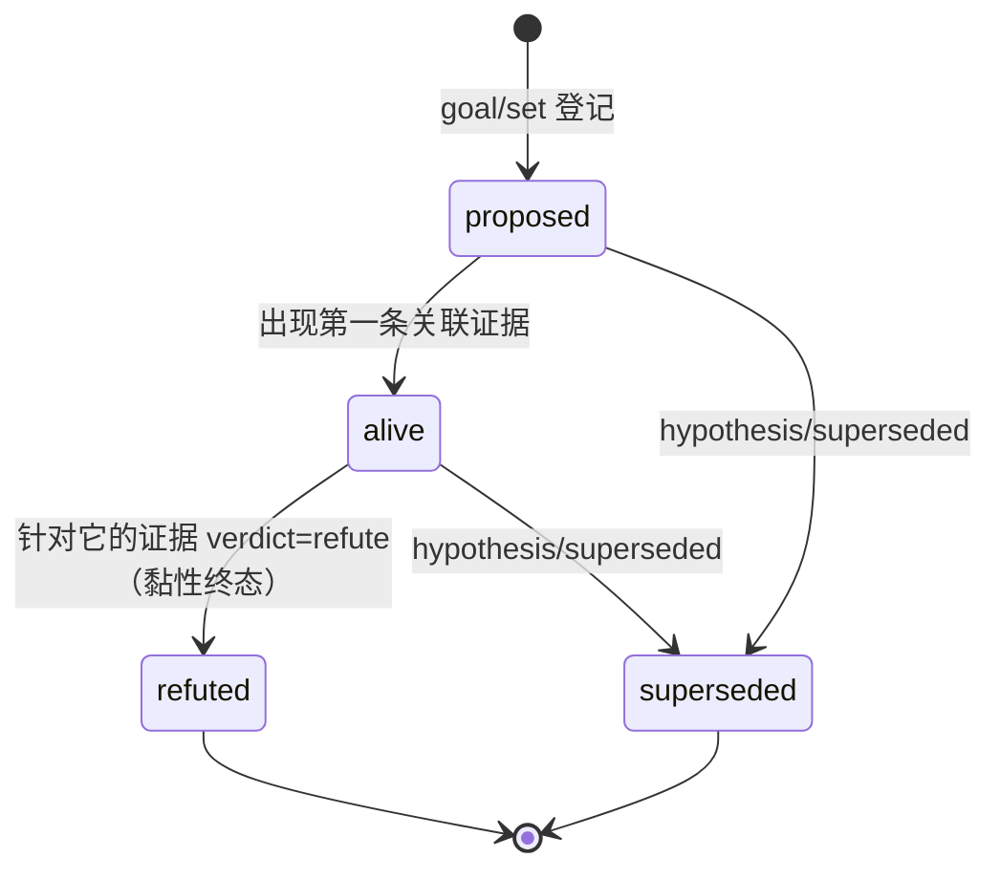
```mermaid
stateDiagram-v2
    [*] --> proposed: goal/set 登记
    proposed --> alive: 出现第一条关联证据
    alive --> refuted: 针对它的证据 verdict=refute（黏性终态）
    proposed --> superseded: hypothesis/superseded
    alive --> superseded: hypothesis/superseded
    refuted --> [*]
    superseded --> [*]
```

三个黏性规则（都在 `fold.js` 里）：

- `refuted` 不被后续「不在清单里」改写成 `superseded`（`fold.js:396-411`）。
- 已升格成事实的假设同样不许被悄悄替代（同一处 `promoted` 判断）。
- 支持等级 `supportedLevel` 是 `derive()` 现算的最大值，不存。
- 等级只决定谁来判，没有跳级检查。`derive()` 给每条假设标 `unlanded`
  （断言主体里不在实体图上的实例节点），`entities_unlanded` 缺口与 Conclude 的实体门都读它。

## 5. 观测（observation）· 已实现

存储字段：`state.materials[]`（只追加）。

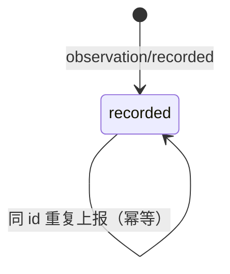
```mermaid
stateDiagram-v2
    [*] --> recorded: observation/recorded
    recorded --> recorded: 同 id 重复上报（幂等）
```

观测**没有拒绝态**：拒绝不是一条状态，而是「这次 `AdvancePlan` 没过闸」，记在 `block/counted` 里。

## 6. 评估（audit）· 已实现

存储字段：`state.audits[].{verdict, holds, results}`（`verdict === null` 表示在飞）。

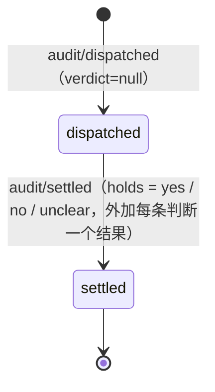
```mermaid
stateDiagram-v2
    [*] --> dispatched: audit/dispatched（verdict=null）
    dispatched --> settled: audit/settled（holds = yes / no / unclear，外加每条判断一个结果）
    settled --> [*]
```

评估者给两份判断：交付成不成立（`holds`），以及对每条被检验判断的结果（`results[]`：support / refute / inconclusive）。
`derive().pendingAudit` = 存在 `verdict === null` 的条目 → 阶段为 `auditing`，卡上写「在等裁决」。
同态复用记一条 `audit/reused`：`verdict` 是 `reused`，**不进** `holds` 这条判定，
也不占 `null` 那个「在飞」的哨兵——所以复用旧裁决的步骤不会让系统一直等。
失联裁决由 `sweepLostAudits` 收口。

## 7. 证据（evidence）· 已实现

存储字段：`state.evidence[]`（只追加）。

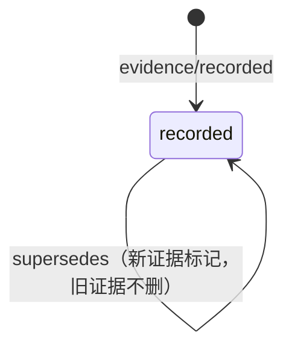
```mermaid
stateDiagram-v2
    [*] --> recorded: evidence/recorded
    recorded --> recorded: supersedes（新证据标记，旧证据不删）
```

证据带 `hypothesis`（针对哪条判断）、`verdict`（support / refute / inconclusive）、`origins[]`（四类出处）与 `basis_reviewable`。

## 8. 事实（fact）· 已实现

存储字段：`state.facts[]` + `clear/knowledge/facts/<事实 id>.json`（一条事实一个文件，只有系统写）。

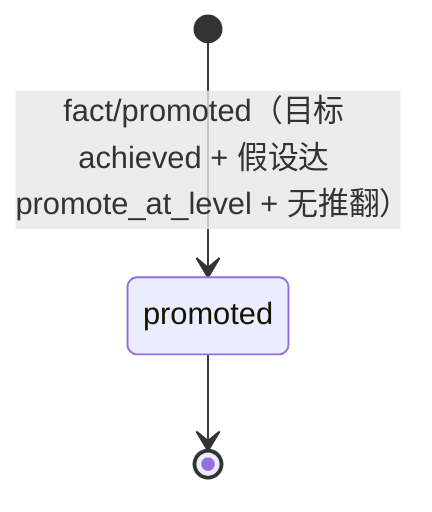
```mermaid
stateDiagram-v2
    [*] --> promoted: fact/promoted（目标 achieved + 假设达 promote_at_level + 无推翻）
    promoted --> [*]
```

`retracted` **不在本图里，因为它不是一个被存储的状态**：推翻证据只**标记**事实（`refuted`，派生），
推翻证据落账的那次交付**当场问人**撤回还是维持原事实——两种结局都落同一条 `fact/reviewed`（撤回是终态，记录保留），
投影再从 `fact.review` 把它读成派生状态。生产者是内核的 `reviewRefutedFacts` / `markFactReviewed`；没人能答 ⇒ 事实标着待复核，
原生 goal 置阻塞。旧日志里人门消息形式的 `retract_fact` / `keep_fact` 仍折得出来。真值表那一行是 `fact-retraction`（已实现）。

**跨会话**：事实文件住在项目里，每个会话每一拍把 `clear/knowledge/facts/` 与 `clear/ontology/` 的变化折成一条
`workspace/synced`（存进 `state.workspace.files`），派生的事实行把别的会话留下的事实一并列出（`foreign`）。
事实文件里记着升格那一刻用到的词条含义指纹（`definitions`）；之后定义改了，派生读数 `definitionsChanged`
不为空，「待处理」里多一条「定义已变，这条结论还成立吗」——只提示，不撤回。

## 9. 自动续跑 · 交给原生 goal

续跑是宿主原生 goal 的事；
ClearAI 只在三个地方碰它：

| 时机 | 对原生 goal 做什么 |
|---|---|
| `Frame` | 建一条（已完成的先清掉再建），或改目标文字 |
| `Conclude` achieved / abandoned | 完成 / 置阻塞（`clearai-goal-abandoned`） |
| 要人而没人能答（计划卡住、L4 放行、事实被推翻） | 置阻塞（`clearai-needs-human`） |

---

## 10. 领域词汇（lexicon）· 已实现

存储字段：`state.lexicon.{terms[], predicates[]}`。

词汇与实体都**从文件来**：`workspace/synced` 的折法用 `materializeOntology` 从 `clear/ontology/` 下的 JSON 文件树得出 `lexicon` / `entities` / `entityAssertions` / `ontologyProblems`（见 §8）。没有登记词条的工具，也没有写词条的事件；`fold.js` 里的 `ontology/*` 与 `entity/*` 分支是这份投影在内存里的表示形状。

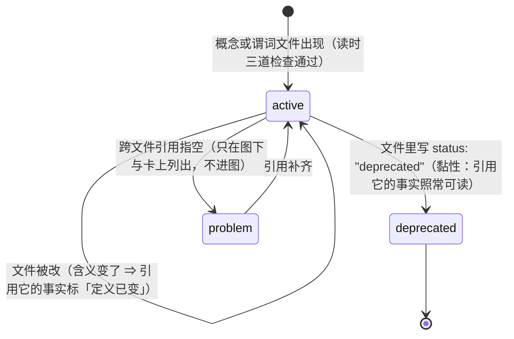
```mermaid
stateDiagram-v2
    [*] --> active: 概念或谓词文件出现（读时三道检查通过）
    active --> active: 文件被改（含义变了 ⇒ 引用它的事实标「定义已变」）
    active --> deprecated: 文件里写 status: "deprecated"（黏性：引用它的事实照常可读）
    active --> problem: 跨文件引用指空（只在图下与卡上列出，不进图）
    problem --> active: 引用补齐
    deprecated --> [*]
```

要点：

- **两种本体是两个字段、两种权威**：`state.ontology` 是**过程本体**的形状（插件自己的后台流转结构，随发布变、不可运行时编辑）；`state.lexicon` 是**领域本体**（项目自己的语言：概念、谓词、值形态），由工作区里的文件决定。
- **废止不是删除**：废止只把条目标成 `deprecated`；引用过它的事实照常可读（与「被推翻的假设保留」同一条）。
- **语义变化看指纹**：事实记着升格那一刻用到的定义指纹；定义改了，事实上就多一条「定义已变」，只提示、不撤回。
- 断言与冲突**不在这张图里**：断言随 `fact/promoted` 落在事实上；冲突由 `derive()` 现算（单值谓词 + 同一主体 + 不同客体 + 两侧都未撤回），只暴露、不裁决。

### 联动：本体层与过程层不互相推进

- **本体文件不推进任何过程对象**，过程事件也不改本体文件——两个状态机不嵌套，它们之间只有**引用**这一种方向性关系（断言引用谓词与概念）。四处握手点见[领域本体 §8](../domain-ontology.zh-CN.md)。
- **断言只在升格那一刻随事实落地**（`fact/promoted` 的 `hypothesis` 与 `assertions`）；冲突是 `derive()` 的现算读数，**不是状态，也不进闸门**。
- **读面全是渲染**：`clear/ontology/domain.md`、`clear/knowledge/facts/INDEX.md`、运行态卡、面板本体图——同一份折法，没有第二本账。

## 11. 实体与断言 · 已实现

派生字段：`state.entities[]`、`state.entityAssertions[]`——从实体文件读出，与「已升格事实」
（`state.facts[].assertions`）分开存、在投影里合起来画。

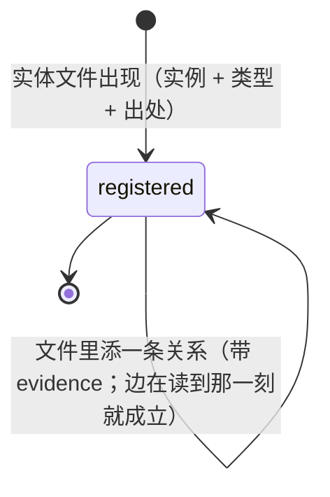
```mermaid
stateDiagram-v2
    [*] --> registered: 实体文件出现（实例 + 类型 + 出处）
    registered --> registered: 文件里添一条关系（带 evidence；边在读到那一刻就成立）
    registered --> [*]
```

要点：

- **约定与观测分开**：概念文件是约定（不需要依据），实体文件是观测——它的每条关系都必须带 `evidence`。
- **实体不依赖目标裁决**：实体文件里的关系在读到那一刻就产边。事实那条路照旧（独立裁决 → `fact/promoted`），
  投影里两条边都在：`source='promoted'` 带等级与边界，`source='asserted'` 带出处、未经独立裁决。
- **主体必须可指认**：断言主体必须是已登记实例（`validateAssertions` 的 `assert_subject_unknown`），
  否则每个字都能读、却没人能核。
- **升格仍会把断言补挂到同一实体上**（按 `${type}|${id}` 去重）：两条来源是**合并**，不是二选一。

## 12. 宿主读面（降级也是事实）· 已实现

存储字段：`state.hostHealth[]`（只增，封顶 20 条）。

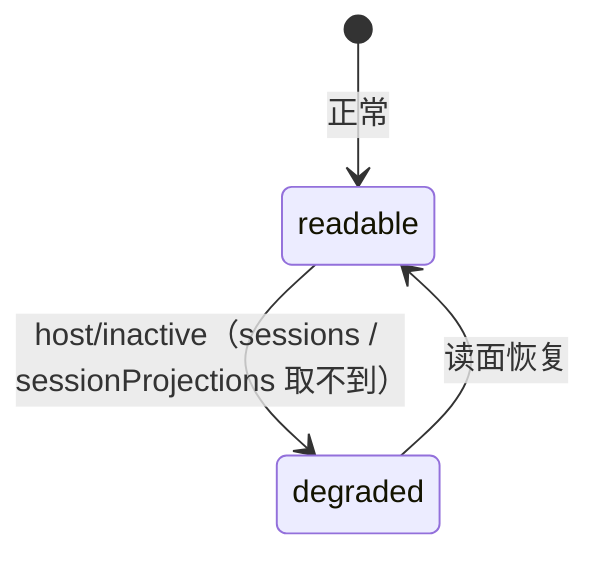
```mermaid
stateDiagram-v2
    [*] --> readable: 正常
    readable --> degraded: host/inactive（sessions / sessionProjections 取不到）
    degraded --> readable: 读面恢复
```

要点：

- 读面取不到服务时**返回空态、不抛**，同时落一条 `host/inactive`：`这一刻读不到` 与 `没有东西`
  是两件事，前者必须写在账上。
- 会话工作目录取不到时**不写盘**（不回退 `process.cwd()`）：写不出去是诚实的降级，
  写到别处是悄悄改了账本的位置。

## 12b. 未解释项（anomaly）· 已实现

存储字段：`state.anomalies[].{status, by, reason, explainedBy}`。认识论里的「反常」：和预期或本体对不上的观测。

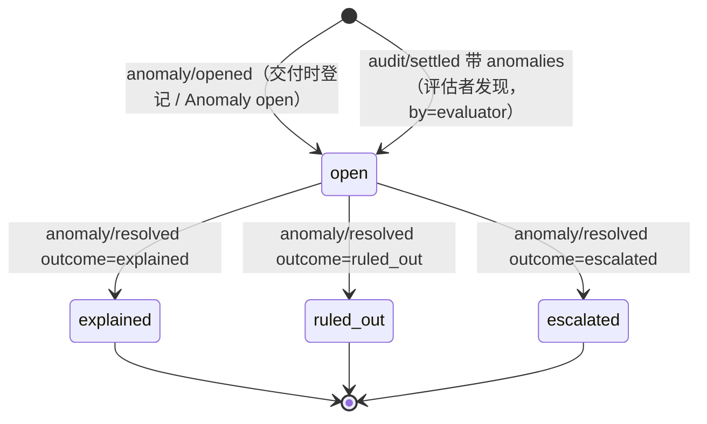
```mermaid
stateDiagram-v2
    [*] --> open: anomaly/opened（交付时登记 / Anomaly open）
    [*] --> open: audit/settled 带 anomalies（评估者发现，by=evaluator）
    open --> explained: anomaly/resolved outcome=explained
    open --> ruled_out: anomaly/resolved outcome=ruled_out
    open --> escalated: anomaly/resolved outcome=escalated
    explained --> [*]
    ruled_out --> [*]
    escalated --> [*]
```

要点：

- 步骤可以带预期（`expect`，`plan/created` / `plan/amended` 一起落，或动手前用 `step/expected` 补写）。预期落空的地方记成未解释项。
- 未解释项不阻塞结案；结案（以及每次独立评估）时随交付交给评估者，排除的理由由评估者核。
- 去处只有一个：处理过的不能再处理。

## 13. 事件清单覆盖表

折法认识的**每一个**变更类型都在本节有归属；反过来，本文出现的每个 event 也都在折法词汇表里。
`只留台账` 那一组不折进视图（它们是账本事实），因此不出现在任何状态机里：

- `admission/checked`：每次交付的准入读数（收下的会另落一条 `observation/recorded`）。

| 事件 | 归属 | 是否折进视图 |
|---|---|---|
| `goal/set` | §1 目标 | 是 |
| `goal/closed` | §1 目标 | 是 |
| `hypothesis/superseded` | §4 假设 | 是 |
| `plan/created` | §2 计划 | 是 |
| `plan/amended` | §2 计划 | 是 |
| `plan/refined` | §2 计划 | 是 |
| `plan/voided` | §3 步骤 | 是 |
| `plan/closed` | §2 计划 | 是 |
| `plan/blocked` | §2 计划 / §3 步骤 | 是 |
| `block/counted` | §2 计划 | 是 |
| `block/cleared` | §2 计划 | 是 |
| `step/advanced` | §3 步骤 | 是 |
| `observation/recorded` | §5 观测 | 是 |
| `audit/dispatched` | §6 评估 | 是 |
| `audit/settled` | §6 评估 | 是 |
| `evidence/recorded` | §7 证据 | 是 |
| `fact/promoted` | §8 事实 | 是 |
| `human/released` | §3 步骤（L4 放行） | 是 |
| `fact/reviewed` | §8 事实(人审查后撤回 / 维持) | 是 |
| `ontology/term_added` | §10 领域词汇 | 是 |
| `ontology/predicate_added` | §10 领域词汇 | 是 |
| `ontology/term_revised` | §10 领域词汇 | 是 |
| `ontology/predicate_revised` | §10 领域词汇 | 是 |
| `ontology/term_deprecated` | §10 领域词汇 | 是 |
| `ontology/predicate_deprecated` | §10 领域词汇 | 是 |
| `entity/registered` | §11 实体与断言 | 是 |
| `entity/asserted` | §11 实体与断言 | 是 |
| `audit/reused` | §6 评估 | 是 |
| `criteria/revised` | §1 目标（判据修订） | 是 |
| `host/inactive` | §12 宿主读面 | 是 |
| `workspace/synced` | §8 事实（跨会话） | 是 |
| `step/expected` | §3 步骤（预期） | 是 |
| `anomaly/opened` | §12b 未解释项 | 是 |
| `anomaly/resolved` | §12b 未解释项 | 是 |
| `admission/checked` | **只留台账** | 否 |

## 14. 与验证本体的关系

`docs/verification-loop.zh-CN.md` 描述的是一份**更完整的**验证本体（八状态机等）。
它与本文件的区别必须在读的时候分清：

| 本文件 | 验证本体 |
|---|---|
| 代码当前真的会走的转移 | 声明出来的完整形状 |
| 用到的状态都有生产者（含人复核落的 `retracted`） | 设计形状里仍有没生产者的状态（如八状态验证机的若干格，见 [known-gaps](../known-gaps.zh-CN.md)） |
| 用于回答「现在到底保证什么」 | 用于回答「这套设计打算长成什么样」 |

已确认的差异见 [`../known-gaps.zh-CN.md`](../known-gaps.zh-CN.md)。
