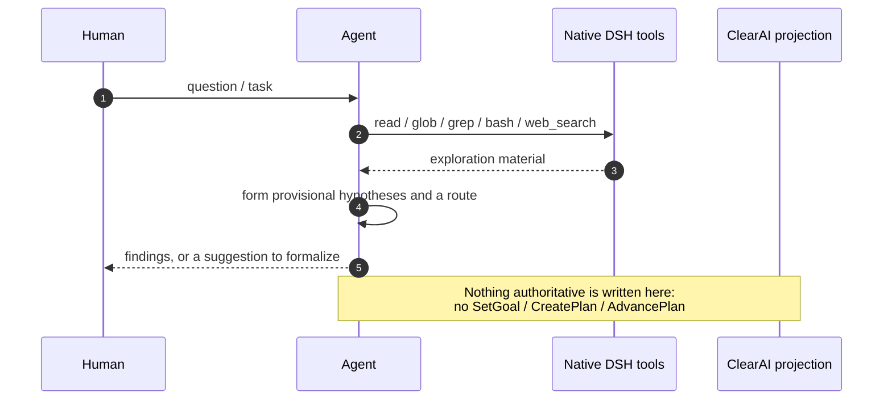
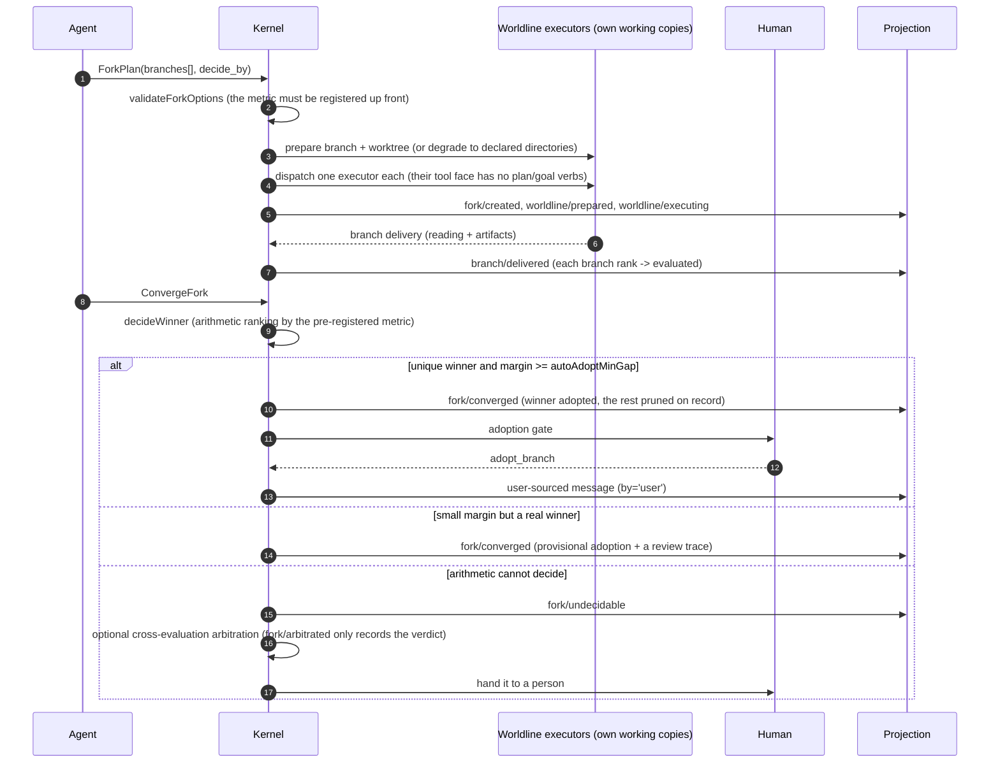
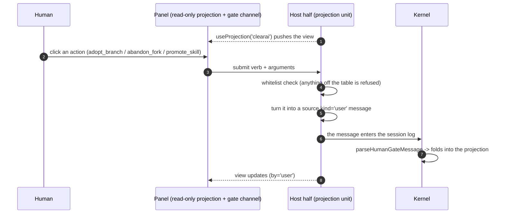

# ClearAI Expected Timing Diagrams

> These diagrams describe **who does what to whom, and when**, on the four main paths.
> They pair with the state machines ([`state-machines.md`](state-machines.md)): the machines answer
> "which states exist", these answer "who moved it there".
> Every tool name and event name here can be matched against the code.

## 1. Light exploration path · partial

**Purpose**: let the model explore with native DSH capability at low authority, without being forced
to open a formal plan first.



Current status: **partial**. Low-authority exploration is physically possible (the native tools are
already there), but the prompt describes it as a preliminary step of the formal loop rather than a zone
one may freely stay in, and the scratch-planning tools (`tool-todo`) are not mounted, so the model has
no "plan that does not enter the ledger" available.

Planned: optimization plan Phase 4 ("exploration zone / formal zone") and Phase 5 ("non-authoritative
tools return").

## 2. Formal epistemic path · implemented

```mermaid
sequenceDiagram
    autonumber
    participant A as Agent
    participant K as ClearAI kernel
    participant H as Human
    participant E as Independent evaluator
    participant P as Projection / panel

    A->>K: SetGoal(claim, done_criteria, hypotheses)
    K->>P: goal/set (derived phase: planning)
    K->>E: precommitRecon dispatches one read-only scout (optional, when input/ has material)
    E-->>K: scout/settled

    A->>K: CreatePlan(brief, steps[].done_criteria)
    K->>K: validateSteps (criteria required, not self-referential, <= 25 steps)
    K->>H: native review card (plan-review)
    alt approved
        H-->>K: approved
        K->>P: plan/created (confirmed_by='user')
    else declined / cancelled / unavailable
        H-->>K: one of the other three
        K->>P: plan/created (confirmed_at=null)
        Note over K,P: No stamp; auto continuation holds;<br/>delivering a step later back-fills by='progress'
    end

    A->>K: AdvancePlan(step_id, observations)
    K->>K: admission: artifacts exist / non-empty / structurally valid
    alt admission fails
        K->>P: block/counted (threshold reached -> plan/blocked)
    else admission passes and L0-L2
        K->>P: step/advanced + evidence/recorded
    else admission passes and L3+
        K->>E: dispatch a fresh-context read-only evaluator
        E-->>K: structured verdict
        K->>P: audit/settled + step/advanced (the system writes the verdict)
    end
    opt L4
        K->>H: native approval stack (human release)
        H-->>K: approval
        K->>P: human/released
    end

    A->>K: ClosePlan then CloseGoal(outcome=achieved)
    K->>E: goal evaluator (synthetic step, criteria = goal.done_criteria)
    E-->>K: support
    K->>P: goal/closed + fact/promoted (at promote_at_level and with no refutation)
```

Three boundaries to remember:

1. **Admission does not judge.** It answers "do we take this in"; `support / refute` belongs to the
   evaluator or to L0–L2 self-judgement.
2. **At L3 and above a caller-supplied verdict is refused** (`verdict_not_accepted`).
3. **A goal cannot close while a plan is open** — the kernel refuses.

## 3. Failure and recovery path · implemented (mechanism) / prompt-only (recovery discipline)

```mermaid
sequenceDiagram
    autonumber
    participant A as Agent
    participant D as DSH
    participant K as Kernel
    participant L as Ledger (git)

    A->>D: side-effecting tool call
    alt ordinary tool error
        D-->>A: ok=false + failure_class
        Note over A: Self-correct: fix the cause, change route,<br/>or retry within bounds when retry_safe
    else provider failure
        D-->>A: typed fact
        Note over A,K: bounded backoff; if permanently unusable the run pauses
    else KernelPanic / EffectOutcomeUnknown
        D-->>A: the effect may already be committed
        A->>K: classify as engine-level failure
        K-->>A: downgraded contract: read-only recovery turn
        A->>D: read / glob / grep (no bash / subagent replay)
        D-->>A: current facts
        A->>K: decide from observation: fix the cause, or stop
        Note over A,L: Every write already entered the ledger,<br/>so "observe first" always has an object
    end
```

Current status: the ledger and admission are mechanism; **the recovery discipline itself lives only in
the prompt** (`clearai/execution-discipline`). Turning it from advice into a boundary needs host-side
support and is a separate topic.

## 4. Worldline path · implemented



Notes:

- Arithmetic only **ranks**; `adopt_branch` is the press a person makes.
- A losing branch loses only its working copy; the **branch ref is kept**, because a later reversal
  depends on it staying readable.
- A settled fork whose executor never reported derives `unreturned` and is no longer awaited.

## 5. Human gate path · implemented



Three hard constraints, each with tests:

1. A verb whitelist; anything off the table is refused, and the value is validated here too.
2. These verbs have **no tool schema** — they do not exist in the model's tool face.
3. The action leaves a signature; folding writes `by:'user'`.
