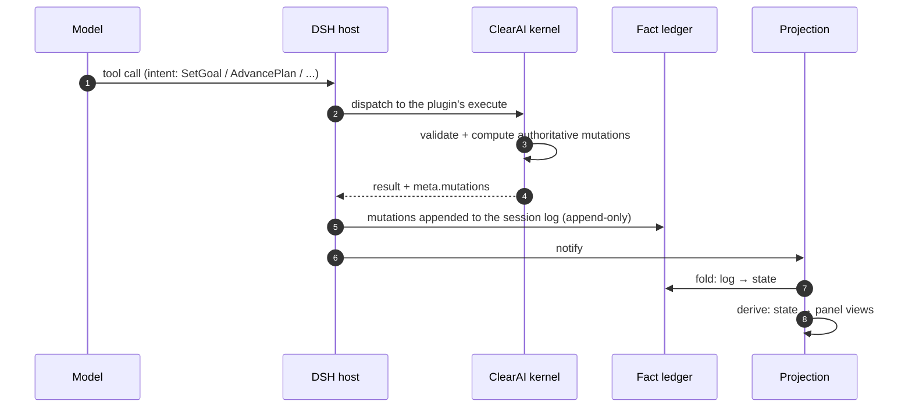
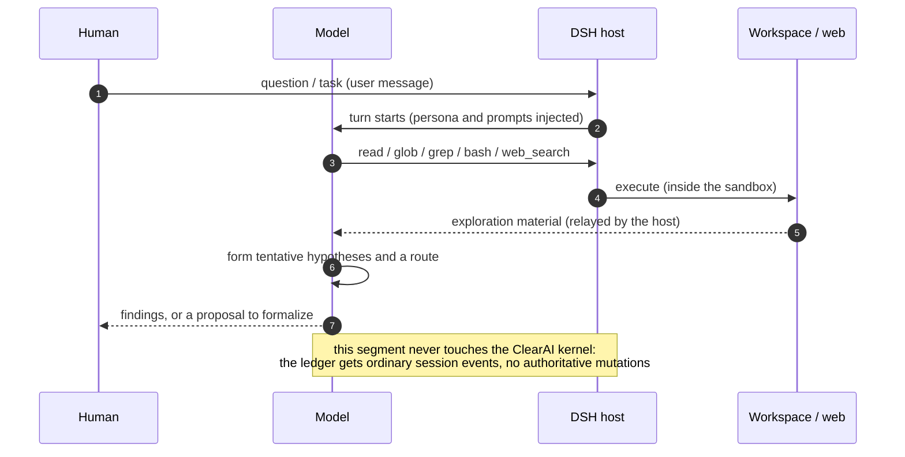
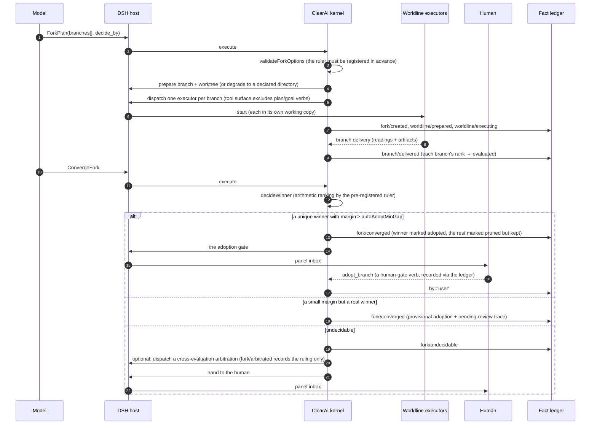
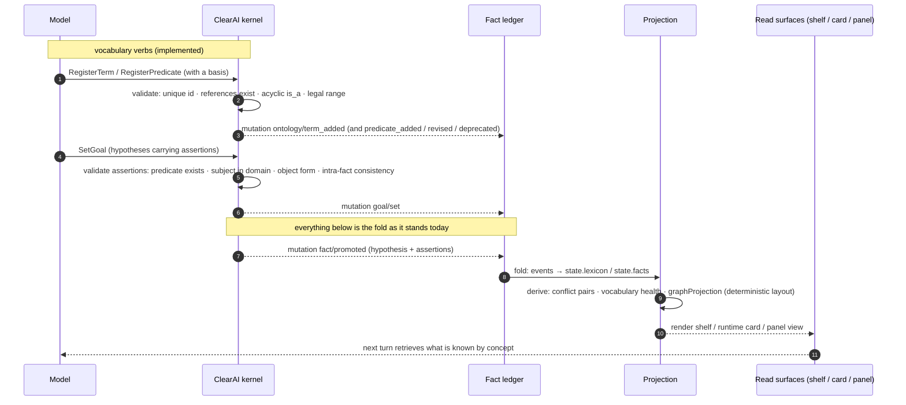

# ClearAI expected timing diagrams

> These diagrams describe **who does what to whom, when, along six main paths**.
> They pair with the state machines ([`state-machines.md`](state-machines.md)):
> state machines answer "which states exist", timing diagrams answer "who pushed it there".
> Every tool name and event name in the diagrams maps one-to-one to code.

## 0. The fixed cast (one set for every diagram, no aliases)

| Role | What it is | What it is not |
|---|---|---|
| **Human** | The user. Only they can do three things: approve a plan on the native review card, release L4 on the native approval stack, press a human-gate verb on the panel | not a system component |
| **Model** | The LLM reasoner. It **emits intent** (tool calls, answers) and executes nothing | not "the agent system"; it touches neither the ledger nor files — everything passes through the host |
| **DSH host** | The engine: the turn loop, tool dispatch, sandbox and approvals, the native review card, subagents, the goals service (continuation driver), writing the session log | makes no epistemic judgments; it does not know "what may be believed" |
| **ClearAI kernel** | The preset plugin: 29 intent tools + guard + the runtime card. **The only producer of authoritative mutations** | does not run turns, render UI, or persist |
| **Fact ledger** | The append-only record of facts. **The content is ours**: clearai mutation events + `clear/` artifacts and evaluation cards; **the carrier is the host's**: the session log + the filesystem. It stores no conclusions — "what may be believed now" is folded out of it by the projection | not a second state book; state is not "read" from it but "folded" out of it |
| **Projection** | The host-side half `ui/lib`: fold (ledger → state) + derive (state → views) + the panel. **Reads the ledger, never writes** | not a cache, not a copy — one view of the same facts |
| **Independent evaluator** | A fresh-context read-only subagent dispatched by the kernel via the host (L3+), returning a structured verdict through `outputSchema` | not the executor's twin; the other half of doer ≠ judge |
| **Worldline executor** | One per mutually exclusive branch, each owning a working copy, with a tool surface that excludes plan/goal verbs | cannot contract, cannot close |

Old-name mapping: **Agent** = split into "Model + DSH host"; **kernel** = ClearAI kernel;
**projection / panel** = the projection; **ledger (git)** = the fact ledger.

The full path of one intent tool call (every arrow in the later diagrams is a segment of it):



Keep this chain in mind: every "kernel → ledger → projection" segment in the five diagrams
below is exactly it, not repeated.

## 1. Light exploration path · partial

**Purpose**: let the model explore at low authority with native DSH capability first, without
forcing an immediate formal plan.



Current status: **implemented**. Two things carry it, and neither is a "zone" object:

- **The negative half is a mechanism**: the native working tools are mounted (`tool-todo`,
  subagents, `workflow`, `ralph`) and the authority-boundary suite pins that none of them can
  emit a `clearai` mutation.
- **The positive half is coverage, not a region**: a workspace snapshot lands at each turn
  boundary in which this session wrote something, so exploration output produced before any plan
  exists is in the ledger — inspectable and restorable. What that does not claim is attribution
  (see [known gaps](../known-gaps.md)).

The "exploration zone" as a **named mode** is retired as a concept: making it a mechanism would
have dressed advice as machinery, and making it a surface would have been a second name for the
same thing. The requirement behind it — "exploration output must be accounted for" — is met by
the two bullets above.

## 2. Formal epistemic path · implemented

```mermaid
sequenceDiagram
    autonumber
    participant M as Model
    participant D as DSH host
    participant K as ClearAI kernel
    participant H as Human
    participant E as Independent evaluator
    participant L as Fact ledger

    M->>D: SetGoal(claim, done_criteria, hypotheses)
    D->>K: execute
    K->>L: goal/set (derived stage: planning)
    K->>D: precommitRecon: dispatch one read-only scout (optional, when input/ has material)
    D->>E: start subagent
    E-->>K: scout/settled

    M->>D: CreatePlan(brief, steps[].done_criteria)
    D->>K: execute
    K->>K: validateSteps (criteria required, non-self-referential, ≤25 steps)
    K->>D: requestPlanReview
    D->>H: native review card (the plan text)
    alt approved
        H-->>K: approved
        K->>L: plan/created (confirmed_by='user')
    else declined / cancelled / unavailable
        H-->>K: the three other outcomes
        K->>L: plan/created (confirmed_at=null)
        Note over K,L: no stamp; auto continuation holds;<br/>an advance back-fills by='progress'
    end

    M->>D: AdvancePlan(step_id, observations)
    D->>K: execute
    K->>K: admission: artifact exists / non-empty / structurally valid
    alt admission failed
        K->>L: block/counted (reaching blockedThreshold → plan/blocked)
    else admitted, L0–L2
        K->>L: step/advanced + evidence/recorded
    else admitted, L3+
        K->>D: dispatch a fresh-context read-only evaluator
        D->>E: start (with outputSchema)
        E-->>K: structured verdict
        K->>L: audit/settled + step/advanced (the verdict is written by the system)
    end
    opt L4
        K->>D: native approval stack (human release)
        D->>H: approval card
        H-->>K: approval
        K->>L: human/released
    end

    M->>D: ClosePlan → CloseGoal(outcome=achieved)
    D->>K: execute
    K->>D: dispatch the goal evaluator (synthetic step, criteria = goal.done_criteria)
    D->>E: start
    E-->>K: support
    K->>L: goal/closed + fact/promoted (promote_at_level reached, no refutation)
```

Three boundaries to remember:

1. **Admission does not judge**. Admission only answers "accept or not"; `support / refute`
   belongs to the evaluator or to L0–L2 self-judgment.
2. **Writing a verdict at L3 or above is rejected** (`verdict_not_accepted`).
3. **The plan must be closed before the goal**, or the kernel refuses.

## 3. Failure and recovery path · implemented (mechanism side) / prompt-only (recovery discipline)

```mermaid
sequenceDiagram
    autonumber
    participant M as Model
    participant D as DSH host
    participant K as ClearAI kernel
    participant L as Fact ledger

    M->>D: a tool call with side effects
    alt ordinary tool error
        D-->>M: ok=false + failure_class
        Note over M: self-correctable: fix the cause, take another route,<br/>or bounded retry per retry_safe
    else provider failure
        D-->>M: typed facts
        Note over M,K: bounded backoff; if finally unavailable, run paused
    else KernelPanic / EffectOutcomeUnknown
        D-->>M: the effect may already be committed
        M->>D: read the kernel's error classification (engine-level fault)
        D->>K: pre-step
        K-->>M: degraded contract: a read-only recovery turn
        M->>D: read / glob / grep (bash and subagent replay forbidden)
        D-->>M: current facts
        M->>M: decide from observation: fix the cause / stop
        Note over D,L: every write already went to the ledger automatically,<br/>so "observe first" always has something to observe
    end
```

Current status: the ledger and admission are mechanisms; **the recovery discipline itself lives
only in the prompts** (`clearai/execution-discipline`). Upgrading it from advice to boundary
needs host-side cooperation and is a later topic.

## 4. Worldline path · implemented



Key points:

- Arithmetic only **ranks**; `adopt_branch` is the press of a human finger.
- Losing branches lose only their working copies; **the branch refs are kept**, because a later
  reversal depends on them staying readable forever.
- A fork closed while an executor has not returned → derived `unreturned`; stop waiting.

## 5. Domain-ontology path · partially implemented (the fold half ships)

**Purpose**: to say how vocabulary and assertions enter the ledger and how they become graphs. **Only the
fold half runs today**: the six vocabulary events fold, assertions fold, and conflicts and graphs are derived;
the **seven verbs are wired** (register / revise / deprecate / query) and only the panel is not (stages D–E).
The only design-target step in the diagram is therefore the panel; the verbs and event names can be checked
line by line today.



Three boundaries (each has a test, or is written into [Known gaps](../known-gaps.md)):

1. **Refused at registration**: an assertion that references an unknown or deprecated entry, or whose object form does not fit the range, is refused **before anything lands** — nothing enters the ledger, so there is nothing to clean up later.
2. **Conflicts are surfaced only**: computed by `derive()`, they retract no side, decide nothing about which is true, and **enter no gate**; handling one goes through the existing human gate (`fact/reviewed`).
3. **Graphs are renderings**: `graphProjection()` is a deterministic pure function (the same ledger always yields the same graph) and coordinates never enter the ledger.

## 6. Human gate path · implemented

```mermaid
sequenceDiagram
    autonumber
    participant H as Human
    participant P as Projection (panel)
    participant D as DSH host
    participant L as Fact ledger
    participant K as ClearAI kernel

    P-->>H: useProjection('clearai') pushes views
    H->>P: press an action (adopt_branch / abandon_fork / promote_skill / retract_fact / keep_fact / confirm_provisional)
    P->>D: submit verb + arguments
    D->>D: whitelist check (anything off-list is refused; values checked on the same layer)
    D->>L: becomes a source.kind='user' message (append-only)
    D->>P: notify
    P->>L: fold: folded into state (by='user')
    P-->>H: view updated (signed: human)
    Note over K,L: the kernel reads the same fact at its next pre-step —<br/>a fact has exactly one fold, regardless of entry point
```

Three hard constraints (each pinned by a test):

1. A verb whitelist; anything off-list is refused, and values are checked on the same layer.
2. These verbs **have no tool schema** — they do not exist in the model's tool surface.
3. Every action leaves a signature, folded into the projection as `by:'user'`.
