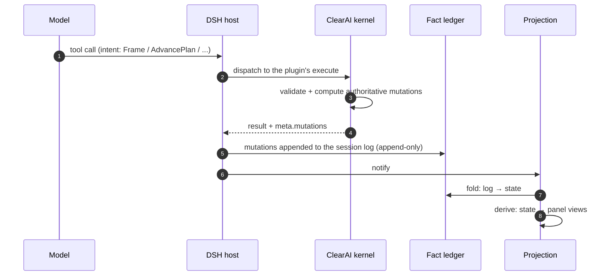
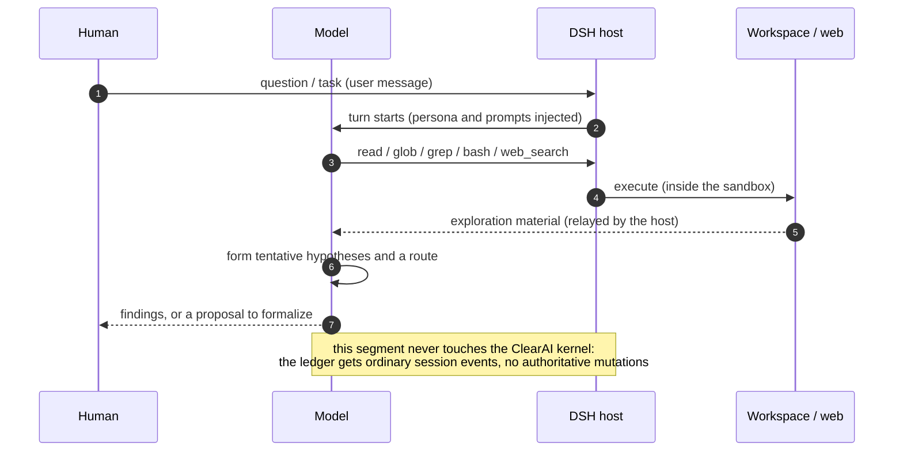
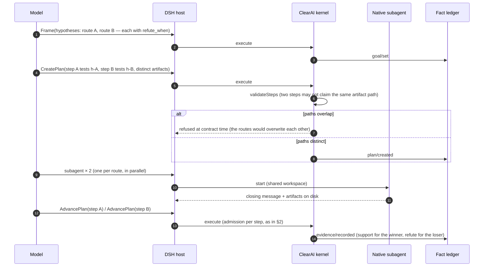

# ClearAI expected timing diagrams

> These diagrams describe **who does what to whom, when, along six main paths**.
> They pair with the state machines ([`state-machines.md`](state-machines.md)):
> state machines answer "which states exist", timing diagrams answer "who pushed it there".
> Every tool name and event name in the diagrams maps one-to-one to code.

## 0. The fixed cast (one set for every diagram, no aliases)

| Role | What it is | What it is not |
|---|---|---|
| **Human** | The user. Only they can do two things: answer the questions the system asks on the spot (L4 release, a stuck plan, a refuted fact), and submit an ontology verb on the panel | not a system component |
| **Model** | The LLM reasoner. It **emits intent** (tool calls, answers) and executes nothing | not "the agent system"; it touches neither the ledger nor files — everything passes through the host |
| **DSH host** | The engine: the turn loop, tool dispatch, sandbox and approvals, subagents, the goals service (native goal and continuation), userQuestions (the native question card), writing the session log | makes no epistemic judgments; it does not know "what may be believed" |
| **ClearAI kernel** | The preset plugin: 19 intent tools + guard + the runtime card. **The only producer of authoritative mutations** | does not run turns, render UI, or persist |
| **Fact ledger** | The append-only record of facts. **The content is ours**: clearai mutation events + `clear/` artifacts and evaluation cards; **the carrier is the host's**: the session log + the filesystem. It stores no conclusions — "what may be believed now" is folded out of it by the projection | not a second state book; state is not "read" from it but "folded" out of it |
| **Projection** | The host-side half `ui/lib`: fold (ledger → state) + derive (state → views) + the panel. **Reads the ledger, never writes** | not a cache, not a copy — one view of the same facts |
| **Independent evaluator** | A fresh-context read-only subagent dispatched by the kernel via the host (L3+), returning a structured verdict through `outputSchema` | not the executor's twin; the other half of doer ≠ judge |
| **Native subagent** | The host's own subagent, started by the model to run one route in parallel. It shares the workspace, so each route declares its own artifact paths | not ours; it does not deliver steps — the model does |

Old-name mapping: **Agent** = split into "Model + DSH host"; **kernel** = ClearAI kernel;
**projection / panel** = the projection; **ledger (git)** = the fact ledger.

The full path of one intent tool call (every arrow in the later diagrams is a segment of it):

```mermaid
sequenceDiagram
    autonumber
    participant M as Model
    participant D as DSH host
    participant K as ClearAI kernel
    participant L as Fact ledger
    participant P as Projection

    M->>D: tool call (intent: Frame / AdvancePlan / ...)
    D->>K: dispatch to the plugin's execute
    K->>K: validate + compute authoritative mutations
    K-->>D: result + meta.mutations
    D->>L: mutations appended to the session log (append-only)
    D->>P: notify
    P->>L: fold: log → state
    P->>P: derive: state → panel views
```

Keep this chain in mind: every "kernel → ledger → projection" segment in the five diagrams
below is exactly it, not repeated.

## 1. Light exploration path · partial

**Purpose**: let the model explore at low authority with native DSH capability first, without
forcing an immediate formal plan.

```mermaid
sequenceDiagram
    autonumber
    participant H as Human
    participant M as Model
    participant D as DSH host
    participant W as Workspace / web

    H->>D: question / task (user message)
    D->>M: turn starts (persona and prompts injected)
    M->>D: read / glob / grep / bash / web_search
    D->>W: execute (inside the sandbox)
    W-->>M: exploration material (relayed by the host)
    M->>M: form tentative hypotheses and a route
    M-->>H: findings, or a proposal to formalize
    Note over M,D: this segment never touches the ClearAI kernel:<br/>the ledger gets ordinary session events, no authoritative mutations
```

Current status: **implemented**. Two things carry it, and neither is a "zone" object:

- **The negative half is a mechanism**: the native working tools are mounted (`tool-todo`,
  subagents, `workflow`, `ralph`) and the authority-boundary suite pins that none of them can
  emit a `clearai` mutation.
- **The positive half is coverage, not a region**: a workspace snapshot lands at each turn
  boundary in which this session wrote something, so exploration output produced before any plan
  exists is in the ledger — inspectable and restorable. What that does not claim is attribution
  (see [known gaps](../known-gaps.md)).

The "exploration zone" as a **named mode** is retired as a concept: making it a mechanism would
have dressed advice as machinery, and making it a surface would have been a second name for the
same thing. The requirement behind it — "exploration output must be accounted for" — is met by
the two bullets above.

## 2. Formal epistemic path · implemented

```mermaid
sequenceDiagram
    autonumber
    participant M as Model
    participant D as DSH host
    participant K as ClearAI kernel
    participant H as Human
    participant E as Independent evaluator
    participant L as Fact ledger

    M->>D: Frame(claim, done_criteria, hypotheses)
    D->>K: execute
    K->>L: goal/set (derived stage: planning)
    K->>D: native goal: create one (or edit its objective); it drives continuation

    M->>D: CreatePlan(brief, steps[].done_criteria, steps[].tests.hypotheses)
    D->>K: execute
    K->>K: validateSteps (criteria required, non-self-referential, ≤25 steps)
    K->>L: plan/created
    Note over M,H: to show a person the plan before acting, use the native /plan; ClearAI raises no review card of its own

    M->>D: AdvancePlan(step_id, basis, results[])
    D->>K: execute
    opt L4
        K->>D: userQuestions: ask the person on the spot whether to release
        D->>H: native question card
        H-->>K: release / hold (nobody can answer ⇒ refused, native goal blocked)
        K->>L: human/released
    end
    K->>K: admission: artifact exists / non-empty / structurally valid
    alt admission failed
        K->>L: block/counted (reaching blockedThreshold → plan/blocked, the person is asked on the spot)
    else admitted, L0–L2
        K->>L: evidence/recorded (one per result) + step/advanced
    else admitted, L3+
        K->>D: dispatch a fresh-context read-only evaluator
        D->>E: start (with outputSchema)
        E-->>K: two judgments: does the delivery hold (holds) + a result per hypothesis
        alt holds = yes
            K->>L: audit/settled + evidence/recorded (one per result) + step/advanced
        else holds = no / unclear
            K->>L: audit/settled + block/counted (no advance)
        end
    end

    M->>D: ClosePlan → Conclude(outcome=achieved)
    D->>K: execute
    K->>D: dispatch the goal evaluator (synthetic step, criteria = goal.done_criteria)
    D->>E: start
    E-->>K: holds = yes
    K->>L: goal/closed + fact/promoted (promote_at_level reached, no refutation)
    K->>D: complete the native goal + declare deliverables
```

Boundaries to remember:

1. **Admission does not judge**. Admission only answers "accept or not"; the result (support / refute / inconclusive)
   belongs to the evaluator or to L0–L2 self-judgment.
2. **Writing results yourself at L3 or above is rejected** (`verdict_not_accepted`).
3. **Completion is separate from result**: a delivery that holds completes the step, even when the result is a refutation or inconclusive.
4. **The plan must be closed before the goal**, or the kernel refuses.

## 3. Failure and recovery path · implemented (mechanism side) / prompt-only (recovery discipline)

```mermaid
sequenceDiagram
    autonumber
    participant M as Model
    participant D as DSH host
    participant K as ClearAI kernel
    participant L as Fact ledger

    M->>D: a tool call with side effects
    alt ordinary tool error
        D-->>M: ok=false + failure_class
        Note over M: self-correctable: fix the cause, take another route,<br/>or bounded retry per retry_safe
    else provider failure
        D-->>M: typed facts
        Note over M,K: bounded backoff; if finally unavailable, run paused
    else KernelPanic / EffectOutcomeUnknown
        D-->>M: the effect may already be committed
        M->>D: read the kernel's error classification (engine-level fault)
        D->>K: pre-step
        K-->>M: degraded contract: a read-only recovery turn
        M->>D: read / glob / grep (bash and subagent replay forbidden)
        D-->>M: current facts
        M->>M: decide from observation: fix the cause / stop
        Note over D,L: every write already went to the ledger automatically,<br/>so "observe first" always has something to observe
    end
```

Current status: the ledger and admission are mechanisms; **the recovery discipline itself lives
only in the prompts** (`clearai/execution-discipline`). Upgrading it from advice to boundary
needs host-side cooperation and is a later topic.

## 4. Competing-routes path · implemented

Worldlines were removed in phase 2. Two routes that differ in kind are two competing
hypotheses, each tested by one step; the parallelism is the host's own subagents.

```mermaid
sequenceDiagram
    autonumber
    participant M as Model
    participant D as DSH host
    participant K as ClearAI kernel
    participant S as Native subagent
    participant L as Fact ledger

    M->>D: Frame(hypotheses: route A, route B — each with refute_when)
    D->>K: execute
    K->>L: goal/set
    M->>D: CreatePlan(step A tests h-A, step B tests h-B, distinct artifacts)
    D->>K: execute
    K->>K: validateSteps (two steps may not claim the same artifact path)
    alt paths overlap
        K-->>D: refused at contract time (the routes would overwrite each other)
    else paths distinct
        K->>L: plan/created
    end
    M->>D: subagent × 2 (one per route, in parallel)
    D->>S: start (shared workspace)
    S-->>D: closing message + artifacts on disk
    M->>D: AdvancePlan(step A) / AdvancePlan(step B)
    D->>K: execute (admission per step, as in §2)
    K->>L: evidence/recorded (support for the winner, refute for the loser)
```

Key points:

- Evidence decides which hypothesis stands; there is no adoption gate. The losing route is a
  refuted hypothesis and stays on the record.
- When both routes hold and contradict each other, the model says so and hands it to the
  human; the conflict is surfaced, not gated.
- Artifact paths are exclusive within a plan, because subagents share one workspace.

## 5. Domain-ontology path · implemented (fold, verbs and panel all ship)

**Purpose**: to say how vocabulary and assertions enter the ledger and how they become graphs. The **fold
half** (six vocabulary events, assertions, conflict and graph derivation) and the **ten verbs**
(register / revise / deprecate / query / register instance / assert / explain a level skip) are wired; **so is the panel** (graph band / assertion chips /
conflict row / vocabulary maintenance zone, plus graph editing through the human-gate route — the same
criteria and the same ledger as the model's verbs).

```mermaid
sequenceDiagram
    autonumber
    participant M as Model
    participant K as ClearAI kernel
    participant L as Fact ledger
    participant P as Projection
    participant G as Read surfaces (shelf / card / panel)

    Note over M,P: knowledge preflight (implemented: no user reminder needed)
    M->>K: Frame (registering propositions)
    K-->>L: mutation goal/set
    L->>P: fold → derive
    P->>P: knowledgePreflight: claim text matches entry label/id/alias (bounded, auditable)
    P-->>G: runtime card gains a "relevant known (directly referenceable)" line
    G-->>M: model receives referenceable ids — reuse first, register only what's missing

    Note over M,K: vocabulary verbs (implemented)
    M->>K: RegisterTerm / RegisterPredicate (with a basis)
    K->>K: validate: unique id · references exist · acyclic is_a · legal range
    K-->>L: mutation ontology/term_added (and predicate_added / revised / deprecated)
    M->>K: Frame (hypotheses carrying assertions)
    K->>K: validate assertions: predicate exists · subject in domain · object form · intra-fact consistency
    K-->>L: mutation goal/set
    Note over K,L: everything below is the fold as it stands today
    K-->>L: mutation fact/promoted (hypothesis + assertions)
    L->>P: fold: events → state.lexicon / state.facts
    P->>P: derive: conflict pairs · vocabulary health · graphProjection (layer / degree / claim)
    P-->>G: render shelf / runtime card / panel view
    G-->>M: next turn retrieves what is known by concept
    Note over G: the graph is rendered by React Flow (nodes/edges from P; viewport and dragging are the library's)
    G->>K: click a node / edge → GET /api/clearai/inspector (kind, id)
    K->>P: inspectGraphSelection(state, selection)
    P-->>G: definition / relations / assertions / evidence chain / history
```

Five boundaries (each has a test, or is written into [Known gaps](../known-gaps.md)):

1. **Refused at registration**: an assertion that references an unknown or deprecated entry, or whose object form does not fit the range, is refused **before anything lands** — nothing enters the ledger, so there is nothing to clean up later.
2. **Conflicts are surfaced only**: computed by `derive()`, they retract no side, decide nothing about which is true, and **enter no gate**; handling one goes through the existing human gate (`fact/reviewed`).
3. **Graphs are renderings**: `graphProjection()` is a deterministic pure function (the same ledger always yields the same graph) and coordinates never enter the ledger.
4. **The graph is a rendering, not a second ledger**: `graphProjection()` yields pure semantics (nodes / edges / bounds); the viewport, dragging and visibility belong to React Flow. The client's Inspector readings always come from `GET /api/clearai/inspector`, so it never assembles an evidence chain itself. Interaction produces no mutation at all.
5. **The shelf has an owner**: `domain.md` and `facts/INDEX.md` are **workspace-level** read surfaces, and only the session that owns the ledger may lay them — the ownership check lives inside the write functions, so spawned children (evaluator / executor) structurally cannot write them. Children share the workspace with the primary line yet hold a separate, empty projection; if they re-laid the shelf, the shared read surface would oscillate with whoever stepped last. Behavior is pinned by the kernel suite, structure by the authority-boundary suite.

## 6. Human gate path · implemented

Decisions that need a person have two entry points. **Asked on the spot**: the call that opens the gate asks the person itself
(L4 release, a stuck plan, a refuted fact), and the answer comes back into that same call and is recorded there:

```mermaid
sequenceDiagram
    autonumber
    participant M as Model
    participant D as DSH host
    participant K as ClearAI kernel
    participant H as Human
    participant L as Fact ledger

    M->>D: AdvancePlan(...)
    D->>K: execute
    K->>D: userQuestions.ask (question + options)
    D->>H: native question card
    alt the person answers
        H-->>K: an option + an optional sentence
        K->>L: human/released / block/cleared / plan/voided / fact/reviewed (by='user')
    else nobody can answer / the person withdraws it
        K->>D: block the native goal (clearai-needs-human)
        Note over K,L: nothing changes in the ledger; the gate stays as it was
    end
```

**The panel**: the four ontology verbs (register_term / register_predicate / revise_term / deprecate_entry) are submitted from the panel:

```mermaid
sequenceDiagram
    autonumber
    participant H as Human
    participant P as Projection (panel)
    participant D as DSH host
    participant L as Fact ledger
    participant K as ClearAI kernel

    P-->>H: useProjection('clearai') pushes views
    H->>P: submit an ontology verb
    P->>D: submit verb + arguments
    D->>D: whitelist check (anything off-list is refused; values checked on the same layer)
    D->>L: becomes a source.kind='user' message (append-only)
    D->>P: notify
    P->>L: fold: folded into state (by='user')
    P-->>H: view updated (signed: human)
    Note over K,L: the kernel reads the same fact at its next pre-step —<br/>a fact has exactly one fold, regardless of entry point
```

Three hard constraints on the panel path (each pinned by a test):

1. A verb whitelist; anything off-list is refused, and values are checked on the same layer.
2. These verbs **have no tool schema** — they do not exist in the model's tool surface.
3. Every action leaves a signature, folded into the projection as `by:'user'`.
