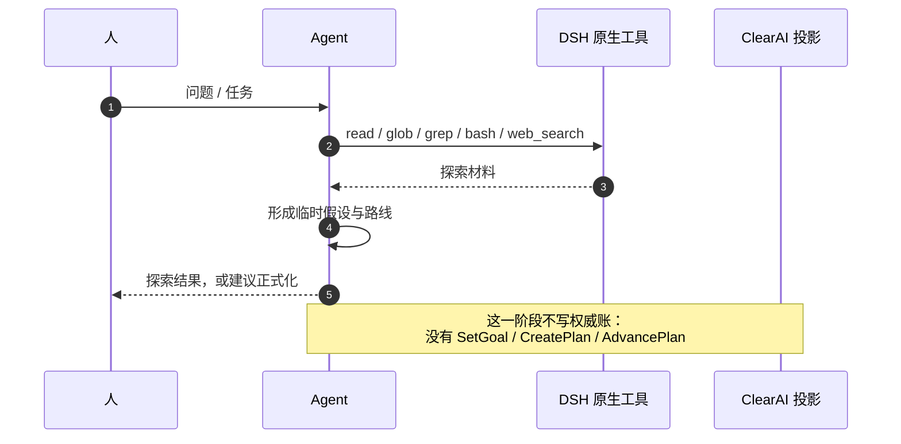
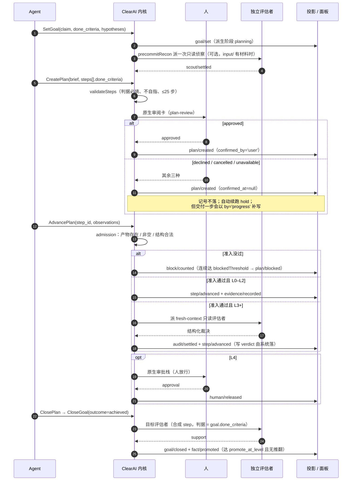
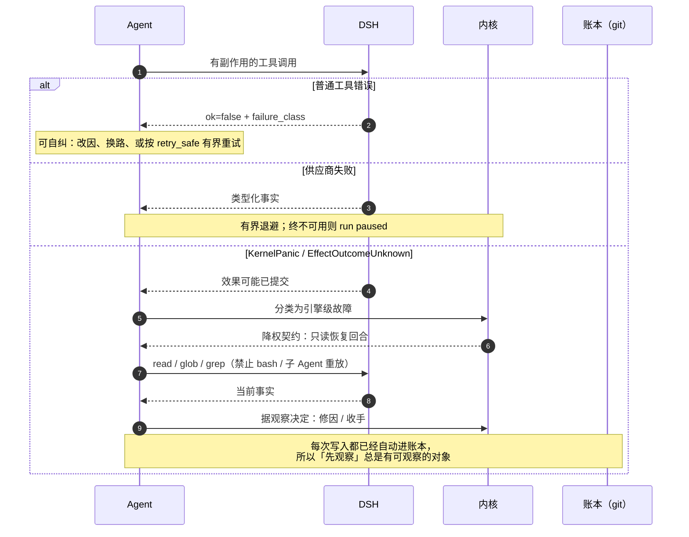
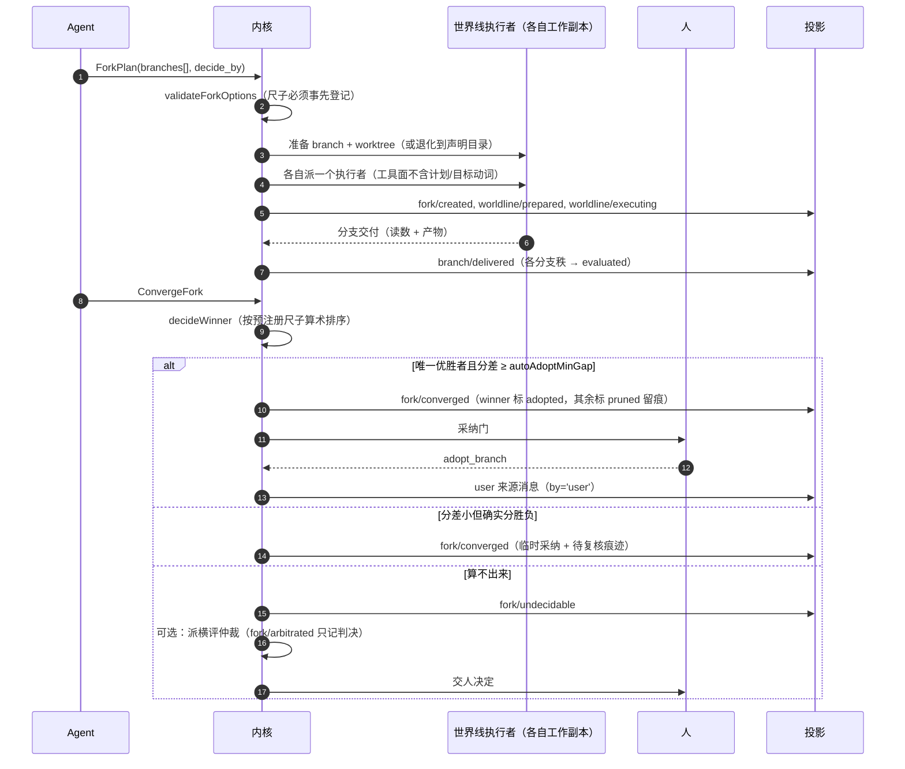
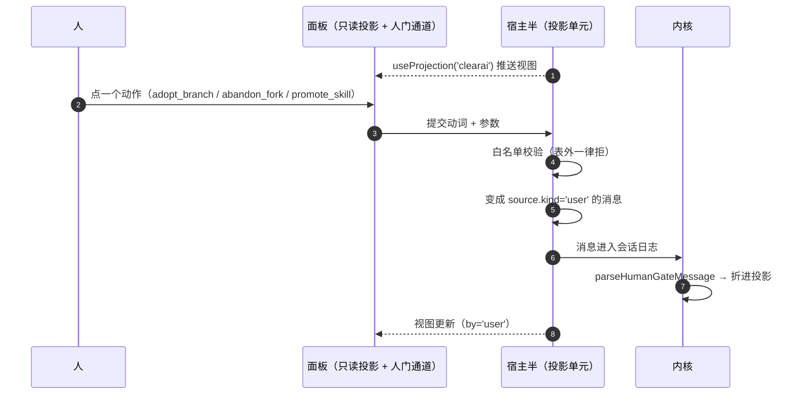

# ClearAI 预期时序图

> 这些图描述**四条主路径上，谁在什么时候对谁做了什么**。
> 与状态机（[`state-machines.zh-CN.md`](state-machines.zh-CN.md)）配套：
> 状态机回答「有哪些状态」，时序图回答「谁把它推过去的」。
> 图里出现的工具名与事件名都可以在代码里逐条对上。

## 1. 轻量探索路径 · 部分实现

**目的**：允许模型先用 DSH 原生能力做低权威探索，不强迫立刻建立正式计划。

当前状态：**部分实现**。低权威探索在物理上可行（原生工具本来就在），
但提示词把它描述成正式循环的前置步骤，而不是一个可以自由停留的区域；
`tool-todo` 等临时计划工具当前未挂载，所以模型没有一个「不进入账本的计划」可用。

计划：见优化计划阶段 4「探索区 / 正式区」与阶段 5「非权威工具回归」。

## 2. 正式认识论路径 · 已实现

三个必须记住的边界：

1. **准入不裁决**。准入只回答「收不收」，`support / refute` 是评估者或 L0–L2 自判的事。
2. **L3 以上写 verdict 会被拒绝**（`verdict_not_accepted`）。
3. **结案前必须先收尾计划**，否则内核拒收。

## 3. 失败与恢复路径 · 已实现（机制侧）/ 仅提示词（恢复纪律）

当前状态：账本与准入是机制；**恢复纪律本身只在提示词里**（`clearai/execution-discipline`）。
把它从「建议」升级为边界，需要宿主侧配合，属后续议题。

## 4. 世界线路径 · 已实现

要点：

- 算术只负责**排序**；`adopt_branch` 是人按的那一下。
- 落选分支只删工作副本，**保留 branch ref**，因为事后改判依赖它永久可读。
- 分叉已收口而执行者未归 → 派生 `unreturned`，不再等。

## 5. 人门（human gate）路径 · 已实现

三条硬约束（每条都有测试）：

1. 动词白名单，表外拒绝，取值也在这一层校验。
2. 这些动词**没有工具 schema**，模型的工具面里不存在它们。
3. 动作留下署名，折进投影时写 `by:'user'`。
