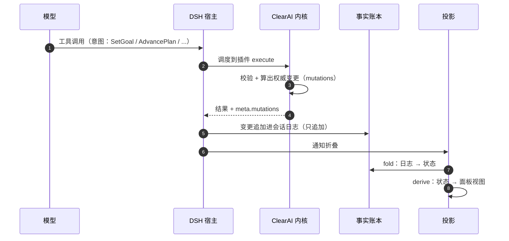
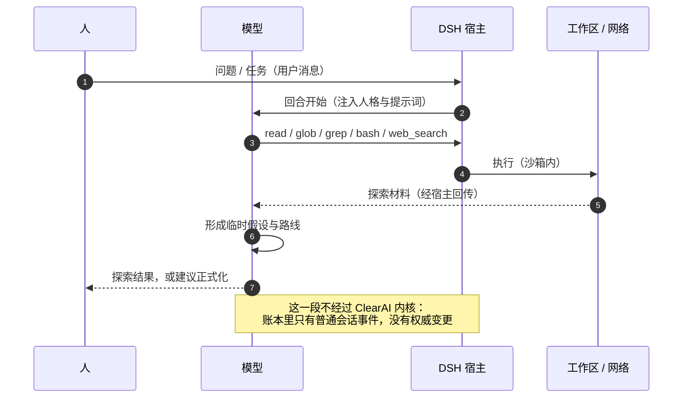
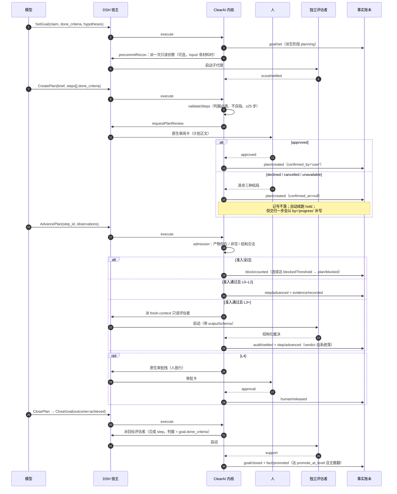
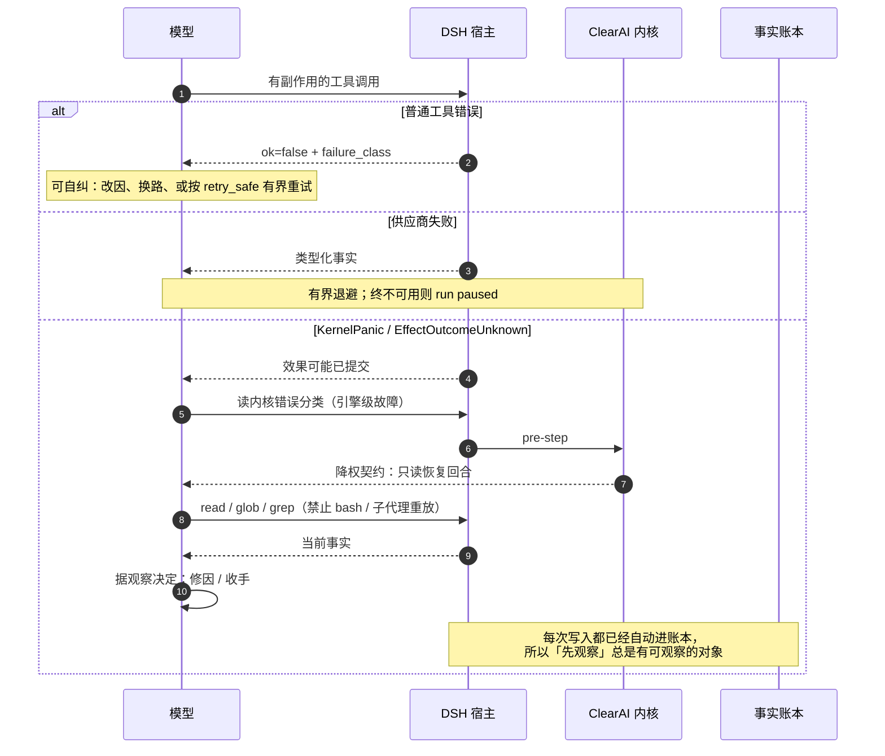
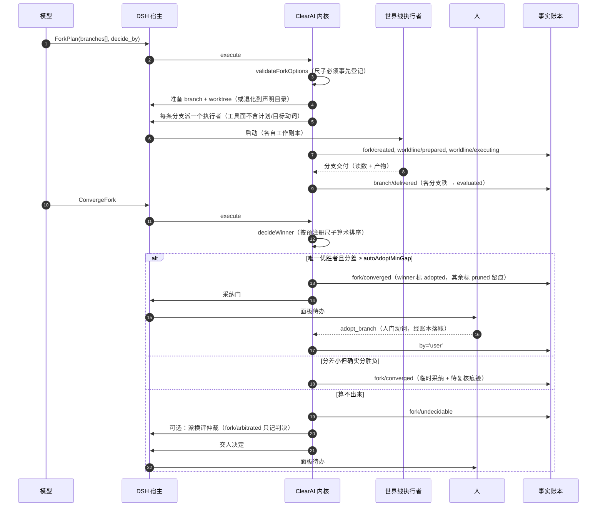
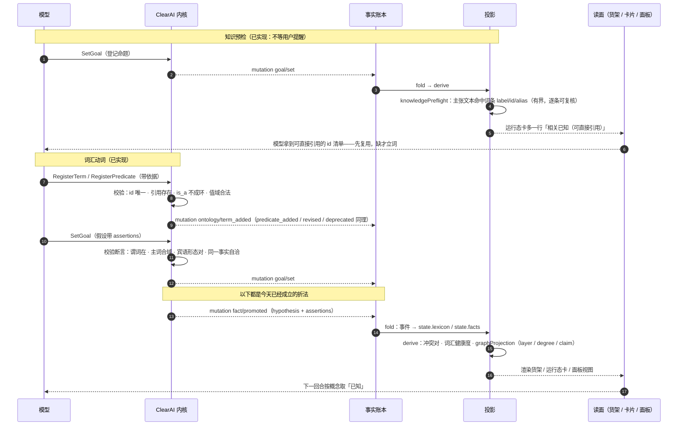
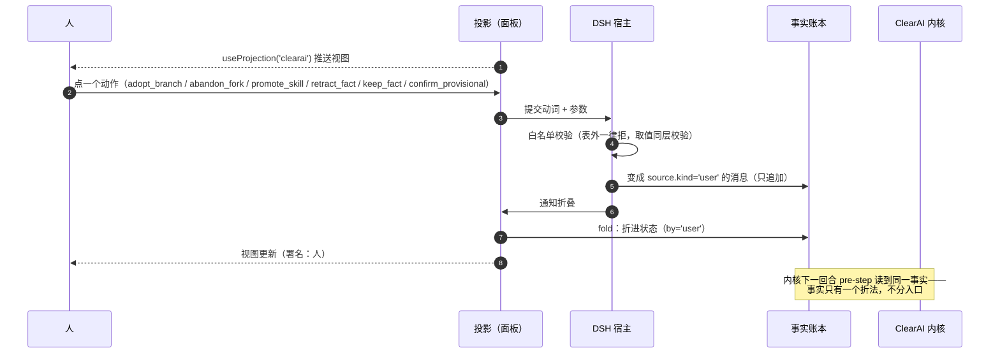

# ClearAI 预期时序图

> 这些图描述**六条主路径上，谁在什么时候对谁做了什么**。
> 与状态机（[`state-machines.zh-CN.md`](state-machines.zh-CN.md)）配套：
> 状态机回答「有哪些状态」，时序图回答「谁把它推过去的」。
> 图里出现的工具名与事件名都可以在代码里逐条对上。

## 0. 固定角色表（所有图共用这一套，不再有别名）

| 角色 | 是什么 | 不是什么 |
|---|---|---|
| **人** | 用户。只有他能做三件事：在原生审阅卡上批准计划、在原生审批栈里放行 L4、在面板上按人门动词 | 不是系统组件 |
| **模型** | LLM 推理体。它**发出意图**（工具调用、答复），不执行任何东西 | 不是「Agent 系统」；它不碰账本、不碰文件，一切经宿主转手 |
| **DSH 宿主** | 引擎：回合循环、工具调度、沙箱与审批、原生审阅卡、子代理、goals 服务（续跑驱动）、会话日志的写入 | 不做认识论判断；它不知道「什么可以被相信」 |
| **ClearAI 内核** | preset 插件：29 件意图工具 + guard + 运行态卡。**权威变更（mutations）的唯一生产者** | 不执行回合、不渲染界面、不持久化 |
| **事实账本** | 只追加的事实记录。**内容是我们的**：clearai 变更事件 + `clear/` 产物与评估卡；**载体是宿主的**：会话日志 + 文件系统。它不存结论——「现在可以相信什么」由投影从它折叠出来 | 不是第二本状态账；状态不从它「读出来」，而是「折出来」 |
| **投影** | 宿主半 `ui/lib`：fold（账本 → 状态）+ derive（状态 → 视图）+ 面板。**只读本账本，从不写** | 不是缓存，不是副本——同一份事实的一种看法 |
| **独立评估者** | 内核经宿主派出的 fresh-context 只读子代理（L3+），带 `outputSchema` 回结构化裁决 | 不是执行者的分身；做判分离的那一半 |
| **世界线执行者** | 每条互斥分支一个，各占一份工作副本，工具面不含计划/目标动词 | 不能立约、不能结案 |

旧名词对照：**Agent** = 拆成「模型 + DSH 宿主」；**内核** = ClearAI 内核；**投影 / 面板** = 投影；**账本（git）** = 事实账本。

一次意图工具调用的完整链路（后面所有图的箭头都是它的局部）：

记住这条链，后面五张图里「内核 → 账本 → 投影」的每一段都是它，不再重复展开。

## 1. 轻量探索路径 · 部分实现

**目的**：允许模型先用 DSH 原生能力做低权威探索，不强迫立刻建立正式计划。

当前状态：**已实现**。它由两件事承担，而**都不是「区」这个对象**：

- **负半是机制**：原生工作方式都已挂载（`tool-todo`、子代理、`workflow`、`ralph`），
  而边界套件钉住了它们**没有一条**能产出 `clearai` 变更。
- **正半是覆盖面，不是区域**：本会话写过东西的每一道回合边界都落一次工作区快照，
  于是立约之前产出的东西也在账本里——可查、可恢复。它不声称的是**归属**
  （见 [已知缺口](../known-gaps.zh-CN.md)）。

「探索区」作为**被命名的模式**已经注销：做成机制等于拿劝告冒充机制，做成界面又只是给同一件事
起第二个名字。它背后的需求——「探索期的产出必须有据可查」——由上两条承担。

## 2. 正式认识论路径 · 已实现

三个必须记住的边界：

1. **准入不裁决**。准入只回答「收不收」，`support / refute` 是评估者或 L0–L2 自判的事。
2. **L3 以上写 verdict 会被拒绝**（`verdict_not_accepted`）。
3. **结案前必须先收尾计划**，否则内核拒收。

## 3. 失败与恢复路径 · 已实现（机制侧）/ 仅提示词（恢复纪律）

当前状态：账本与准入是机制；**恢复纪律本身只在提示词里**（`clearai/execution-discipline`）。
把它从「建议」升级为边界，需要宿主侧配合，属后续议题。

## 4. 世界线路径 · 已实现

要点：

- 算术只负责**排序**；`adopt_branch` 是人按的那一下。
- 落选分支只删工作副本，**保留 branch ref**，因为事后改判依赖它永久可读。
- 分叉已收口而执行者未归 → 派生 `unreturned`，不再等。

## 5. 领域本体路径 · 已实现（折法、动词与面板都在跑）

**目的**：说清词汇与断言怎么进账本、又怎么变成图。**折法那一半**（六个词汇事件、断言、冲突与图的派生）
与**七个动词**（注册 / 修订 / 废止 / 查询）都已接；**面板也接了**（图带 / 断言芯片 / 冲突行 / 词汇维护区，
以及经人门通道的图编辑——与模型动词同一套判据、同一本账）。

四条边界（每条都有测试或写进[已知缺口](../known-gaps.zh-CN.md)）：

1. **登记即拒**：引用不存在、已废止或值域不符的断言在**落账之前**被拒——不进账本，就没有「先污染后治理」。
2. **冲突只暴露**：由 `derive()` 现算，不撤回任何一侧、不判断哪条为真、**不进闸门**；处置走既有的人门（`fact/reviewed`）。
3. **图是渲染**：`graphProjection()` 是确定性纯函数（同一账本必得同一张图），坐标不进账本。
4. **货架有主人**：`domain.md` 与 `facts/INDEX.md` 是**工作区级**读面，只有拥有账本的会话能铺——
   写入口自带所有权判据，派出去的子会话（评估者 / 侦察 / 执行者）结构上写不进
   （它们与主线共享工作区、却各持一份投影；让它们铺，共享读面就会在「谁最后铺了一拍」之间摆动）。
   行为由 kernel 套件钉、结构由 authority-boundary 套件钉。

## 6. 人门（human gate）路径 · 已实现

三条硬约束（每条都有测试）：

1. 动词白名单，表外拒绝，取值也在这一层校验。
2. 这些动词**没有工具 schema**，模型的工具面里不存在它们。
3. 动作留下署名，折进投影时写 `by:'user'`。
