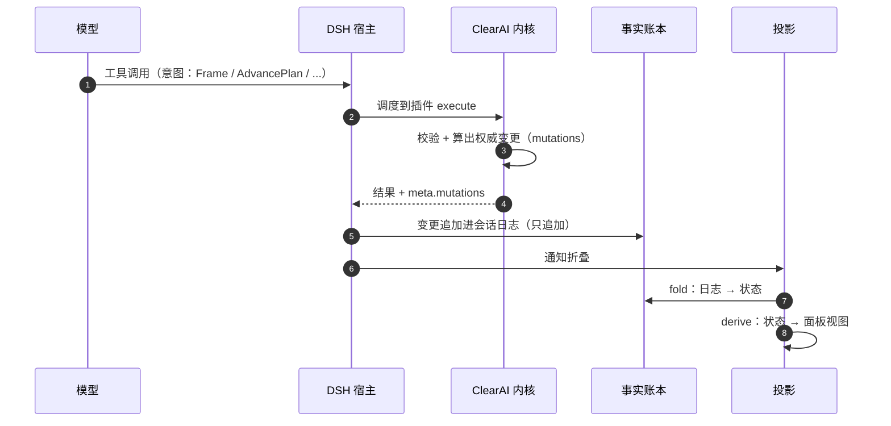
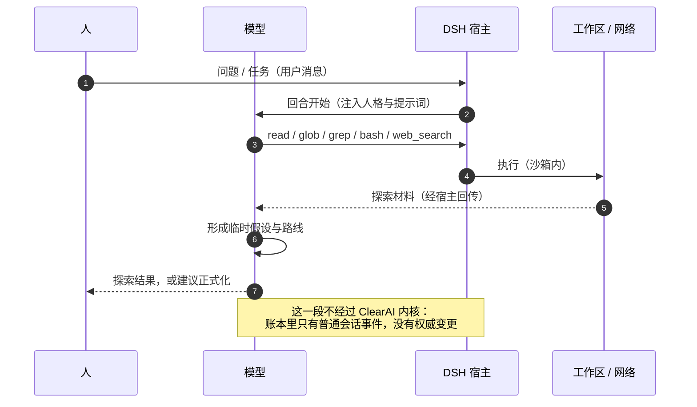
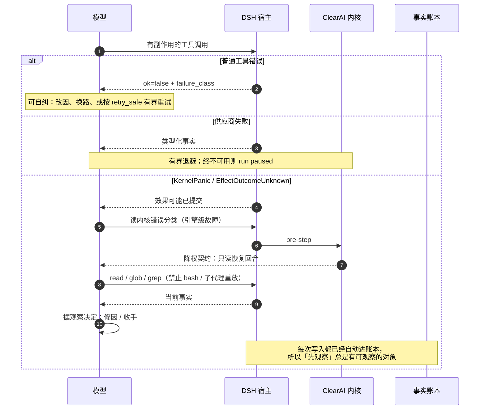
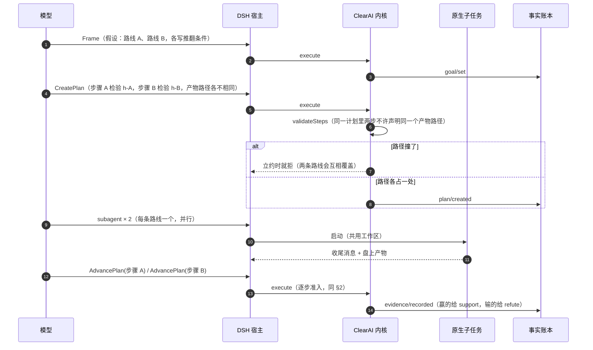
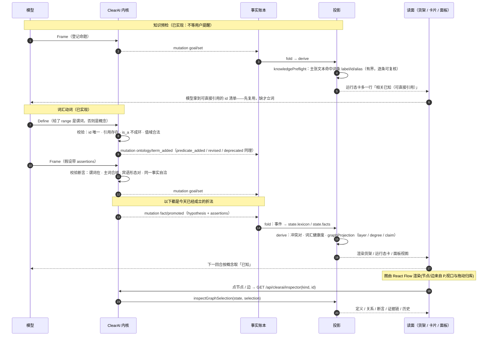
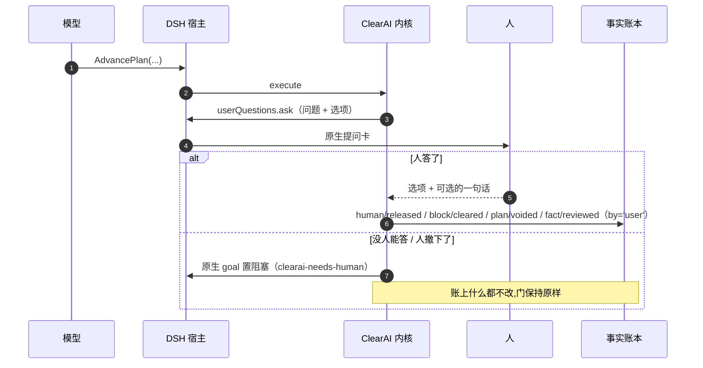
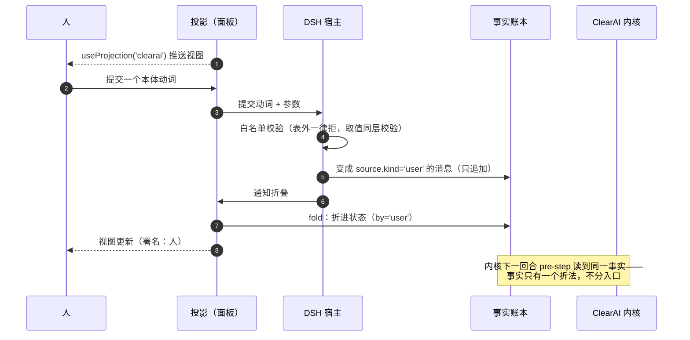

# ClearAI 预期时序图

> 这些图描述**六条主路径上，谁在什么时候对谁做了什么**。
> 与状态机（[`state-machines.zh-CN.md`](state-machines.zh-CN.md)）配套：
> 状态机回答「有哪些状态」，时序图回答「谁把它推过去的」。
> 图里出现的工具名与事件名都可以在代码里逐条对上。

## 0. 固定角色表（所有图共用这一套，不再有别名）

| 角色 | 是什么 | 不是什么 |
|---|---|---|
| **人** | 用户。只有人能做两件事：回答系统当场问的问题（L4 放行、计划卡住、事实被推翻）、在面板上提交本体动词 | 不是系统组件 |
| **模型** | LLM 推理体。它**发出意图**（工具调用、答复），不执行任何东西 | 不是「Agent 系统」；它不碰账本、不碰文件，一切经宿主转手 |
| **DSH 宿主** | 引擎：回合循环、工具调度、沙箱与审批、子代理、goals 服务（原生目标与续跑）、userQuestions（原生提问卡）、会话日志的写入 | 不做认识论判断；它不知道「什么可以被相信」 |
| **ClearAI 内核** | preset 插件：10 件意图工具 + guard + 运行态卡。**权威变更（mutations）的唯一生产者** | 不执行回合、不渲染界面、不持久化 |
| **事实账本** | 只追加的事实记录。**内容是我们的**：clearai 变更事件 + `clear/` 产物与评估卡；**载体是宿主的**：会话日志 + 文件系统。它不存结论——「现在可以相信什么」由投影从它折叠出来 | 不是第二本状态账；状态不从它「读出来」，而是「折出来」 |
| **投影** | 宿主半 `ui/lib`：fold（账本 → 状态）+ derive（状态 → 视图）+ 面板。**只读本账本，从不写** | 不是缓存，不是副本——同一份事实的一种看法 |
| **独立评估者** | 内核经宿主派出的 fresh-context 只读子代理（L3+），带 `outputSchema` 回结构化裁决 | 不是执行者的分身；做判分离的那一半 |
| **原生子任务** | 宿主自己的 subagent，由模型派出、并行跑一条路线。它与主线共用工作区，所以每条路线声明自己的产物路径 | 不是我们的；它不交付步骤——交付归模型 |

旧名词对照：**Agent** = 拆成「模型 + DSH 宿主」；**内核** = ClearAI 内核；**投影 / 面板** = 投影；**账本（git）** = 事实账本。

一次意图工具调用的完整链路（后面所有图的箭头都是它的局部）：

```mermaid
sequenceDiagram
    autonumber
    participant M as 模型
    participant D as DSH 宿主
    participant K as ClearAI 内核
    participant L as 事实账本
    participant P as 投影

    M->>D: 工具调用（意图：Frame / AdvancePlan / ...）
    D->>K: 调度到插件 execute
    K->>K: 校验 + 算出权威变更（mutations）
    K-->>D: 结果 + meta.mutations
    D->>L: 变更追加进会话日志（只追加）
    D->>P: 通知折叠
    P->>L: fold：日志 → 状态
    P->>P: derive：状态 → 面板视图
```

记住这条链，后面五张图里「内核 → 账本 → 投影」的每一段都是它，不再重复展开。

## 1. 轻量探索路径 · 部分实现

**目的**：允许模型先用 DSH 原生能力做低权威探索，不强迫立刻建立正式计划。

```mermaid
sequenceDiagram
    autonumber
    participant H as 人
    participant M as 模型
    participant D as DSH 宿主
    participant W as 工作区 / 网络

    H->>D: 问题 / 任务（用户消息）
    D->>M: 回合开始（注入人格与提示词）
    M->>D: read / glob / grep / bash / web_search
    D->>W: 执行（沙箱内）
    W-->>M: 探索材料（经宿主回传）
    M->>M: 形成临时假设与路线
    M-->>H: 探索结果，或建议正式化
    Note over M,D: 这一段不经过 ClearAI 内核：<br/>账本里只有普通会话事件，没有权威变更
```

当前状态：**已实现**。它由两件事承担，而**都不是「区」这个对象**：

- **负半是机制**：原生工作方式都已挂载（`tool-todo`、子代理、`workflow`、`ralph`），
  而边界套件钉住了它们**没有一条**能产出 `clearai` 变更。
- **正半是覆盖面，不是区域**：本会话写过东西的每一道回合边界都落一次工作区快照，
  于是立约之前产出的东西也在账本里——可查、可恢复。它不声称的是**归属**
  （见 [已知缺口](../known-gaps.zh-CN.md)）。

「探索区」作为**被命名的模式**已经注销：做成机制等于拿劝告冒充机制，做成界面又只是给同一件事
起第二个名字。它背后的需求——「探索期的产出必须有据可查」——由上两条承担。

## 2. 正式认识论路径 · 已实现

```mermaid
sequenceDiagram
    autonumber
    participant M as 模型
    participant D as DSH 宿主
    participant K as ClearAI 内核
    participant H as 人
    participant E as 独立评估者
    participant L as 事实账本

    M->>D: Frame(claim, done_criteria, hypotheses)
    D->>K: execute
    K->>L: goal/set（派生阶段 planning）
    K->>D: 原生 goal：建一条（或改目标文字），续跑由它驱动

    M->>D: CreatePlan(brief, steps[].done_criteria, steps[].tests.hypotheses)
    D->>K: execute
    K->>K: validateSteps（判据必填、不自指、≤25 步）
    K->>L: plan/created
    Note over M,H: 想让人在动手前看计划,用原生 /plan;ClearAI 不另起审阅卡

    M->>D: AdvancePlan(step_id, basis, results[])
    D->>K: execute
    opt L4
        K->>D: userQuestions：当场问人放不放行
        D->>H: 原生提问卡
        H-->>K: 放行 / 不放行（没人能答 ⇒ 拒收,原生 goal 置阻塞）
        K->>L: human/released
    end
    K->>K: admission：产物存在 / 非空 / 结构合法
    alt 准入没过
        K->>L: block/counted（连续达 blockedThreshold → plan/blocked,当场问人）
    else 准入通过且 L0–L2
        K->>L: evidence/recorded（每条结果一条）+ step/advanced
    else 准入通过且 L3+
        K->>D: 派 fresh-context 只读评估者
        D->>E: 启动（带 outputSchema）
        E-->>K: 两份判断:交付成不成立(holds) + 每条判断的结果
        alt holds = yes
            K->>L: audit/settled + evidence/recorded（每条结果一条）+ step/advanced
        else holds = no / unclear
            K->>L: audit/settled + block/counted（不推进）
        end
    end

    M->>D: ClosePlan → Conclude(outcome=achieved)
    D->>K: execute
    K->>D: 派目标评估者（合成 step，判据 = goal.done_criteria）
    D->>E: 启动
    E-->>K: holds = yes
    K->>L: goal/closed + fact/promoted（达 promote_at_level 且无推翻）
    K->>D: 原生 goal 完成 + 声明交付物
```

必须记住的边界：

1. **准入不裁决**。准入只回答「收不收」，结果（support / refute / inconclusive）是评估者或 L0–L2 自判的事。
2. **L3 以上自己写结果会被拒绝**（`verdict_not_accepted`）。
3. **完成与结果分开**：交付成立这一步就完成，结果是推翻或说不清也一样。
4. **结案前必须先收尾计划**，否则内核拒收。

## 3. 失败与恢复路径 · 已实现（机制侧）/ 仅提示词（恢复纪律）

```mermaid
sequenceDiagram
    autonumber
    participant M as 模型
    participant D as DSH 宿主
    participant K as ClearAI 内核
    participant L as 事实账本

    M->>D: 有副作用的工具调用
    alt 普通工具错误
        D-->>M: ok=false + failure_class
        Note over M: 可自纠：改因、换路、或按 retry_safe 有界重试
    else 供应商失败
        D-->>M: 类型化事实
        Note over M,K: 有界退避；终不可用则 run paused
    else KernelPanic / EffectOutcomeUnknown
        D-->>M: 效果可能已提交
        M->>D: 读内核错误分类（引擎级故障）
        D->>K: pre-step
        K-->>M: 降权契约：只读恢复回合
        M->>D: read / glob / grep（禁止 bash / 子代理重放）
        D-->>M: 当前事实
        M->>M: 据观察决定：修因 / 收手
        Note over D,L: 每次写入都已经自动进账本，<br/>所以「先观察」总是有可观察的对象
    end
```

当前状态：准入是机制。只读恢复的纪律原本只在提示词里，第五阶段提示词收成三段时删掉了，
只在身份段（`clearai/identity`）留一句：结局不明的操作先看当前事实，再谈重试。
把它升级为边界需要宿主侧配合，属后续议题。

## 4. 竞争路线路径 · 已实现

世界线已在第二阶段删除。两条做法迥异的路线就是两条竞争的假设，各由一个步骤检验；
并行交给宿主自己的子任务。

```mermaid
sequenceDiagram
    autonumber
    participant M as 模型
    participant D as DSH 宿主
    participant K as ClearAI 内核
    participant S as 原生子任务
    participant L as 事实账本

    M->>D: Frame（假设：路线 A、路线 B，各写推翻条件）
    D->>K: execute
    K->>L: goal/set
    M->>D: CreatePlan（步骤 A 检验 h-A，步骤 B 检验 h-B，产物路径各不相同）
    D->>K: execute
    K->>K: validateSteps（同一计划里两步不许声明同一个产物路径）
    alt 路径撞了
        K-->>D: 立约时就拒（两条路线会互相覆盖）
    else 路径各占一处
        K->>L: plan/created
    end
    M->>D: subagent × 2（每条路线一个，并行）
    D->>S: 启动（共用工作区）
    S-->>D: 收尾消息 + 盘上产物
    M->>D: AdvancePlan(步骤 A) / AdvancePlan(步骤 B)
    D->>K: execute（逐步准入，同 §2）
    K->>L: evidence/recorded（赢的给 support，输的给 refute）
```

要点：

- 谁成立由证据说；没有采纳门。输的那条是被推翻的假设，照样留在账上。
- 两条都成立而互相矛盾时，模型如实写出来交给人；冲突只呈现，不设门。
- 同一计划里产物路径互斥，因为子任务共用一个工作区。

## 5. 领域本体路径 · 已实现（折法、动词与面板都在跑）

**目的**：说清词汇与断言怎么进账本、又怎么变成图。**折法那一半**（六个词汇事件、断言、冲突与图的派生）
与**四个动词**（`Define` 立词或修订 / `Deprecate` 废止 / `RegisterInstance` 实例登记 / `Assert` 断言）都已接；**面板也接了**（图带 / 断言芯片 / 冲突行 / 词汇维护区，
以及经人门通道的图编辑——与模型动词同一套判据、同一本账）。

```mermaid
sequenceDiagram
    autonumber
    participant M as 模型
    participant K as ClearAI 内核
    participant L as 事实账本
    participant P as 投影
    participant G as 读面（货架 / 卡片 / 面板）

    Note over M,P: 知识预检（已实现：不等用户提醒）
    M->>K: Frame（登记命题）
    K-->>L: mutation goal/set
    L->>P: fold → derive
    P->>P: knowledgePreflight：主张文本命中词条 label/id/alias（有界，逐条可复核）
    P-->>G: 运行态卡多一行「相关已知（可直接引用）」
    G-->>M: 模型拿到可直接引用的 id 清单——先复用，缺才立词

    Note over M,K: 词汇动词（已实现）
    M->>K: Define（给了 range 是谓词，否则是概念）
    K->>K: 校验：id 唯一 · 引用存在 · is_a 不成环 · 值域合法
    K-->>L: mutation ontology/term_added（predicate_added / revised / deprecated 同理）
    M->>K: Frame（假设带 assertions）
    K->>K: 校验断言：谓词在 · 主词合域 · 宾语形态对 · 同一事实自洽
    K-->>L: mutation goal/set
    Note over K,L: 以下都是今天已经成立的折法
    K-->>L: mutation fact/promoted（hypothesis + assertions）
    L->>P: fold：事件 → state.lexicon / state.facts
    P->>P: derive：冲突对 · 词汇健康度 · graphProjection（layer / degree / claim）
    P-->>G: 渲染货架 / 运行态卡 / 面板视图
    G-->>M: 下一回合按概念取「已知」
    Note over G: 图由 React Flow 渲染(节点/边来自 P,视口与拖动归库)
    G->>K: 点节点 / 边 → GET /api/clearai/inspector(kind, id)
    K->>P: inspectGraphSelection(state, selection)
    P-->>G: 定义 / 关系 / 断言 / 证据链 / 历史
```

五条边界（每条都有测试或写进[已知缺口](../known-gaps.zh-CN.md)）：

1. **登记即拒**：引用不存在、已废止或值域不符的断言在**落账之前**被拒——不进账本，就没有「先污染后治理」。
2. **冲突只暴露**：由 `derive()` 现算，不撤回任何一侧、不判断哪条为真、**不进闸门**；处置走既有的人门（`fact/reviewed`）。
3. **图是渲染**：`graphProjection()` 是确定性纯函数（同一账本必得同一张图），坐标不进账本。
4. **图是渲染，不是第二本账**：`graphProjection()` 出的是纯语义（节点 / 边 / 包围盒），
   视口 / 拖动 / 可见性归 React Flow；客户端的 Inspector 读数一律经
   `GET /api/clearai/inspector` 向宿主取，自己不拼证据链。交互不产生任何 mutation。
5. **货架有主人**：`domain.md` 与 `facts/INDEX.md` 是**工作区级**读面，只有拥有账本的会话能铺——
   写入口自带所有权判据，派出去的子会话（评估者 / 执行者）结构上写不进
   （它们与主线共享工作区、却各持一份投影；让它们铺，共享读面就会在「谁最后铺了一拍」之间摆动）。
   行为由 kernel 套件钉、结构由 authority-boundary 套件钉。

## 6. 人门（human gate）路径 · 已实现

要人拍板的事有两种入口。**当场问**：开门的那次调用自己问人（L4 放行、计划卡住、事实被推翻），答复当场回到那次调用里落账：

```mermaid
sequenceDiagram
    autonumber
    participant M as 模型
    participant D as DSH 宿主
    participant K as ClearAI 内核
    participant H as 人
    participant L as 事实账本

    M->>D: AdvancePlan(...)
    D->>K: execute
    K->>D: userQuestions.ask（问题 + 选项）
    D->>H: 原生提问卡
    alt 人答了
        H-->>K: 选项 + 可选的一句话
        K->>L: human/released / block/cleared / plan/voided / fact/reviewed（by='user'）
    else 没人能答 / 人撤下了
        K->>D: 原生 goal 置阻塞（clearai-needs-human）
        Note over K,L: 账上什么都不改,门保持原样
    end
```

**面板**：本体四个动词（register_term / register_predicate / revise_term / deprecate_entry）从面板提交：

```mermaid
sequenceDiagram
    autonumber
    participant H as 人
    participant P as 投影（面板）
    participant D as DSH 宿主
    participant L as 事实账本
    participant K as ClearAI 内核

    P-->>H: useProjection('clearai') 推送视图
    H->>P: 提交一个本体动词
    P->>D: 提交动词 + 参数
    D->>D: 白名单校验（表外一律拒，取值同层校验）
    D->>L: 变成 source.kind='user' 的消息（只追加）
    D->>P: 通知折叠
    P->>L: fold：折进状态（by='user'）
    P-->>H: 视图更新（署名：人）
    Note over K,L: 内核下一回合 pre-step 读到同一事实——<br/>事实只有一个折法，不分入口
```

面板那条路的三条硬约束（每条都有测试）：

1. 动词白名单，表外拒绝，取值也在这一层校验。
2. 这些动词**没有工具 schema**，模型的工具面里不存在它们。
3. 动作留下署名，折进投影时写 `by:'user'`。
