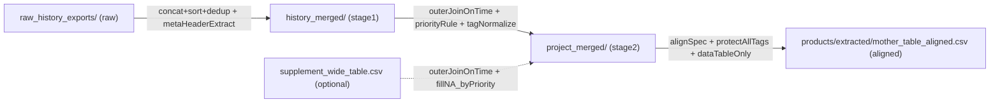
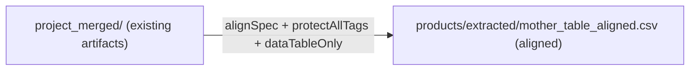
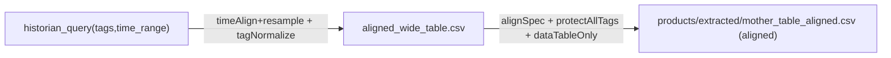

# Workflow 1: 数据源盘点与数据血缘 (Data Source Inventory & Lineage)

## 目标
建议在你已经具备“上游系统边界与结构骨架”的前提下（例如已拿到 `products/extracted/unit_inventory.md`、`products/extracted/segment_boundary.md`、`products/extracted/entity_map.json`），先回答两个问题：
1. **我正在分析的数据从哪里来？**（数据源盘点）
2. **我现在已有的数据是否已经“对齐可用”？如果没有，我如何用已有数据合成一张“对齐的母表/指标母表”？**（时间对齐 + 信息对齐 + 可追溯）

> **Rule**：未完成最小血缘交付物（数据源清单 + 血缘图 + 冲突优先级）前，禁止进入稳态、单位代价、BiC/P20 等下游分析。

## 输入
- 原始数据导出（历史 CSV、采集系统导出、离线检测/人工记录、报警/事件日志）
- 元数据（通道清单、单位、设计值/告警限、实验方案/操作说明文本）
- 现有合并/清洗产物（若已存在）

## 步骤

### Step 1: 盘点所有数据源（Inventory）
至少列出以下字段：
- **路径**：文件夹/文件名模式（含通配）
- **来源系统**：采集系统/时序数据库/历史库/手工记录表/检测系统/公开数据集/管理系统
- **数据类型**：连续模拟量/离散状态/事件日志/离线检测点检/设计值与告警限
- **时间范围**：起止时间、时区
- **采样频率/粒度**：1min/5min/1h/按事件
- **关键字段**：时间列、主键（如实验批次号）、Tag/通道列
- **表头结构**：是否存在多行表头（描述/要点/设计值/告警限），以及其行含义
- **编码与单位**：utf-8-sig/gbk；单位是否统一

产出填入：`templates/data_source_inventory_and_lineage.md.tpl` 的“数据源清单”章节。

### Step 2: 定义“对齐母表”的目标与表结构（Mother Table Alignment Spec）
把项目中真正用于计算 KPI/稳态/标杆的表明确为 **母表**。然后用“对齐视角”写清楚它的规格（Spec）：
- **时间对齐**：时间列字段名、时区、解析规则、采样粒度（1min/5min/1h）、重采样策略（如需）
- **通道对齐**：通道全集来自哪些数据源？是否需要 Tag 归一化（`-/_`、`.PV/.OUT`）与映射表？
- **元数据对齐**：描述/要点/方案/设计值/告警限/正常范围来自哪一层？如何与数据层绑定？
- **单位与口径对齐**：g/s vs kg/h、计数 vs 速率；净输入/净输出/内部循环规则是否已与系统边界一致？

> **建议**：母表命名统一包含“合并后 / filtered / mother”关键词，避免多人协作时搞混版本。

### Step 3: 绘制“对齐流水线血缘”（Alignment Lineage）
使用 Mermaid 画出“从**已有数据源/已有产物** → 对齐加工 → 母表”的链路，并给每一条边补充：
- **时间轴处理**：join key、outer/left、dedup、resample
- **通道处理**：归一化/映射、冲突优先级（同通道同时间）、缺失补齐策略
- **元数据处理**：多行表头保留策略/结构化拆分策略、元数据优先级

> **说明**：很多项目并不会要求你从“最原始导出”开始复现整条加工链路，而是直接给到若干**已有中间产物**（例如 `历史数据_合并/`、`补充_合并大表.csv`）。
> 此时血缘图的起点应以“已有中间产物”为准；同时在备注中保留“可选的上游追溯路径”（用于审计与复现）。

最小血缘图应包含：
- **原始数据节点**（按来源系统划分）
- **中间产物节点**（按加工阶段划分）
- **母表节点**

#### 3.1 母表合成模式库（Patterns，非唯一，但必须选一种并声明）
不同项目拿到的“上游数据形态”不同，母表（`products/extracted/mother_table_aligned.csv`）的合成链路也不同。下列模式是常见情形，但不是唯一方式。
> **强制要求**：你必须明确声明“本项目采用哪一种 Pattern（P0~P5）”，并在 `products/extracted/data_lineage.mmd` 的首段写清理由与各 stage 的输入/输出文件名模式（用占位路径表达）。
> **禁止**：只画一个“FullTable→MotherTable”而不解释 FullTable 的来源与阶段（否则无法追溯）。

**Pattern P0（最小交付）**：只拿到现成母表或同等对齐宽表
- 输入：`lab/data/mother_table_aligned.csv`（或 `input/` 中等价文件，对齐后落 `products/extracted/`）
- 要求：仍需补齐 Step 2 的 Spec 与 Step 4 的 Contract（否则口径不可复现）

**Pattern P1（分阶段合并）**：原始历史导出 → 历史合并产物 → 项目级合并产物 → 对齐母表
- 形态：`lab/data/raw_history_exports/` → `lab/data/history_merged/` → `lab/data/project_merged/` → `products/extracted/mother_table_aligned.csv`
- 适用：你确实看到了“先把历史数据合成一个合并目录/宽表”，再进入“项目级合并后目录/宽表”的情况

**Pattern P2（已有项目级宽表直对齐）**：只拿到项目级合并宽表，再按 Spec/Contract 对齐
- 形态：`lab/data/project_merged/` → `products/extracted/mother_table_aligned.csv`

**Pattern P3（直连历史库查询对齐）**：从时序数据库/历史库按 tag 清单拉取对齐宽表
- 形态：`historian_query(tags,time_range)` → `lab/data/aligned_wide_table.csv` → `products/extracted/mother_table_aligned.csv`

**Pattern P4（多观测段多母表）**：一个项目多个观测段/实验阶段，各自母表，再汇总系统母表
- 形态：`products/extracted/mother_segment_*/` → `products/extracted/system_mother_table_aligned.csv`
- 要求：必须写清“系统级口径如何合并”（并行子系统相加/取加权平均/按边界重算）

**Pattern P5（增量追加滚动重算）**：按月/按批追加，周期性去重、冲突覆盖，滚动产出母表
- 形态：`lab/data/monthly_append/` → `lab/data/rolling_merged/` → `products/extracted/mother_table_aligned.csv`

#### 3.2 选型闸门（强制写入血缘交付）
在 `products/extracted/data_lineage.mmd` 的开头（非 Mermaid 图内）必须写出：
- 选用 Pattern：P0/P1/P2/P3/P4/P5
- 选型理由：你拿到的上游产物是什么、为什么跳过/包含某些阶段
- Stage 列表：每一层的输入/输出文件名模式（glob），以及该层的关键加工动作（concat/dedup/outer join/priority/meta header）

#### 3.3 同一项目存在多张母表（必须支持）
同一项目中同时存在多张母表是常见情况，例如：
- **按观测段拆分**：不同 segment 各自一张 `products/extracted/mother_table_aligned.csv`（对应 Pattern P4）
- **按粒度拆分**：1min 母表用于稳态/波动，1h 母表用于代价/报表
- **按用途拆分**：全量对齐母表（保护所有通道）与若干派生表（如稳态表）；需要明确“谁是母表、谁是派生表”

> **Rule（强制）**：当存在多张母表时，不允许只写“一个母表路径”。必须建立并维护一份“母表清单（Mother Table Registry）”，让每张母表都可追溯、可复现、可对齐口径。

**强制产出**：`products/extracted/mother_table_registry.md`（或 `.csv`，二选一即可）

Registry 至少包含以下字段（建议按表格输出）：
- `mother_id`：母表唯一标识（例如 `segment_fieldtest_1min`）
- `path`：母表文件路径（例如 `products/extracted/mother_tables/<segment>/mother_table_aligned.csv`）
- `boundary_or_segment`：对应边界/观测段（引用上游结构骨架的边界定义口径）
- `time_grain`：时间粒度（1min/5min/1h/…）
- `intended_use`：用途（稳态识别/单位代价/诊断/报表/…）
- `pattern_id`：采用的 Pattern（P0~P5）
- `upstream_artifacts`：上游输入产物（glob）
- `merge_contract_ref`：合并契约引用（`products/extracted/merge_contract.md` 的章节或补充文件）
- `notes`：例如“这是系统级母表/这是 segment 母表/这是派生表（非母表）”

### Step 4: 固化“冲突优先级”和“时间去重规则”
连续观测/长期实验常见的冲突：
- **同一 Tag + 同一时间点**，来自多个源（历史库 vs 补充导出）
- **同一时间点多行重复**（通讯重传/导出重复/拼接重复）
- **同一 Tag 多种命名**（下划线/横线、后缀 `.PV/.OUT/.MV`）

必须明确：
- **冲突优先级**：谁覆盖谁、谁用于填空
- **去重规则**：`keep="first"` / `keep="last"` / 聚合（平均/中位数）
- **时间解析**：时区、字符串格式、非法值处理

### Step 5: （可选）把“多行表头”当作元数据层处理
如果 CSV/Excel 不是“单行表头”，而是多行（如“描述/要点/方案/设计值/告警限”），建议将其拆为：
- `header_meta`：通道 → (描述/要点/方案片段/设计值/告警限/正常范围/仪器量程)
- `data_table`：时间点 → 通道值

并在后续 pipeline 中做到：
- **元数据优先合并/覆盖**（通常来自权威通道清单/实验方案）
- **数据层按时间点对齐**（outer join）

### Step 6: 生成“对齐母表”（强制产出）
基于 Step 2 的母表规格（Spec）与 Step 4 的合并契约（Contract），必须落地生成一份“可直接用于稳态/单位代价/BiC”的对齐母表。

**强制要求**：
- **时间对齐**：以时间列为 join key，采用 outer join 得到“时间点并集”（除非 Spec 明确要求 left join）。
- **通道保护**：采用 outer join 合并通道全集，默认不因缺失率/疑似异常而删列（列删除必须在 Contract 中显式声明）。
- **冲突可追溯**：同通道同时间冲突严格按优先级覆盖，并在 `products/extracted/merge_contract.md` 说明覆盖/填空策略。
- **元数据不丢**：如果存在多行表头/元数据行，必须结构化拆分为 `header_meta`（元数据层）+ `data_table`（数据层），并在 Contract 中固定。
  - `products/extracted/mother_table_aligned.csv` **必须是数据层（data_table）**，用于后续所有统计/稳态/标杆计算。
  - `products/extracted/header_meta.csv` 用于解释与治理（描述/单位/量程/设计值/告警限/来源），不得与数据行混排进入后续计算。

**下游依赖（强制）**：
- 从本 workflow 结束开始，后续所有分析（稳态、代价、波动、BiC、改进空间）**只能**基于本步骤产出的 `products/extracted/mother_table_aligned.csv`（以及可选的 `products/extracted/header_meta.csv`、`products/extracted/tag_map.csv`）。
- 禁止后续 workflow 直接读取“上游原始导出文件”进行指标计算（否则口径会漂移、结论不可复现）。

> **补充**：如果本项目存在多张母表（按观测段/按粒度/按用途），则 Step 6 需要为每张母表分别执行一次 Spec+Contract 的对齐落地，并在 `products/extracted/mother_table_registry.md` 中登记清楚（母表之间的关系、用途、是否为系统级母表）。

## 产出物（Outputs）
- `products/extracted/data_source_inventory.md`：数据源盘点清单（可复用）
- `products/extracted/data_lineage.mmd`：血缘图（Mermaid）
- `products/extracted/merge_contract.md`：合并契约（冲突优先级、去重策略、表头行策略）
- `products/extracted/mother_table_aligned.csv`：对齐母表（时间点对齐 + 通道全集；若多母表则为其中之一或以文件夹承载）
- `products/extracted/mother_table_registry.md`：母表清单（当存在多张母表时强制；推荐始终产出）
- （可选，但推荐）`products/extracted/header_meta.csv`：通道元数据层（描述/单位/量程/设计值/告警限/来源）
- （可选）`products/extracted/tag_map.csv`：通道归一化与映射（raw_tag → canonical_tag → role/PV/MV/KPI）

## 闸门（确认后进入下一 Workflow）
在进入 `workflows/02-data-alignment-and-tag-semantics.md`（通道语义与对齐）或任何下游分析前，必须确认本 workflow 产出无误，并在 `products/extracted/merge_contract.md` 或 `products/extracted/data_source_inventory.md` 末尾追加“确认记录”（日期/确认人/结论/疑点与后续动作）。最少确认：
- **强制产出物是否齐全**：`products/extracted/data_source_inventory.md`、`products/extracted/data_lineage.mmd`、`products/extracted/merge_contract.md`、`products/extracted/mother_table_aligned.csv` 已生成；若存在多母表，`products/extracted/mother_table_registry.md` 已生成并登记清楚。
- Pattern 选型闸门已声明（P0~P5），且血缘图能解释每个 stage 的输入/输出与关键加工动作（不是“FullTable→MotherTable”一句话带过）。
- `products/extracted/merge_contract.md` 中 outer join/dedup/priority/meta header 策略可复现，且与实际产物一致。
- `products/extracted/mother_table_aligned.csv` 的时间轴连续性/去重/列保护策略符合 Spec；若存在多母表，`products/extracted/mother_table_registry.md` 已登记用途、边界、粒度与关系。

## 示例（Example，仅展示写法，不依赖具体文件路径）

> **说明**：下面示例展示“不同 Pattern 下的主链路长相”。交付时你只需要画出你项目实际采用的那一种（并在图上写清 merge/对齐动作）。

### 示例 1（Pattern P1）：分阶段合并（raw_history_exports → history_merged → project_merged → mother）

### 示例 2（Pattern P2）：已有项目级宽表直对齐（project_merged → mother）

### 示例 3（Pattern P3）：直连历史库查询对齐（historian_query → aligned_wide_table → mother）

### 示例 2：合并契约（冲突优先级）
以一个“历史库数据 + 补充导出数据”的常见组合为例，关键约束通常包括：
- **按时间点 outer join 取并集**
- **同通道同时间冲突：历史数据优先**；补充数据仅用于填充历史空值
- **表头多行需要整体保留**（描述/要点/方案/设计值/告警限/正常范围）
- 历史 CSV 常见编码 **gbk**；且存在“第 1 行为通道名、第 2 行为描述”的结构
