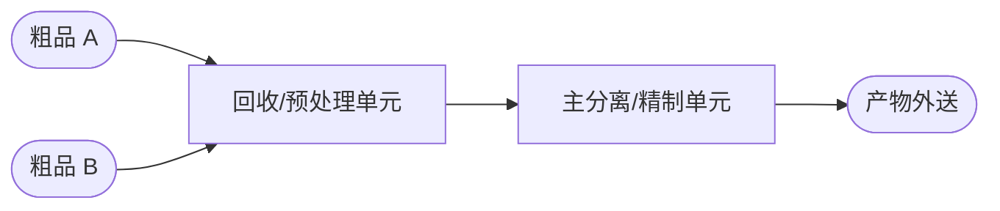

# Workflow 2: 流程理解与流程图产出 (Process Understanding & Diagramming)

## 目标
把“文字流程”转成可讨论、可校验、可复用的流程图（建议 Mermaid），并形成“单元/流股/能量流”的最小数字孪生骨架。

## 前置依赖
- `products/extracted/process_brief.md`（Workflow 01 产出，含逐字粘贴的流程叙述原文）
- `products/extracted/unit_inventory.md`（Workflow 01 产出，含存在性三态 + 流向 + 能量/资源接口）

## 步骤

### Step 1: 抽取单元操作与主要流股
从 `products/extracted/process_brief.md` 的**原文摘录区域**中抽取：
- **单元操作**：反应/分离/换热/真空/缓冲罐/泵/培养/过滤/处理模块等
- **主要流股**：进料、顶部采出、侧线采出、底部采出、回流、不凝气、排放
- **主要能流/资源流**：加热蒸汽、冷却水、真空系统能耗（电）等

> **硬规则（逐条溯源，推断必须显式标注）**：本 workflow 抽取的每一条“流股/能流连接”（谁→谁），都必须能在 `products/extracted/process_brief.md` **原文摘录**或 `products/extracted/unit_inventory.md` 中找到对应文字依据。
> - 若原文写“ A 的底部产物送入 B ”，则画 A→B。
> - 若原文只写“进料经 P 泵送入 C 单元”，则画 Feed→C（不得自行改为 Feed→A 再 A→C，除非原文如此描述）。
> - 若某条连接暂时缺少直接原文依据，允许标注为**推断（inferred）**，但必须：写出推断理由与依据来源，并在 `products/extracted/process_flow.md` 的“推断清单”中记录（见 Step 2 规则）。

### Step 1.1: 建立“输入去向映射表”（必须，画图前先做）
在画流程图之前，必须先产出一张“输入去向映射表”，明确每股外来输入（净输入）的**直接接收单元**：

| 输入名称/描述 | 直接接收单元 | 原文依据（逐字引用） | 来源位置 |
|--------------|-------------|---------------------|---------|
| （例：粗品 A） | （例：2# 回收单元） | （例：“粗品 A 经 Pxxx 泵送入 2# 回收单元”） | products/extracted/process_brief.md 原文摘录第 x 段 |

> **硬规则**：
> - “直接接收单元”必须是原文明确写出的目标单元/装置，**不允许凭序号或编号顺序推测**（例如不得因为“1# 单元在前面”就假设输入先进 1# 单元）。
> - 若原文只写了泵号（例如“经 Pxxx 送入”）但未写明目标单元，必须在“直接接收单元”列标注“待确认（原文仅提及泵号 Pxxx）”，并在 `products/extracted/unit_inventory.md` 中交叉查找。
> - 若存在多股输入（流程型系统常见），每股输入必须单独一行，不允许合并。
> - 该表必须写入 `products/extracted/process_flow.md` 的开头（在 Mermaid 图之前），作为流程图的溯源依据。

### Step 2: 画两张流程图（强烈建议）
1. **主流程图（不含公用支撑系统）**：只画对象/物料流，便于识别净输入/净输出/回流。
2. **能量/资源视角流程图（含公用支撑系统）**：补上蒸汽/冷却水/电等，便于定义消耗口径。

建议用模板起稿：`templates/process_flow_mermaid.md.tpl`

> **画图规则（保持通用性）**：
> - 每条“输入→单元”的连接，必须能在“输入去向映射表”中找到对应行（带逐字引用）。
> - 单元之间的连接顺序必须忠实于原文描述的流向，**不得按单元编号顺序（1→2→3→...）假设流程顺序**。真实系统的流向经常不等于编号顺序。
> - 若原文描述了分支/旁路/回流，必须在图中体现（回流/内循环需要显式标注，不与产物外送混淆）。
> - 若存在推断连接：必须采用**文本方式**显式标注，并形成“推断清单”。推荐做法：
>   - 在边标签末尾追加 `【推断】`（例如：`UnitA -- 侧线 --> UnitB【推断】`）。
>   - 在 `products/extracted/process_flow.md` 中追加“推断清单”表格，列出：from/to、推断理由、依据来源、置信度、下一步如何验证。

### Step 3: 产出单元级拓扑（节点=单元+公用支撑系统，边=流股/能量）
本步骤只做“单元级别/公用支撑系统级别”的最小拓扑，作为后续数据对齐与测点匹配的骨架：
- **节点**：核心单元（unit）+ 公用支撑系统节点（utility，例如 SteamHeader/CWHeader/VacuumSystem）+ 可选边界节点（boundary，例如 Feed/Product/Offgas）
- **边**：
  - **流股边（material）**：单元→单元 / 边界→单元（输入）/ 单元→边界（产物外送、排放等）
  - **能量边（energy）**：公用支撑系统→单元（蒸汽/冷却水/电等的注入或移除）

> **Rule**：本 workflow 不写入任何具体测点/字段名（流量/温度/压力测点、累计量、功率等）。所有“计量口径/metric-of-record”与测点匹配，统一在数据 skill（`data-qa-analysis/workflows/02-data-alignment-and-tag-semantics.md`）完成并校验。

> **Rule（拓扑溯源）**：`products/extracted/entity_map.json` 中每条 edge 必须包含一个 `evidence` 字段，引用 `products/extracted/process_brief.md` 原文摘录或 `products/extracted/unit_inventory.md` 中的对应描述；若为推断，必须标注为 `type: inferred` 并写出推断理由与下一步验证方法。

> **Rule（多股净输入的表达）**：若系统存在多股“净输入”，建议在 `products/extracted/entity_map.json` 中用多个边界节点表达（例如 `Boundary_Feed_A`、`Boundary_Feed_B`），并分别连到其“直接接收单元”。禁止为了省事把多股输入强行合并为一条边，导致后续负荷口径缺股。

输出：`products/extracted/entity_map.json`（unit topology, topology-only）

建议使用模板：`templates/entity_map_unit_topology.json.tpl`

## 产出物
- `products/extracted/process_flow.md`：包含输入去向映射表 + Mermaid 流程图（两张）+ 口径说明 + 推断清单（如有）
- `products/extracted/entity_map.json`：单元级拓扑（nodes/edges），不含具体测点/字段名；供数据 skill workflow02 做测点匹配与校验

## 闸门（确认后进入下一 Workflow）
在本 skill workflow01-02 全部完成、产出经确认后，方可进入数据 skill（`data-qa-analysis/workflows/01-data-source-inventory-and-lineage.md`）。workflow02 结束前须在 `products/extracted/process_flow.md` 末尾追加“确认记录”（日期/确认人/结论/疑点与后续动作）。最少确认：
- **强制产出物是否齐全**：`products/extracted/process_flow.md`、`products/extracted/entity_map.json` 是否都已生成且内容完整。
- **输入去向映射表**是否存在，且每股输入的“直接接收单元”都有原文依据（不得凭编号顺序推测）。
- **流程图流向是否忠实于原文**：重点检查“输入进入哪个单元”是否与原文一致；单元与单元之间的流向是否与原文描述吻合。
- Mermaid 流程图能清晰区分净输入/净输出与回流/内循环（不会把回流画成产物外送）。
- 若存在推断连接：是否已在图中以 `【推断】` 文本标注，并在 `products/extracted/process_flow.md` 中给出“推断清单”（理由 + 依据来源 + 置信度 + 验证动作）。
- `products/extracted/entity_map.json` 的节点/边能复原“单元-单元流股 + 公用支撑系统-单元能量”的拓扑，且不包含测点/字段名（测点补齐后置到数据 skill workflow02）。
- 能量/资源视角图中，主要支撑介质（蒸汽/冷却水/电/燃气/真空等）已作为边界/公用支撑系统节点表达，避免下游消耗口径缺失。

## 示例（Example）
建议在流程图下方附一段“口径说明”，明确：
- 哪些流股是净输入/净输出
- 哪些是回流/内循环（不计入净输出）
- 能量/资源介质是否计入（蒸汽/燃气/电等）

示例（仅展示结构，不依赖任何固定项目路径）：

输入去向映射表：

| 输入名称 | 直接接收单元 | 原文依据 | 来源位置 |
|----------|-------------|---------|---------|
| 粗品 A | 回收/预处理单元（同一系统内） | “粗品 A ……送入回收/预处理单元进料口” | products/extracted/process_brief.md §原文摘录, 第 3 段 |
| 粗品 B | 回收/预处理单元（同一系统内） | “粗品 B ……送入回收/预处理单元进料口” | products/extracted/process_brief.md §原文摘录, 第 5 段 |

主流程图（Mermaid）：

